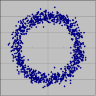

複数の確率変数があるとき、それらがてんでバラバラ好き勝手に変動しているとき「無相関」という言葉を使います。 また「独立」という言葉もあります。\
どちらも何となく似たような意味合いなので、混同している（というか気にしていない）場合もあるようですが、もちろんこの2つは異なる定義があります。\
では「無相関」と「独立」の関係を見てみましょう。

### 「独立」なら「無相関」か？

その通り！「独立」の方が強いです。これはまぁ言葉通りのイメージではないでしょうか。「独立」しているのに何らかの関連性があるとは考えにくいです。

### 「無相関」なら「独立」か？

これは**違います！**。お互いに関連せずに変動していても「独立」でない場合があります。\
これを理解するにはやはり「相関」を正しく理解することが必要です。\
相関の定義は、

$$
\rho_{xy}=\frac{1}{N}\sum_{i=1}^{N}(x_i-\bar{x})(y_{i}-\bar{y})
$$

です。細かい内容はさておき、重要なのは相関はデータ全体でひとつの値、つまり平均や標準偏差と同じデータの特徴を現す量であることです。\
平均は分布の位置、標準偏差は分布の広がり具合です。

相関係数が 0 つまり無相関の場合とそうでない場合のデータプロットの違いが分かりましたか？無相関だと分布が全体としてまん丸になるになりますね。もっとも無相関だからといって分布がまん丸になるとは限りませんが、少なくともまん丸なら無相関です。\
では下のようなプロットはどうでしょう？\
\
このプロット (x, y) を生成する確率変数 X と Y は無相関です（まん丸で、どっちに傾けても変化なし）。しかしこの図をみて X と Y が勝手に変動していると認識する人はいないでしょう（たとえば X が 0付近なら、Y は $\pm 1$ 付近しか値がとれない）。
