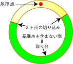

この一様乱数（連続）を利用したゲームは
http://beetama.blog14.fc2.com/blog-date-200807.html
に掲載されていたものを参考にしました。ペコリ。

#### ルール

1箇所に赤い丸印（基準点）がつけてあるリングがあります。リングの任意の2箇所にボタンを使って切り込みを入れます。その結果リングは2つに分割されますが、そのうち**赤い丸印がない**方があなたの取り分、もう一方が闇のオーナーの取り分となります。\

- あなたの取り分が大きい場合：あなたの勝利。闇のオーナーとの取り分の差額が手に入る。
- あなたの取り分が小さい場合：あなたの負け。闇のオーナーとの取り分の差額を支払う。

要するに基準点、切り込み1、切り込み2の3点を円周上にランダムに配置しているだけなのです。その位置は**一様分布（連続）**に従っていて、範囲は $0\sim 360$[度]になっているというわけ。 3点をデタラメにばら撒いているだけなので、どっちに基準点が入るかは5分5分のような気がする。ならば勝敗は5分5分なんでしょうかn？
