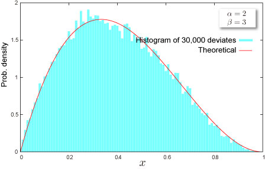

import DataGridMdx from "@site/src/components/DataGridMdx";

# NTRANDBETA

Returns beta pseudo random number(s) based on [Mersenne Twister Algorithm](https://www.ntrand.com/glossary/#local_Mersenne_Twister) which has long period ($2^{19937}-1$), high order of equidistribution and 623 dimensions.

## Syntax

```excel
NTRANDBETA(
 Size,
 Alpha,
 Beta,
 Algorithm,
 Random seed1,
 Random seed2
)
```

### Parameters

- **_Size_** is # of random numbers (Positive integer).
- **_Alpha_** is a parameter of the distribution $\alpha;(>0)$.
- **_Beta_** is a parameter of the distribution $\beta;(>0)$.
- **_Algorithm_** is a integer value that determines a method to generate uniform random number.
  - 0: Mersenne Twister(2002)
  - 1: Mersenne Twister(1998)
  - 2: Numerical Recipesran2()
- **_Random seed1_** is 1st. random seed.
- **_Random seed2_** is 2nd. random seed.

## Remarks

- The distribution has a bounded support [0,1].
- The distribution can be leptokurtic or platykurtic.
- The algorithm generating beta deviates is shown in :

  R. C. H. Cheng, "Generating beta variates with nonintegral shape parameters", Communication of the ACM, 21(1978), pp 317-322

## Example



- The example may be easier to understand if you copy it to a blank worksheet

<details>
  <summary>How to copy an example</summary>

1.  Create a blank workbook or worksheet.
2.  Select the example in the Help topic.

    **Note**  Do not select the row or column headers.

    

    Selecting an example from Help

3.  Press CTRL+C.
4.  In the worksheet, select cell A1, and press CTRL+V.
5.  To switch between viewing the results and viewing the formulas that return the results, press CTRL+` (grave accent), or on the **Tools** menu, point to **Formula Auditing**, and then click **Formula Auditing Mode**.

</details>

<DataGridMdx
  data={{
    cells: [
      [
        { value: "Data", readOnly: true, className: "orange-cell" },
        { value: "Description", readOnly: true, className: "orange-cell" },
      ],
      [
        { value: "0.5", readOnly: true },
        { value: "Value of parameter Alpha", readOnly: true },
      ],
      [
        { value: "0.5", readOnly: true },
        { value: "Value of parameter Beta", readOnly: true },
      ],
      [
        { value: "Formula", readOnly: true, className: "orange-cell" },
        {
          value: "Description (Result)",
          readOnly: true,
          className: "orange-cell",
        },
      ],
      [
        { value: "=NTRANDBETA(100,A2,A3,0)", readOnly: true },
        {
          value:
            "100 beta deviates based on Mersenne-Twister algorithm for which the parameters above",
          readOnly: true,
        },
      ],
    ],
  }}
/>

Note The formula in the example must be entered as an array formula. After copying the example to a blank worksheet, select the range A5:A104 starting with the formula cell. Press F2, and then press CTRL+SHIFT+ENTER.

- [Download sample excel sheet](https://www.ntrand.com/files/NtRand1.zip "Downloading Sample")
- [See tutorial video](https://www.ntrand.com/files/SingleRandom_Demo.swf)

## See also

- [NTBETADIST](https://www.ntrand.com/ntbetadist/)
- [NTBETAKURT](https://www.ntrand.com/ntbetakurt/)
- [NTBETAMEAN](https://www.ntrand.com/ntbetamean/)
- [NTBETAMOM](https://www.ntrand.com/ntbetamom/)
- [NTBETAPARAM](https://www.ntrand.com/ntbetaparam/)
- [NTBETASKEW](https://www.ntrand.com/ntbetaskew/)
- [NTBETASTDEV](https://www.ntrand.com/ntbetastdev/)
- [Beta distribution](https://www.ntrand.com/beta-distribution/)
- [Choice of the random number generator algorithm](https://www.ntrand.com/glossary/#local_Choiceoftherandomnumber)
- [Why I always see the same result even if I input formula into multiple cell?](https://www.ntrand.com/faq/#local_CtrlShiftEnter)
