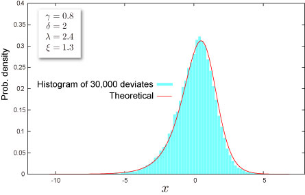

import DataGridMdx from "@site/src/components/DataGridMdx";

# NTRANDJOHNSONSU

Returns Johnson SU pseudo random number(s) based on [Mersenne Twister Algorithm](https://www.ntrand.com/glossary/#local_Mersenne_Twister) which has long period ($2^{19937}-1$), high order of equidistribution (623 dimensions).

## Syntax

```excel
NTRANDJOHNSONSU(
 Size,
 Gamma,
 Delta,
 Lambda,
 Xi,
 Algorithm,
 Random seed1,
 Random seed2,
 Use invert func,
 Use antithetic,
 Use resampling
)
```

### Parameters

- **_Size_** is # of random numbers (Positive integer).
- **_Gamma_** is a parameter of the distribution $\gamma$.
- **_Delta_** is a parameter of the distribution $\delta;(>0)$.
- **_Lambda_** is a parameter of the distribution $\lambda;(>0)$.
- **_Xi_** is a parameter of the distribution $\xi$.
- **_Algorithm_** is a integer value that determines a method to generate uniform random number.
  - 0: Mersenne Twister(2002)
  - 1: Mersenne Twister(1998)
  - 2: Numerical Recipes\
    ran2()
- **_Random seed1_** is 1st. random seed.
- **_Random seed2_** is 2nd. random seed.
- **_Use invert func_** is a logical value that determines a method to generate normal random number. If Use invert func is TRUE, inverse function method is used; if FALSE, box-Muller method is used.
- **_Use antithetic_** is a logical value that determines antithetic variant method is used or not. If Use antithetic is TRUE, antithetic variant method is used; if FALSE, antithetic variant method is not used.
- **_Use resampling_** is a logical value that determines quadratic resampling method is used or not. If Use resampling is TRUE, quadratic resampling method is used; if FALSE, quadratic resampling method is not used.

## Remarks

- The distribution has infinite support $(-\infty,+\infty)$.
- The distribution is leptokurtic.

## Example



- The example may be easier to understand if you copy it to a blank worksheet

<details>
  <summary>How to copy an example</summary>

1.  Create a blank workbook or worksheet.
2.  Select the example in the Help topic.

    **Note**  Do not select the row or column headers.

    

    Selecting an example from Help

3.  Press CTRL+C.
4.  In the worksheet, select cell A1, and press CTRL+V.
5.  To switch between viewing the results and viewing the formulas that return the results, press CTRL+` (grave accent), or on the **Tools** menu, point to **Formula Auditing**, and then click **Formula Auditing Mode**.

</details>

<DataGridMdx
  data={{
    cells: [
      [
        { value: "Data", readOnly: true, className: "orange-cell" },
        { value: "Description", readOnly: true, className: "orange-cell" },
      ],
      [
        { value: "0.8", readOnly: true },
        { value: "Value of parameter Gamma", readOnly: true },
      ],
      [
        { value: "2", readOnly: true },
        { value: "Value of parameter Delta", readOnly: true },
      ],
      [
        { value: "2.5", readOnly: true },
        { value: "Value of parameter Lambda", readOnly: true },
      ],
      [
        { value: "1.2", readOnly: true },
        { value: "Value of parameter Xi", readOnly: true },
      ],
      [
        { value: "Formula", readOnly: true, className: "orange-cell" },
        {
          value: "Description (Result)",
          readOnly: true,
          className: "orange-cell",
        },
      ],
      [
        { value: "=NTRANDJOHNSONSU(100,A2,A3,A4,A5,0)", readOnly: true },
        {
          value:
            "100 Johnson SU deviates based on Mersenne-Twister algorithm for which the parameters above",
          readOnly: true,
        },
      ],
    ],
  }}
/>

Note The formula in the example must be entered as an array formula. After copying the example to a blank worksheet, select the range A2:A101 starting with the formula cell. Press F2, and then press CTRL+SHIFT+ENTER.

- [Download sample excel sheet](https://www.ntrand.com/files/NtRand1.zip "Downloading Sample")
- [See tutorial video](https://www.ntrand.com/files/SingleRandom_Demo.swf)

## See also

- [NTJOHNSONSUDIST](https://www.ntrand.com/ntjohnsonsudist/)
- [NTJOHNSONSUINV](https://www.ntrand.com/ntjohnsonsuinv/)
- [NTJOHNSONSUKURT](https://www.ntrand.com/ntjohnsonsukurt/)
- [NTJOHNSONSUMEAN](https://www.ntrand.com/ntjohnsonsumean/)
- [NTJOHNSONSUMOM](https://www.ntrand.com/ntjohnsonsumom/)
- [NTJOHNSONSUPARAM](https://www.ntrand.com/ntjohnsonsuparam/)
- [NTJOHNSONSUSKEW](https://www.ntrand.com/ntjohnsonsuskew/)
- [NTJOHNSONSUSTDEV](https://www.ntrand.com/ntjohnsonsustdev/)
- [Johnson SU distribution](https://www.ntrand.com/johnson-su-distribution/)
- [Choice of the random number generator algorithm](https://www.ntrand.com/glossary/#local_Choiceoftherandomnumber)
- [Why I always see the same result even if I input formula into multiple cell?](https://www.ntrand.com/faq/#local_CtrlShiftEnter)
