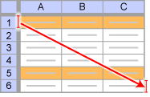

import DataGridMdx from "@site/src/components/DataGridMdx";

# NTTDIST

Returns the Student's t distribution for the specified parameters.

## Syntax

```excel
NTTDIST(
    x,
    N,
    Cumulative
)
```

### Parameters

- **_x_** is the value for which you want the distribution ($x\geq 0$).
- **_N_** is a parameter of the distribution $N$ (Positive integer).
- **_Cumulative_** is a logical value that determines the form of the function. If cumulative is TRUE, NTTDIST returns the cumulative distribution function; if FALSE, it returns the probability density function.

## Remarks

- [Probability density function](https://www.ntrand.com/glossary/#local_probability) is given as:

$$
  f(x)=\frac{\Gamma\left(\frac{N+1}{2}\right)}{\sqrt{\pi N\left(1+\frac{x^2}{N}\right)^{N+1}}\Gamma\left(\frac{N}{2}\right)}
$$

, where $\Gamma(\cdot)$ is [gamma function](https://www.ntrand.com/glossary/#local_Gamma).

- [Cumulative distribution function](https://www.ntrand.com/glossary/#local_cumulative) is given as:

$$
  F(x)=\frac{1}{2}-\frac{1}{2}\left[1-I_{\gamma}\left(\frac{1}{2},\frac{N}{2}\right)\right]\text{sign}(x)
$$

, where $\gamma=\frac{N_1}{N_1+x^2}$ and $I_{x}(\cdot,\cdot)$ is [regularized incomplete beta function](https://www.ntrand.com/glossary/#local_regularized_incomplete_beta).

## Example

- The example may be easier to understand if you copy it to a blank worksheet\

<details>
  <summary>How to copy an example</summary>

1.  Create a blank workbook or worksheet.
2.  Select the example in the Help topic.

    **Note**  Do not select the row or column headers.

    

    Selecting an example from Help

3.  Press CTRL+C.
4.  In the worksheet, select cell A1, and press CTRL+V.
5.  To switch between viewing the results and viewing the formulas that return the results, press CTRL+` (grave accent), or on the **Tools** menu, point to **Formula Auditing**, and then click **Formula Auditing Mode**.

</details>

<DataGridMdx
  data={{
    cells: [
      [
        { value: "Data", readOnly: true, className: "orange-cell" },
        { value: "Description", readOnly: true, className: "orange-cell" },
      ],
      [
        { value: "5", readOnly: true },
        { value: "Value for which you want the distribution", readOnly: true },
      ],
      [
        { value: "8", readOnly: true },
        { value: "Value of parameter N", readOnly: true },
      ],
      [
        { value: "Formula", readOnly: true, className: "orange-cell" },
        {
          value: "Description (Result)",
          readOnly: true,
          className: "orange-cell",
        },
      ],
      [
        { value: "=NTTDIST(A2,A3,TRUE)", readOnly: true },
        {
          value: "Cumulative distribution function for the terms above",
          readOnly: true,
        },
      ],
      [
        { value: "=NTTDIST(A2,A3,FALSE)", readOnly: true },
        {
          value: "Probability density function for the terms above",
          readOnly: true,
        },
      ],
    ],
  }}
/>

- [Download sample excel sheet](https://www.ntrand.com/files/NtRand2.zip "Downloading Sample")

## See also

- [NTRANDT](https://www.ntrand.com/ntrandt/)
- [NTTKURT](https://www.ntrand.com/nttkurt/)
- [NTTMEAN](https://www.ntrand.com/nttmean/)
- [NTTMOM](https://www.ntrand.com/nttmom/)
- [NTTSKEW](https://www.ntrand.com/nttskew/)
- [NTTSTDEV](https://www.ntrand.com/nttstdev/)
- [T distribution](https://www.ntrand.com/t-distribution/)
