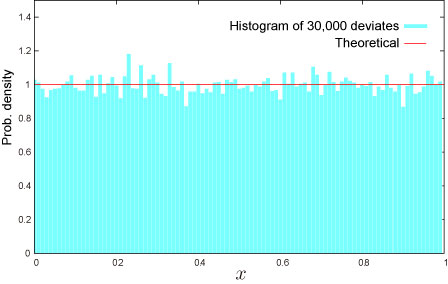

import DataGridMdx from "@site/src/components/DataGridMdx";

# NTRAND

Returns uniform pseudo random number(s) in (0, 1) based on [Mersenne Twister Algorithm](/docs/glossary#mersenne-twister-algorithm) which has long period ($2^{19937}-1$), high order of equidistribution and 623 dimensions.

## Syntax

```excel
NTRAND(
 Size,
 Algorithm,
 Random seed1,
 Random seed2
)
```

### Parameters

- **_Size_** is # of random numbers (Positive integer).
- **_Algorithm_** is an integer value that determines a method to generate uniform random number.
  - 0: Mersenne Twister(2002)
  - 1: Mersenne Twister(1998)
  - 2: Numerical Recipes ran2()
- **_Random seed1_** is 1st. random seed.
- **_Random seed2_** is 2nd. random seed.

## Remarks

- More precisely, a range of random number is

$$
  [10^{-12},;1-10^{-12}]
$$

- To generate uniform random numbers between a and b (a < b), use:

```excel
  =(b-a)*NTRAND(100)+a
```

- To generate discrete random numbers in [m, n] (m and n are integer and m < n), use:

```
  =INT(NTRAND(100)*(n-m+1))+m
```

For example, to model a dice (output is in [1,6]):

```
  =INT(NTRAND(100)*6)+1
```

## Example



<details>
  <summary>How to copy an example</summary>

1.  Create a blank workbook or worksheet.
2.  Select the example in the Help topic.

    **Note**  Do not select the row or column headers.

    

    Selecting an example from Help

3.  Press CTRL+C.
4.  In the worksheet, select cell A1, and press CTRL+V.
5.  To switch between viewing the results and viewing the formulas that return the results, press CTRL+` (grave accent), or on the **Tools** menu, point to **Formula Auditing**, and then click **Formula Auditing Mode**.

</details>

<DataGridMdx
  data={{
    cells: [
      [
        { value: "Data", readOnly: true, className: "orange-cell" },
        { value: "Description", readOnly: true, className: "orange-cell" },
      ],
      [
        { value: "=NTRAND(100,0,12345,67890)", readOnly: true },
        {
          value:
            "100 uniform random numbers by Mersenne Twister algorithm with random seeds 12345 and 67890",
          readOnly: true,
        },
      ],
    ],
  }}
/>

Note : The formula in the example must be entered as an array formula. After copying the example to a blank worksheet, select the range A2:A101 starting with the formula cell. Press F2, and then press CTRL+SHIFT+ENTER.

- [Download sample excel sheet](./../../../assets/NtRand1.zip)

## See also

- [Uniform distribution](../../../05-gallery-of-distributions/uniform-distribution-continuous.mdx)
- [Choice of the random number generator algorithm](/docs/glossary#choice-of-the-random-number-generator-algorithm)
- [Why I always see the same result even if I input formula into multiple cell?](/docs/faq#why-i-always-see-the-same-result-even-if-i-input-formula-into-multiple-cell)
