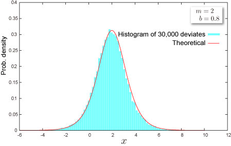

import DataGridMdx from "@site/src/components/DataGridMdx";

# NTRANDLOGISTIC

Returns logistic pseudo random number(s) based on [Mersenne Twister Algorithm](/docs/glossary#mersenne-twister-algorithm) which has long period ($2^{19937}-1$), high order of equidistribution (623 dimensions).

## Syntax

```excel
NTRANDLOGISTIC(
  Size,
  M,
  B,
  Algorithm,
  Random seed1,
  Random seed2
)
```

### Parameters

- **_Size_** is # of random numbers (Positive integer).
- **_M_** is a parameter of the distribution $m$.
- **_B_** is a parameter of the distribution $b(>0)$.
- **_Algorithm_** is a integer value that determines a method to generate uniform random number.
  - 0: Mersenne Twister(2002)
  - 1: Mersenne Twister(1998)
  - 2: Numerical Recipes ran2()
- **_Random seed1_** is 1st. random seed.
- **_Random seed2_** is 2nd. random seed.

## Remarks

- The distribution has infinite support $(-\infty,+\infty)$.
- The distribution is symmetric around mean of the distribution (skewness is 0).
- The distribution is leptokurtic (kurtosis is 1.2).

## Example



- The example may be easier to understand if you copy it to a blank worksheet\

<details>
  <summary>How to copy an example</summary>

1.  Create a blank workbook or worksheet.
2.  Select the example in the Help topic.

    **Note**  Do not select the row or column headers.

    

    Selecting an example from Help

3.  Press CTRL+C.
4.  In the worksheet, select cell A1, and press CTRL+V.
5.  To switch between viewing the results and viewing the formulas that return the results, press CTRL+` (grave accent), or on the **Tools** menu, point to **Formula Auditing**, and then click **Formula Auditing Mode**.

</details>

<DataGridMdx
  data={{
    cells: [
      [
        { value: "Data", readOnly: true, className: "orange-cell" },
        { value: "Description", readOnly: true, className: "orange-cell" },
      ],
      [
        { value: "-5.7", readOnly: true },
        { value: "Value of parameter M", readOnly: true },
      ],
      [
        { value: "11", readOnly: true },
        { value: "Value of parameter B", readOnly: true },
      ],
      [
        { value: "Formula", readOnly: true, className: "orange-cell" },
        {
          value: "Description (Result)",
          readOnly: true,
          className: "orange-cell",
        },
      ],
      [
        { value: "=NTRANDLOGISTIC(100,A2,A3,0)", readOnly: true },
        {
          value:
            "100 logistic deviates based on Mersenne-Twister algorithm for which the parameters above",
          readOnly: true,
        },
      ],
    ],
  }}
/>

- [Download sample excel sheet](https://www.ntrand.com/files/NtRand1.zip)
- [See tutorial video](https://www.ntrand.com/files/SingleRandom_Demo.swf)

## See also

- [NTLOGISTICDIST](../../02-distribution-functions/055-ntlogisticdist.mdx)
- [NTLOGISTICINV](../../02-distribution-functions/056-ntlogisticinv.mdx)
- [NTLOGISTICKURT](../../02-distribution-functions/057-ntlogistickurt.mdx)
- [NTLOGISTICMEAN](../../02-distribution-functions/058-ntlogisticmean.mdx)
- [NTLOGISTICMOM](../../02-distribution-functions/059-ntlogisticmom.mdx)
- [NTLOGISTICPARAM](../../02-distribution-functions/060-ntlogisticparam.mdx)
- [NTLOGISTICSKEW](../../02-distribution-functions/061-ntlogisticskew.mdx)
- [NTLOGISTICSTDEV](../../02-distribution-functions/062-ntlogisticstdev.mdx)
- [Logistic distribution](../../../05-gallery-of-distributions/logistic-distribution.mdx)
- [Choice of the random number generator algorithm](/docs/glossary#choice-of-the-random-number-generator-algorithm)
- [Why I always see the same result even if I input formula into multiple cell?](/docs/faq#why-i-always-see-the-same-result-even-if-i-input-formula-into-multiple-cell)
