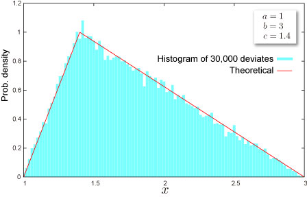

import DataGridMdx from "@site/src/components/DataGridMdx";

# NTRANDTRIANGULAR

Returns triangular pseudo random number(s) based on [Mersenne Twister Algorithm](/docs/glossary#mersenne-twister-algorithm) which has long period ($2^{19937}-1$), high order of equidistribution (623 dimensions).

## Syntax

```excel
NTRANDTRIANGULAR(
  Size,
  Min,
  Max,
  Mode,
  Algorithm,
  Random seed1,
  Random seed2
)
```

### Parameters

- **_Size_** is # of random numbers (Positive integer).
- **_Min_** is a lower limit of a support of the distribution $a$.
- **_Max_** is a upper limit of a support of the distribution $b$.
- **_Mode_** is a mode of the distribution $c$.
- **_Algorithm_** is a integer value that determines a method to generate uniform random number.
  - 0: Mersenne Twister(2002)
  - 1: Mersenne Twister(1998)
  - 2: Numerical Recipes\
    ran2()
- **_Random seed1_** is 1st. random seed.
- **_Random seed2_** is 2nd. random seed.

## Remarks

- Parameters must hold the following relation: a < c < b
- The distribution has bounded support [a, b]

## Example



- The example may be easier to understand if you copy it to a blank worksheet

<details>
  <summary>How to copy an example</summary>

1.  Create a blank workbook or worksheet.
2.  Select the example in the Help topic.

    **Note**  Do not select the row or column headers.

    

    Selecting an example from Help

3.  Press CTRL+C.
4.  In the worksheet, select cell A1, and press CTRL+V.
5.  To switch between viewing the results and viewing the formulas that return the results, press CTRL+` (grave accent), or on the **Tools** menu, point to **Formula Auditing**, and then click **Formula Auditing Mode**.

</details>

<DataGridMdx
  data={{
    cells: [
      [
        { value: "Data", readOnly: true, className: "orange-cell" },
        { value: "Description", readOnly: true, className: "orange-cell" },
      ],
      [
        { value: 1, readOnly: true },
        { value: "Lower limit of support", readOnly: true },
      ],
      [
        { value: 3, readOnly: true },
        { value: "Upper limit of support", readOnly: true },
      ],
      [
        { value: 1.4, readOnly: true },
        { value: "Mode of the distribution", readOnly: true },
      ],
      [
        { value: "Formula", readOnly: true, className: "orange-cell" },
        {
          value: "Description (Result)",
          readOnly: true,
          className: "orange-cell",
        },
      ],
      [
        { value: "=NTRANDTRIANGULAR(100,A2,A3,A4,0)", readOnly: true },
        {
          value:
            "100 triangular deviates based on Mersenne-Twister algorithm for which the parameters above",
          readOnly: true,
        },
      ],
    ],
  }}
/>

Note The formula in the example must be entered as an array formula. After copying the example to a blank worksheet, select the range A6:A105 starting with the formula cell. Press F2, and then press CTRL+SHIFT+ENTER.

- [Download sample excel sheet](https://www.ntrand.com/files/NtRand1.zip)
- [See tutorial video](https://www.ntrand.com/files/SingleRandom_Demo.swf)

## See also

- [NTTRIANGULARDIST](../../02-distribution-functions/087-nttriangulardist.mdx)
- [NTTRIANGULARINV](../../02-distribution-functions/088-nttriangularinv.mdx)
- [NTTRIANGULARKURT](../../02-distribution-functions/089-nttriangularkurt.mdx)
- [NTTRIANGULARMEAN](../../02-distribution-functions/090-nttriangularmean.mdx)
- [NTTRIANGULARMOM](../../02-distribution-functions/091-nttriangularmom.mdx)
- [NTTRIANGULARPARAM](../../02-distribution-functions/092-nttriangularparam.mdx)
- [NTTRIANGULARSKEW](../../02-distribution-functions/093-nttriangularskew.mdx)
- [NTTRIANGULARSTDEV](../../02-distribution-functions/094-nttriangularstdev.mdx)
- [Triangular distribution](https://www.ntrand.com/triangular-distribution/)
- [Choice of the random number generator algorithm](/docs/glossary#choice-of-the-random-number-generator-algorithm)
- [Why I always see the same result even if I input formula into multiple cell?](https://www.ntrand.com/faq/#local_CtrlShiftEnter)
