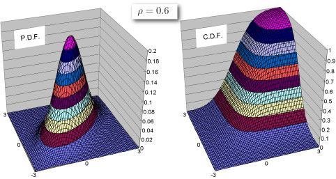

import DataGridMdx from "@site/src/components/DataGridMdx";

# NTBINORMDIST

Returns the bivariate normal distribution

## Syntax

```excel
NTBINORMDIST(
    X1,
    X2,
    Corr,
    Cumulative
)
```

### Parameters

- **_X1_** is the value of 1st. variable for which you want the distribution.
- **_X2_** is the value of 2nd. variable for which you want the distribution.
- **_Corr_** is a correlation coefficient between 2 variables $\rho;(-1\leq \rho \leq 1)$.
- **_Cumulative_** is a logical value that determines the form of the function. If cumulative is TRUE, NTBINORMDIST returns the cumulative distribution function; if FALSE, it returns the probability density function.

## Remark

- If $\rho=\pm 1$, the probability density is singular at X1=X2 (returns #VALUE! error).

## Example



- The example may be easier to understand if you copy it to a blank worksheet\

<details>
  <summary>How to copy an example</summary>

1.  Create a blank workbook or worksheet.
2.  Select the example in the Help topic.

    **Note**  Do not select the row or column headers.

    

    Selecting an example from Help

3.  Press CTRL+C.
4.  In the worksheet, select cell A1, and press CTRL+V.
5.  To switch between viewing the results and viewing the formulas that return the results, press CTRL+` (grave accent), or on the **Tools** menu, point to **Formula Auditing**, and then click **Formula Auditing Mode**.

</details>

<DataGridMdx
  data={{
    cells: [
      [
        { value: "Data", readOnly: true, className: "orange-cell" },
        { value: "Description", readOnly: true, className: "orange-cell" },
      ],
      [
        { value: 1.5, readOnly: true },
        {
          value: "Value of 1st. variable for which you want the distribution",
          readOnly: true,
        },
      ],
      [
        { value: -1, readOnly: true },
        {
          value: "Value of 2nd. variable for which you want the distribution",
          readOnly: true,
        },
      ],
      [
        { value: 0.5, readOnly: true },
        { value: "Correlation coefficient", readOnly: true },
      ],
      [
        { value: "Formula", readOnly: true, className: "orange-cell" },
        {
          value: "Description (Result)",
          readOnly: true,
          className: "orange-cell",
        },
      ],
      [
        { value: "=NTBINORMDIST(A2,A3,A4,TRUE)", readOnly: true },
        {
          value: "Cumulative distribution function for the terms above",
          readOnly: true,
        },
      ],
      [
        { value: "=NTBINORMDIST(A2,A3,A4,FALSE)", readOnly: true },
        {
          value: "Probability density function for the terms above",
          readOnly: true,
        },
      ],
    ],
  }}
/>

## See also

- [NTRANDMULTINORM](../01-random-numbers/02-multi-series/01-ntrandmultinorm.mdx)
- [Normal distribution (Multi variables)](https://www.ntrand.com/normal-distribution-multi/)
