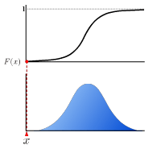
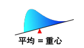
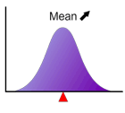
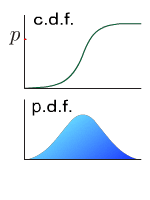
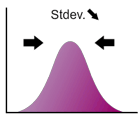

# Glossary

## Antithetic variant method

A simple improvement method of Monte Carlo’s convergence. When a normal random number is generated, change its sign to produce a new random number. This makes all the odd moments (e.g., mean, skewness) turned zero with a significant increase in convergence. A normal random numbers sequence generated by antithetic variant method is self-explanatory.

## Array formula in Excel

Excel performs multiple-calculation using array formula and returns multiple results at a time. To input the array formula, select the desired cell for output, type the expression, and then press CTRL+SHIFT+ENTER. For further information, see the topic about "Array Formula" in your Excel Online Help.

[Why I always see the same result even if I input formula into multiple cells?](https://www.ntrand.com/faq/#local_CtrlShiftEnter)

## Beta function

$$
B(x, y) = \int_0^1 t^{x-1} (1-t)^{y-1} dt
$$

## Box-Muller method

The simplest method of converting uniform random numbers into normal random numbers. The conversion is applicable to one sequence of pseudo-random numbers.

## c.d.f.

*See* [Cumulative distribution function](https://www.ntrand.com/glossary/#local_Cumulative)

## Central moment

Central moment is the moment about the mean. The k-th central moment $\mu_{(k)}$ is defined as:

$$
\mu*{(k)}=\int*{-\infty}^{+\infty}(x-\mu)^kf(x)\text{d}x
$$

where $f(x)$ is the [probability density function](https://www.ntrand.com/glossary/#local_Probability) and $\mu$ is the [mean](https://www.ntrand.com/glossary/#local_mean) of the distribution.

- The 0th central moment is one.
- The 1st central moment is zero.
- The 2nd central moment is called [variance](https://www.ntrand.com/glossary/#local_variance).
- The 3rd central moment is used to define [skewness](https://www.ntrand.com/glossary/#local_skewness).
- The 4th central moment is used to define [kurtosis](https://www.ntrand.com/glossary/#local_kurtosis).

## Choice of the random number generator algorithm

NtRand has three pseudo random number generator algorithms. The selection is made by 2nd argument (Algorithm) of each random number functions.

- **Algorithm=0: Mersenne Twister 2002**\
  Produce 53bit precision (0, 1) uniform real random numbers by revised Mersenne Twister algorithm released 1/26/2002. At this moment, this is the 'standard' Mersenne Twister. In this implementation, its random seed is 64 bit width. I recommend this algorithm in most of the case.
- **Algorithm=1: Mersenne Twister 1998**\
  Mersenne Twister used within Version 1.x NtRand. Its random seed is 64 bit width. Previous Mersenne Twister algorithm had a small problem. The highest bit of the seed is not well reflected to the state vector. The problem is reported in [Mersenne Twister home page](http://www.math.sci.hiroshima-u.ac.jp/~m-mat/MT/emt.html "Mersenne Twister home page"), and [TT800 problem report](http://random.mat.sbg.ac.at/news/seedingTT800.html "TT800 problem report"). The reports say Jeff Szuhay reveals the problem to MT's small cousin TT800. However, this is not so 'small' problem and I also detected in 1998. So I modified MT slightly when I released NtRand in 1998. My resolution is to project 64bit random seed into 32bit space, and avoid this reflection problem. (I didn't report the problem like Jeff does. Sorry, Prof. Matsumoto.) From the first release in 1998, NtRand uses this algorithm. Now, the 'standard' Mersenne Twister algorithm has released, I won't recommend my resolution. Use this option only if you want to keep backward compatibility.
- **Algorithm=2: Numerical Recipes ran2**\
  This is the recommended random number generator algorithm in the book, W. H. Press, S. A. Teukolsky, W. T. Vetterling, B. P. Flannery, Numerical Recipes in C 2nd ed., Cambridge Univ. Press, 1992. This is very famous algorithm and it has long period (> 2 x 10^18^). However, unfortunately, the algorithm doesn't pass many random number quality tests (e.g. 2-dimensional random walk, n-block test, etc.). It has clear correlation problem and I don't recommend this especially for multi-dimensional Monte Carlo simulation. There are several other algorithms in Numerical Recipes book, however, all of them are no good.

## Cumulative distribution function

The real-valued function which describes the probability distribution of a real-valued random variable. The value at x represents the probability that the variable has value less than or equal to x.

## Euler’s constant

$$
\gamma=\lim_{n\to\infty}\left(\sum_{k=1}^{n}\frac{1}{k}-\ln n\right)\sim 0.577215
$$

## Gamma function

$$
\Gamma(x)=\int_{0}^{+\infty}t^{x-1}\text{e}^{-t}\text{d}t
$$

## Incomplete beta function

$$
B_x(p,q)=\int_{0}^{x}t^{p-1}(1-t)^{q-1}\text{d}t
$$

This is identical to beta function when x=1.

Normalized incomplete beta function are defined by

$$
I_x(p,q)=\frac{B_x(p,q)}{B(p,q)}
$$

where $B(\cdot,;\cdot)$ is [beta function](https://www.ntrand.com/glossary/#local_beta).

## Incomplete gamma function

$$
\Gamma_x(a)=\int_{0}^{x}\text{e}^{-u}u^{a-1}\text{d}u
$$

## Inverse function method (Moro’s algorithm)

One method of the uniform/normal random numbers conversions. Performs conversion by applying the approximate expression obtained by Taylor's expansion while dividing it in intervals. In Quasi Monte Carlo, the combined use of Box-Muller and quasi-random number does not bring an expected improvement due to the problem of Box-Muller method in uniform/normal random numbers conversion. Thus, the inverse function method, rather complicated than the Box-Muller, must be applied.

## Kurtosis

Kurtosis of the distribution is defined as:

$$
\gamma_2=\frac{\mu_{(4)}}{\sigma^4}-3
$$

where $\mu_{(4)}$ is the 4-th [central moment](https://www.ntrand.com/glossary/#local_central_moment) of the distribution and $\sigma$ is the [standard deviation](https://www.ntrand.com/glossary/#local_standard_deviation) of the distribution.\
This is also known as "excess kurtosis"

## Leptokurtic

Leptokurtic means the distribution has fat tail. Mathematically, [kurtosis](https://www.ntrand.com/glossary/#local_kurtosis) is positive.

## Mean

Mean is interpreted as typical location of the distribution or weighted center of the distribution.

The probability density function transfers without changing its form when the mean is varying.

It is computed as 1st. [raw moment](https://www.ntrand.com/glossary/#local_raw_moment) of the distribution. It is represented as "m" in almost all text book.

## Median

The position at which [the probability density function](https://www.ntrand.com/glossary/#local_probability) is separated into two parts whose area are the same each other.

Median is computed as

$$
\text{median}=F^{-1}(0.5)
$$

, where $F^{-1}(x)$ is a inverse function of the [cumulative distribution function](https://www.ntrand.com/glossary/#local_Cumulative).

## Mersenne Twister algorithm

An algorithm which generates uniform pseudo random numbers with longer period and higher order of equidistribution. (See [Mersenne Twister home page](http://www.math.sci.hiroshima-u.ac.jp/~m-mat/MT/emt.html "Mersenne Twister home page"))

## Mode

The value that occurs the most frequently in a data set or a probability distribution. For the [probability density function](https://www.ntrand.com/glossary/#local_probability) which has a single peak, the mode is the position of the peak.

## Multivariate correlation random numbers

Multiple number of normal random number sequences which are correlational to each other. These make the key in multivariate simulation such as Monte Carlo VaR.

## Normal (Gaussian) random numbers

A sequence of random numbers that has the mean value of 0 and standard deviation of 1 when its statistics is collected.

## p.d.f.

*See* [Probability density function](https://www.ntrand.com/glossary/#local_Probability)

## p.m.f.

*See* [Probability mass function](https://www.ntrand.com/glossary/#local_ProbabilityMass)

## Physical random numbers

Physical random numbers ([Wikipedia -- Random number generation](http://en.wikipedia.org/wiki/Random_number_generation#Physical_methods))

## Platykurtic

Leptokurtic means the distribution has thin tail. Mathematically, [kurtosis](https://www.ntrand.com/glossary/#local_kurtosis) is negative.

## Probability density function

The real-value function which describes the relative likelihood for this random variable to occur at a given point in the observation space.

- always positive
- Area below the curb of function on the range between x=a and x=b represents a probability that the variable x have a value between a and b.\
  
- Whole area below the curb of function is one.
- The function is characterized by [median](https://www.ntrand.com/glossary/#local_median), [mode](https://www.ntrand.com/glossary/#local_mode), [mean](https://www.ntrand.com/glossary/#local_mean), [standard deviation](https://www.ntrand.com/glossary/#local_standard_deviation), [skewness](https://www.ntrand.com/glossary/#local_skewness), [kurtosis](https://www.ntrand.com/glossary/#local_kurtosis) and so on.

## Probability mass function

A function characterize the discrete distribution as:

$$
Pr[X=x]=p(x)
$$

This is corresponding to [probability density function](https://www.ntrand.com/glossary/#local_Probability) for continuous distribution function.

## Pseudo-random numbers

Computer-generated random numbers are not actually the true random numbers. Thus, they are called “pseudo” random numbers.

## Quadratic resampling

Generate random numbers for the desired number, calculate the statistics of entire random number sequences, then offset the random numbers with the obtained statistics. This method enables to adjust the 2nd moment which the antithetic variant cannot eliminate. Normally, this method is used with the antithetic variant method. In **NtRand**, the quadratic resampling is implemented based on the know-how in 1990. Regarding the recent quadratic resampling method, some participant employs the higher order of even-order moment matching.

## Quantile

p-quantile is the value at which the distribution is divided into two parts with probabilities p and (1-p) respectively. This is the value of inverse function of [cumulative distribution function](https://www.ntrand.com/glossary/#local_cumulative) at p.

## Raw moment

Raw moment is the moment about the origin. The k-th raw moment $\mu^\prime_{(k)}$ is defined as:

$$
\mu^\prime_{(k)}=\int_{-\infty}^{+\infty}x^kf(x)\text{d}x
$$

where $f(x)$ is the [probability density function](https://www.ntrand.com/glossary/#local_Probability).

- The 0th raw moment is one.
- The 1st raw moment is [mean](https://www.ntrand.com/glossary/#local_mean) of the distribution.

## Regularized incomplete beta function

*See* Incomplete beta function

## Riemann zeta function

$$
\zeta(x)=\sum_{n=1}^{\infty}\frac{1}{n^x}
$$

$$
\zeta(2)=\frac{\pi^2}{6}\sim 1.645
$$

$$
\zeta(3)\sim 1.202\quad\text{(a.k.a. Ap\'{e}ry's constant)}
$$

$$
\zeta(4)=\frac{\pi^4}{90}\sim 1.0823
$$

## Singular value decomposition (SVD)

One of the triangular decomposition methods of matrix. To generate a multivariate correlated random numbers, the covariance matrix entered in the generation process shall be split into two triangular matrices. Square rooting and Cholesky decomposition are convenient methods and covered in elementary textbooks for their application in real symmetric positive definite matrix. For the larger amount of non-correlated data, the split Cholesky decomposition assuming a "band matrix" with narrower condition doubles the computing efficiency compared to the standard Cholekey method. However, to compute by using the higher dimension of economic time-series data, securing the inter-sequence independency is difficult and the assumption of the positive definite matrix is too strict. Under the higher dimensional environment, solutions may not be stable because of the increased possibility to encounter the underflow error in the process of repeating operation in the computer. In this case, the improved SVD is an effective and practicable method.

## Skewness

Skewness of the distribution is defined as:

$$
\gamma_1=\frac{\mu_{(3)}}{\sigma^3}
$$

where $\mu_{(3)}$ is the 3rd [central moment](https://www.ntrand.com/glossary/#local_central_moment) of the distribution and $\sigma$ is the [standard deviation](https://www.ntrand.com/glossary/#local_standard_deviation) of the distribution.

## Standard deviation

The positive root of the [variance](https://www.ntrand.com/glossary/#local_variance) of the distribution and is denoted as $\sigma$.

Standard deviation represents how the distribution spread. In the case of normal distribution, the standard deviation is the distance between the [mean](https://www.ntrand.com/glossary/#local_mean) and the saddle point.

Drag the arrow!

## Uniform/normal random numbers conversion

Uniform random numbers distribute constantly in [0,1] interval. As random numbers are usually obtained in the form of uniform random numbers, you need to convert them to normal random numbers. This process is called uniform/normal random numbers conversion.

## Uniform random numbers

Random numbers uniformly distributed in the [0,1] interval.

## Unimodal

A unimodal probability distribution is a probability distribution which has a single [mode](https://www.ntrand.com/glossary/#local_mode). Rectangle shaped distributions such as the uniform distribution does not have a mode.

## Variance

Variance of the distribution is the 2nd [central moment](https://www.ntrand.com/glossary/#local_central_moment) of the distribution and denoted as $\sigma^2$. This is a square of [standard deviation](https://www.ntrand.com/glossary/#local_standard_deviation).
