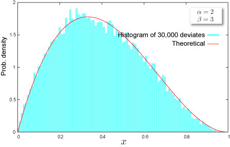

import DataGridMdx from "@site/src/components/DataGridMdx";

# Beta Distribution

## Where do you meet this distribution?

- [Bayesian statistics](http://en.wikipedia.org/wiki/Bayesian_statistics)
- [Project management](http://en.wikipedia.org/wiki/Project_management) -- [PERT](http://en.wikipedia.org/wiki/PERT), [CPM](http://en.wikipedia.org/wiki/Critical_path_method) and so on
- [Information theory](http://en.wikipedia.org/wiki/Beta_distribution#Information_Theory)
- [Rule of succession](http://en.wikipedia.org/wiki/Beta_distribution#Rule_of_succession)
- [Risk management -- Operational risk](http://en.wikipedia.org/wiki/Operational_risk)

## Shape of Distribution

### Basic Properties

- Two parameters $\alpha, \beta$ are required ([How can you get these?](https://www.ntrand.com/ntbetaparam/))

  $$
  \alpha>0,\beta>0
  $$

- Continuous distribution defined on bounded range $0\leq x \leq 1$
- This distribution can be symmetric or asymmetric.

### Probability

- [Cumulative distribution function](https://www.ntrand.com/glossary/#local_cumulative)

  $$
  F(x)=I_x(\alpha,\beta)
  $$

  where $I_x(\cdot,\cdot)$ is [regularized incomplete beta function](https://www.ntrand.com/glossary/#local_Regularized_incomplete_beta).

- [Probability density function](https://www.ntrand.com/glossary/#local_probability)

  $$
  f(x)=\frac{x^{\alpha-1}(1-x)^{\beta-1}}{B(\alpha,\beta)}
  $$

  where $B(\cdot,\cdot)$ is [beta function](https://www.ntrand.com/glossary/#local_beta).

- When the 4th. argument of [NTBETADIST](https://www.ntrand.com/ntbetadist/)=TRUE, this function returns same result as Excel function "[BETADIST](http://office.microsoft.com/en-us/excel/HP052090001033.aspx)" does.
- How to compute these on Excel.

<DataGridMdx
  data={{
    cells: [
      [
        { value: "Data", readOnly: true, className: "orange-cell" },
        { value: "Description", readOnly: true, className: "orange-cell" },
      ],
      [
        { value: "0.5", readOnly: true },
        { value: "Value for which you want the distribution", readOnly: true },
      ],
      [
        { value: "8", readOnly: true },
        { value: "Value of parameter Alpha", readOnly: true },
      ],
      [
        { value: "2", readOnly: true },
        { value: "Value of parameter Beta", readOnly: true },
      ],
      [
        { value: "Formula", readOnly: true, className: "orange-cell" },
        { value: "Description (Result)", readOnly: true, className: "orange-cell" },
      ],
      [
        { value: "=NTBETADIST(A2,A3,A4,TRUE)", readOnly: true },
        {
          value: "Cumulative distribution function for the terms above",
          readOnly: true,
        },
      ],
      [
        { value: "=NTBETADIST(A2,A3,A4,FALSE)", readOnly: true },
        {
          value: "Probability density function for the terms above",
          readOnly: true,
        },
      ],
    ],
  }}
/>

- Function reference : [NTBETADIST](https://www.ntrand.com/ntbetadist/)

### Quantile

- Inverse function of [cumulative distribution function](https://www.ntrand.com/glossary/#local_cumulative) cannot be expressed in closed form.
- [BETAINV](http://office.microsoft.com/en-us/excel/HP052090011033.aspx) is an excel function.
- How to compute this on Excel.

<DataGridMdx
  data={{
    cells: [
      [
        { value: "Data", readOnly: true, className: "orange-cell" },
        { value: "Description", readOnly: true, className: "orange-cell" },
      ],
      [
        { value: "0.7", readOnly: true },
        {
          value: "Probability associated with the distribution",
          readOnly: true,
        },
      ],
      [
        { value: "1.7", readOnly: true },
        { value: "Value of parameter Alpha", readOnly: true },
      ],
      [
        { value: "0.9", readOnly: true },
        { value: "Value of parameter Beta", readOnly: true },
      ],
      [
        { value: "Formula", readOnly: true, className: "orange-cell" },
        { value: "Description (Result)", readOnly: true, className: "orange-cell" },
      ],
      [
        { value: "=BETAINV(A2,A3,A4)", readOnly: true },
        {
          value:
            "Inverse of the cumulative distribution function for the terms above",
          readOnly: true,
        },
      ],
    ],
  }}
/>

## Characteristics

### Mean -- Where is the "center" of the distribution? ([Definition](https://www.ntrand.com/glossary/#local_mean))

- [Mean](https://www.ntrand.com/glossary/#local_mean) of the distribution is given as

  $$
  \frac{\alpha}{\alpha+\beta}
  $$

- How to compute this on Excel

<DataGridMdx
  data={{
    cells: [
      [
        { value: "Data", readOnly: true, className: "orange-cell" },
        { value: "Description", readOnly: true, className: "orange-cell" },
      ],
      [
        { value: "8", readOnly: true },
        { value: "Value of parameter Alpha", readOnly: true },
      ],
      [
        { value: "2", readOnly: true },
        { value: "Value of parameter Beta", readOnly: true },
      ],
      [
        { value: "Formula", readOnly: true, className: "orange-cell" },
        { value: "Description (Result)", readOnly: true, className: "orange-cell" },
      ],
      [
        { value: "=NTBETAMEAN(A2,A3)", readOnly: true },
        {
          value: "Mean of the distribution for the terms above",
          readOnly: true,
        },
      ],
    ],
  }}
/>

- Function reference : [NTBETAMEAN](https://www.ntrand.com/ntbetamean/)

### Standard Deviation -- How wide does the distribution spread? ([Definition](https://www.ntrand.com/glossary/#local_standard_deviation))

- [Variance](https://www.ntrand.com/glossary/#local_variance) of the distribution is given as

  $$
  \frac{\alpha\beta}{(\alpha+\beta)^2(\alpha+\beta+1)}
  $$

  [Standard Deviation](https://www.ntrand.com/glossary/#local_standard_deviation) is a positive square root of [Variance](https://www.ntrand.com/glossary/#local_variance).

- How to compute this on Excel

<DataGridMdx
  data={{
    cells: [
      [
        { value: "Data", readOnly: true, className: "orange-cell" },
        { value: "Description", readOnly: true, className: "orange-cell" },
      ],
      [
        { value: "8", readOnly: true },
        { value: "Value of parameter Alpha", readOnly: true },
      ],
      [
        { value: "2", readOnly: true },
        { value: "Value of parameter Beta", readOnly: true },
      ],
      [
        { value: "Formula", readOnly: true, className: "orange-cell" },
        {
          value: "Description (Result)",
          readOnly: true,
          className: "orange-cell",
        },
      ],
      [
        { value: "=NTBETASTDEV(A2,A3)", readOnly: true },
        {
          value: "Standard deviation of the distribution for the terms above",
          readOnly: true,
        },
      ],
    ],
  }}
/>

- Function reference : [NTBETASTDEV](https://www.ntrand.com/ntbetastdev/)

### Skewness -- Which side is the distribution distorted into? ([Definition](https://www.ntrand.com/glossary/#local_skewness))

- [Skewness](https://www.ntrand.com/glossary/#local_skew) of the distribution is given as

  $$
  \frac{2(\beta-\alpha)\sqrt{\alpha+\beta+1}}{(\alpha+\beta+2)\sqrt{\alpha\beta}}
  $$

- How to compute this on Excel

<DataGridMdx
  data={{
    cells: [
      [
        { value: "Data", readOnly: true, className: "orange-cell" },
        { value: "Description", readOnly: true, className: "orange-cell" },
      ],
      [
        { value: "8", readOnly: true },
        { value: "Value of parameter Alpha", readOnly: true },
      ],
      [
        { value: "2", readOnly: true },
        { value: "Value of parameter Beta", readOnly: true },
      ],
      [
        { value: "Formula", readOnly: true, className: "orange-cell" },
        {
          value: "Description (Result)",
          readOnly: true,
          className: "orange-cell",
        },
      ],
      [
        { value: "=NTBETASKEW(A2,A3)", readOnly: true },
        {
          value: "Skewness of the distribution for the terms above",
          readOnly: true,
        },
      ],
    ],
  }}
/>

- Function reference : [NTBETASKEW](https://www.ntrand.com/ntbetaskew/)

### Kurtosis -- Sharp or Dull, consequently Fat Tail or Thin Tail ([Definition](https://www.ntrand.com/glossary/#local_kurtosis))

- [Kurtosis](https://www.ntrand.com/glossary/#local_kurtosis) of the distribution is given as

  $$
  6\frac{\alpha^3-\alpha^2(2\beta-1)+\beta^2(\beta+1)-2\alpha\beta(\beta+2)}{\alpha\beta(\alpha+\beta+2)(\alpha+\beta+3)}
  $$

- This distribution can be [leptokurtic](https://www.ntrand.com/glossary/#local_leptokurtic) or [platykurtic](https://www.ntrand.com/glossary/#local_platykurtic).
- How to compute this on Excel

<DataGridMdx
  data={{
    cells: [
      [
        { value: "Data", readOnly: true, className: "orange-cell" },
        { value: "Description", readOnly: true, className: "orange-cell" },
      ],
      [
        { value: "8", readOnly: true },
        { value: "Value of parameter Alpha", readOnly: true },
      ],
      [
        { value: "2", readOnly: true },
        { value: "Value of parameter Beta", readOnly: true },
      ],
      [
        { value: "Formula", readOnly: true, className: "orange-cell" },
        {
          value: "Description (Result)",
          readOnly: true,
          className: "orange-cell",
        },
      ],
      [
        { value: "=NTBETAKURT(A2,A3)", readOnly: true },
        {
          value: "Kurtosis of the distribution for the terms above",
          readOnly: true,
        },
      ],
    ],
  }}
/>

- Function reference : [NTBETAKURT](https://www.ntrand.com/ntbetakurt/)

## Random Numbers

- The algorithm to generated random numbers is shown in:

  R. C. H. Cheng, "Generating beta variates with nonintegral shape parameters", Communication of the ACM, 21(1978), pp 317-322

- How to generate random numbers on Excel.

<DataGridMdx
  data={{
    cells: [
      [
        { value: "Data", readOnly: true, className: "orange-cell" },
        { value: "Description", readOnly: true, className: "orange-cell" },
      ],
      [
        { value: "0.5", readOnly: true },
        { value: "Value of parameter Alpha", readOnly: true },
      ],
      [
        { value: "0.5", readOnly: true },
        { value: "Value of parameter Beta", readOnly: true },
      ],
      [
        { value: "Formula", readOnly: true, className: "orange-cell" },
        {
          value: "Description (Result)",
          readOnly: true,
          className: "orange-cell",
        },
      ],
      [
        {
          value: "=NTRANDBETA(100,A2,A3,0)",
          readOnly: true,
        },
        {
          value:
            "100 beta deviates based on Mersenne-Twister algorithm for which the parameters above",
          readOnly: true,
        },
      ],
    ],
  }}
/>

Note The formula in the example must be entered as an array formula. After copying the example to a blank worksheet, select the range A5:A104 starting with the formula cell. Press F2, and then press CTRL+SHIFT+ENTER.

- Function reference : [NTRANDBETA](https://www.ntrand.com/ntrandbeta/)

## NtRand Functions

- If you already have parameters of the distribution
  - Generating random numbers based on Mersenne Twister algorithm: [NTRANDBETA](https://www.ntrand.com/ntrandbeta/)
  - Computing probability : [NTBETADIST](https://www.ntrand.com/ntbetadist/)
  - Computing mean : [NTBETAMEAN](https://www.ntrand.com/ntbetamean/)
  - Computing standard deviation : [NTBETASTDEV](https://www.ntrand.com/ntbetaskew/)
  - Computing skewness : [NTBETASKEW](https://www.ntrand.com/ntbetaskew/)
  - Computing kurtosis : [NTBETAKURT](https://www.ntrand.com/ntbetakurt/)
  - Computing moments above at once : [NTBETAMOM](https://www.ntrand.com/ntbetamom/)
- If you know mean and standard deviation of the distribution
  - Estimating parameters of the distribution:[NTBETAPARAM](https://www.ntrand.com/ntbetaparam/)

## Reference

- [Wolfram Mathworld -- Beta Distribution](http://mathworld.wolfram.com/BetaDistribution.html)
- [Wikipedia -- Beta distribution](http://en.wikipedia.org/wiki/Beta_distribution)
- [Statistics Online Computational Resource](http://www.socr.ucla.edu/htmls/SOCR_Distributions.html)
- [Numerical Technologies Magnitude -- Operational risk](http://www.numtech.com/products/)
