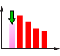
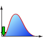

**From countless probability distributions, you're sure to find one that perfectly fits your purpose!**

(To find the optimal distribution based on data characteristics ⇒[Gallery of Distributions](/docs/gallery-of-distributions/))

## For cases dealing with integers such as counts or number of people

<table>
  <tbody>
    <tr>
      <th>Data Range</th>
      <th>Distribution Name</th>
      <th>Description</th>
    </tr>
    <tr>
      <td rowspan="2">Finite</td>
      <td>
        <a href="/docs/gallery-of-distributions/bernoulli-distribution">
          Bernoulli
        </a>
      </td>
      <td>
        Success or failure. An all-or-nothing model. Coin toss is a typical
        example.
      </td>
    </tr>
    <tr>
      <td>
        <a href="/docs/gallery-of-distributions/uniform-distribution-discrete">
          Uniform(discrete)
        </a>
      </td>
      <td>
        Distribution of "equally likely" outcomes.
        <ul>
          <li>Dice, Roulette</li>
          <li>Random sampling</li>
          <li>Shuffling (Random shuffle)</li>
        </ul>
        Fair coin. Toss a coin and take 1 step right if heads, 1 step left if
        tails... This is a one-dimensional random walk.
         
        Four-sided fair die. Each face is labeled "Right", "Left", "Forward",
        "Backward". Roll the die and take 1 step in the direction shown... This
        is a two-dimensional random walk.
         
        Six-sided fair die. Each face is labeled "Right", "Left", "Forward",
        "Backward", "Up", "Down". Roll the die and take 1 step in the direction
        shown... This is a three-dimensional random walk.
      </td>
    </tr>
    <tr>
      <td>Infinite</td>
      <td>
        <a href="/docs/gallery-of-distributions/poisson-distribution">
          Poisson
        </a>
      </td>
      <td>
        Distribution of events that occur randomly and infrequently.
        <ul>
          <li>Number of emails per hour</li>
          <li>Number of airplane accidents per year</li>
          <li>Number of restaurants per km of national highway</li>
        </ul>
        The "infrequently" part is important. For high-frequency events, it can
        be approximated by a
        <a href="/docs/gallery-of-distributions/normal-distribution-single">
          Normal(Single)
        </a>
      </td>
    </tr>
  </tbody>
</table>

## For cases dealing with any values, not limited to integers, such as weight, length, time, rate of return...

<table>
  <tbody>
    <tr>
      <th>Data Range</th>
      <th>Distribution Name</th>
      <th>Description</th>
    </tr>
    <tr>
      <td rowspan="6">Finite</td>
      <td>
        <a href="/docs/gallery-of-distributions/beta-distribution">Beta</a>
      </td>
      <td>
        Has a high degree of freedom in shape, so it can fit various
        distributions. Good to try for finite interval data with unclear
        characteristics that don't fit well with normal distribution.
      </td>
    </tr>
    <tr>
      <td>
        <a href="/docs/gallery-of-distributions/johnson-sb-distribution">
          Johnson SB
        </a>
      </td>
      <td>
        Like the
        <a href="/docs/gallery-of-distributions/beta-distribution">Beta</a>, it
        can be used to fit data of unknown nature in a finite interval with
        asymmetric shape. Mean, standard deviation, skewness, and kurtosis can
        be freely adjusted. Used in forestry (distribution of tree trunk
        diameters in forests).
      </td>
    </tr>
    <tr>
      <td>
        <a href="/docs/gallery-of-distributions/kumaraswamy-distribution">
          Kumaraswamy
        </a>
      </td>
      <td>
        When Beta distribution and Johnson SB distribution are too complex, but
        triangular distribution is too simple... This might be just right.
      </td>
    </tr>
    <tr>
      <td>
        <a href="/docs/gallery-of-distributions/triangular-distribution">
          Triangular
        </a>
      </td>
      <td>
        Easy to handle due to its simple distribution function. Can be used
        instead of
        <a href="/docs/gallery-of-distributions/beta-distribution">Beta</a>
        or
        <a href="/docs/gallery-of-distributions/johnson-sb-distribution">
          Johnson SB
        </a>
        for finite interval distributions with a single peak and left-right
        asymmetry.
      </td>
    </tr>
    <tr>
      <td>
        <a href="/docs/gallery-of-distributions/uniform-distribution-continuous">
          Uniform
        </a>
      </td>
      <td>
        The base random number used in the inverse function method to generate
        random numbers following other distributions.
      </td>
    </tr>
    <tr>
      <td>
        <a href="/docs/gallery-of-distributions/u-quadratic-distribution">
          U Quadratic
        </a>
      </td>
      <td>
        The simplest U-shaped distribution. Can be an alternative to Beta
        distribution.
      </td>
    </tr>
    <tr>
      <td rowspan="9">Semi-Infinite</td>
      <td>
        <a href="/docs/gallery-of-distributions/exponential-distribution">
          Exponential
        </a>
      </td>
      <td>
        Distribution of "intervals" between rare events.
        <ul>
          <li>Intervals between accidents</li>
          <li>Intervals between customer arrivals at a convenience store</li>
          <li>Intervals between radioactive decay events</li>
        </ul>
        If events occur following this distribution, their frequency follows a
        <a href="/docs/gallery-of-distributions/poisson-distribution">
          Poisson
        </a>
        .
      </td>
    </tr>
    <tr>
      <td>
        <a href="/docs/gallery-of-distributions/gumbel-type-ii-distribution">
          Gumbel Type II
        </a>
      </td>
      <td>Extreme value theory</td>
    </tr>
    <tr>
      <td>
        <a href="/docs/gallery-of-distributions/log-normal-distribution">
          Log Normal
        </a>
      </td>
      <td>
        <ul>
          <li>Distribution of annual income</li>
          <li>Distribution of logarithmic returns on stock prices</li>
        </ul>
        The logarithm of these data follows a normal distribution. In this case,
        the original data follows a log-normal distribution.
      </td>
    </tr>
    <tr>
      <td>
        <a href="/docs/gallery-of-distributions/pareto-distribution">Pareto</a>
      </td>
      <td>
        Originally developed as a model for income distribution. One of the
        distributions known as power-law distributions. It's becoming
        increasingly important as various phenomena are found to follow
        power-law distributions.
        <ul>
          <li>Distribution of savings amounts</li>
          <li>Shape of distribution tails (extreme value theory)</li>
        </ul>
      </td>
    </tr>
    <tr>
      <td>
        <a href="/docs/gallery-of-distributions/weibull-distribution">
          Weibull
        </a>
      </td>
      <td>
        A representative distribution for failure rates in reliability
        engineering. Also used in extreme value theory.
      </td>
    </tr>
    <tr>
      <td>
        <a href="/docs/gallery-of-distributions/chi-distribution">Chi</a>
      </td>
      <td>Can someone explain?</td>
    </tr>
    <tr>
      <td>
        <a href="/docs/gallery-of-distributions/chi-square-distribution">
          Chi square
        </a>
      </td>
      <td>Chi-square test</td>
    </tr>
    <tr>
      <td>
        <a href="/docs/gallery-of-distributions/gamma-distribution">Gamma</a>
      </td>
      <td>
        Precipitation amount distribution. Insurance claim amount distribution.
      </td>
    </tr>
    <tr>
      <td>
        <a href="/docs/gallery-of-distributions/f-distribution">F</a>
      </td>
      <td>F test</td>
    </tr>
    <tr>
      <td rowspan="8">Infinite</td>
      <td>
        <a href="/docs/gallery-of-distributions/cauchy-distribution">Cauchy</a>
      </td>
      <td>
        Like the normal distribution, it's a distribution with a single peak
        over an infinite interval. However, it's used as a distribution with far
        more outliers than can be explained by a normal distribution.
      </td>
    </tr>
    <tr>
      <td>
        <a href="/docs/gallery-of-distributions/gumbel-type-i-distribution">
          Gumbel Type I
        </a>
      </td>
      <td>Extreme value theory</td>
    </tr>
    <tr>
      <td>
        <a href="/docs/gallery-of-distributions/johnson-su-distribution">
          Johnson SU
        </a>
      </td>
      <td>
        It has heavier tails than the normal distribution and allows for
        adjustment of skewness and kurtosis. It's gaining attention as a
        replacement for the normal distribution in VaR calculations, etc.
      </td>
    </tr>
    <tr>
      <td>
        <a href="/docs/gallery-of-distributions/laplace-distribution">
          Laplace
        </a>
      </td>
      <td>Can someone explain?</td>
    </tr>
    <tr>
      <td>
        <a href="/docs/gallery-of-distributions/logistic-distribution">
          Logistic
        </a>
      </td>
      <td>
        Similar to the normal distribution but with slightly heavier tails. It's
        sometimes used instead of the normal distribution because its equation
        is simpler and easier to handle. Also, its
        <a href="/docs/glossary#cumulative-distribution-function">
          Cumulative Distribution Function
        </a>
        is called the "logistic curve" and is applied in various fields.
        <ul>
          <li>Spread of infectious diseases</li>
          <li>Sales pattern of new products</li>
          <li>Population growth model</li>
          <li>Proficiency level</li>
        </ul>
      </td>
    </tr>
    <tr>
      <td>
        <a href="/docs/gallery-of-distributions/normal-distribution-single">
          Normal(Single)
        </a>
      </td>
      <td>
        A fundamental distribution that appears everywhere. You can't do
        anything without knowing this.
      </td>
    </tr>
    <tr>
      <td>
        <a href="/docs/gallery-of-distributions/normal-distribution-multi">
          Normal(Multi)
        </a>
      </td>
      <td>
        Used for calculating VaR of portfolios through Monte Carlo simulation.
      </td>
    </tr>
    <tr>
      <td>
        <a href="/docs/gallery-of-distributions/t-distribution">t</a>
      </td>
      <td>t test</td>
    </tr>
  </tbody>
</table>
