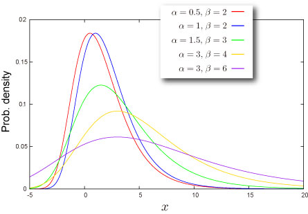

import DataGridMdx from "@site/src/components/DataGridMdx";

# Gumbel (Type I) Distribution

## Where do you meet this distribution?

- Extreme value theory (EVT)
- [Risk management -- Operational risk](http://en.wikipedia.org/wiki/Operational_risk)

## Shape of Distribution

### Basic Properties

- Two parameters $\alpha, \beta$ are required ([How can you get these](../03-function-reference/02-distribution-functions/044-ntgumbelparam.mdx)).

  $$
  \beta>0
  $$

- Continuous distribution defined on entire range
- This distribution is always asymmetric.

### Probability

- [Cumulative distribution function](/docs/glossary#cumulative-distribution-function)

  $$
  F(x)=\exp\left[-\exp\left(-\frac{x-\alpha}{\beta}\right)\right]
  $$

- [Probability density function](/docs/glossary#probability-density-function)

  $$
  f(x)=\frac{1}{\beta}\exp\left(-\frac{x-\alpha}{\beta}\right)\exp\left[-\exp\left(-\frac{x-\alpha}{\beta}\right)\right]
  $$

- How to compute these on Excel.

<DataGridMdx
  data={{
    cells: [
      [
        { value: "Data", readOnly: true, className: "orange-cell" },
        { value: "Description", readOnly: true, className: "orange-cell" },
      ],
      [
        { value: "0.5", readOnly: true },
        { value: "Value for which you want the distribution", readOnly: true },
      ],
      [
        { value: "8", readOnly: true },
        { value: "Value of parameter Alpha", readOnly: true },
      ],
      [
        { value: "2", readOnly: true },
        { value: "Value of parameter Beta", readOnly: true },
      ],
      [
        { value: "Formula", readOnly: true, className: "orange-cell" },
        {
          value: "Description (Result)",
          readOnly: true,
          className: "orange-cell",
        },
      ],
      [
        { value: "=NTGUMBELDIST(A2,A3,A4,TRUE)", readOnly: true },
        {
          value: "Cumulative distribution function for the terms above",
          readOnly: true,
        },
      ],
      [
        { value: "=NTGUMBELDIST(A2,A3,A4,FALSE)", readOnly: true },
        {
          value: "Probability density function for the terms above",
          readOnly: true,
        },
      ],
    ],
  }}
/>

- Function reference : [NTGUMBELDIST](../03-function-reference/02-distribution-functions/039-ntgumbeldist.mdx)

### Quantile

- Inverse function of [cumulative distribution function](/docs/glossary#cumulative-distribution-function)

  $$
  F^{-1}(P)=\alpha-\beta\ln\ln\frac{1}{P}
  $$

- How to compute this on Excel.

<DataGridMdx
  data={{
    cells: [
      [
        { value: "Data", readOnly: true, className: "orange-cell" },
        { value: "Description", readOnly: true, className: "orange-cell" },
      ],
      [
        { value: "0.7", readOnly: true },
        {
          value: "Probability associated with the distribution",
          readOnly: true,
        },
      ],
      [
        { value: "1.7", readOnly: true },
        { value: "Value of parameter Alpha", readOnly: true },
      ],
      [
        { value: "0.9", readOnly: true },
        { value: "Value of parameter Beta", readOnly: true },
      ],
      [
        { value: "Formula", readOnly: true, className: "orange-cell" },
        {
          value: "Description (Result)",
          readOnly: true,
          className: "orange-cell",
        },
      ],
      [
        { value: "=GUMBELINV(A2,A3,A4)", readOnly: true },
        {
          value:
            "Inverse of the cumulative distribution function for the terms above",
          readOnly: true,
        },
      ],
    ],
  }}
/>

- Function reference : [NTGUMBELINV](../03-function-reference/02-distribution-functions/040-ntgumbelinv.mdx)

## Characteristics

### Mean -- Where is the "center" of the distribution? ([Definition](/docs/glossary#mean))

- [Mean](/docs/glossary#mean) of the distribution is given as

  $$
  \alpha+\gamma\beta
  $$

  where $\gamma$ is [Euler's constant](/docs/glossary#eulers-constant).

- How to compute this on Excel

<DataGridMdx
  data={{
    cells: [
      [
        { value: "Data", readOnly: true, className: "orange-cell" },
        { value: "Description", readOnly: true, className: "orange-cell" },
      ],
      [
        { value: "8", readOnly: true },
        { value: "Value of parameter Alpha", readOnly: true },
      ],
      [
        { value: "2", readOnly: true },
        { value: "Value of parameter Beta", readOnly: true },
      ],
      [
        { value: "Formula", readOnly: true, className: "orange-cell" },
        {
          value: "Description (Result)",
          readOnly: true,
          className: "orange-cell",
        },
      ],
      [
        { value: "=NTGUMBELMEAN(A2,A3)", readOnly: true },
        {
          value: "Mean of the distribution for the terms above",
          readOnly: true,
        },
      ],
    ],
  }}
/>

- Function reference : [NTGUMBELMEAN](../03-function-reference/02-distribution-functions/042-ntgumbelmean.mdx)

### Standard Deviation -- How wide does the distribution spread? ([Definition](/docs/glossary#standard-deviation))

- [Variance](/docs/glossary#variance) of the distribution is given as

  $$
  \beta^2\zeta(2)
  $$

  where $\zeta(\cdot)$ is [Riemann zeta function](/docs/glossary#riemann-zeta-function).

  [Standard Deviation](/docs/glossary#standard-deviation) is a positive square root of [Variance](/docs/glossary#variance).

- How to compute this on Excel

<DataGridMdx
  data={{
    cells: [
      [
        { value: "Data", readOnly: true, className: "orange-cell" },
        { value: "Description", readOnly: true, className: "orange-cell" },
      ],
      [
        { value: "2", readOnly: true },
        { value: "Value of parameter Beta", readOnly: true },
      ],
      [
        { value: "Formula", readOnly: true, className: "orange-cell" },
        {
          value: "Description (Result)",
          readOnly: true,
          className: "orange-cell",
        },
      ],
      [
        { value: "=NTGUMBELSTDEV(A2)", readOnly: true },
        {
          value: "Standard deviation of the distribution for the terms above",
          readOnly: true,
        },
      ],
    ],
  }}
/>

- Function reference : [NTGUMBELSTDEV](../03-function-reference/02-distribution-functions/046-ntgumbelstdev.mdx)

### Skewness -- Which side is the distribution distorted into? ([Definition](/docs/glossary#skewness))

- [Skewness](/docs/glossary#skewness) of the distribution is given as

  $$
  -\frac{12\sqrt{6}\zeta(3)}{\pi^3}=-1.139547099\cdots
  $$

  where $\zeta(\cdot)$ is [Riemann zeta function](/docs/glossary#riemann-zeta-function).

### Kurtosis -- Sharp or Dull, consequently Fat Tail or Thin Tail ([Definition](/docs/glossary#kurtosis))

- Kurtosis of the distribution is $2.4$

## Random Numbers

- Random number x is generated by inverse function method, which is for uniform random U,

  $$
  x=\alpha-\beta\ln\ln\frac{1}{U}
  $$

- How to generate random numbers on Excel.

<DataGridMdx
  data={{
    cells: [
      [
        { value: "Data", readOnly: true, className: "orange-cell" },
        { value: "Description", readOnly: true, className: "orange-cell" },
      ],
      [
        { value: "0.5", readOnly: true },
        { value: "Value of parameter Alpha", readOnly: true },
      ],
      [
        { value: "0.5", readOnly: true },
        { value: "Value of parameter Beta", readOnly: true },
      ],
      [
        { value: "Formula", readOnly: true, className: "orange-cell" },
        {
          value: "Description (Result)",
          readOnly: true,
          className: "orange-cell",
        },
      ],
      [
        { value: "=NTRANDGUMBEL(100,A2,A3,0)", readOnly: true },
        {
          value:
            "100 Gumbel Type I deviates based on Mersenne-Twister algorithm for which the parameters above",
          readOnly: true,
        },
      ],
    ],
  }}
/>

Note The formula in the example must be entered as an array formula. After copying the example to a blank worksheet, select the range A5:A104 starting with the formula cell. Press F2, and then press CTRL+SHIFT+ENTER.

## NtRand Functions

- If you already have parameters of the distribution
  - Generating random numbers based on Mersenne Twister algorithm: [NTRANDGUMBEL](../03-function-reference/01-random-numbers/01-single-series/07-ntrandgumbel.mdx)
  - Computing probability : [NTGUMBELDIST](../03-function-reference/02-distribution-functions/039-ntgumbeldist.mdx)
  - Computing mean : [NTGUMBELMEAN](../03-function-reference/02-distribution-functions/042-ntgumbelmean.mdx)
  - Computing standard deviation : [NTGUMBELSTDEV](../03-function-reference/02-distribution-functions/045-ntgumbelskew.mdx)
  - Computing skewness : [NTGUMBELSKEW](../03-function-reference/02-distribution-functions/045-ntgumbelskew.mdx)
  - Computing kurtosis : [NTGUMBELKURT](../03-function-reference/02-distribution-functions/041-ntgumbelkurt.mdx)
  - Computing moments above at once : [NTGUMBELMOM](../03-function-reference/02-distribution-functions/043-ntgumbelmom.mdx)
- If you know mean and standard deviation of the distribution
  - Estimating parameters of the distribution:[NTGUMBELRPARAM](../03-function-reference/02-distribution-functions/044-ntgumbelparam.mdx)

## Reference

- [Wolfram Mathworld -- Gumbel Distribution](http://mathworld.wolfram.com/GumbelDistribution.html)
- [Wikipedia -- Gumbel distribution](http://en.wikipedia.org/wiki/Gumbel_distribution)
- [Statistics Online Computational Resource](http://www.socr.ucla.edu/htmls/SOCR_Distributions.html)
