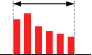
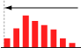
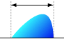
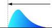
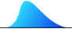

# Gallery of Distributions

### This is a Gallery of Distributions!

Do not hesitate to explore the world of distributions! They look boring? Come on! You'll be surprised by some facts even in [normal distribution](normal-distribution-single.mdx).\
Other distribution than written here are coming soon!

## Single Variable

### Integer variable (e.g. head-count, no. of events)

| Support      | Name                                                                                                                                                     |
| ------------ | -------------------------------------------------------------------------------------------------------------------------------------------------------- |
| **Finite**   |   [Bernoulli](bernoulli-distribution.mdx)  [Uniform(discrete)](uniform-distribution-discrete.mdx) |
| **Infinite** |   [Poisson](poisson-distribution.mdx)                                                                |

### Real value variable (e.g. weight, height, time, earnings ratio)

- Unimodal...

| Support           | Symmetric                                                                                                                                                                                                                                                             | Arbitrary                                                                                                                                                                                                                                                                                       | Asymmetric                                                                                                                                                                                                                                                                                                                                                      |
| ----------------- | --------------------------------------------------------------------------------------------------------------------------------------------------------------------------------------------------------------------------------------------------------------------- | ----------------------------------------------------------------------------------------------------------------------------------------------------------------------------------------------------------------------------------------------------------------------------------------------- | --------------------------------------------------------------------------------------------------------------------------------------------------------------------------------------------------------------------------------------------------------------------------------------------------------------------------------------------------------------- |
| **Finite**        | Not Supported                                                                                                                                                                                                                                                         |   [Johnson SB](johnson-sb-distribution.mdx)  [Kumaraswamy](kumaraswamy-distribution.mdx)  [Triangular](triangular-distribution.mdx)  [Beta](beta-distribution.mdx)  [Truncated Normal](truncated-normal-distribution.mdx) | Not Supported                                                                                                                                                                                                                                                                                                                                                   |
| **Semi-infinite** | Not Supported                                                                                                                                                                                                                                                         | Not Supported                                                                                                                                                                                                                                                                                   |   [Gumbel Type II](gumbel-type-ii-distribution.mdx)  [Log Normal](log-normal-distribution.mdx)  [Weibull](weibull-distribution.mdx)  [Chi](chi-distribution.mdx)  [Chi square](chi-square-distribution.mdx)  [Gamma](gamma-distribution.mdx)  [F](f-distribution.mdx) |
| **Infinite**      |   [Laplace](laplace-distribution.mdx)  [Cauchy](cauchy-distribution.mdx)  [Normal(Single)](normal-distribution-single.mdx)  [Logistic](logistic-distribution.mdx)  [t](t-distribution.mdx) |   [Johnson SU ](johnson-su-distribution.mdx)                                                                                                                                                                                                |   [Gumbel Type I](gumbel-type-i-distribution.mdx)                                                                                                                                                                                                                                                       |

- Monotonic increase / decrease...
  - [Truncated Normal](truncated-normal-distribution.mdx)
  - [Beta](beta-distribution.mdx)
  - [Weibull](weibull-distribution.mdx)
  - [Chi](chi-distribution.mdx)
  - [Chi square](chi-square-distribution.mdx)
  - [Gamma](gamma-distribution.mdx)
  - [F](f-distribution.mdx)
  - [Johnson SB](johnson-sb-distribution.mdx)
  - [Pareto](pareto-distribution.mdx)
  - [Exponential](exponential-distribution.mdx)
- Horseshoe shape...
  - [Beta](beta-distribution.mdx)
  - [U Quadratic](u-quadratic-distribution.mdx)
- Rectangle...
  - [Uniform](https://www.ntrand.com/uniform-distribution/)

## Multi variable

- [Normal (Multi)](normal-distribution-multi.mdx)
