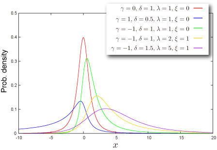
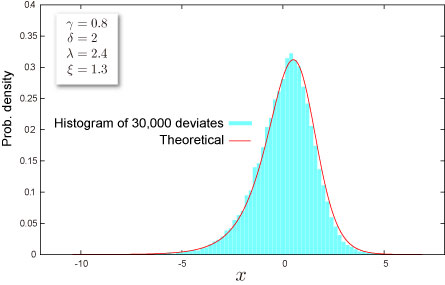

import DataGridMdx from "@site/src/components/DataGridMdx";

# Johnson SU Distribution

## Where do you meet this distribution?

- Finance, Economics : Value at Risk(VaR) model

  ["Estimation of Value at Risk Using Johnson Su-normal Distribution"](http://gloriamundi.org/library_journal_view.asp?journal_id=5574)

## Shape of Distribution

### Basic Properties

- Four parameters $\gamma, \delta,\lambda,\xi$ are required ([How can you get these](https://www.ntrand.com/ntjohnsonsuparam/)).

  $$
  \delta>0,\lambda>0
  $$

- Continuous distribution defined on entire range.
- This distribution can be symmetric or asymmetric.

### Probability

- [Cumulative distribution function](https://www.ntrand.com/glossary/#local_cumulative)

  $$
  F(x)=\Phi\left(\gamma+\delta\sinh^{-1}z\right)
  $$

  where

  $$
  z=\frac{x-\xi}{\lambda}
  $$

  and $\Phi(\cdot)$") is [cumulative distribution function](https://www.ntrand.com/glossary/#local_cumulative) of standard normal distribution.

- [Probability density function](https://www.ntrand.com/glossary/#local_probability)

  $$
  f(x)=\frac{\delta}{\lambda\sqrt{2\pi}\sqrt{z^2+1}}\exp\left[-\frac{1}{2}\left(\gamma+\delta\sinh^{-1}z\right)^2\right]
  $$

- How to compute these on Excel.

<DataGridMdx
  data={{
    cells: [
      [
        { value: "Data", readOnly: true, className: "orange-cell" },
        { value: "Description", readOnly: true, className: "orange-cell" },
      ],
      [
        { value: "2.5", readOnly: true },
        { value: "Value for which you want the distribution", readOnly: true },
      ],
      [
        { value: "1", readOnly: true },
        { value: "Value of parameter Gamma", readOnly: true },
      ],
      [
        { value: "4", readOnly: true },
        { value: "Value of parameter Delta", readOnly: true },
      ],
      [
        { value: "3", readOnly: true },
        { value: "Value of parameter Lambda", readOnly: true },
      ],
      [
        { value: "0.9", readOnly: true },
        { value: "Value of parameter Xi", readOnly: true },
      ],
      [
        { value: "Formula", readOnly: true, className: "orange-cell" },
        {
          value: "Description (Result)",
          readOnly: true,
          className: "orange-cell",
        },
      ],
      [
        {
          value: "=NTJOHNSONSUDIST(A2,A3,A4,A5,A6,TRUE)",
          readOnly: true,
        },
        {
          value: "Cumulative distribution function for the terms above",
          readOnly: true,
        },
      ],
      [
        {
          value: "=NTJOHNSONSUDIST(A2,A3,A4,A5,A6,FALSE)",
          readOnly: true,
        },
        {
          value: "Probability density function for the terms above",
          readOnly: true,
        },
      ],
    ],
  }}
/>

- Function reference : [NTJOHNSONSUDIST](https://www.ntrand.com/ntjohnsonsudist/)

### Quantile

- Inverse of [cumulative distribution function](https://www.ntrand.com/glossary/#local_cumulative)

  $$
  F^{-1}(P)=\lambda\sinh\left(\frac{\Phi^{-1}(P)-\gamma}{\delta}\right)+\xi
  $$

  where $\Phi(\cdot)$ is [cumulative distribution function](https://www.ntrand.com/glossary/#local_cumulative) of standard normal distribution.

- How to compute this on Excel.

<DataGridMdx
  data={{
    cells: [
      [
        { value: "Data", readOnly: true, className: "orange-cell" },
        { value: "Description", readOnly: true, className: "orange-cell" },
      ],
      [
        { value: "0.5", readOnly: true },
        {
          value: "Probability associated with the Johnson SU distribution",
          readOnly: true,
        },
      ],
      [
        { value: "1", readOnly: true },
        { value: "Value of parameter Gamma", readOnly: true },
      ],
      [
        { value: "4", readOnly: true },
        { value: "Value of parameter Delta", readOnly: true },
      ],
      [
        { value: "3", readOnly: true },
        { value: "Value of parameter Lambda", readOnly: true },
      ],
      [
        { value: "0.9", readOnly: true },
        { value: "Value of parameter Xi", readOnly: true },
      ],
      [
        { value: "Formula", readOnly: true, className: "orange-cell" },
        {
          value: "Description (Result)",
          readOnly: true,
          className: "orange-cell",
        },
      ],
      [
        {
          value: "=NTJOHNSONSUINV(A2,A3,A4,A5,A6)",
          readOnly: true,
        },
        {
          value:
            "Inverse of the cumulative distribution function for the terms above",
          readOnly: true,
        },
      ],
    ],
  }}
/>

- Function reference : [NTJOHNSONSUINV](https://www.ntrand.com/ntjohnsonsuinv/)

## Characteristics

### Mean -- Where is the "center" of the distribution? ([Definition](https://www.ntrand.com/glossary/#local_mean))

- [Mean](https://www.ntrand.com/glossary/#local_mean) of the distribution is given as

  $$
  \xi+\text{sign}(\gamma_1)\sigma\frac{\omega-1-m(\omega)}{\omega-1}
  $$

  where

  $$
  m(\omega)=-2+\sqrt{4+2\left(\omega^2-\frac{\beta_2+3}{\omega^2+2\omega+3}\right)}
  $$

  $$
  \omega=\exp\left(\delta^{-2}\right)
  $$

  and $\gamma_1$ is skewness of the distribution (see below)

- How to compute this on Excel

<DataGridMdx
  data={{
    cells: [
      [
        { value: "Data", readOnly: true, className: "orange-cell" },
        { value: "Description", readOnly: true, className: "orange-cell" },
      ],
      [
        { value: "1", readOnly: true },
        { value: "Value of parameter Gamma", readOnly: true },
      ],
      [
        { value: "4", readOnly: true },
        { value: "Value of parameter Delta", readOnly: true },
      ],
      [
        { value: "3", readOnly: true },
        { value: "Value of parameter Lambda", readOnly: true },
      ],
      [
        { value: "0.9", readOnly: true },
        { value: "Value of parameter Xi", readOnly: true },
      ],
      [
        { value: "Formula", readOnly: true, className: "orange-cell" },
        {
          value: "Description (Result)",
          readOnly: true,
          className: "orange-cell",
        },
      ],
      [
        {
          value: "=NTJOHNSONSUMEAN(A2,A3,A4,A5)",
          readOnly: true,
        },
        {
          value: "Mean of the distribution for the terms above",
          readOnly: true,
        },
      ],
    ],
  }}
/>

- Function reference : [NTJOHNSONSUMEAN](https://www.ntrand.com/ntjohnsonsumean/)

### Standard Deviation -- How wide does the distribution spread? ([Definition](https://www.ntrand.com/glossary/#local_standard_deviation))

- [Variance](https://www.ntrand.com/glossary/#local_variance) of the distribution is given as

  $$
  \lambda(\omega-1)\sqrt{\frac{\omega+1}{2m(\omega)}}
  $$

  where

  $$
  m(\omega)=-2+\sqrt{4+2\left(\omega^2-\frac{\beta_2+3}{\omega^2+2\omega+3}\right)}
  $$

  $$
  \omega=\exp\left(\delta^{-2}\right)
  $$

  [Standard Deviation](https://www.ntrand.com/glossary/#local_standard_deviation) is a positive square root of [Variance](https://www.ntrand.com/glossary/#local_variance).

- How to compute this on Excel

<DataGridMdx
  data={{
    cells: [
      [
        { value: "Data", readOnly: true, className: "orange-cell" },
        { value: "Description", readOnly: true, className: "orange-cell" },
      ],
      [
        { value: "1", readOnly: true },
        { value: "Value of parameter Gamma", readOnly: true },
      ],
      [
        { value: "4", readOnly: true },
        { value: "Value of parameter Delta", readOnly: true },
      ],
      [
        { value: "3", readOnly: true },
        { value: "Value of parameter Lambda", readOnly: true },
      ],
      [
        { value: "0.9", readOnly: true },
        { value: "Value of parameter Xi", readOnly: true },
      ],
      [
        { value: "Formula", readOnly: true, className: "orange-cell" },
        {
          value: "Description (Result)",
          readOnly: true,
          className: "orange-cell",
        },
      ],
      [
        {
          value: "=NTJOHNSONSUSTDEV(A2,A3,A4,A5)",
          readOnly: true,
        },
        {
          value: "Standard deviation of the distribution for the terms above",
          readOnly: true,
        },
      ],
    ],
  }}
/>

- Function reference : [NTJOHNSONSUSTDEV](https://www.ntrand.com/ntjohnsonsustdev/)

### Skewness -- Which side is the distribution distorted into? ([Definition](https://www.ntrand.com/glossary/#local_skewness))

- [Skewness](https://www.ntrand.com/glossary/#local_skew) of the distribution is given as

  $$
  \beta_1=\omega(\omega-1)\frac{[\omega(\omega+2)\sinh 3\Omega+3\sinh\Omega]^2}{2(\omega\cosh 2\Omega+1)^3}
  $$

  where

  $$
  \omega=\exp\left(\delta^{-2}\right),\Omega=\frac{\gamma}{\delta}
  $$

- How to compute this on Excel

<DataGridMdx
  data={{
    cells: [
      [
        { value: "Data", readOnly: true, className: "orange-cell" },
        { value: "Description", readOnly: true, className: "orange-cell" },
      ],
      [
        { value: "1", readOnly: true },
        { value: "Value of parameter Gamma", readOnly: true },
      ],
      [
        { value: "4", readOnly: true },
        { value: "Value of parameter Delta", readOnly: true },
      ],
      [
        { value: "3", readOnly: true },
        { value: "Value of parameter Lambda", readOnly: true },
      ],
      [
        { value: "0.9", readOnly: true },
        { value: "Value of parameter Xi", readOnly: true },
      ],
      [
        { value: "Formula", readOnly: true, className: "orange-cell" },
        {
          value: "Description (Result)",
          readOnly: true,
          className: "orange-cell",
        },
      ],
      [
        {
          value: "=NTJOHNSONSUSKEW(A2,A3,A4,A5)",
          readOnly: true,
        },
        {
          value: "Skewness of the distribution for the terms above",
          readOnly: true,
        },
      ],
    ],
  }}
/>

- Function reference : [NTJOHNSONSUSKEW](https://www.ntrand.com/ntjohnsonsuskew/)

### Kurtosis -- Sharp or Dull, consequently Fat Tail or Thin Tail ([Definition](https://www.ntrand.com/glossary/#local_kurtosis))

- [Kurtosis](https://www.ntrand.com/glossary/#local_kurtosis) of the distribution is given as

  $$
  \beta_2=\frac{\omega^2(\omega^4+2\omega^3+3\omega^2-3)\cosh 4\Omega+4\omega^2(\omega+2)\cosh 2\Omega+3(2\omega+1)}{2(\omega\cosh 2\Omega+2)^2}-3
  $$

  where

  $$
  \omega=\exp\left(\delta^{-2}\right),\Omega=\frac{\gamma}{\delta}
  $$

- How to compute this on Excel

<DataGridMdx
  data={{
    cells: [
      [
        { value: "Data", readOnly: true, className: "orange-cell" },
        { value: "Description", readOnly: true, className: "orange-cell" },
      ],
      [
        { value: "1", readOnly: true },
        { value: "Value of parameter Gamma", readOnly: true },
      ],
      [
        { value: "4", readOnly: true },
        { value: "Value of parameter Delta", readOnly: true },
      ],
      [
        { value: "3", readOnly: true },
        { value: "Value of parameter Lambda", readOnly: true },
      ],
      [
        { value: "0.9", readOnly: true },
        { value: "Value of parameter Xi", readOnly: true },
      ],
      [
        { value: "Formula", readOnly: true, className: "orange-cell" },
        {
          value: "Description (Result)",
          readOnly: true,
          className: "orange-cell",
        },
      ],
      [
        {
          value: "=NTJOHNSONSUKURT(A2,A3,A4,A5)",
          readOnly: true,
        },
        {
          value: "Kurtosis of the distribution for the terms above",
          readOnly: true,
        },
      ],
    ],
  }}
/>

- Function reference : [NTJOHNSONSUKURT](https://www.ntrand.com/ntjohnsonsukurt/)

## Random Numbers

- Random number x is generated by inverse function method, which is for uniform random U,

  $$
  x=\lambda\left(\frac{\Phi^{-1}(U)-\gamma}{\delta}\right)+\xi
  $$

- How to generate random numbers on Excel.

<DataGridMdx
  data={{
    cells: [
      [
        { value: "Data", readOnly: true, className: "orange-cell" },
        { value: "Description", readOnly: true, className: "orange-cell" },
      ],
      [
        { value: "100", readOnly: true },
        { value: "Number of random numbers to generate", readOnly: true },
      ],
      [
        { value: "1", readOnly: true },
        { value: "Value of parameter Gamma", readOnly: true },
      ],
      [
        { value: "4", readOnly: true },
        { value: "Value of parameter Delta", readOnly: true },
      ],
      [
        { value: "3", readOnly: true },
        { value: "Value of parameter Lambda", readOnly: true },
      ],
      [
        { value: "0.9", readOnly: true },
        { value: "Value of parameter Xi", readOnly: true },
      ],
      [
        { value: "Formula", readOnly: true, className: "orange-cell" },
        {
          value: "Description (Result)",
          readOnly: true,
          className: "orange-cell",
        },
      ],
      [
        {
          value: "=NTRANDJOHNSONSU(100,A2,A3,A4,A5,0)",
          readOnly: true,
        },
        {
          value:
            "100 Johnson SU deviates based on Mersenne-Twister algorithm for which the parameters above",
          readOnly: true,
        },
      ],
    ],
  }}
/>

Note The formula in the example must be entered as an array formula. After copying the example to a blank worksheet, select the range A7:A106 starting with the formula cell. Press F2, and then press CTRL+SHIFT+ENTER.

## NtRand Functions

- If you already have parameters of the distribution
  - Generating random numbers based on Mersenne Twister algorithm: [NTRANDJOHNSONSU](https://www.ntrand.com/ntrandjohnsonsu/)
  - Computing probability : [NTJOHNSONSUDIST](https://www.ntrand.com/ntjohnsonsudist/)
  - Computing quantile : [NTJOHNSONSUINV](https://www.ntrand.com/ntjohnsonsuinv/)
  - Computing mean : [NTJOHNSONSUMEAN](https://www.ntrand.com/ntjohnsonsumean/)
  - Computing standard deviation : [NTJOHNSONSUSTDEV](https://www.ntrand.com/ntjohnsonsuskew/)
  - Computing skewness : [NTJOHNSONSUSKEW](https://www.ntrand.com/ntjohnsonsuskew/)
  - Computing kurtosis : [NTJOHNSONSUKURT](https://www.ntrand.com/ntjohnsonsukurt/)
  - Computing moments above at once : [NTJOHNSONSUMOM](https://www.ntrand.com/ntjohnsonsumom/)
- If you know mean and standard deviation of the distribution
  - Estimating parameters of the distribution:[NTJOHNSONSUPARAM](https://www.ntrand.com/ntjohnsonsuparam/)

## Reference

- [Statistics Online Computational Resource](http://www.socr.ucla.edu/htmls/SOCR_Distributions.html)
