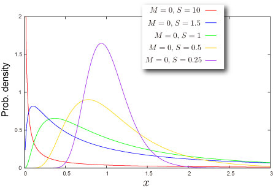
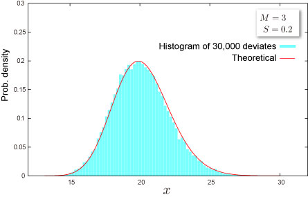

import DataGridMdx from "@site/src/components/DataGridMdx";

# Log Normal Distribution

## Where do you meet this distribution?

- Finance, Economics : Change of stock price

## Shape of Distribution

### Basic Properties

- Two parameters $M, S$ are required ([How can you get these](../03-function-reference/02-distribution-functions/068-ntlognormparam.mdx)).

  $$
  S>0
  $$

- Continuous distribution defined on semi-bounded range $x>0$
- This distribution is always asymmetric.

### Probability

- [Cumulative distribution function](/docs/glossary#cumulative-distribution-function)

  $$
  F(x)=\Phi\left(\frac{\ln x-M}{S}\right)
  $$

  where\
  $\Phi(\cdot)$ is [cumulative distribution function](/docs/glossary#cumulative-distribution-function) of standard normal distribution.

- [Probability density function](/docs/glossary#probability-density-function)

  $$
  f(x)=\frac{1}{Sx}\phi\left(\frac{\ln x-M}{S}\right)
  $$

  where\
  $\phi(\cdot)$ is [probability density function](/docs/glossary#probability-density-function) of standard normal distribution.

- How to compute these on Excel.

<DataGridMdx
  data={{
    cells: [
      [
        { value: "Data", readOnly: true, className: "orange-cell" },
        { value: "Description", readOnly: true, className: "orange-cell" },
      ],
      [
        { value: "0.5", readOnly: true },
        { value: "Value for which you want the distribution", readOnly: true },
      ],
      [
        { value: "0.1", readOnly: true },
        { value: "Value of parameter M", readOnly: true },
      ],
      [
        { value: "2", readOnly: true },
        { value: "Value of parameter S", readOnly: true },
      ],
      [
        { value: "Formula", readOnly: true, className: "orange-cell" },
        {
          value: "Description (Result)",
          readOnly: true,
          className: "orange-cell",
        },
      ],
      [
        { value: "=NTLOGNORMDIST(A2,A3,A4,TRUE)", readOnly: true },
        {
          value: "Cumulative distribution function for the terms above",
          readOnly: true,
        },
      ],
      [
        { value: "=NTLOGNORMDIST(A2,A3,A4,FALSE)", readOnly: true },
        {
          value: "Probability density function for the terms above",
          readOnly: true,
        },
      ],
    ],
  }}
/>

- Function reference : [NTLOGNORMDIST](../03-function-reference/02-distribution-functions/063-ntlognormdist.mdx)

### Quantile

- Inverse function of [cumulative distribution function](/docs/glossary#cumulative-distribution-function)

  $$
  F^{-1}(P)=\exp\left[S\Phi^{-1}(P)+M\right]
  $$

  where\
  $\Phi(\cdot)$is [cumulative distribution function](/docs/glossary#cumulative-distribution-function) of standard normal distribution.

- How to compute this on Excel.

<DataGridMdx
  data={{
    cells: [
      [
        { value: "Data", readOnly: true, className: "orange-cell" },
        { value: "Description", readOnly: true, className: "orange-cell" },
      ],
      [
        { value: "0.7", readOnly: true },
        {
          value: "Probability associated with the distribution",
          readOnly: true,
        },
      ],
      [
        { value: "0.1", readOnly: true },
        { value: "Value of parameter M", readOnly: true },
      ],
      [
        { value: "2", readOnly: true },
        { value: "Value of parameter S", readOnly: true },
      ],
      [
        { value: "Formula", readOnly: true, className: "orange-cell" },
        {
          value: "Description (Result)",
          readOnly: true,
          className: "orange-cell",
        },
      ],
      [
        {
          value: "=NTLOGNORMINV(A2,A3,A4)",
          readOnly: true,
        },
        {
          value:
            "Inverse of the cumulative distribution function for the terms above",
          readOnly: true,
        },
      ],
    ],
  }}
/>

## Characteristics

### Mean -- Where is the "center" of the distribution? ([Definition](/docs/glossary#mean))

- [Mean](/docs/glossary#mean) of the distribution is given as

  $$
  m\sqrt{\omega}
  $$

  where

  $$
  m=\exp(M),;\omega=\exp(S^2)
  $$

- How to compute this on Excel

<DataGridMdx
  data={{
    cells: [
      [
        { value: "Data", readOnly: true, className: "orange-cell" },
        { value: "Description", readOnly: true, className: "orange-cell" },
      ],
      [
        { value: "0.1", readOnly: true },
        { value: "Value of parameter M", readOnly: true },
      ],
      [
        { value: "2", readOnly: true },
        { value: "Value of parameter S", readOnly: true },
      ],
      [
        { value: "Formula", readOnly: true, className: "orange-cell" },
        {
          value: "Description (Result)",
          readOnly: true,
          className: "orange-cell",
        },
      ],
      [
        { value: "=NTLOGNORMMEAN(A2,A3)", readOnly: true },
        {
          value: "Mean of the distribution for the terms above",
          readOnly: true,
        },
      ],
    ],
  }}
/>

- Function reference : [NTLOGNORMMEAN](../03-function-reference/02-distribution-functions/066-ntlognormmean.mdx)

### Standard Deviation -- How wide does the distribution spread? ([Definition](/docs/glossary#standard-deviation))

- [Variance](/docs/glossary#variance) of the distribution is given as

  $$
  m^2\omega(\omega-1)
  $$

  where

  $$
  m=\exp(M),;\omega=\exp(S^2)
  $$

  [Standard Deviation](/docs/glossary#standard-deviation) is a positive square root of [Variance](/docs/glossary#variance).

- How to compute this on Excel

<DataGridMdx
  data={{
    cells: [
      [
        { value: "Data", readOnly: true, className: "orange-cell" },
        { value: "Description", readOnly: true, className: "orange-cell" },
      ],
      [
        { value: "0.1", readOnly: true },
        { value: "Value of parameter M", readOnly: true },
      ],
      [
        { value: "2", readOnly: true },
        { value: "Value of parameter S", readOnly: true },
      ],
      [
        { value: "Formula", readOnly: true, className: "orange-cell" },
        {
          value: "Description (Result)",
          readOnly: true,
          className: "orange-cell",
        },
      ],
      [
        { value: "=NTLOGNORMSTDEV(A2,A3)", readOnly: true },
        {
          value: "Standard deviation of the distribution for the terms above",
          readOnly: true,
        },
      ],
    ],
  }}
/>

- Function reference : [NTLOGNORMSTDEV](../03-function-reference/02-distribution-functions/070-ntlognormstdev.mdx)

### Skewness -- Which side is the distribution distorted into? ([Definition](/docs/glossary#skewness))

- [Skewness](https://www.ntrand.com/glossary/#local_skew) of the distribution is given as

  $$
  (\omega+2)\sqrt{\omega-1}
  $$

  where

  $$
  \omega=\exp(S^2)
  $$

- How to compute this on Excel

<DataGridMdx
  data={{
    cells: [
      [
        { value: "Data", readOnly: true, className: "orange-cell" },
        { value: "Description", readOnly: true, className: "orange-cell" },
      ],
      [
        { value: "0.1", readOnly: true },
        { value: "Value of parameter M", readOnly: true },
      ],
      [
        { value: "2", readOnly: true },
        { value: "Value of parameter S", readOnly: true },
      ],
      [
        { value: "Formula", readOnly: true, className: "orange-cell" },
        {
          value: "Description (Result)",
          readOnly: true,
          className: "orange-cell",
        },
      ],
      [
        { value: "=NTLOGNORMSKEW(A2,A3)", readOnly: true },
        {
          value: "Skewness of the distribution for the terms above",
          readOnly: true,
        },
      ],
    ],
  }}
/>

- Function reference : [NTLOGNORMSKEW](../03-function-reference/02-distribution-functions/069-ntlognormskew.mdx)

### Kurtosis -- Sharp or Dull, consequently Fat Tail or Thin Tail ([Definition](/docs/glossary#kurtosis))

- [Kurtosis](/docs/glossary#kurtosis) of the distribution is given as

  $$
  \omega^4+2\omega^3+3\omega^2-6
  $$

  where

  $$
  \omega=\exp(S^2)
  $$

- How to compute this on Excel

<DataGridMdx
  data={{
    cells: [
      [
        { value: "Data", readOnly: true, className: "orange-cell" },
        { value: "Description", readOnly: true, className: "orange-cell" },
      ],
      [
        { value: "0.1", readOnly: true },
        { value: "Value of parameter M", readOnly: true },
      ],
      [
        { value: "2", readOnly: true },
        { value: "Value of parameter S", readOnly: true },
      ],
      [
        { value: "Formula", readOnly: true, className: "orange-cell" },
        {
          value: "Description (Result)",
          readOnly: true,
          className: "orange-cell",
        },
      ],
      [
        { value: "=NTLOGNORMKURT(A2,A3)", readOnly: true },
        {
          value: "Kurtosis of the distribution for the terms above",
          readOnly: true,
        },
      ],
    ],
  }}
/>

- Function reference : [NTLOGNORMKURT](../03-function-reference/02-distribution-functions/065-ntlognormkurt.mdx)

## Random Numbers

- Random number x is generated by inverse function method, which is for uniform random U,

  $$
  x=\exp\left[S\Phi^{-1}(U)+M\right]
  $$

  where\

  $$
  \Phi(\cdot)
  $$

- How to generate random numbers on Excel.

<DataGridMdx
  data={{
    cells: [
      [
        { value: "Data", readOnly: true, className: "orange-cell" },
        { value: "Description", readOnly: true, className: "orange-cell" },
      ],
      [
        { value: "0.1", readOnly: true },
        { value: "Value of parameter M", readOnly: true },
      ],
      [
        { value: "2", readOnly: true },
        { value: "Value of parameter S", readOnly: true },
      ],
      [
        { value: "Formula", readOnly: true, className: "orange-cell" },
        {
          value: "Description (Result)",
          readOnly: true,
          className: "orange-cell",
        },
      ],
      [
        { value: "=NTRANDLOGNORM(100,A2,A3,0)", readOnly: true },
        {
          value:
            "100 log normal deviates based on Mersenne-Twister algorithm for which the parameters above",
          readOnly: true,
        },
      ],
    ],
  }}
/>

Note The formula in the example must be entered as an array formula. After copying the example to a blank worksheet, select the range A7:A106 starting with the formula cell. Press F2, and then press CTRL+SHIFT+ENTER.

- Function reference : [NTRANDLOGNORM](../03-function-reference/01-random-numbers/01-single-series/10-ntrandlognorm.mdx)

## NtRand Functions

- If you already have parameters of the distribution
  - Generating random numbers based on Mersenne Twister algorithm: [NTRANDLOGNORM](../03-function-reference/01-random-numbers/01-single-series/10-ntrandlognorm.mdx)
  - Computing probability : [NTLOGNORMDIST](../03-function-reference/02-distribution-functions/063-ntlognormdist.mdx)
  - Computing mean : [NTLOGNORMMEAN](../03-function-reference/02-distribution-functions/066-ntlognormmean.mdx)
  - Computing standard deviation : [NTLOGNORMSTDEV](../03-function-reference/02-distribution-functions/069-ntlognormskew.mdx)
  - Computing skewness : [NTLOGNORMSKEW](../03-function-reference/02-distribution-functions/069-ntlognormskew.mdx)
  - Computing kurtosis : [NTLOGNORMKURT](../03-function-reference/02-distribution-functions/065-ntlognormkurt.mdx)
  - Computing moments above at once : [NTLOGNORMMOM](../03-function-reference/02-distribution-functions/067-ntlognormmom.mdx)
- If you know mean and standard deviation of the distribution
  - Estimating parameters of the distribution:[NTLOGNORMPARAM](../03-function-reference/02-distribution-functions/068-ntlognormparam.mdx)

## Reference

- [Wolfram Mathworld -- Log Normal Distribution](http://mathworld.wolfram.com/LogNormalDistribution.html)
- [Wikipedia -- Log-normal distribution](http://en.wikipedia.org/wiki/Log_normal_distribution)
- [Statistics Online Computational Resource](http://www.socr.ucla.edu/htmls/SOCR_Distributions.html)
