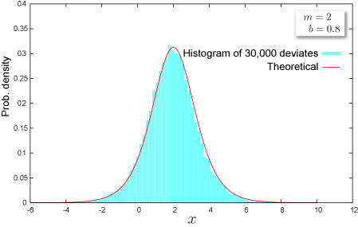

import DataGridMdx from "@site/src/components/DataGridMdx";

# Logistic Distribution

## Where do you meet this distribution?

- Biology : how species populations grow in competition
- Energy : the diffusion and substitution of primary energy so
- Epidemiology: spreading of epidemics
- Marketing : the diffusion of new-product sales
- Psychology : learning curve
- Technology : to describe how new technologies diffuse and substitute for each other

## Shape of Distribution

### Basic Properties

- Two parameters $m, b$ are required ([How can you get these](https://www.ntrand.com/ntlogisticparam/)).

  $$
  b>0
  $$

- Continuous distribution defined on entire range
- This distribution is always symmetric.

### Probability

- [Cumulative distribution function](https://www.ntrand.com/glossary/#local_cumulative)

  $$
  F(x)=\frac{1}{2}\left[1+\tanh\left(\frac{x-m}{2b}\right)\right]
  $$

- [Probability density function](https://www.ntrand.com/glossary/#local_probability)

  $$
  f(x)=\frac{1}{4 b}\text{sech}^2\left(\frac{x-m}{2b}\right)
  $$

- How to compute these on Excel.

<DataGridMdx
  data={{
    cells: [
      [
        { value: "Data", readOnly: true, className: "orange-cell" },
        { value: "Description", readOnly: true, className: "orange-cell" },
      ],
      [
        { value: "0.5", readOnly: true },
        { value: "Value for which you want the distribution", readOnly: true },
      ],
      [
        { value: "8", readOnly: true },
        { value: "Value of parameter M", readOnly: true },
      ],
      [
        { value: "2", readOnly: true },
        { value: "Value of parameter B", readOnly: true },
      ],
      [
        { value: "=NTLOGISTICDIST(A2,A3,A4,TRUE)", readOnly: true },
        {
          value: "Cumulative distribution function for the terms above",
          readOnly: true,
        },
      ],
      [
        { value: "=NTLOGISTICDIST(A2,A3,A4,FALSE)", readOnly: true },
        {
          value: "Probability density function for the terms above",
          readOnly: true,
        },
      ],
    ],
  }}
/>

- Function reference : [NTLOGISTICDIST](https://www.ntrand.com/ntlogisticdist/)

### Quantile

- Inverse function of [cumulative distribution function](https://www.ntrand.com/glossary/#local_cumulative)

  $$
  F^{-1}(P)=2b\tanh^{-1}(2P-1)+m
  $$

- How to compute this on Excel.

<DataGridMdx
  data={{
    cells: [
      [
        { value: "Data", readOnly: true, className: "orange-cell" },
        { value: "Description", readOnly: true, className: "orange-cell" },
      ],
      [
        { value: "0.7", readOnly: true },
        {
          value: "Probability associated with the distribution",
          readOnly: true,
        },
      ],
      [
        { value: "1.7", readOnly: true },
        { value: "Value of parameter M", readOnly: true },
      ],
      [
        { value: "0.9", readOnly: true },
        { value: "Value of parameter B", readOnly: true },
      ],
      [
        { value: "Formula", readOnly: true, className: "orange-cell" },
        {
          value: "Description (Result)",
          readOnly: true,
          className: "orange-cell",
        },
      ],
      [
        {
          value: "=NTLOGISTICINV(A2,A3,A4)",
          readOnly: true,
        },
        {
          value:
            "Inverse of the cumulative distribution function for the terms above",
          readOnly: true,
        },
      ],
    ],
  }}
/>

- Function reference : [NTLOGISTICINV](https://www.ntrand.com/ntlogisticinv/)

## Characteristics

### Mean -- Where is the "center" of the distribution? ([Definition](https://www.ntrand.com/glossary/#local_mean))

- Mean of the distribution is given as $m$

### Standard Deviation -- How wide does the distribution spread? ([Definition](https://www.ntrand.com/glossary/#local_standard_deviation))

- [Variance](https://www.ntrand.com/glossary/#local_variance) of the distribution is given as

  $$
  \frac{\pi^2b^2}{3}
  $$

  [Standard Deviation](https://www.ntrand.com/glossary/#local_standard_deviation) is a positive square root of [Variance](https://www.ntrand.com/glossary/#local_variance).

- How to compute this on Excel

<DataGridMdx
  data={{
    cells: [
      [
        { value: "Data", readOnly: true, className: "orange-cell" },
        { value: "Description", readOnly: true, className: "orange-cell" },
      ],
      [
        { value: "2", readOnly: true },
        { value: "Value of parameter B", readOnly: true },
      ],
      [
        { value: "Formula", readOnly: true, className: "orange-cell" },
        {
          value: "Description (Result)",
          readOnly: true,
          className: "orange-cell",
        },
      ],
      [
        { value: "=NTLOGISTICSTDEV(A2)", readOnly: true },
        {
          value: "Standard deviation of the distribution for the terms above",
          readOnly: true,
        },
      ],
    ],
  }}
/>

- Function reference : [NTLOGISTICSTDEV](https://www.ntrand.com/ntlogisticstdev/)

### Skewness -- Which side is the distribution distorted into? ([Definition](https://www.ntrand.com/glossary/#local_skewness))

- Skewness of the distribution is $0$.

### Kurtosis -- Sharp or Dull, consequently Fat Tail or Thin Tail ([Definition](https://www.ntrand.com/glossary/#local_kurtosis))

- Kurtosis of the distribution is $1.2$.

## Random Numbers

- Random number x is generated by inverse function method, which is for uniform random U,

  $$
  x=2b\tanh^{-1}(2U-1)+m
  $$

- How to generate random numbers on Excel.

<DataGridMdx
  data={{
    cells: [
      [
        { value: "Data", readOnly: true, className: "orange-cell" },
        { value: "Description", readOnly: true, className: "orange-cell" },
      ],
      [
        { value: "0.5", readOnly: true },
        { value: "Value of parameter M", readOnly: true },
      ],
      [
        { value: "0.5", readOnly: true },
        { value: "Value of parameter B", readOnly: true },
      ],
      [
        { value: "Formula", readOnly: true, className: "orange-cell" },
        {
          value: "Description (Result)",
          readOnly: true,
          className: "orange-cell",
        },
      ],
      [
        {
          value: "=NTRANDLOGISTIC(100,A2,A3)",
          readOnly: true,
        },
        {
          value:
            "100 Logistic deviates based on Mersenne-Twister algorithm for which the parameters above",
          readOnly: true,
        },
      ],
    ],
  }}
/>

Note The formula in the example must be entered as an array formula. After copying the example to a blank worksheet, select the range A5:A104 starting with the formula cell. Press F2, and then press CTRL+SHIFT+ENTER.

## NtRand Functions

- If you already have parameters of the distribution
  - Generating random numbers based on Mersenne Twister algorithm: [NTRANDLOGISTIC](https://www.ntrand.com/ntrandlogistic/)
  - Computing probability : [NTLOGISTICDIST](https://www.ntrand.com/ntlogisticdist/)
  - Computing mean : [NTLOGISTICMEAN](https://www.ntrand.com/ntlogisticmean/)
  - Computing standard deviation : [NTLOGISTICSTDEV](https://www.ntrand.com/ntlogisticskew/)
  - Computing skewness : [NTLOGISTICSKEW](https://www.ntrand.com/ntlogisticskew/)
  - Computing kurtosis : [NTLOGISTICKURT](https://www.ntrand.com/ntlogistickurt/)
  - Computing moments above at once : [NTLOGISTICMOM](https://www.ntrand.com/ntlogisticmom/)
- If you know mean and standard deviation of the distribution
  - Estimating parameters of the distribution:[NTLOGISTICPARAM](https://www.ntrand.com/ntlogisticparam/)

## Reference

- [Wolfram Mathworld -- Logistic Distribution](http://mathworld.wolfram.com/LogisticDistribution.html)
- [Wikipedia -- Logistic distribution](http://en.wikipedia.org/wiki/Logistic_distribution)
- [Statistics Online Computational Resource](http://www.socr.ucla.edu/htmls/SOCR_Distributions.html)
