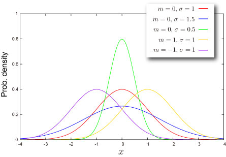
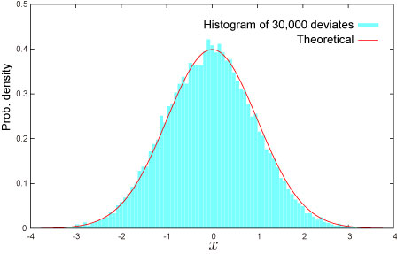

import DataGridMdx from "@site/src/components/DataGridMdx";

# Normal Distribution (Single variable)

## Where do you meet this distribution?

- Standard score
- Finance, Economics : changes in the logarithm of exchange rates, price indices, and stock market indices are assumed normal
- Average of stochastic variables : Central Limit Theorem
- Statistical mechanics : Velocities of the molecules in the ideal gas
- Quantum physics : Probability density function of a ground state in a quantum harmonic oscillator
- Error analysis

## Shape of Distribution

### Basic Properties

- Two parameters $m, \sigma$ are required.

$$
  \sigma>0
$$

These parameters are [Mean](/docs/glossary#mean) and [Standard Deviation](/docs/glossary#standard-deviation) of the distribution respectively.

- Continuous distribution defined on entire range
- This distribution is always symmetric.

### Probability

- [Cumulative distribution function](/docs/glossary#cumulative-distribution-function)

$$
  F(x)=\int_{-\infty}^{x}\phi\left(\frac{t-m}{\sigma}\right)\text{d}t
$$

where $\phi(\cdot)$ is [Probability density function](/docs/glossary#probability-density-function) of standard normal distribution.

- [Probability density function](/docs/glossary#probability-density-function)

$$
  f(x)=\frac{1}{\sqrt{2\pi}\sigma}\exp\left[-\frac{(x-m)^2}{2\sigma^2}\right]
$$

- How to compute these on Excel.

<DataGridMdx
  data={{
    cells: [
      [
        { value: "Data", readOnly: true, className: "orange-cell" },
        { value: "Description", readOnly: true, className: "orange-cell" },
      ],
      [
        { value: "0.5", readOnly: true },
        { value: "Value for which you want the distribution", readOnly: true },
      ],
      [
        { value: "8", readOnly: true },
        { value: "Value of parameter M", readOnly: true },
      ],
      [
        { value: "2", readOnly: true },
        { value: "Value of parameter Sigma", readOnly: true },
      ],
      [
        { value: "Formula", readOnly: true, className: "orange-cell" },
        {
          value: "Description (Result)",
          readOnly: true,
          className: "orange-cell",
        },
      ],
      [
        { value: "=NTNORMDIST((A2-A3)/A4,TRUE)", readOnly: true },
        {
          value: "Cumulative distribution function for the terms above",
          readOnly: true,
        },
      ],
      [
        { value: "=NTNORMDIST((A2-A3)/A4,FALSE)", readOnly: true },
        {
          value: "Probability density function for the terms above",
          readOnly: true,
        },
      ],
    ],
  }}
/>

- Function reference : [NTNORMDIST](../03-function-reference/02-distribution-functions/071-ntnormdist.mdx)
- NtRand Function [NTNORMDIST](../03-function-reference/02-distribution-functions/071-ntnormdist.mdx) is same as excel function [NORMSDIST](http://office.microsoft.com/en-us/excel/HP052091941033.aspx?pid=CH062528311033) when 2nd. argument=TRUE.

### Quantile

- Inverse function of [cumulative distribution function](/docs/glossary#cumulative-distribution-function)

  =\\sigma\\Phi^{-1}(P)+m")

  where ") is [cumulative distribution function](/docs/glossary#cumulative-distribution-function) of standard normal distribution.

- [NORMSINV](http://office.microsoft.com/en-us/excel/HP052091951033.aspx?pid=CH062528311033) is an excel function
- How to compute this on Excel.

<DataGridMdx
  data={{
    cells: [
      [
        { value: "Data", readOnly: true, className: "orange-cell" },
        { value: "Description", readOnly: true, className: "orange-cell" },
      ],
      [
        { value: "0.7", readOnly: true },
        {
          value: "Probability associated with the distribution",
          readOnly: true,
        },
      ],
      [
        { value: "1.7", readOnly: true },
        { value: "Value of parameter M", readOnly: true },
      ],
      [
        { value: "0.9", readOnly: true },
        { value: "Value of parameter Sigma", readOnly: true },
      ],
      [
        { value: "Formula", readOnly: true, className: "orange-cell" },
        {
          value: "Description (Result)",
          readOnly: true,
          className: "orange-cell",
        },
      ],
      [
        { value: "=A4*NORMSINV(A2)+A3", readOnly: true },
        {
          value:
            "Inverse of the cumulative distribution function for the terms above",
          readOnly: true,
        },
      ],
    ],
  }}
/>

## Characteristics

### Mean -- Where is the "center" of the distribution? ([Definition](/docs/glossary#mean))

- Mean of the distribution is given as .

### Standard Deviation -- How wide does the distribution spread? ([Definition](/docs/glossary#standard-deviation))

- Standard deviation of the distribution is given as .

### Skewness -- Which side is the distribution distorted into? ([Definition](/docs/glossary#skewness))

- Skewness of the distribution is given as .

### Kurtosis -- Sharp or Dull, consequently Fat Tail or Thin Tail ([Definition](/docs/glossary#kurtosis))

- Kurtosis of the distribution is given as .

## Random Numbers

- How to generate random numbers on Excel.

<DataGridMdx
  data={{
    cells: [
      [
        { value: "Data", readOnly: true, className: "orange-cell" },
        { value: "Description", readOnly: true, className: "orange-cell" },
      ],
      [
        { value: "0.5", readOnly: true },
        { value: "Value of parameter M", readOnly: true },
      ],
      [
        { value: "0.5", readOnly: true },
        { value: "Value of parameter Sigma", readOnly: true },
      ],
      [
        { value: "Formula", readOnly: true, className: "orange-cell" },
        {
          value: "Description (Result)",
          readOnly: true,
          className: "orange-cell",
        },
      ],
      [
        { value: "=A3*NTRANDNORM(100)+A2", readOnly: true },
        {
          value:
            "100 Normal deviates based on Mersenne-Twister algorithm for which the parameters above",
          readOnly: true,
        },
      ],
    ],
  }}
/>

Note The formula in the example must be entered as an array formula. After copying the example to a blank worksheet, select the range A5:A104 starting with the formula cell. Press F2, and then press CTRL+SHIFT+ENTER.

## NtRand Functions

- Generating random numbers based on Mersenne Twister algorithm: [NTRANDNORM](../03-function-reference/01-random-numbers/01-single-series/01-ntrandnorm.mdx)

## Reference

- [Wolfram Mathworld -- Normal Distribution](http://mathworld.wolfram.com/NormalDistribution.html)
- [Wikipedia -- Normal distribution](http://en.wikipedia.org/wiki/Normal_distribution)
- [Statistics Online Computational Resource](http://www.socr.ucla.edu/htmls/SOCR_Distributions.html)
