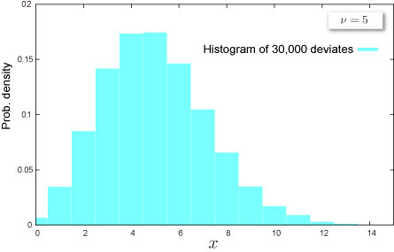

import DataGridMdx from "@site/src/components/DataGridMdx";

# Poisson Distribution

## Where do you meet this distribution?

- Accident : The number of soldiers killed by horse-kicks each year in each corps
- [Queuing Theory](http://en.wikipedia.org/wiki/Queueing_theory) : Number of phone calls per minute, number of access to web sever per minute
- Biology : Number of mutations
- Nuclear physics : the [nuclear decay](http://en.wikipedia.org/wiki/Nuclear_decay) of atoms
- [Risk management -- Operational risk](http://en.wikipedia.org/wiki/Operational_risk)

## Shape of Distribution

### Basic Properties

- A parameter $\nu$ is required.

$$
  \nu>0
$$

$\nu$ is [mean](/docs/glossary#mean) of the distribution.

- Discrete distribution defined at non-negative integer $x={0,1,2,\cdots}$

### Probability

- [Cumulative distribution function](/docs/glossary#cumulative-distribution-function)

  $$
  F(x)=\text{e}^{-\nu}\sum_{i=0}^{x}\frac{\nu^i}{i !}
  $$

- [Probability mass function](/docs/glossary#probability-mass-function)

  $$
  f(x)=\frac{\nu^x\text{e}^{-\nu}}{x !}
  $$

- How to compute these on Excel.

<DataGridMdx
  data={{
    cells: [
      [
        { value: "Data", readOnly: true, className: "orange-cell" },
        { value: "Description", readOnly: true, className: "orange-cell" },
      ],
      [
        { value: "3", readOnly: true },
        { value: "Value for which you want the distribution", readOnly: true },
      ],
      [
        { value: "5", readOnly: true },
        { value: "Value of parameter nu", readOnly: true },
      ],
      [
        { value: "Formula", readOnly: true, className: "orange-cell" },
        {
          value: "Description (Result)",
          readOnly: true,
          className: "orange-cell",
        },
      ],
      [
        { value: "=NTPOISSONDIST(A2,A3,TRUE)", readOnly: true },
        {
          value: "Cumulative distribution function for the terms above",
          readOnly: true,
        },
      ],
      [
        { value: "=NTPOISSONDIST(A2,A3,FALSE)", readOnly: true },
        {
          value: "Probability mass function for the terms above",
          readOnly: true,
        },
      ],
    ],
  }}
/>

- Function reference : [NTPOISSONDIST](../03-function-reference/02-distribution-functions/073-ntpoissondist.mdx)

## Characteristics

### Mean -- Where is the "center" of the distribution? ([Definition](/docs/glossary#mean))

- Mean is given as $\nu$

### Standard Deviation -- How wide does the distribution spread? ([Definition](/docs/glossary#standard-deviation))

- Standard deviation is given as $\nu$

  [Standard Deviation](/docs/glossary#standard-deviation) is a positive square root of [Variance](/docs/glossary#variance).

### Skewness -- Which side is the distribution distorted into? ([Definition](/docs/glossary#skewness))

- [Skewness](/docs/glossary#skewness) of the distribution is given as

  $$
  \frac{1}{\sqrt{\nu}}
  $$

- How to compute this on Excel

<DataGridMdx
  data={{
    cells: [
      [
        { value: "Data", readOnly: true, className: "orange-cell" },
        { value: "Description", readOnly: true, className: "orange-cell" },
      ],
      [
        { value: "8", readOnly: true },
        { value: "Value of parameter nu", readOnly: true },
      ],
      [
        { value: "Formula", readOnly: true, className: "orange-cell" },
        {
          value: "Description (Result)",
          readOnly: true,
          className: "orange-cell",
        },
      ],
      [
        { value: "=NTPOISSONSKEW(A2)", readOnly: true },
        {
          value: "Mean of the distribution for the terms above",
          readOnly: true,
        },
      ],
    ],
  }}
/>

- Function reference : [NTPOISSONSKEW](../03-function-reference/02-distribution-functions/078-ntpoissonskew.mdx)

### Kurtosis -- Sharp or Dull, consequently Fat Tail or Thin Tail ([Definition](/docs/glossary#kurtosis))

- [Kurtosis](/docs/glossary#kurtosis) of the distribution is given as

  $$
  \frac{1}{\nu}
  $$

- How to compute this on Excel

<DataGridMdx
  data={{
    cells: [
      [
        { value: "Data", readOnly: true, className: "orange-cell" },
        { value: "Description", readOnly: true, className: "orange-cell" },
      ],
      [
        { value: "8", readOnly: true },
        { value: "Value of parameter nu", readOnly: true },
      ],
      [
        { value: "Formula", readOnly: true, className: "orange-cell" },
        {
          value: "Description (Result)",
          readOnly: true,
          className: "orange-cell",
        },
      ],
      [
        { value: "=NTPOISSONKURT(A2)", readOnly: true },
        {
          value: "Mean of the distribution for the terms above",
          readOnly: true,
        },
      ],
    ],
  }}
/>

- Function reference : [NTPOISSONKURT](../03-function-reference/02-distribution-functions/075-ntpoissonkurt.mdx)

## Random Numbers

- How to generate random numbers.

<DataGridMdx
  data={{
    cells: [
      [
        { value: "Data", readOnly: true, className: "orange-cell" },
        { value: "Description", readOnly: true, className: "orange-cell" },
      ],
      [
        { value: "6", readOnly: true },
        { value: "Value of parameter nu", readOnly: true },
      ],
      [
        { value: "Formula", readOnly: true, className: "orange-cell" },
        {
          value: "Description (Result)",
          readOnly: true,
          className: "orange-cell",
        },
      ],
      [
        { value: "=NTRANDPOISSON(100,A2,0)", readOnly: true },
        {
          value:
            "100 Poisson deviates based on Mersenne-Twister algorithm for which the parameters above",
          readOnly: true,
        },
      ],
    ],
  }}
/>

Note The formula in the example must be entered as an array formula. After copying the example to a blank worksheet, select the range A4:A103 starting with the formula cell. Press F2, and then press CTRL+SHIFT+ENTER.

## NtRand Functions

- If you already have parameters of the distribution
  - Generating random numbers based on Mersenne Twister algorithm: [NTRANDPOISSON](../03-function-reference/01-random-numbers/01-single-series/12-ntrandpoisson.mdx)
  - Computing probability : [NTPOISSONDIST](../03-function-reference/02-distribution-functions/073-ntpoissondist.mdx)
  - Computing mean : [NTPOISSONMEAN](../03-function-reference/02-distribution-functions/076-ntpoissonmean.mdx)
  - Computing standard deviation : [NTPOISSONSTDEV](../03-function-reference/02-distribution-functions/079-ntpoissonstdev.mdx)
  - Computing skewness : [NTPOISSONSKEW](../03-function-reference/02-distribution-functions/078-ntpoissonskew.mdx)
  - Computing kurtosis : [NTPOISSONKURT](../03-function-reference/02-distribution-functions/075-ntpoissonkurt.mdx)
  - Computing moments above at once : [NTPOISSONMOM](../03-function-reference/02-distribution-functions/077-ntpoissonmom.mdx)

## Reference

- [Wolfram Mathworld -- Poisson Distribution](http://mathworld.wolfram.com/PoissonDistribution.html)
- [Wikipedia -- Poisson distribution](http://en.wikipedia.org/wiki/Poisson_distribution)
- [Statistics Online Computational Resource](http://www.socr.ucla.edu/htmls/SOCR_Distributions.html)
