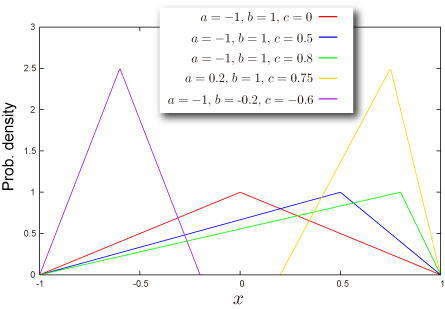

import DataGridMdx from "@site/src/components/DataGridMdx";

# Triangular Distribution

## Where do you meet this distribution?

- [Project management](http://en.wikipedia.org/wiki/Project_management) -- [PERT](http://en.wikipedia.org/wiki/PERT), [CPM](http://en.wikipedia.org/wiki/Critical_path_method) and so on
- Digital signal processing ([dithering](http://en.wikipedia.org/wiki/Dither)) -- digital audio, digital video, digital photography, seismology, RADAR, weather forecasting systems and many more
- Data security

  ["Truncated Triangular Distribution for Multiplicative Noise and Domain Estimation" by Jay J. Kim and Dong M. Jeong](http://www.amstat.org/sections/srms/Proceedings/y2008/Files/300855.pdf)

- [Business simulation](http://en.wikipedia.org/wiki/Triangular_distribution#Business_simulations) (Corporate finance)
- Proxy of [Beta distribution](beta-distribution.mdx)

## Shape of Distribution

### Basic Properties

- Three parameters $a, b, c$ are required ([How can you get these](../03-function-reference/02-distribution-functions/092-nttriangularparam.mdx)).

  $$
  a<c<b
  $$

  These parameters are minimum value of variable, maximum value of variable and [mode](/docs/glossary#mode) of the distribution respectively.

- Continuous distribution defined on bounded range $a\leq x \leq b$
- This distribution can be symmetric or asymmetric.

### Probability

- [Cumulative distribution function](/docs/glossary#cumulative-distribution-function)

  $$
  F(x)=\begin{cases}\frac{(x-a)^2}{(b-a)(c-a)}\quad&(a\leq x<c)\\1-\frac{(b-x)^2}{(b-a)(b-c)}\quad&(c\leq x\leq b)\end{cases}
  $$

- [Probability density function](/docs/glossary#probability-density-function)

  $$
  f(x)=\begin{cases}\frac{2(x-a)}{(b-a)(c-a)}\quad&(a\leq x<c)\\\frac{2(b-x)}{(b-a)(b-c)}\quad&(c\leq x\leq b)\end{cases}
  $$

- How to compute these on Excel.

<DataGridMdx
  data={{
    cells: [
      [
        { value: "Data", readOnly: true, className: "orange-cell" },
        { value: "Description", readOnly: true, className: "orange-cell" },
      ],
      [
        { value: "1.5", readOnly: true },
        { value: "Value for which you want the distribution", readOnly: true },
      ],
      [
        { value: "1", readOnly: true },
        { value: "Value of parameter Min", readOnly: true },
      ],
      [
        { value: "3", readOnly: true },
        { value: "Value of parameter Max", readOnly: true },
      ],
      [
        { value: "1.4", readOnly: true },
        { value: "Value of parameter Mode", readOnly: true },
      ],
      [
        { value: "Formula", readOnly: true, className: "orange-cell" },
        {
          value: "Description (Result)",
          readOnly: true,
          className: "orange-cell",
        },
      ],
      [
        { value: "=NTTRIANGULARDIST(A2,A3,A4,A5,TRUE)", readOnly: true },
        {
          value: "Cumulative distribution function for the terms above",
          readOnly: true,
        },
      ],
      [
        { value: "=NTTRIANGULARDIST(A2,A3,A4,A5,FALSE)", readOnly: true },
        {
          value: "Probability density function for the terms above",
          readOnly: true,
        },
      ],
    ],
  }}
/>

- Function reference : [NTTRIANGULARDIST](../03-function-reference/02-distribution-functions/087-nttriangulardist.mdx)

### Quantile

- Inverse function of [cumulative distribution function](/docs/glossary#cumulative-distribution-function)

  $$
  F^{-1}(P)=\begin{cases}\sqrt{P(c-a)(b-a)}+a\quad&\left(P< \frac{c-a}{b-a}\right)\\-\sqrt{(1-P)(b-c)(b-a)}+b\quad&\left(P\geq \frac{c-a}{b-a}\right)\end{cases}
  $$

- How to compute this on Excel.

<DataGridMdx
  data={{
    cells: [
      [
        { value: "Data", readOnly: true, className: "orange-cell" },
        { value: "Description", readOnly: true, className: "orange-cell" },
      ],
      [
        { value: "0.5", readOnly: true },
        {
          value: "Probability associated with the distribution",
          readOnly: true,
        },
      ],
      [
        { value: "1", readOnly: true },
        { value: "Value of parameter Min", readOnly: true },
      ],
      [
        { value: "3", readOnly: true },
        { value: "Value of parameter Max", readOnly: true },
      ],
      [
        { value: "1.4", readOnly: true },
        { value: "Value of parameter Mode", readOnly: true },
      ],
      [
        { value: "Formula", readOnly: true, className: "orange-cell" },
        {
          value: "Description (Result)",
          readOnly: true,
          className: "orange-cell",
        },
      ],
      [
        { value: "=NTTRIANGULARINV(A2,A3,A4,A5)", readOnly: true },
        {
          value:
            "Inverse of the cumulative distribution function for the terms above",
          readOnly: true,
        },
      ],
    ],
  }}
/>

- Function reference : [NTTRIANGULARINV](../03-function-reference/02-distribution-functions/088-nttriangularinv.mdx)

## Characteristics

### Mean - Where is the `center'' of the distribution? ([Definition](/docs/glossary#mean))

- Mean of the distribution is given as

  $$
  \frac{a+b+c}{3}
  $$

- How to compute this on Excel

<DataGridMdx
  data={{
    cells: [
      [
        { value: "Data", readOnly: true, className: "orange-cell" },
        { value: "Description", readOnly: true, className: "orange-cell" },
      ],
      [
        { value: "1", readOnly: true },
        { value: "Value of parameter Min", readOnly: true },
      ],
      [
        { value: "3", readOnly: true },
        { value: "Value of parameter Max", readOnly: true },
      ],
      [
        { value: "1.4", readOnly: true },
        { value: "Value of parameter Mode", readOnly: true },
      ],
      [
        { value: "Formula", readOnly: true, className: "orange-cell" },
        {
          value: "Description (Result)",
          readOnly: true,
          className: "orange-cell",
        },
      ],
      [
        { value: "=NTTRIANGULARMEAN(A2,A3,A4)", readOnly: true },
        {
          value: "Mean of the distribution for the terms above",
          readOnly: true,
        },
      ],
    ],
  }}
/>

- Function reference : [NTTRIANGULARMEAN](../03-function-reference/02-distribution-functions/090-nttriangularmean.mdx)

### Standard Deviation -- How wide does the distribution spread? ([Definition](/docs/glossary#standard-deviation))

- [Variance](/docs/glossary#variance) of the distribution is given as

  $$
  \frac{a^2+b^2+c^2-ab-bc-ca}{18}
  $$

  [Standard Deviation](/docs/glossary#standard-deviation) is a positive square root of [Variance](/docs/glossary#variance).

- How to compute this on Excel

<DataGridMdx
  data={{
    cells: [
      [
        { value: "Data", readOnly: true, className: "orange-cell" },
        { value: "Description", readOnly: true, className: "orange-cell" },
      ],
      [
        { value: "1", readOnly: true },
        { value: "Value of parameter Min", readOnly: true },
      ],
      [
        { value: "3", readOnly: true },
        { value: "Value of parameter Max", readOnly: true },
      ],
      [
        { value: "1.4", readOnly: true },
        { value: "Value of parameter Mode", readOnly: true },
      ],
      [
        { value: "Formula", readOnly: true, className: "orange-cell" },
        {
          value: "Description (Result)",
          readOnly: true,
          className: "orange-cell",
        },
      ],
      [
        { value: "=NTTRIANGULARSTDEV(A2,A3,A4)", readOnly: true },
        {
          value: "Standard deviation of the distribution for the terms above",
          readOnly: true,
        },
      ],
    ],
  }}
/>

- Function reference : [NTTRIANGULARSTDEV](../03-function-reference/02-distribution-functions/094-nttriangularstdev.mdx)

### Skewness -- Which side is the distribution distorted into? ([Definition](/docs/glossary#skewness))

- [Skewness](/docs/glossary#skewness) of the distribution is given as

  $$
  \frac{\sqrt{2}(a+b-2c)(2a-b-c)(a-2b+c)}{5(a^2+b^2+c^2-ab-bc-ca)^{3/2}}
  $$

- How to compute this on Excel

<DataGridMdx
  data={{
    cells: [
      [
        { value: "Data", readOnly: true, className: "orange-cell" },
        { value: "Description", readOnly: true, className: "orange-cell" },
      ],
      [
        { value: "1", readOnly: true },
        { value: "Value of parameter Min", readOnly: true },
      ],
      [
        { value: "3", readOnly: true },
        { value: "Value of parameter Max", readOnly: true },
      ],
      [
        { value: "1.4", readOnly: true },
        { value: "Value of parameter Mode", readOnly: true },
      ],
      [
        { value: "Formula", readOnly: true, className: "orange-cell" },
        {
          value: "Description (Result)",
          readOnly: true,
          className: "orange-cell",
        },
      ],
      [
        { value: "=NTTRIANGULARSKEW(A2,A3,A4)", readOnly: true },
        {
          value: "Skewness of the distribution for the terms above",
          readOnly: true,
        },
      ],
    ],
  }}
/>

- Function reference : [NTTRIANGULARSKEW](../03-function-reference/02-distribution-functions/093-nttriangularskew.mdx)

### Kurtosis -- Sharp or Dull, consequently Fat Tail or Thin Tail ([Definition](/docs/glossary#kurtosis))

- Kurtosis is $-0.6$ .

## Random Numbers

- Random number x is generated by inverse function method, which is for uniform random U,

  $$
  x=\begin{cases}\sqrt{U(c-a)(b-a)}+a\quad&\left(U< \frac{c-a}{b-a}\right)\\-\sqrt{(1-U)(b-c)(b-a)}+b\quad&\left(U\geq \frac{c-a}{b-a}\right)\end{cases}
  $$

- How to generate random numbers on Excel.

<DataGridMdx
  data={{
    cells: [
      [
        { value: "Data", readOnly: true, className: "orange-cell" },
        { value: "Description", readOnly: true, className: "orange-cell" },
      ],
      [
        { value: "0", readOnly: true },
        { value: "Value of parameter A", readOnly: true },
      ],
      [
        { value: "3", readOnly: true },
        { value: "Value of parameter B", readOnly: true },
      ],
      [
        { value: "1.8", readOnly: true },
        { value: "Value of parameter C", readOnly: true },
      ],
      [
        { value: "Formula", readOnly: true, className: "orange-cell" },
        {
          value: "Description (Result)",
          readOnly: true,
          className: "orange-cell",
        },
      ],
      [
        {
          value: "=NTRANDTRIANGULAR(100,A2,A3,A5,0)",
          readOnly: true,
        },
        {
          value:
            "100 triangular deviates based on Mersenne-Twister algorithm for which the parameters above",
          readOnly: true,
        },
      ],
    ],
  }}
/>

Note The formula in the example must be entered as an array formula. After copying the example to a blank worksheet, select the range A6:A105 starting with the formula cell. Press F2, and then press CTRL+SHIFT+ENTER.

## NtRand Functions

- If you already have parameters of the distribution
  - Generating random numbers based on Mersenne Twister algorithm: [NTRANDTRIANGULAR](../03-function-reference/01-random-numbers/01-single-series/13-ntrandtriangular.mdx)
  - Computing probability : [NTTRIANGULARDIST](../03-function-reference/02-distribution-functions/087-nttriangulardist.mdx)
  - Computing quantile : [NTTRIANGULARINV](../03-function-reference/02-distribution-functions/088-nttriangularinv.mdx)
  - Computing mean : [NTTRIANGULARMEAN](../03-function-reference/02-distribution-functions/090-nttriangularmean.mdx)
  - Computing standard deviation : [NTTRIANGULARSTDEV](../03-function-reference/02-distribution-functions/093-nttriangularskew.mdx)
  - Computing skewness : [NTTRIANGULARSKEW](../03-function-reference/02-distribution-functions/093-nttriangularskew.mdx)
  - Computing kurtosis : [NTTRIANGULARKURT](../03-function-reference/02-distribution-functions/089-nttriangularkurt.mdx)
  - Computing moments above at once : [NTTRIANGULARMOM](../03-function-reference/02-distribution-functions/091-nttriangularmom.mdx)
- If you know mean, standard deviation and mode of the distribution
  - Estimating parameters of the distribution:[NTTRIANGULARPARAM](../03-function-reference/02-distribution-functions/092-nttriangularparam.mdx)

## Reference

- [Wolfram Mathworld -- Triangular Distribution](http://mathworld.wolfram.com/TriangularDistribution.html)
- [Wikipedia -- Triangular distribution](http://en.wikipedia.org/wiki/Triangular_distribution)
- [Statistics Online Computational Resource](http://www.socr.ucla.edu/htmls/SOCR_Distributions.html)
