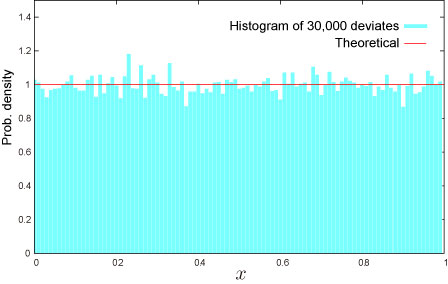

import DataGridMdx from "@site/src/components/DataGridMdx";

# Uniform Distribution (Continuous)

## Where will you meet this distribution?

- Generating random numbers according to a desired distribution
- Digital signal processing ([dithering](http://en.wikipedia.org/wiki/Dither)) -- digital audio, digital video, digital photography, seismology, RADAR, weather forecasting systems and many more

## Shape of Distribution

### Basic Properties

- Two parameters $a, b$ are required.

  $$
  a<b
  $$

  These parameters are minimum and maximum value of variable respectively.

- Continuous distribution defined on bounded range $a\leq x \leq b$
- This distribution is always symmetric.

### Probability

- [Cumulative distribution function](/docs/glossary#cumulative-distribution-function)

  $$
  F(x)=\frac{x}{b-a}
  $$

- [Probability density function](/docs/glossary#probability-density-function)

  $$
  f(x)=\frac{1}{b-a}
  $$

- How to compute these on Excel.

<DataGridMdx
  data={{
    cells: [
      [
        { value: "Data", readOnly: true, className: "orange-cell" },
        { value: "Description", readOnly: true, className: "orange-cell" },
      ],
      [
        { value: "0.5", readOnly: true },
        { value: "Value for which you want the distribution", readOnly: true },
      ],
      [
        { value: "1", readOnly: true },
        { value: "Value of parameter A", readOnly: true },
      ],
      [
        { value: "5", readOnly: true },
        { value: "Value of parameter B", readOnly: true },
      ],
      [
        { value: "Formula", readOnly: true, className: "orange-cell" },
        {
          value: "Description (Result)",
          readOnly: true,
          className: "orange-cell",
        },
      ],
      [
        { value: "=(A2-A3)/(A4-A3)", readOnly: true },
        {
          value: "Cumulative distribution function for the terms above",
          readOnly: true,
        },
      ],
      [
        { value: "=1/(A4-A3)", readOnly: true },
        {
          value: "Probability density function for the terms above",
          readOnly: true,
        },
      ],
    ],
  }}
/>

### Quantile

- Inverse of [cumulative distribution function](/docs/glossary#cumulative-distribution-function)

  $$
  F^{-1}(P)=a+P(b-a)
  $$

- How to compute this on Excel.

<DataGridMdx
  data={{
    cells: [
      [
        { value: "Data", readOnly: true, className: "orange-cell" },
        { value: "Description", readOnly: true, className: "orange-cell" },
      ],
      [
        { value: "0.5", readOnly: true },
        {
          value: "Probability associated with the distribution",
          readOnly: true,
        },
      ],
      [
        { value: "1", readOnly: true },
        { value: "Value of parameter A", readOnly: true },
      ],
      [
        { value: "5", readOnly: true },
        { value: "Value of parameter B", readOnly: true },
      ],
      [
        { value: "Formula", readOnly: true, className: "orange-cell" },
        {
          value: "Description (Result)",
          readOnly: true,
          className: "orange-cell",
        },
      ],
      [
        { value: "=A3+A2*(A4-A3)", readOnly: true },
        {
          value:
            "Inverse of the cumulative distribution function for the terms above",
          readOnly: true,
        },
      ],
    ],
  }}
/>

## Characteristics

### Mean -- Where is the "center" of the distribution? ([Definition](/docs/glossary#mean))

- [Mean](/docs/glossary#mean) of the distribution is given as

  $$
  \frac{a+b}{2}
  $$

- How to compute this on Excel

<DataGridMdx
  data={{
    cells: [
      [
        { value: "Data", readOnly: true, className: "orange-cell" },
        { value: "Description", readOnly: true, className: "orange-cell" },
      ],
      [
        { value: "8", readOnly: true },
        { value: "Value of parameter A", readOnly: true },
      ],
      [
        { value: "2", readOnly: true },
        { value: "Value of parameter B", readOnly: true },
      ],
      [
        { value: "Formula", readOnly: true, className: "orange-cell" },
        {
          value: "Description (Result)",
          readOnly: true,
          className: "orange-cell",
        },
      ],
      [
        { value: "=(A2+A3)/2", readOnly: true },
        {
          value: "Mean of the distribution for the terms above",
          readOnly: true,
        },
      ],
    ],
  }}
/>

### Standard Deviation -- How wide does the distribution spread? ([Definition](/docs/glossary#standard-deviation))

- [Variance](/docs/glossary#variance) of the distribution is given as

  $$
  \frac{(a-b)^2}{12}
  $$

  [Standard Deviation](/docs/glossary#standard-deviation) is a positive square root of [Variance](/docs/glossary#variance).

- How to compute this on Excel

<DataGridMdx
  data={{
    cells: [
      [
        { value: "Data", readOnly: true, className: "orange-cell" },
        { value: "Description", readOnly: true, className: "orange-cell" },
      ],
      [
        { value: "8", readOnly: true },
        { value: "Value of parameter A", readOnly: true },
      ],
      [
        { value: "2", readOnly: true },
        { value: "Value of parameter B", readOnly: true },
      ],
      [
        { value: "Formula", readOnly: true, className: "orange-cell" },
        {
          value: "Description (Result)",
          readOnly: true,
          className: "orange-cell",
        },
      ],
      [
        { value: "=(A3-A2)/2*SQRT(3)", readOnly: true },
        {
          value: "Standard deviation of the distribution for the terms above",
          readOnly: true,
        },
      ],
    ],
  }}
/>

### Skewness -- Which side is the distribution distorted into? ([Definition](/docs/glossary#skewness))

- Skewness is $0$

### Kurtosis -- Sharp or Dull, consequently Fat Tail or Thin Tail ([Definition](/docs/glossary#kurtosis))

- Kurtosis is $-1.2$

## Random Numbers

- Random number x is generated from uniform random U,

  $$
  x=a+U(b-a)
  $$

- How to generate random numbers on Excel.

<DataGridMdx
  data={{
    cells: [
      [
        { value: "Data", readOnly: true, className: "orange-cell" },
        { value: "Description", readOnly: true, className: "orange-cell" },
      ],
      [
        { value: "8", readOnly: true },
        { value: "Value of parameter A", readOnly: true },
      ],
      [
        { value: "5", readOnly: true },
        { value: "Value of parameter B", readOnly: true },
      ],
      [
        { value: "Formula", readOnly: true, className: "orange-cell" },
        {
          value: "Description (Result)",
          readOnly: true,
          className: "orange-cell",
        },
      ],
      [
        { value: "=(A3-A2)*NTRAND(100,A2,A3,0)+A2", readOnly: true },
        {
          value:
            "100 uniform deviates based on Mersenne-Twister algorithm for which the parameters above",
          readOnly: true,
        },
      ],
    ],
  }}
/>

Note The formula in the example must be entered as an array formula. After copying the example to a blank worksheet, select the range A5:A104 starting with the formula cell. Press F2, and then press CTRL+SHIFT+ENTER.

## NtRand Functions

- Generating random numbers based on Mersenne Twister algorithm: [NTRAND](../03-function-reference/01-random-numbers/01-single-series/01-ntrand.mdx)

## Reference

- [Wolfram Mathworld -- Uniform Distribution](http://mathworld.wolfram.com/UniformDistribution.html)
- [Wikipedia -- Uniform distribution (continuous)](<http://en.wikipedia.org/wiki/Uniform_distribution_(continuous)>)
- [Statistics Online Computational Resource](http://www.socr.ucla.edu/htmls/SOCR_Distributions.html)
