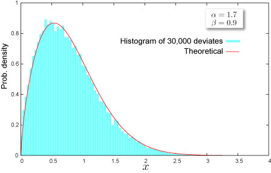

import DataGridMdx from "@site/src/components/DataGridMdx";

# Weibull Distribution

## Where do you meet this distribution?

- [Risk management -- Operational risk](http://en.wikipedia.org/wiki/Operational_risk)

## Shape of Distribution

### Basic Properties

- Two parameters $\alpha, \beta$ are required ([How can you get these](../03-function-reference/02-distribution-functions/108-ntweibullparam.mdx)).

  $$
  \alpha>0,\beta>0
  $$

- Continuous distribution defined on semi-bounded range $x \geq 0$
- This distribution is always asymmetric.

### Probability

- How to compute these on Excel.

<DataGridMdx
  data={{
    cells: [
      [
        { value: "Data", readOnly: true, className: "orange-cell" },
        { value: "Description", readOnly: true, className: "orange-cell" },
      ],
      [
        { value: "0.5", readOnly: true },
        { value: "Value for which you want the distribution", readOnly: true },
      ],
      [
        { value: "8", readOnly: true },
        { value: "Value of parameter Alpha", readOnly: true },
      ],
      [
        { value: "2", readOnly: true },
        { value: "Value of parameter Beta", readOnly: true },
      ],
      [
        { value: "Formula", readOnly: true, className: "orange-cell" },
        {
          value: "Description (Result)",
          readOnly: true,
          className: "orange-cell",
        },
      ],
      [
        { value: "=NTWEIBULLDIST(A2,A3,A4,TRUE)", readOnly: true },
        {
          value: "Cumulative distribution function for the terms above",
          readOnly: true,
        },
      ],
      [
        { value: "=NTWEIBULLDIST(A2,A3,A4,FALSE)", readOnly: true },
        {
          value: "Probability density function for the terms above",
          readOnly: true,
        },
      ],
    ],
  }}
/>

- [Cumulative distribution function](/docs/glossary#cumulative-distribution-function)

  $$
  F(x)=1-\exp\left[-\left(\frac{x}{\beta}\right)^\alpha\right]
  $$

- [Probability density function](/docs/glossary#probability-density-function)

  $$
  f(x)=\frac{\alpha}{\beta}\left(\frac{x}{\beta}\right)^{\alpha-1}\exp\left[-\left(\frac{x}{\beta}\right)^{\alpha}\right]
  $$

- Function reference : [NTWEIBULLDIST](../03-function-reference/02-distribution-functions/103-ntweibulldist.mdx)

### Quantile

- Inverse function of [cumulative distribution function](/docs/glossary#cumulative-distribution-function)

  $$
  F^{-1}(P)=\beta\left(\ln\frac{1}{1-P}\right)^{1/\alpha}
  $$

- How to compute this on Excel.

<DataGridMdx
  data={{
    cells: [
      [
        { value: "Data", readOnly: true, className: "orange-cell" },
        { value: "Description", readOnly: true, className: "orange-cell" },
      ],
      [
        { value: "0.7", readOnly: true },
        {
          value: "Probability associated with the distribution",
          readOnly: true,
        },
      ],
      [
        { value: "1.7", readOnly: true },
        { value: "Value of parameter Alpha", readOnly: true },
      ],
      [
        { value: "0.9", readOnly: true },
        { value: "Value of parameter Beta", readOnly: true },
      ],
      [
        { value: "Formula", readOnly: true, className: "orange-cell" },
        {
          value: "Description (Result)",
          readOnly: true,
          className: "orange-cell",
        },
      ],
      [
        { value: "=WEIBULLINV(A2,A3,A4)", readOnly: true },
        {
          value:
            "Inverse of the cumulative distribution function for the terms above",
          readOnly: true,
        },
      ],
    ],
  }}
/>

- Function reference : [NTWEIBULLINV](../03-function-reference/02-distribution-functions/104-ntweibullinv.mdx)

## Characteristics

### Mean -- Where is the "center" of the distribution? ([Definition](/docs/glossary#mean))

- [Mean](/docs/glossary#mean) of the distribution is given as

  $$
  \beta\Gamma\left(1+\frac{1}{\alpha}\right)
  $$

  where $\Gamma(\cdot)$ is [gamma function](/docs/glossary#gamma-function).

- How to compute this on Excel

<DataGridMdx
  data={{
    cells: [
      [
        { value: "Data", readOnly: true, className: "orange-cell" },
        { value: "Description", readOnly: true, className: "orange-cell" },
      ],
      [
        { value: "8", readOnly: true },
        { value: "Value of parameter Alpha", readOnly: true },
      ],
      [
        { value: "2", readOnly: true },
        { value: "Value of parameter Beta", readOnly: true },
      ],
      [
        { value: "Formula", readOnly: true, className: "orange-cell" },
        {
          value: "Description (Result)",
          readOnly: true,
          className: "orange-cell",
        },
      ],
      [
        { value: "=NTWEIBULLMEAN(A2,A3)", readOnly: true },
        {
          value: "Mean of the distribution for the terms above",
          readOnly: true,
        },
      ],
    ],
  }}
/>

- Function reference : [NTWEIBULLMEAN](../03-function-reference/02-distribution-functions/106-ntweibullmean.mdx)

### Standard Deviation -- How wide does the distribution spread? ([Definition](/docs/glossary#standard-deviation))

- [Variance](/docs/glossary#variance) of the distribution is given as

  $$
  \mu^\prime(2)-m^2
  $$

  where

  $$
  \mu^\prime(r)=\beta^r\Gamma\left(1+\frac{r}{\alpha}\right)
  $$

  , $m$ is mean of the distribution and $\Gamma(\cdot)$ is [gamma function](/docs/glossary#gamma-function)

  [Standard Deviation](/docs/glossary#standard-deviation) is a positive square root of [Variance](/docs/glossary#variance).

- How to compute this on Excel

<DataGridMdx
  data={{
    cells: [
      [
        { value: "Data", readOnly: true, className: "orange-cell" },
        { value: "Description", readOnly: true, className: "orange-cell" },
      ],
      [
        { value: "8", readOnly: true },
        { value: "Value of parameter Alpha", readOnly: true },
      ],
      [
        { value: "2", readOnly: true },
        { value: "Value of parameter Beta", readOnly: true },
      ],
      [
        { value: "Formula", readOnly: true, className: "orange-cell" },
        {
          value: "Description (Result)",
          readOnly: true,
          className: "orange-cell",
        },
      ],
      [
        { value: "=NTWEIBULLSTDEV(A2,A3)", readOnly: true },
        {
          value: "Standard deviation of the distribution for the terms above",
          readOnly: true,
        },
      ],
    ],
  }}
/>

- Function reference : [NTWEIBULLSTDEV](../03-function-reference/02-distribution-functions/110-ntweibullstdev.mdx)

### Skewness -- Which side is the distribution distorted into? ([Definition](/docs/glossary#skewness))

- [Skewness](https://www.ntrand.com/glossary/#local_skew) of the distribution is given as

  $$
  \frac{1}{\sigma^3}\left[\mu^\prime(3)-3m\sigma^2-m^3\right]
  $$

  where

  $$
  \mu^\prime(r)=\beta^r\Gamma\left(1+\frac{r}{\alpha}\right)
  $$

  , $m$ is mean of the distribution, $\sigma^2$ is variance of the distribution, $\Gamma(\cdot)$ is [gamma function](/docs/glossary#gamma-function) and $\sigma$ is [standard deviation](/docs/glossary#standard-deviation) of the distribution.

- How to compute this on Excel

<DataGridMdx
  data={{
    cells: [
      [
        { value: "Data", readOnly: true, className: "orange-cell" },
        { value: "Description", readOnly: true, className: "orange-cell" },
      ],
      [
        { value: "8", readOnly: true },
        { value: "Value of parameter Alpha", readOnly: true },
      ],
      [
        { value: "2", readOnly: true },
        { value: "Value of parameter Beta", readOnly: true },
      ],
      [
        { value: "Formula", readOnly: true, className: "orange-cell" },
        {
          value: "Description (Result)",
          readOnly: true,
          className: "orange-cell",
        },
      ],
      [
        { value: "=NTWEIBULLSKEW(A2,A3)", readOnly: true },
        {
          value: "Skewness of the distribution for the terms above",
          readOnly: true,
        },
      ],
    ],
  }}
/>

- Function reference : [NTWEIBULLSKEW](../03-function-reference/02-distribution-functions/109-ntweibullskew.mdx)

### Kurtosis -- Sharp or Dull, consequently Fat Tail or Thin Tail ([Definition](/docs/glossary#kurtosis))

- [Kurtosis](/docs/glossary#kurtosis) of the distribution is given as

  $$
  \frac{{\mu^\prime}(4)-4\gamma_1\sigma^3m-6m^2\sigma^2-m^4}{\sigma^4}-3
  $$

  where

  $$
  \mu^\prime(r)=\beta^r\Gamma\left(1+\frac{r}{\alpha}\right)
  $$

  , $\Gamma(\cdot)$ is [gamma function](/docs/glossary#gamma-function), $m$ is [mean](/docs/glossary#mean) of the distribution, $\sigma$ is [standard deviation](/docs/glossary#standard-deviation) of the distribution and $\gamma_1$ is [skewness](/docs/glossary#skewness) of the distribution.

- How to compute this on Excel

<DataGridMdx
  data={{
    cells: [
      [
        { value: "Data", readOnly: true, className: "orange-cell" },
        { value: "Description", readOnly: true, className: "orange-cell" },
      ],
      [
        { value: "8", readOnly: true },
        { value: "Value of parameter Alpha", readOnly: true },
      ],
      [
        { value: "2", readOnly: true },
        { value: "Value of parameter Beta", readOnly: true },
      ],
      [
        { value: "Formula", readOnly: true, className: "orange-cell" },
        {
          value: "Description (Result)",
          readOnly: true,
          className: "orange-cell",
        },
      ],
      [
        { value: "=NTWEIBULLKURT(A2,A3)", readOnly: true },
        {
          value: "Kurtosis of the distribution for the terms above",
          readOnly: true,
        },
      ],
    ],
  }}
/>

- Function reference : [NTWEIBULLKURT](../03-function-reference/02-distribution-functions/105-ntweibullkurt.mdx)

## Random Numbers

- Random number x is generated by inverse function method, which is for uniform random U,

  $$
  x=\beta\left(\ln\frac{1}{1-U}\right)^{1/\alpha}
  $$

- How to generate random numbers on Excel.

<DataGridMdx
  data={{
    cells: [
      [
        { value: "Data", readOnly: true, className: "orange-cell" },
        { value: "Description", readOnly: true, className: "orange-cell" },
      ],
      [
        { value: "0.5", readOnly: true },
        { value: "Value of parameter Alpha", readOnly: true },
      ],
      [
        { value: "0.5", readOnly: true },
        { value: "Value of parameter Beta", readOnly: true },
      ],
      [
        { value: "Formula", readOnly: true, className: "orange-cell" },
        {
          value: "Description (Result)",
          readOnly: true,
          className: "orange-cell",
        },
      ],
      [
        {
          value: "=NTRANDWEIBULL(100,A2,A3,0)",
          readOnly: true,
        },
        {
          value:
            "100 Weibull deviates based on Mersenne-Twister algorithm for which the parameters above",
          readOnly: true,
        },
      ],
    ],
  }}
/>

Note The formula in the example must be entered as an array formula. After copying the example to a blank worksheet, select the range A5:A104 starting with the formula cell. Press F2, and then press CTRL+SHIFT+ENTER.

## NtRand Functions

- If you already have parameters of the distribution
  - Generating random numbers based on Mersenne Twister algorithm: [NTRANDWEIBULL](../03-function-reference/01-random-numbers/01-single-series/15-ntrandweibull.mdx)
  - Computing probability : [NTWEIBULLDIST](../03-function-reference/02-distribution-functions/103-ntweibulldist.mdx)
  - Computing mean : [NTWEIBULLMEAN](../03-function-reference/02-distribution-functions/106-ntweibullmean.mdx)
  - Computing standard deviation : [NTWEIBULLSTDEV](../03-function-reference/02-distribution-functions/109-ntweibullskew.mdx)
  - Computing skewness : [NTWEIBULLSKEW](../03-function-reference/02-distribution-functions/109-ntweibullskew.mdx)
  - Computing kurtosis : [NTWEIBULLKURT](../03-function-reference/02-distribution-functions/105-ntweibullkurt.mdx)
  - Computing moments above at once : [NTWEIBULLMOM](../03-function-reference/02-distribution-functions/107-ntweibullmom.mdx)
- If you know mean and standard deviation of the distribution
  - Estimating parameters of the distribution:[NTWEIBULLPARAM](../03-function-reference/02-distribution-functions/108-ntweibullparam.mdx)

## Reference

- [Wolfram Mathworld -- Weibull Distribution](http://mathworld.wolfram.com/WeibullDistribution.html)
- [Wikipedia -- Weibull distribution](http://en.wikipedia.org/wiki/Weibull_distribution)
- [Statistics Online Computational Resource](http://www.socr.ucla.edu/htmls/SOCR_Distributions.html)
