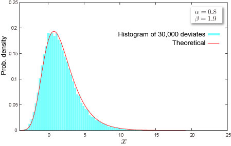
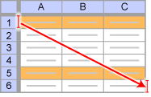

import DataGridMdx from "@site/src/components/DataGridMdx";

# NTRANDGUMBEL

[ガンベル（タイプ1）分布](../../../05-gallery-of-distributions/gumbel-type-i-distribution.mdx)に従う疑似乱数を返します。乱数は超長周期 ($2^{19937}-1$)、 かつ高次元均等性（623次元）を備えた[Mersenne Twister アルゴリズム](/docs/glossary#mersenne-twister-algorithm) を基に生成されます。

## 書式

```excel
NTRANDGUMBEL(
    Size,
    Alpha,
    Beta,
    Algorithm,
    Random seed1,
    Random seed2
)
```

### 引数

- **_Size_**乱数の個数を指定します（正の整数）。
- **_Alpha_** 分布のパラメータ $\alpha$ を指定します。
- **_Beta_** 分布のパラメータ $\beta\;(>0)$ を指定します。
- **_Algorithm_** 一様乱数を生成するアルゴリズムを下記の3つから選択します。この引数は省略することができます。
  - 0: Mersenne Twister(2002)
  - 1: Mersenne Twister(1998)
  - 2: Numerical Recipes ran2()
- **_Random seed1_** 第1乱数シードを指定します。この引数は省略することが出来ます。
- **_Random seed2_** 第2乱数シードを指定します。この引数は省略することが出来ます。

## 解説

- 乱数$x$ は、$(0,1)$ の一様乱数$U$から、

  $$
  x=\alpha-\beta\ln\ln\frac{1}{U}
  $$

  として計算されます（逆関数法）。

## 使用例



- 使用例を新規のワークシートにコピーすると、計算結果を確認できます。

<details>
<summary>その方法は？</summary>

1.  新しいブックまたはワークシートを作成します。
2.  ヘルプ トピックにある使用例を選択します（行番号および列番号を除く）。

    

    ヘルプから使用例を選択する

3.  Ctrl キーを押しながら C キーを押します。
4.  ワークシートのセル A1 を選択し、Ctrl キーを押しながら V キーを押します。
5.  計算結果と結果を返す数式の表示を切り替えるには、Ctrl キーを押しながら ` (アクサン グラーブ) キーを押すか、または [ツール] メニューの [ワークシート分析] をポイントし、[ワークシート分析モード] をクリックします。

</details>

<DataGridMdx
  data={{
    cells: [
      [
        { value: "データ", readOnly: true, className: "orange-cell" },
        { value: "説明", readOnly: true, className: "orange-cell" },
      ],
      [
        { value: -3.5, readOnly: true },
        { value: "パラメータ Alpha の値", readOnly: true },
      ],
      [
        { value: 23, readOnly: true },
        { value: "パラメータ Beta の値", readOnly: true },
      ],
      [
        { value: "数式", readOnly: true, className: "orange-cell" },
        { value: "説明（計算結果）", readOnly: true, className: "orange-cell" },
      ],
      [
        { value: "=NTRANDGUMBEL(100,A2,A3,0)", readOnly: true },
        {
          value:
            "100個のガンベル乱数を Mersenne Twister アルゴリズムで生成します。",
          readOnly: true,
        },
      ],
    ],
  }}
/>

メモ： この使用例の数式は、配列数式として入力する必要があります。使用例を新規ワークシートにコピーした後、A5:A104 のセル範囲 (配列数式が入力されているセルが左上になる) を選択します。F2 キーを押し、Ctrl キーと Shift キーを押しながら Enter キーを押します。この数式が配列数式として入力されていない場合、単一の値 2 のみが計算結果として返されます。

- [サンプル Excel シートをダウンロード](./../../../assets/NtRand1.zip)

## 参照

- [NTGUMBELDIST](../../02-distribution-functions/039-ntgumbeldist.mdx)
- [NTGUMBELINV](../../02-distribution-functions/040-ntgumbelinv.mdx)
- [NTGUMBELKURT](../../02-distribution-functions/041-ntgumbelkurt.mdx)
- [NTGUMBELMEAN](../../02-distribution-functions/042-ntgumbelmean.mdx)
- [NTGUMBELMOM](../../02-distribution-functions/043-ntgumbelmom.mdx)
- [NTGUMBELPARAM](../../02-distribution-functions/044-ntgumbelparam.mdx)
- [NTGUMBELSKEW](../../02-distribution-functions/045-ntgumbelskew.mdx)
- [NTGUMBELSTDEV](../../02-distribution-functions/046-ntgumbelstdev.mdx)
- [ガンベル（タイプ1）分布](../../../05-gallery-of-distributions/gumbel-type-i-distribution.mdx)
- [乱数アルゴリズムの選択](/docs/glossary#choice-of-the-random-number-generator-algorithm)
- [どうして複数のセルに数式をコピーすると全部同じ結果になるの？](/docs/faq#why-i-always-see-the-same-result-even-if-i-input-formula-into-multiple-cell)
