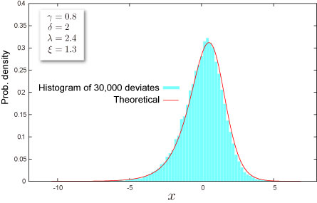

import DataGridMdx from "@site/src/components/DataGridMdx";

# NTRANDJOHNSONSU

[\
ジョンソン SU 分布](https://www.ntrand.com/jp/johnson-su-distribution/)に従う疑似乱数を返します。乱数は超長周期 ($2^{19937}-1$)、 かつ高次元均等性（623次元）を備えた[Mersenne Twister アルゴリズム](https://www.ntrand.com/jp/glossary/#local_Mersenne_Twister) を基に生成されます。

## 書式

```excel
NTRANDJOHNSONSU(
    Size,
    Gamma,
    Delta,
    Lambda,
    Xi,
    Algorithm,
    Random seed1,
    Random seed2,
    Use invert func,
    Use antithetic,
    Use resampling
)
```

### 引数

- **_Size_**乱数の個数を指定します（正の整数）。
- **_Gamma_** 分布のパラメータ $\gamma$ を指定します。
- **_Delta_** 分布のパラメータ $\delta(>0)$ を指定します。
- **_Lambda_** 分布のパラメータ $\lambda(>0)$ を指定します。
- **_Xi_** 分布のパラメータ $\xi$ を指定します。
- **_Algorithm_** 一様乱数を生成するアルゴリズムを下記の3つから選択します。この引数は省略することができます。
  - 0: Mersenne Twister(2002)
  - 1: Mersenne Twister(1998)
  - 2: Numerical Recipes ran2()
- **_Random seed1_** 第1乱数シードを指定します。この引数は省略することが出来ます。
- **_Random seed2_** 第2乱数シードを指定します。この引数は省略することが出来ます。
- **_Use invert func_** 乱数生成法を論理値で指定します。*Use invert func* に TRUE を指定すると逆関数法が用いられ、FALSE を指定すると[極座標法（Box-Muller 法）](https://www.ntrand.com/jp/glossary/#local_Box-Muller)が用いられます。
- **_Use antithetic_** [対称変量法](https://www.ntrand.com/jp/glossary/#local_Antitheticvariant)を用いるか否かを論理値で指定します。*Use antithetic* に TRUE を指定すると[対称変量法](https://www.ntrand.com/jp/glossary/#local_Antitheticvariant)が用いられ，FALSEを指定すると用いられません。
- **_Use resampling_** [2次サンプリング](https://www.ntrand.com/jp/glossary/#local_quadraticresampling)を用いるか否かを論理値で指定します。*Use resampling* に TRUE を指定すると[2次サンプリング](https://www.ntrand.com/jp/glossary/#local_Antitheticvariant)が用いられ，FALSEを指定すると用いられません。

## 解説

- 乱数$x$ は、$(0,1)$ の一様乱数$U$から、

  $$
  x=\lambda\sinh\left(\frac{\Phi^{-1}(U)-\gamma}{\delta}\right)+\xi
  $$

  として計算されます（逆関数法）。ここで、$\Phi(\cdot)$は[標準正規分布](https://www.ntrand.com/jp/normal-distribution-single/)の[累積分布関数](https://www.ntrand.com/jp/glossary/#local_cumulative)です。

## 使用例



- 使用例を新規のワークシートにコピーすると、計算結果を確認できます。

<details>
<summary>その方法は？</summary>

1.  新しいブックまたはワークシートを作成します。
2.  ヘルプ トピックにある使用例を選択します（行番号および列番号を除く）。

    

    ヘルプから使用例を選択する

3.  Ctrl キーを押しながら C キーを押します。
4.  ワークシートのセル A1 を選択し、Ctrl キーを押しながら V キーを押します。
5.  計算結果と結果を返す数式の表示を切り替えるには、Ctrl キーを押しながら ` (アクサン グラーブ) キーを押すか、または [ツール] メニューの [ワークシート分析] をポイントし、[ワークシート分析モード] をクリックします。

</details>

<DataGridMdx
  data={{
    cells: [
      [
        { value: "データ", readOnly: true, className: "orange-cell" },
        { value: "説明", readOnly: true, className: "orange-cell" },
      ],
      [
        { value: 0.8, readOnly: true },
        { value: "パラメータ Gamma の値", readOnly: true },
      ],
      [
        { value: 2, readOnly: true },
        { value: "パラメータ Delta の値", readOnly: true },
      ],
      [
        { value: 2.5, readOnly: true },
        { value: "パラメータ Lambda の値", readOnly: true },
      ],
      [
        { value: 1.2, readOnly: true },
        { value: "パラメータ Xi の値", readOnly: true },
      ],
      [
        { value: "数式", readOnly: true, className: "orange-cell" },
        { value: "説明（計算結果）", readOnly: true, className: "orange-cell" },
      ],
      [
        { value: "=NTRANDJOHNSONSU(100,A2,A3,A4,A5,0)", readOnly: true },
        {
          value:
            "100個のジョンソン SU 乱数を Mersenne Twister アルゴリズムで生成します。",
          readOnly: true,
        },
      ],
    ],
  }}
/>

メモ： この使用例の数式は、配列数式として入力する必要があります。使用例を新規ワークシートにコピーした後、A7:A106 のセル範囲 (配列数式が入力されているセルが左上になる) を選択します。F2 キーを押し、Ctrl キーと Shift キーを押しながら Enter キーを押します。この数式が配列数式として入力されていない場合、単一の値 2 のみが計算結果として返されます。

- [サンプル Excel シートをダウンロード](https://www.ntrand.com/files/NtRand1.xls "Downloading Sample")
- [チュートリアルビデオを見る](https://www.ntrand.com/files/SingleRandom_Demo.swf)

## 参照

- [NTJOHNSONSUDIST](https://www.ntrand.com/jp/ntjohnsonsudist/)
- [NTJOHNSONSUINV](https://www.ntrand.com/jp/ntjohnsonsuinv/)
- [NTJOHNSONSUKURT](https://www.ntrand.com/jp/ntjohnsonsukurt/)
- [NTJOHNSONSUMEAN](https://www.ntrand.com/jp/ntjohnsonsumean/)
- [NTJOHNSONSUMOM](https://www.ntrand.com/jp/ntjohnsonsumom/)
- [NTJOHNSONSUPARAM](https://www.ntrand.com/jp/ntjohnsonsuparam/)
- [NTJOHNSONSUSKEW](https://www.ntrand.com/jp/ntjohnsonsuskew/)
- [NTJOHNSONSUSTDEV](https://www.ntrand.com/jp/ntjohnsonsustdev/)
- [ジョンソン SU 分布](https://www.ntrand.com/jp/johnson-su-distribution/)
- [乱数アルゴリズムの選択](https://www.ntrand.com/jp/glossary/#local_Choiceoftherandomnumber)
- [どうして複数のセルに数式をコピーすると全部同じ結果になるの？](https://www.ntrand.com/jp/faq/#local_CtrlShiftEnter)
