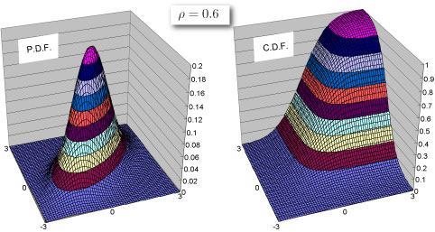

import DataGridMdx from "@site/src/components/DataGridMdx";

# NTBINORMDIST

2変数正規分布の確率の値を返します。

## 書式

```excel
NTBINORMDIST(
    X1,
    X2,
    Corr,
    Cumulative
)
```

#### 引数

- **_X1_** 第1変数の値を指定します。
- **_X2_** 第2変数の値を指定します。
- **_Corr_** 2変数間の相関係数 $\rho;(-1\leq \rho \leq 1)$ を指定します。この引数は省略出来ます。
- **_Cumulative_** 計算に使用する指数関数の形式を論理値で指定します。*Cumulative* に TRUE を指定すると累積分布関数の値が計算され、FALSE を指定すると確率質量関数の値が計算されます。

## 解説

- 引数 *Corr* が 1 または -1、かつ*Cumulative* が FALSE、かつ *X1*=*X2*の場合、この関数は "#VALUE!" を返します。

## 使用例



- 使用例を新規のワークシートにコピーすると、計算結果を確認できます。

<details>
<summary>その方法は？</summary>

1.  新しいブックまたはワークシートを作成します。
2.  ヘルプ トピックにある使用例を選択します（行番号および列番号を除く）。

    

    ヘルプから使用例を選択する

3.  Ctrl キーを押しながら C キーを押します。
4.  ワークシートのセル A1 を選択し、Ctrl キーを押しながら V キーを押します。
5.  計算結果と結果を返す数式の表示を切り替えるには、Ctrl キーを押しながら ` (アクサン グラーブ) キーを押すか、または [ツール] メニューの [ワークシート分析] をポイントし、[ワークシート分析モード] をクリックします。

</details>

<DataGridMdx
  data={{
    cells: [
      [
        { value: "データ", readOnly: true, className: "orange-cell" },
        { value: "説明", readOnly: true, className: "orange-cell" },
      ],
      [
        { value: 1.5, readOnly: true },
        { value: "第1変数の値", readOnly: true },
      ],
      [
        { value: -1, readOnly: true },
        { value: "第2変数の値", readOnly: true },
      ],
      [
        { value: 0.5, readOnly: true },
        { value: "相関係数", readOnly: true },
      ],
      [
        { value: "数式", readOnly: true, className: "orange-cell" },
        { value: "説明（計算結果）", readOnly: true, className: "orange-cell" },
      ],
      [
        { value: "=NTBINORMDIST(A2,A3,A4,TRUE)", readOnly: true },
        { value: "上のデータに対する累積分布関数の値", readOnly: true },
      ],
      [
        { value: "=NTBINORMDIST(A2,A3,A4,FALSE)", readOnly: true },
        { value: "上のデータに対する確率密度関数の値", readOnly: true },
      ],
    ],
  }}
/>

## 参照

- [NTRANDMULTINORM](../01-random-numbers/02-multi-series/01-ntrandmultinorm.mdx)
- [正規分布（多変量）](../../05-gallery-of-distributions/normal-distribution-multi.mdx)
