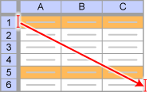

import DataGridMdx from "@site/src/components/DataGridMdx";

# NTCOV2COR

分散・共分散行列を標準偏差と相関行列に分解します。

## 書式

```excel
NTCOV2COR(
    Covariance matrix,
    Calc stdev vector
)
```

### 引数

- **_Covariance matrix_** 分散・共分散行列を指定します。
- **_Calc stdev vector_** 各変数の標準偏差を計算するかを論理値で指定します。*Calc stdev vector* に TRUE を指定すると各変数の標準偏差が計算され、FALSE を指定すると計算されません。

## 使用例

- 使用例を新規のワークシートにコピーすると、計算結果を確認できます。

<details>
<summary>その方法は？</summary>

1.  新しいブックまたはワークシートを作成します。
2.  ヘルプ トピックにある使用例を選択します（行番号および列番号を除く）。

    

    ヘルプから使用例を選択する

3.  Ctrl キーを押しながら C キーを押します。
4.  ワークシートのセル A1 を選択し、Ctrl キーを押しながら V キーを押します。
5.  計算結果と結果を返す数式の表示を切り替えるには、Ctrl キーを押しながら ` (アクサン グラーブ) キーを押すか、または [ツール] メニューの [ワークシート分析] をポイントし、[ワークシート分析モード] をクリックします。

</details>

例1. 相関行列

<DataGridMdx
  data={{
    cells: [
      [
        { value: "データ", readOnly: true, className: "orange-cell" },
        { value: "データ", readOnly: true, className: "orange-cell" },
        { value: "データ", readOnly: true, className: "orange-cell" },
        { value: "説明", readOnly: true, className: "orange-cell" },
      ],
      [
        { value: 0.9, readOnly: true },
        { value: 2.1, readOnly: true },
        { value: -0.65, readOnly: true },
        { value: "分散・共分散行列", readOnly: true },
      ],
      [
        { value: 2.1, readOnly: true },
        { value: 0.59, readOnly: true },
        { value: 1.2, readOnly: true },
        { value: "分散・共分散行列", readOnly: true },
      ],
      [
        { value: -0.65, readOnly: true },
        { value: 1.2, readOnly: true },
        { value: 1.1, readOnly: true },
        { value: "分散・共分散行列", readOnly: true },
      ],
      [
        { value: "数式", readOnly: true, className: "orange-cell" },
        { value: "", readOnly: true, className: "orange-cell" },
        { value: "", readOnly: true, className: "orange-cell" },
        { value: "説明（計算結果）", readOnly: true, className: "orange-cell" },
      ],
      [
        { value: "=NTCOV2COR(A2:C4,FALSE)", readOnly: true },
        { value: "", readOnly: true },
        { value: "", readOnly: true },
        { value: "上のデータに対する相関行列 (3 x 3 行列)", readOnly: true },
      ],
    ],
  }}
/>

メモ： この使用例の数式は、配列数式として入力する必要があります。使用例を新規ワークシートにコピーした後、A6:C8 のセル範囲 (配列数式が入力されているセルが左上になる) を選択します。F2 キーを押し、Ctrl キーと Shift キーを押しながら Enter キーを押します。この数式が配列数式として入力されていない場合、単一の値 2 のみが計算結果として返されます。

例2. 標準偏差と相関行列

<DataGridMdx
  data={{
    cells: [
      [
        { value: "データ", readOnly: true, className: "orange-cell" },
        { value: "データ", readOnly: true, className: "orange-cell" },
        { value: "データ", readOnly: true, className: "orange-cell" },
        { value: "説明", readOnly: true, className: "orange-cell" },
      ],
      [
        { value: 0.9, readOnly: true },
        { value: 2.1, readOnly: true },
        { value: -0.65, readOnly: true },
        { value: "分散・共分散行列", readOnly: true },
      ],
      [
        { value: 2.1, readOnly: true },
        { value: 0.59, readOnly: true },
        { value: 1.2, readOnly: true },
        { value: "分散・共分散行列", readOnly: true },
      ],
      [
        { value: -0.65, readOnly: true },
        { value: 1.2, readOnly: true },
        { value: 1.1, readOnly: true },
        { value: "分散・共分散行列", readOnly: true },
      ],
      [
        { value: "数式", readOnly: true, className: "orange-cell" },
        { value: "", readOnly: true, className: "orange-cell" },
        { value: "", readOnly: true, className: "orange-cell" },
        { value: "説明（計算結果）", readOnly: true, className: "orange-cell" },
      ],
      [
        { value: "=NTCOV2COR(A2:C4,TRUE)", readOnly: true },
        { value: "", readOnly: true },
        { value: "", readOnly: true },
        {
          value: "上のデータに対する標準偏差 (A6:C6) と 相関行列 (A7:C9)",
          readOnly: true,
        },
      ],
    ],
  }}
/>

- [サンプル Excel シートをダウンロード](https://www.ntrand.com/files/NtRand3.xls "Downloading Sample")

## 参照

- [NTCOR2COV](https://www.ntrand.com/jp/ntcor2cov/)
- [NTMULTICORREL](https://www.ntrand.com/jp/ntmulticorrel/)
- [NTMULTICOVARP](https://www.ntrand.com/jp/ntmulticovarp/)
- [どうして複数のセルに数式をコピーすると全部同じ結果になるの？](https://www.ntrand.com/jp/faq/#local_CtrlShiftEnter)
