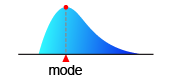
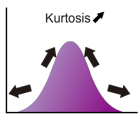
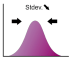
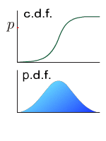
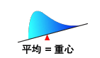
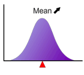
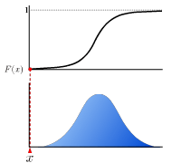
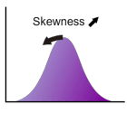

## 2次サンプリング (quadratic resampling) {#quadratic-resampling}

コンピューターで生成する[疑似乱数](/docs/glossary#pseudo-random-numbers)のモーメントを指定した値に一致させる方法の1つ。\
まず目的の個数分の乱数を生成してから、乱数系列全体の統計量を計算し、その分の補正を加える手法のことです。[対称変量法](/docs/glossary#antithetic-variant-method)では除去できない2次モーメントの調整が可能です。通常、[対称変量法](/docs/glossary#antithetic-variant-method)と組み合わせて使います。\
なお、本プログラムで用いている2次サンプリングの手法は基本的には1990年当時のノウハウにて実装したものです。一部の市場参加者が使用する2次サンプリングに関する最近の成果には、より高次の偶数次モーメントを一致させる手法もあります。

## Box-Muller 法（極座標法）{#box-muller-method}

一様乱数を正規乱数に変換する手法の1つです。1つの乱数系列が対象である限りこの手法を使っても問題はありません。\
2つの独立な一様乱数 $u_1$、$u_2$ を生成し、そこから

$$
\begin{cases}
  z_1=\sqrt{-2\ln u_1}\sin (2\pi u_2) \\
  z_2=\sqrt{-2\ln u_1}\cos (2\pi u_2)
\end{cases}
$$

として2つの乱数 $z_1$、$z_2$ を生成します。この2つの乱数はそれぞれ、$N(0,1)$の正規分布に従います。

## c.d.f. {#cdf}

Cumulative distribution function（累積分布関数） の略。[累積分布関数](/docs/glossary#cumulative-distribution-function)参照

## Excelの配列数式 {#array-formula-in-excel}

Excelでは配列数式を使って複数の計算を行い、複数の結果を一度に返すことができます。配列数式を入力するには、最初に出力範囲のセルを指定し、数式を入力、入力が終わったらCtrl キーと Shift キーを押しながら Enter キーを押します。配列数式の詳細については、Excelのヘルプ (タイトル名：配列数式とその入力方法について)や[Microsoftのページ (配列数式のガイドラインと例)](http://office.microsoft.com/ja-jp/excel/HA102284581041.aspx "配列数式のガイドラインと例")をご覧下さい。 [どうして複数のセルに数式をコピーすると全部同じ結果になるの？](/docs/faq#why-i-always-see-the-same-result-even-if-i-input-formula-into-multiple-cell/)

## Leptokurtic {#leptokurtic}

**Leptokurtic** とは、分布の裾が正規分布に比べて厚いこと、つまり[尖度](/docs/glossary#kurtosis)が正である分布のことをいいます。急尖的ともいいます。 正規分布に従うとすると決して起き得ないような小さい確率であるような事象が実際には起きてしまう --- こういった場合は正規分布に替えて、Leptokurtic な分布（例えば[ロジスティック分布](05-gallery-of-distributions/logistic-distribution.mdx)や[ジョンソン SU 分布](05-gallery-of-distributions/johnson-su-distribution.mdx)）を仮定することがモデル改善の一案となります。

## Mersenne Twister 法 {#mersenne-twister-algorithm}

超長周期（$2^{19937}$ と高次元均等性（$R^{623}$を備えた、現在最高の[一様乱数](/docs/glossary#uniformnormal-random-numbers-conversion)生成アルゴリズム。詳しくは [Mersenne Twiser のホームページ](http://www.math.sci.hiroshima-u.ac.jp/~m-mat/MT/emt.html "Mersenne Twister home page")をご覧ください。

## Mesokurtic {#mesokurtic}

**Mesokurtic** とは[尖度](/docs/glossary#kurtosis)が 0 である分布のことをいいます。正規分布がその代表です。中尖的ともいいます。

## Moroの方法 {#inverse-function-method-moros-algorithm}

正規分布の[累積分布関数](/docs/glossary#cumulative-distribution-function)の逆関数の近似法。この近似式によって、正規乱数を逆関数法で生成できるようになります。[Box-Muller法](/docs/glossary#box-muller-method)より幾分複雑になるが、Moroの方法による近似式を用いた逆関数法を使うべきです。 Moroの方法は、$0<x<1$なる入力$x$に対して、$y=x-\frac{1}{2},\;z=\log\left[-\log\left(\frac{1}{2}-|y|\right)\right]$として、

- $|y|\leq 0.42$の場合

$$
  \Phi^{-1}(x)\sim\frac{y\cdot\displaystyle{\sum_{i=1}^{4}a_{i}y^{2(i-1)}}}{1+\displaystyle{\sum_{i=1}^{4}b_{i}y^{2i}}}
$$

- $|y|> 0.42$の場合

$$
  \Phi^{-1}(x)\sim\text{sgn}(y)\sum_{i=0}^{8}c_iz^{i}
$$

と計算される。ここで、各式中にあらわれる係数は以下の通り。

| $i$ | $a_{i}$         | $b_{i}$         | $c_{i}$            |
| --- | --------------- | --------------- | ------------------ |
| 0   |                 |                 | 0.3374754822726147 |
| 1   | 2.50662823884   | -8.47351093090  | 0.9761690190917186 |
| 2   | -18.61500062529 | 23.08336743743  | 0.1607979714918209 |
| 3   | 41.39119773534  | -21.06224101826 | 0.0276438810333863 |
| 4   | -25.44106049637 | 3.13082909833   | 0.0038405729373609 |
| 5   |                 |                 | 0.0003951896511919 |
| 6   |                 |                 | 0.0000321767881768 |
| 7   |                 |                 | 0.0000002888167364 |
| 8   |                 |                 | 0.0000003960315187 |

B. Moro: "The Full Monte", Risk, Vol. 8 (Feb.), pp. 57-58 (1995).

## Platykurtic {#platykurtic}

**Platykurtic**とは、分布の裾が正規分布に比べて薄いこと、つまり[尖度](/docs/glossary#kurtosis)が負である分布のことです。緩尖的ともいいます。

## p.d.f. {#pdf}

Probability density function（確率密度関数）の略。[確率密度関数](/docs/glossary#probability-density-function)参照。

## p.m.f. {#pmf}

Probability mass function（確率質量関数）の略。[確率質量関数](/docs/glossary#probability-mass-function)参照。

## 一様乱数 {#uniform-random-numbers}

[一様分布（離散）](05-gallery-of-distributions/uniform-distribution-discrete.mdx) または [一様分布（連続）](05-gallery-of-distributions/uniform-distribution-continuous.mdx) に従う乱数のこと。 [NTRAND](03-function-reference/01-random-numbers/01-single-series/01-ntrand.mdx) 関数は $(0,1)$ の区間に一様に分布する事実上連続な関数を生成します。 正確には出力範囲は

$$
0\leq x\leq 1-\frac{1}{9007199254740992}
$$

で、隣り合う数字の間隔は $1/9007199254740992$ となります 。

## 一様乱数から正規乱数への変換 {#uniformnormal-random-numbers-conversion}

シミュレーションの中心となる正規乱数を一様乱数から生成する方法をNtRand では[Box-Muller 法](/docs/glossary#box-muller-method)と[paragraph の方法](/docs/glossary#inverse-function-method-moros-algorithm)から選択可能です。

## オイラーの定数 {#eulers-constant}

次式で定義される定数。驚くべきことに、この定数が有理数か無理数かもわかっていません。

$$
\gamma=\lim_{n\to\infty}\left(\sum_{k=1}^{n}\frac{1}{k}-\ln n\right)\sim 0.577215
$$

## 確率質量関数 {#probability-mass-function}

離散的な確率変数が整数 $x$ をとる確率を表す関数。

$$
Pr[X=x]=p(x)
$$

離散確率分布の[累積分布関数](/docs/glossary#cumulative-distribution-function)は、確率質量関数の和になります。

$$
F(x)=\sum_{i=0}^xf(i)
$$

この関数は、連続型の分布における[確率密度関数](/docs/glossary#probability-density-function)に相当します。

## 確率密度関数 {#probability-density-function}

確率変数が $x$ から微小な間隔$x+\text{d}x$の間の値をとる確率が $f(x)\text{d}x$ で与えられるとき、この関数 $f(x)\text{d}x$ を確率密度関数といいます。 確率密度関数は以下の特徴を備えます。

- 常に正
- 確率密度関数とx軸、そしてｙ軸に平行な直線 x=a と x=b で囲まれる部分の面積は、確率変数が x=a から x=b までの間の値を取る確率を表します。 
- 確率密度関数下の全面積は1
- 確率密度関数は、[中央値（median）](/docs/glossary#median)、[最頻値（mode）](/docs/glossary#mode)、[平均](/docs/glossary#central-moment)、[標準偏差](/docs/glossary#standard-deviation)、[歪度](/docs/glossary#skewness)、[尖度](/docs/glossary#kurtosis)などといった量で特徴づけられます。

よくある勘違いは、$f(x)$ そのものが確率変数が $x$ をとる確率だ，とすることです。連続分布の確率変数が特定の値 $x$ をとる確率は 0 です。

## ガンマ関数 {#gamma-function}

次式で定義される特殊関数。

$$
\Gamma(x)=\int_{0}^{+\infty}t^{x-1}\text{e}^{-t}\text{d}t
$$

## 疑似乱数 {#pseudo-random-numbers}

コンピューター上で、決定論的な手順によって生成される乱数のこと。決定論的故に、同じ条件下では必ず同じ数列が生成される。真の乱数（例：[物理乱数](/docs/glossary#physical-random-numbers)）と異なるこの性質のために "疑似"乱数と呼ばれます。

## 原点周りのモーメント {#raw-moment}

[モーメント](/docs/glossary#moment)参照。

## 最頻値（mode） {#Mode}

データセット、あるいは確率分布で最も頻繁に現れる値です。山が1つの[確率密度関数](/docs/glossary#probability-density-function)に関して言えば、最頻値は山の位置のことです。\

## 正規化された不完全ベータ関数 {#regularized-incomplete-beta-function}

[不完全ベータ関数](/docs/glossary#incomplete-beta-function/)参照。

## 尖度 {#kurtosis}

尖度は分布を特徴付ける指標の1つで、分布がどれほど平均周辺に集中しているかを表します。$\gamma_2$（ギリシャ文字の"ガンマ"）と表記される場合が多いです。

尖度が大きい場合、分布は平均の周辺に集中するので、分布の山が鋭く尖っています。中心に集中した分、裾は大きく広がることになるので（面積を 1 に保つため）、裾が厚くなります。一方、尖度が小さい場合は、集中度が小さいので分布の山は平たくなり、同時に裾が薄くなります。

尖度は正規分布が 0 で、尖度が正の場合は正規分布より厚い裾を持った分布、尖度が負のものを正規分布より薄い裾を持った分布と分類されます。

尖度は次式で定義されます。

$$
\gamma_2=\frac{\mu_{(4)}}{\sigma^4}-3
$$

ここで $\mu_{(4)}$ は4次の [平均周りのモーメント](/docs/glossary#central-moment) で、 $\sigma$ は [標準偏差](/docs/glossary#standard-deviation) を表します。 この式で定義される尖度は「超過尖度」とも呼ばれます。

## 対称変量法 {#antithetic-variant-method}

正規乱数を1つ作った時に符号を反転させただけでもう1つ乱数を作るという、非常に単純なモンテカルロ法の収束性改善策です。たったこれだけで奇数次モーメント (平均、歪度、...)を全てゼロにすることが出来、顕著に収束性が向上します。対称変量法を使った正規乱数系列は見れば一目瞭然です。

## 多変量相関正規乱数 {#multivariate-correlation-random-numbers}

互いに相関を持った複数の正規乱数列。この乱数列の生成がモンテカルロ法による VaR の算出のような多変量シミュレーションのキーテクノロジーとなります。

## 単峰型 {#unimodal}

モードを一つだけ持つ分布のこと。つまり、[確率密度分布](/docs/glossary#probability-density-function)の形状が1つの山のようになっている分布。[一様分布（連続）](05-gallery-of-distributions/uniform-distribution-continuous.mdx)のように長方形の分布は山と認識しないことに注意。

## モード {#mode}

離散分布におけるモードとは、確率質量関数が最大値をとる値のことです。言い換えるともっとも出やすい値のことです。連続分布におけるモードとは、[確率密度分布](/docs/glossary#probability-density-function)が最大値をとる値のことです。

## 中央値 {#median}

[確率密度関数](/docs/glossary#probability-density-function) の下部の面積を等しく2つに分ける点。\
\
中央値は次式で算出される。

$$
\text{median}=F^{-1}(0.5)
$$

, ここで $F^{-1}(x)$ は[累積分布関数](/docs/glossary#cumulative-distribution-function)の逆関数。

## 特異値分解（SVD） {#singular-value-decomposition-svd}

行列の三角分解法の一つです。 多変量相関乱数を生成するには、その計算過程で入力した共分散行列の三角分解を行わねばなりません。 簡便なのは平方根法やCholesky法であり、初歩的な教科書ではこれらの実対称正定値行列の三角分解法を紹介しています。 また、無相関データが多いならば、さらに制約条件を強めて「帯行列」を仮定したSplit Cholesky法を用いれば、標準Cholesky法の約２倍の計算効率を実現できます。 ところが、高次元の経済時系列データなどを使った計算では、系列間独立性を保障することが難しく、正定値行列の仮定は強すぎます。 また、高次元下では計算機内部の繰り返し計算の過程での桁落ちエラー (アンダーフロー)などに遭遇する可能性が高まり、解が安定しないことがあります。 改良されたSVD法はそうしたケースでも有効な実用的手法です。\
[特異値分解の簡単な解説](https://www.ntrand.com/jp/columns/20100520/)もご覧ください。

## 標準正規乱数 {#normal-gaussian-random-numbers}

平均 0 、標準偏差 1 の[正規分布](05-gallery-of-distributions/normal-distribution-single.mdx)に従う乱数のこと。

## 標準偏差 {#standard-deviation}

標準偏差は分布がどの程度広がっているかを示す指標で、多くの教科書では$\sigma$（ギリシャ文字。"シグマ"と読む）と表記されます。正規分布を例にとると、標準偏差は[平均](/docs/glossary#central-moment)と変曲点（上に凸から下に凸に変化する点）までの距離となります（下図参照）。\
\
例えば標準偏差が2倍になると、分布は横に広がりますが、同時に高さが 1/2 になります。これによって曲線と x軸で囲まれる部分の面積が 1 に保たれます。下の図で標準偏差の変化とともに分布の形状がどのように変化するかを確認してください。(矢印をドラッグ!）\
\
標準偏差の2乗は[分散](/docs/glossary#variance)と呼ばれます。

## 不完全ベータ関数 {#incomplete-beta-function}

次式で定義される特殊関数。

$$
B_x(p,q)=\int_{0}^{x}t^{p-1}(1-t)^{q-1}\text{d}t
$$

$x=1$ のとき、この関数は[ベータ関数](/docs/glossary#beta-function)に等しくなります。 正規化された不完全ベータ関数は以下で定義されます。

$$
I_x(p,q)=\frac{B_x(p,q)}{B(p,q)}
$$

ここで $B(\cdot,\;\cdot)$ は[ベータ関数](/docs/glossary#beta-function)です。

## 不完全ガンマ関数 {#incomplete-gamma-function}

次式で定義される特殊関数。

$$
\Gamma_x(a)=\int_{0}^{x}\text{e}^{-u}u^{a-1}\text{d}u
$$

## 物理乱数 {#physical-random-numbers}

物理的な現象を用いて、真の乱数 (と思われるもの)を求めたものです。古くは放射性崩壊現象が使われましたが、単位時間当たりの乱数生成量が少ないため、現在では電気回路の利用が通例です。

## 分位点 {#quantile}

$0< p< 1$ なる数 $p$ に対して、p-分位点とは、図のように、確率を $p:(1-p)$ に分割する点のことです。 p-分位点は、[累積分布関数](/docs/glossary#cumulative-distribution-function) $F(x)$ を用いて、

$$
F^{-1}(p)
$$

と与えられます。0.5-分位点は[中央値](/docs/glossary#median)と呼ばれます。\

## 分散 {#variance}

[標準偏差](/docs/glossary#standard-deviation)の2乗で、$\sigma^2$ と表記される場合が多い。分散は、2次の[平均周りのモーメント](/docs/glossary#central-moment)として定義されます。

## ベータ関数 {#beta-function}

次式で定義される特殊関数。

$$
B(x,y)=\int_{0}^{1}t^{x-1}(1-t)^{y-1}\text{d}t
$$

## 平均 {#mean}

分布を特徴付ける指標の1つで、分布の典型的な位置を表します。図にみるように分布の重心に一致します。$m$ と表記される場合が多いです。

平均が変化しても分布関数の形状は変わりません。

これは1次の [原点周りのモーメント](/docs/glossary#raw-moment)に等しい。

## 平均周りのモーメント {#central-moment}

[モーメント](/docs/glossary#moment)参照。

## モーメント {#moment}

分布を特徴づける量で、0次のモーメント、1次のモーメント．．．といった具合に整数次のモーメントが定義され、それぞれに異なる意味、役割を持ちます。 分布のモーメントには**原点周りのモーメント**と**平均周りのモーメント**があります。

- 原点周りのモーメント k-次の原点周りのモーメント $\mu^\prime_{(k)}$ は次式で定義されます。

  $$
    \mu^\prime_{(k)}=\int x^{k}f(x)\text{d}x
  $$

  ここで $f(x)$ は分布の[確率密度関数](/docs/glossary#probability-density-function) で、積分は定義域全体に渡って行います。 原点周りのモーメントは以下の特徴があります。

  - 0次の原点周りのモーメントは常に 1
  - 1次の原点周りのモーメントは分布の[平均](/docs/glossary#central-moment)

- 平均周りのモーメント k-次の平均周りのモーメントは次式で定義されます。

  $$
  \mu_{(k)}=\int(x-m)^kf(x)\text{d}x
  $$

  ここで $f(x)$ は 分布の[確率密度関数](/docs/glossary#probability-density-function) で、 $m$ は分布の[平均](/docs/glossary#central-moment) を表します。また積分は定義域全体に渡って行います。 平均周りのモーメントは以下の特徴があります。

  - 0次の平均周りのモーメントは常に1。
  - 1次の平均周りのモーメントは常に0。
  - 2次の平均周りのモーメントは [分散](/docs/glossary#variance)と呼ばれる。
  - 3次の平均周りのモーメントは [歪度](/docs/glossary#skewness)の計算に用いられる。
  - 4次の平均周りのモーメントは [尖度](/docs/glossary#kurtosis)の計算に用いられる。

## リーマンのゼータ関数 {#riemann-zeta-function}

リーマンのゼータ関数のうち、特別なケースは以下の通りです。

$$
\zeta(x)=\sum_{n=1}^{\infty}\frac{1}{n^x}
$$

$$
\zeta(2)=\frac{\pi^2}{6}\sim 1.645
$$

$$
\zeta(3)\sim 1.202\quad\text{(a.k.a. Ap\'{e}ry's constant)}
$$

$$
\zeta(4)=\frac{\pi^4}{90}\sim 1.0823
$$

## 乱数アルゴリズムの選択 {#choice-of-the-random-number-generator-algorithm}

NtRandは次の3種類の乱数アルゴリズムを実装しています。これらは各乱数生成関数の引数 *Algorithm* の指定により切り替えられます。

- **Algorithm=0: Mersenne Twister 2002**\
  1/26/2002に発表された初期化ルーチン改良版 Mersenne Twister アルゴリズムを用いて、53bit精度(0, 1)開区間実数表現の[疑似乱数](/docs/glossary#pseudo-random-numbers)を生成します。現時点ではこれが「標準版」 Mersenne Twister です。乱数初期値には64bitの種数(random seed)を使用しています。多くの場合、このアルゴリズムをお勧めします。

- **Algorithm=1: Mersenne Twister 1998**\
  Version 1.x のNtRandに用いられた Mersenne Twister アルゴリズムを用いて(0,1)開区間実数表現の[疑似乱数](/docs/glossary#pseudo-random-numbers)を生成します。乱数初期値には64bitの種数(random seed)を使用しています。1998年時点で公表されていた Mersenne Twister アルゴリズムには初期化ルーチンには、シードの最上位ビットが状態ベクトルにあまり反映されない問題がありました。この問題の詳細は、[Mersenne Twister のホームページ](http://www.math.sci.hiroshima-u.ac.jp/~m-mat/MT/emt.html "Mersenne Twister home page")ならびに近縁の[疑似乱数TT800への問題レポート](http://random.mat.sbg.ac.at/news/seedingTT800.html "TT800 problem report")に記述されています。松本先生によれば Jeff Szuhay 氏がTT800に対して問題報告し公になったとのことです。説明が長くなるので理由は割愛しますが会計畑のユーザーからの要請により初期値空間に敏感な金融シミュレーションへの応用に際してはそれほど（小さな）問題ではなくて、私も当初よりこの問題に気がついておりました。このため1998年時点で独自に初期化アルゴリズムを修正してNtRandをリリース致しました（松本教授には問題報告を怠り申し訳ありません）。私の修正方法はオリジナルの初期値アルゴリズムはそのまま残し、64bit乱数初期値から32bit乱数初期値へ線形合同法を用いて縮小写像、乱数初期値の変化の影響がビット位置によらないようにするというものでした。1998年以降、NtRandはこの手法を採用してきました。弊社の製品版リスク管理システムPortforioBrowserTM/CreditBrowserRではさらにDESを併用して64bit超に拡大しています。現在では「標準版」 Mersenne Twister が利用できますから、このアルゴリズムは以前のバージョンとの互換性をとるためにのみ使用してください。

- **Algorithm=2: Numerical Recipies ran2**\
  W. H. Press, S. A. Teukolsky, W. T. Vetterling, B. P. Flannery, Numerical Recipies in C 2nd ed., Cambridge Univ. Press, 1992 に掲載されている推奨乱数です。書籍が広く販売されているためこのアルゴリズムは大変有名で、長い乱数周期を持ちます (> 2 x 1018)。しかしながらこのアルゴリズムには相関の問題があって乱数精度に関するテストの多くに合格しません (e.g. 2-dimensional random walk, n-block test, etc.)。このため特に多次元のモンテカルロシミュレーションにはほとんど適さないと考えた方がよいでしょう。Numerical Recipies には他にも乱数アルゴリズムが掲載されていますが、どれも問題が多くあるためお勧めできません。

## 累積分布関数 {#cumulative-distribution-function}

確率変数が、ある値$x$以下の値を取る確率を表す実数関数。
 

## 歪度 {#skewness}

歪度は分布の形状を特徴づける指標の1つで、分布が[平均](/docs/glossary#central-moment)に対して左右対称か非対称かを示します。$\gamma_1$（ギリシャ文字の"ガンマ"）と表記される場合が多いです。左右対称の場合は歪度は 0 となり、分布の正の側の裾がより広がっている場合は歪度が正、負の側の裾が広い場合は歪度は負となります（正規分布は歪度 0）。

歪度の定義は次式で与えられます。

$$
\gamma_1=\frac{\mu_{(3)}}{\sigma^3}
$$

ここで、$\mu_{(3)}$ は3次の[平均周りのモーメント](/docs/glossary#central-moment)で、$\sigma$ は分布の[標準偏差](/docs/glossary#standard-deviation)です。
