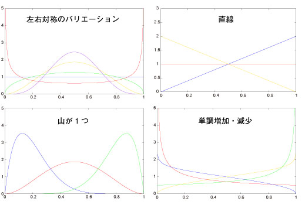
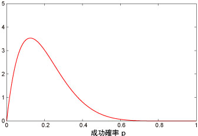
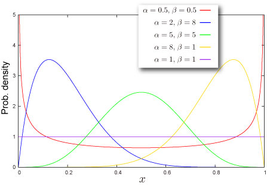
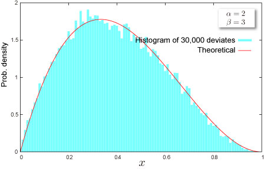

import DataGridMdx from "@site/src/components/DataGridMdx";

# ベータ分布(Beta distribution)

## 納期に間に合うか？ベータ分布

### 工期見積もり

ベータ分布が表舞台に現れる数少ない例が、**PERT**（Program Evaluation and Review Technique）という工期見積もり手法である。

#### 以下のストーリー性あふれる例を見てみよう。

今回新たなプロジェクトがスタートした。なんとしてでも期限までに完了させたい。\
楽観的に考えると1ヵ月後には納品できるという意見もある。 しかし、毎晩布団に潜ると不安が襲って来る。ここはラテンアメリカではないのだ！心配要素は数えればいくらでもある。最悪の場合、納期が遅れて6ヵ月後になる可能性だってあり得る。 プロジェクトメンバーの大半の意見とこれまで実績から、一番可能性のある納期の試算は2ヶ月半と出た。

では納期の期待値はいったいいつと判断すべきなのでしょうか。\
PERT では**3点見積もり**という方法で納期の期待値を算出しています。

納期の期待値 = (楽観値+4×最可能値+悲観値）÷6

この場合では、8.5÷6[ヶ月]。大体1月半くらいになるでしょうか。実はこの算式の正体は、工期の確率分布をベータ分布とした場合の期待値の簡易算式です（簡易式なので実際のベータ分布の期待値とは一致しませんが）。

### 分布の万能選手

その利用例の少なさとは裏腹に、この分布は実に優れた特徴を持っています。それは、極めてバラエティーに富んだ分布形状を取ることができることなのです。

\
このように様々な形状がとれるので、素性不明の分布があれば、適当にパラメータを調整してフィッティングが出来るでしょう。\
さあ、では例を見てみましょう。\
1棟あたり100戸、全100棟。総戸数10000戸のマンモス団地で、ある商品を売るために100人の大営業部隊を投入することにしました。1人1棟担当し、全戸を回るローラー作戦を実行です。\
この商品がこの団地で売れる確率は、平均的な力量をもった営業マンならば $p=0.25$ だったとしましょう。つまり、4件に1件は買ってくれるということ。

- 驚くべきことに営業マンの力量が全員一定の場合。\
  この場合1棟（100戸）あたりで売れる商品の数は $p=0.25$ の成功確率で100回トライする**二項分布**になるので、$x$個売れる確率は、

  $$
  f(x)=\begin{pmatrix}100\\x\end{pmatrix}(1-0.25)^{100-x}(0.25)^{x}
  $$

  となります。

- やっぱり営業マンの力量が一定でない場合。\
  入ったばかりの新人営業マンや、この道一筋のカリスマ営業マンなど、100人もいえば様々な力量を持った営業マンがいるでしょう。すると売れる確率は $p=0.25$ ではなく、図のような分布になったとします。

  \
  この分布は何分布なのでしょうか？こんなものにはモデルなどありません。そこで**ベータ分布**の登場なのです。ベータ分布のパラメータを上手に調整して、この分布は **$B(2,8)$** に従うとしたとしましょう。 この場合、1棟当たりの売上の分布は、

  $$
  f(x)=\begin{pmatrix}100\\x\end{pmatrix}(1-p)^{100-x}p^{x}
  $$

  という二項分布の式で、成功確率 $p$ 自体が**ベータ分布**に従うという、**ベータ二項分布**（別名：**負の超幾何分布**、**ポリア=エッゲンベルガー分布**）になるのです！

## 分布の形状

### 基本情報

- 2つのパラメータ $\alpha, \beta$ が必要です ([どうやって求めるの？](../03-function-reference/02-distribution-functions/006-ntbetaparam.mdx))

  $$
  \alpha>0,\beta>0
  $$

- 有限区間 $0\leq x \leq 1$ で定義される連続分布
- [平均](/docs/glossary#central-moment)対して対称にも非対称にもなり得ます。

### 確率

- [累積分布関数](/docs/glossary#cumulative-distribution-function)

  $$
  F(x)=I_x(\alpha,\beta)
  $$

  ここで $I_x(\cdot,\cdot)$ は [正規化された不完全ベータ関数](/docs/glossary#regularized-incomplete-beta-function)です。

- [確率密度関数](/docs/glossary#probability-density-function)

  $$
  f(x)=\frac{x^{\alpha-1}(1-x)^{\beta-1}}{B(\alpha,\beta)}
  $$

  ここで $B(\cdot,\cdot)$ は [ベータ関数](/docs/glossary#beta-function)です。

- Excel での[累積分布関数 (c.d.f.)](/docs/glossary#cumulative-distribution-function) と [確率密度関数 (p.d.f.)](/docs/glossary#probability-density-function)の求め方

<DataGridMdx
  data={{
    cells: [
      [
        { value: "データ", readOnly: true, className: "orange-cell" },
        { value: "説明", readOnly: true, className: "orange-cell" },
      ],
      [
        { value: 0.5, readOnly: true },
        { value: "対象となる値", readOnly: true },
      ],
      [
        { value: 8, readOnly: true },
        { value: "分布のパラメータ Alpha の値", readOnly: true },
      ],
      [
        { value: 2, readOnly: true },
        { value: "分布のパラメータ Beta の値", readOnly: true },
      ],
      [
        { value: "数式", readOnly: true, className: "orange-cell" },
        { value: "説明（計算結果）", readOnly: true, className: "orange-cell" },
      ],
      [
        { value: "=NTBETADIST(A2,A3,A4,TRUE)", readOnly: true },
        { value: "上のデータに対する累積分布関数の値", readOnly: true },
      ],
      [
        { value: "=NTBETADIST(A2,A3,A4,FALSE)", readOnly: true },
        { value: "上のデータに対する確率密度関数の値", readOnly: true },
      ],
    ],
  }}
/>

- 関連 NtRand 関数 : [NTBETADIST](../03-function-reference/02-distribution-functions/001-ntbetadist.mdx)
- 第4引数が TRUE の場合、この関数は Excel 関数"[BETADIST](http://office.microsoft.com/en-us/excel/HP052090001033.aspx)" と同等です。

### 分位点

- [累積分布関数](/docs/glossary#cumulative-distribution-function)の逆関数は閉じた形式で表記できません。
- [BETAINV](http://office.microsoft.com/en-us/excel/HP052090011033.aspx) は Excel の関数です。
- Excel での[分位点](/docs/glossary#quantile)の求め方

<DataGridMdx
  data={{
    cells: [
      [
        { value: "データ", readOnly: true, className: "orange-cell" },
        { value: "説明", readOnly: true, className: "orange-cell" },
      ],
      [
        { value: 0.7, readOnly: true },
        { value: "この分布の確率", readOnly: true },
      ],
      [
        { value: 1.7, readOnly: true },
        { value: "分布のパラメータ Alpha の値", readOnly: true },
      ],
      [
        { value: 0.9, readOnly: true },
        { value: "分布のパラメータ Beta の値", readOnly: true },
      ],
      [
        { value: "数式", readOnly: true, className: "orange-cell" },
        { value: "説明（計算結果）", readOnly: true, className: "orange-cell" },
      ],
      [
        { value: "=BETAINV(A2,A3,A4)", readOnly: true },
        { value: "上のデータに対する累積分布関数の逆関数の値", readOnly: true },
      ],
    ],
  }}
/>

## 分布の特徴

### 平均 -- 分布の"中心"はどこ？ ([定義](/docs/glossary#central-moment))

- 分布の[平均](/docs/glossary#central-moment) は次式で与えられます。

  $$
  \frac{\alpha}{\alpha+\beta}
  $$

- Excel での計算法

<DataGridMdx
  data={{
    cells: [
      [
        { value: "データ", readOnly: true, className: "orange-cell" },
        { value: "説明", readOnly: true, className: "orange-cell" },
      ],
      [
        { value: 8, readOnly: true },
        { value: "分布のパラメータ Alpha の値", readOnly: true },
      ],
      [
        { value: 2, readOnly: true },
        { value: "分布のパラメータ Beta の値", readOnly: true },
      ],
      [
        { value: "数式", readOnly: true, className: "orange-cell" },
        { value: "説明（計算結果）", readOnly: true, className: "orange-cell" },
      ],
      [
        { value: "=NTBETAMEAN(A2,A3)", readOnly: true },
        { value: "上のデータに対する分布の平均", readOnly: true },
      ],
    ],
  }}
/>

- 関連 NtRand 関数 : [NTBETAMEAN](../03-function-reference/02-distribution-functions/004-ntbetamean.mdx)

### 標準偏差 -- 分布はどのくらい広がっているか（[定義](/docs/glossary#standard-deviation)）

- 分布の[分散](/docs/glossary#variance) は次式で与えられます。

  $$
  \frac{\alpha\beta}{(\alpha+\beta)^2(\alpha+\beta+1)}
  $$

  [標準偏差](/docs/glossary#standard-deviation) は [分散](/docs/glossary#variance)の正の平方根です。

- Excel での計算法

<DataGridMdx
  data={{
    cells: [
      [
        { value: "データ", readOnly: true, className: "orange-cell" },
        { value: "説明", readOnly: true, className: "orange-cell" },
      ],
      [
        { value: 8, readOnly: true },
        { value: "分布のパラメータ Alpha の値", readOnly: true },
      ],
      [
        { value: 2, readOnly: true },
        { value: "分布のパラメータ Beta の値", readOnly: true },
      ],
      [
        { value: "数式", readOnly: true, className: "orange-cell" },
        { value: "説明（計算結果）", readOnly: true, className: "orange-cell" },
      ],
      [
        { value: "=NTBETASTDEV(A2,A3)", readOnly: true },
        { value: "上のデータに対する分布の標準偏差", readOnly: true },
      ],
    ],
  }}
/>

- 関連 NtRand 関数 : [NTBETASTDEV](../03-function-reference/02-distribution-functions/008-ntbetastdev.mdx)

### 歪度 -- 分布はどちらに偏っているか([定義](/docs/glossary#skewness))

- 分布の[歪度](/docs/glossary#skewness) は次式で与えられます。

  $$
  \frac{2(\beta-\alpha)\sqrt{\alpha+\beta+1}}{(\alpha+\beta+2)\sqrt{\alpha\beta}}
  $$

- Excel での計算法

<DataGridMdx
  data={{
    cells: [
      [
        { value: "データ", readOnly: true, className: "orange-cell" },
        { value: "説明", readOnly: true, className: "orange-cell" },
      ],
      [
        { value: 8, readOnly: true },
        { value: "分布のパラメータ Alpha の値", readOnly: true },
      ],
      [
        { value: 2, readOnly: true },
        { value: "分布のパラメータ Beta の値", readOnly: true },
      ],
      [
        { value: "数式", readOnly: true, className: "orange-cell" },
        { value: "説明（計算結果）", readOnly: true, className: "orange-cell" },
      ],
      [
        { value: "=NTBETASKEW(A2,A3)", readOnly: true },
        { value: "上のデータに対する分布の歪度", readOnly: true },
      ],
    ],
  }}
/>

- 関連 NtRand 関数 : [NTBETASKEW](../03-function-reference/02-distribution-functions/007-ntbetaskew.mdx)

### 尖度 -- 尖っているか丸まっているか ([定義](/docs/glossary#kurtosis))

- 分布の[尖度](/docs/glossary#kurtosis) は次式で与えられます。

  $$
  6\frac{\alpha^3-\alpha^2(2\beta-1)+\beta^2(\beta+1)-2\alpha\beta(\beta+2)}{\alpha\beta(\alpha+\beta+2)(\alpha+\beta+3)}
  $$

- Excel での計算法

<DataGridMdx
  data={{
    cells: [
      [
        { value: "データ", readOnly: true, className: "orange-cell" },
        { value: "説明", readOnly: true, className: "orange-cell" },
      ],
      [
        { value: 8, readOnly: true },
        { value: "分布のパラメータ Alpha の値", readOnly: true },
      ],
      [
        { value: 2, readOnly: true },
        { value: "分布のパラメータ Beta の値", readOnly: true },
      ],
      [
        { value: "数式", readOnly: true, className: "orange-cell" },
        { value: "説明（計算結果）", readOnly: true, className: "orange-cell" },
      ],
      [
        { value: "=NTBETAKURT(A2,A3)", readOnly: true },
        { value: "上のデータに対する分布の尖度", readOnly: true },
      ],
    ],
  }}
/>

- 関連 NtRand 関数 : [NTBETAKURT](../03-function-reference/02-distribution-functions/003-ntbetakurt.mdx)

## 乱数

- 乱数生成のアルゴリズムは、

  R. C. H. Cheng, "Generating beta variates with nonintegral shape parameters", Communication of the ACM, 21(1978), pp 317-322

  に従います。

- Excel での乱数生成法

<DataGridMdx
  data={{
    cells: [
      [
        { value: "データ", readOnly: true, className: "orange-cell" },
        { value: "説明", readOnly: true, className: "orange-cell" },
      ],
      [
        { value: 0.5, readOnly: true },
        { value: "分布のパラメータ Alpha の値", readOnly: true },
      ],
      [
        { value: 0.5, readOnly: true },
        { value: "分布のパラメータ Beta の値", readOnly: true },
      ],
      [
        { value: "数式", readOnly: true, className: "orange-cell" },
        { value: "説明（計算結果）", readOnly: true, className: "orange-cell" },
      ],
      [
        { value: "=NTRANDBETA(100,A2,A3,0)", readOnly: true },
        {
          value:
            "100個のベータ乱数を Mersenne Twister アルゴリズムで生成します。",
          readOnly: true,
        },
      ],
    ],
  }}
/>

メモ： この使用例の数式は、配列数式として入力する必要があります。使用例を新規ワークシートにコピーした後、A5:A104 のセル範囲 (配列数式が入力されているセルが左上になる) を選択します。F2 キーを押し、Ctrl キーと Shift キーを押しながら Enter キーを押します。この数式が配列数式として入力されていない場合、単一の値 2 のみが計算結果として返されます。

- 関連 NtRand 関数 : [NTRANDBETA](../03-function-reference/01-random-numbers/01-single-series/02-ntrandbeta.mdx)

## 関連 NtRand 関数

- 既に分布のパラメータをお持ちの場合
  - Mersenne Twiseter 法による乱数生成 : [NTRANDBETA](../03-function-reference/01-random-numbers/01-single-series/02-ntrandbeta.mdx)
  - 確率計算 : [NTBETADIST](../03-function-reference/02-distribution-functions/001-ntbetadist.mdx)
  - 平均計算 : [NTBETAMEAN](../03-function-reference/02-distribution-functions/004-ntbetamean.mdx)
  - 標準偏差計算 : [NTBETASTDEV](../03-function-reference/02-distribution-functions/007-ntbetaskew.mdx)
  - 歪度計算 : [NTBETASKEW](../03-function-reference/02-distribution-functions/007-ntbetaskew.mdx)
  - 尖度計算 : [NTBETAKURT](../03-function-reference/02-distribution-functions/003-ntbetakurt.mdx)
  - 上記の各モーメントを一度に計算 : [NTBETAMOM](../03-function-reference/02-distribution-functions/005-ntbetamom.mdx)
- 分布の平均と標準偏差をお持ちの場合
  - 分布のパラメータ推定 : [NTBETAPARAM](../03-function-reference/02-distribution-functions/006-ntbetaparam.mdx)

## 参照

- [Wolfram Mathworld -- Beta Distribution](http://mathworld.wolfram.com/BetaDistribution.html)
- [Wikipedia -- Beta distribution](http://en.wikipedia.org/wiki/Beta_distribution)
- [Statistics Online Computational Resource](http://www.socr.ucla.edu/htmls/SOCR_Distributions.html)
- [Numerical Technologies Magnitude -- Operational risk](http://www.numtech.com/products/)
- [Bayesian statistics](http://en.wikipedia.org/wiki/Bayesian_statistics)
- [Project management](http://en.wikipedia.org/wiki/Project_management) -- [PERT](http://en.wikipedia.org/wiki/PERT), [CPM](http://en.wikipedia.org/wiki/Critical_path_method) and so on
- [Information theory](http://en.wikipedia.org/wiki/Beta_distribution#Information_Theory)
- [Rule of succession](http://en.wikipedia.org/wiki/Beta_distribution#Rule_of_succession)
- [The beta distribution as a probability model for daily cloud duration](http://linkinghub.elsevier.com/retrieve/pii/0168192391900914)
- [Risk management -- Operational risk](http://en.wikipedia.org/wiki/Operational_risk)
