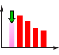
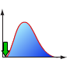

**星の数ほどある確率分布から、あなたの目的にピッタリの分布がきっと見つかる！**

（データの特徴から最適な分布を見つける⇒[確率分布の世界](/docs/gallery-of-distributions/)）

## 件数や人数など整数を対象にしている場合

<table>
  <tbody>
    <tr>
      <th>データ範囲</th>
      <th>分布名</th>
      <th>説明</th>
    </tr>
    <tr>
      <td rowspan="2">有限</td>
      <td>
        <a href="/ja/docs/gallery-of-distributions/bernoulli-distribution">
          ベルヌーイ
        </a>
      </td>
      <td>成功か失敗か。イチかバチかのモデル。コイントスが代表的な事例。</td>
    </tr>
    <tr>
      <td>
        <a href="/ja/docs/gallery-of-distributions/uniform-distribution-discrete">
          一様（離散）
        </a>
      </td>
      <td>
        「同様に確からしい」分布。
        <ul>
          <li>サイコロ，ルーレット</li>
          <li>無作為抽出</li>
          <li>並べ替え（ランダムシャッフル）</li>
        </ul>
        公正なコイン。コイントスをして表が出たら右に1歩、裏が出たら左に1歩…これが1次元ランダムウォークです。
         
        正４面体のサイコロ。各面には「右」「左」「前」「後ろ」と書いてある。サイコロを振って、出た面に従って1歩…これが2次元ランダムウォークです。
         
        正6面体のサイコロ。各面には「右」「左」「前」「後ろ」「上」「下」と書いてある。サイコロを振って、出た面に従って1歩…これが3次元ランダムウォークです。
      </td>
    </tr>
    <tr>
      <td>無限</td>
      <td>
        <a href="/ja/docs/gallery-of-distributions/poisson-distribution">
          ポアソン
        </a>
      </td>
      <td>
        たまにデタラメに発生する事故のようなものの分布。
        <ul>
          <li>1時間あたりの E-mail 数</li>
          <li>1年間あたりの 飛行機事故数</li>
          <li>国道1km当たりのレストラン数</li>
        </ul>
        「たまに」というのが大事。頻度が大きい場合には
        <a href="/ja/docs/gallery-of-distributions/normal-distribution-single">
          正規分布
        </a>
        で近似できる。
      </td>
    </tr>
  </tbody>
</table>

## 重さ、長さ、時間、収益率．．． 整数に限らずどんな値でもとる場合

<table>
  <tbody>
    <tr>
      <th>データ範囲</th>
      <th>分布名</th>
      <th>説明</th>
    </tr>
    <tr>
      <td rowspan="6">有限</td>
      <td>
        <a href="/ja/docs/gallery-of-distributions/beta-distribution">
          ベータ分布
        </a>
      </td>
      <td>
        分布形状の自由度がかなり高いので、様々な分布にフィットさせることが出来る。有限区間のデータで、素性がはっきりしなくて、正規分布ではうまくいかないようなものはこれを試してみると良い。
      </td>
    </tr>
    <tr>
      <td>
        <a href="/ja/docs/gallery-of-distributions/johnson-sb-distribution">
          ジョンソン SB
        </a>
      </td>
      <td>
        有限区間で、非対称な形状の分布として
        <a href="/ja/docs/gallery-of-distributions/beta-distribution">
          ベータ分布
        </a>
        と同様に素性不明のデータのフィットに使える。平均、標準偏差、歪度、尖度を自由に調整できる。
        林学での利用事例あり（森林の樹木の幹の直径の分布）
      </td>
    </tr>
    <tr>
      <td>
        <a href="/ja/docs/gallery-of-distributions/kumaraswamy-distribution">
          クマラスワミー
        </a>
      </td>
      <td>
        ベータ分布やジョンソン SB
        分布は手に負えない。かといって三角分布ではシンプルすぎる．．．これくらいがちょうどいいかも
      </td>
    </tr>
    <tr>
      <td>
        <a href="/ja/docs/gallery-of-distributions/triangular-distribution">
          三角
        </a>
      </td>
      <td>
        分布関数が簡単な数式なので扱いやすい。有限区間で、山が1つの分布で、左右非対称を実現する分布として、
        <a href="/ja/docs/gallery-of-distributions/beta-distribution">
          ベータ分布
        </a>
        や
        <a href="/ja/docs/gallery-of-distributions/johnson-sb-distribution">
          ジョンソン SB 分布
        </a>
        の代わりに使える。
      </td>
    </tr>
    <tr>
      <td>
        <a href="/ja/docs/gallery-of-distributions/uniform-distribution-continuous">
          一様
        </a>
      </td>
      <td>逆関数法で他の分布に従う乱数を生成する際に元になる乱数</td>
    </tr>
    <tr>
      <td>
        <a href="/ja/docs/gallery-of-distributions/u-quadratic-distribution">
          U字型2次
        </a>
      </td>
      <td>U字型の分布としては最もシンプルなもの。ベータ分布の替わりになる。</td>
    </tr>
    <tr>
      <td rowspan="9">半無限</td>
      <td>
        <a href="/ja/docs/gallery-of-distributions/exponential-distribution">
          指数
        </a>
      </td>
      <td>
        たまに起きる事故のようなものの「間隔」の分布。
        <ul>
          <li>事故が起きる間隔</li>
          <li>コンビニに客がやってくる間隔</li>
          <li>放射性崩壊の間隔</li>
        </ul>
        この分布にしたがって事故が発生すると、その頻度は
        <a href="/ja/docs/gallery-of-distributions/poisson-distribution">
          ポアソン分布
        </a>
        になる。
      </td>
    </tr>
    <tr>
      <td>
        <a href="/ja/docs/gallery-of-distributions/gumbel-type-ii-distribution">
          ガンベル（タイプ2）
        </a>
      </td>
      <td>極値理論</td>
    </tr>
    <tr>
      <td>
        <a href="/ja/docs/gallery-of-distributions/log-normal-distribution">
          対数正規
        </a>
      </td>
      <td>
        <ul>
          <li>年収の分布</li>
          <li>株価の対数収益率の分布</li>
        </ul>
        これらのデータの対数をとると正規分布になる。この場合元のデータは対数正規分布に従っている。
      </td>
    </tr>
    <tr>
      <td>
        <a href="/ja/docs/gallery-of-distributions/pareto-distribution">
          パレート
        </a>
      </td>
      <td>
        元々は収入の分布のモデルとして誕生した分布。ベキ分布といわれる分布群の1つ。今はさまざまな事象がベキ分布に従うということが分かってきて、その存在感を増している。
        <ul>
          <li>貯蓄額の分布</li>
          <li>分布の裾の形（極値理論）</li>
        </ul>
      </td>
    </tr>
    <tr>
      <td>
        <a href="/ja/docs/gallery-of-distributions/weibull-distribution">
          ワイブル
        </a>
      </td>
      <td>
        信頼性工学における故障率を表す代表的な分布。極値理論でも使われる。
      </td>
    </tr>
    <tr>
      <td>
        <a href="/ja/docs/gallery-of-distributions/chi-distribution">カイ</a>
      </td>
      <td>誰か教えて！</td>
    </tr>
    <tr>
      <td>
        <a href="/ja/docs/gallery-of-distributions/chi-square-distribution">
          カイ2乗
        </a>
      </td>
      <td>カイ2乗検定</td>
    </tr>
    <tr>
      <td>
        <a href="/ja/docs/gallery-of-distributions/gamma-distribution">
          ガンマ
        </a>
      </td>
      <td>降水量分布。保険クレーム額分布。</td>
    </tr>
    <tr>
      <td>
        <a href="/ja/docs/gallery-of-distributions/f-distribution">F</a>
      </td>
      <td>F 検定</td>
    </tr>
    <tr>
      <td rowspan="8">無限</td>
      <td>
        <a href="/ja/docs/gallery-of-distributions/cauchy-distribution">
          コーシー
        </a>
      </td>
      <td>
        正規分布と同じ、無限区間で山が1つの分布。しかし、正規分布では到底説明できないくらいに外れ値の多い分布として利用される。
      </td>
    </tr>
    <tr>
      <td>
        <a href="/ja/docs/gallery-of-distributions/gumbel-type-i-distribution">
          ガンベル（タイプ1）
        </a>
      </td>
      <td>極値理論</td>
    </tr>
    <tr>
      <td>
        <a href="/ja/docs/gallery-of-distributions/johnson-su-distribution">
          ジョンソン SU
        </a>
      </td>
      <td>
        正規分布より裾が厚く、歪度や尖度も調整可能なため、VaR
        の計算などでこの分布を正規分布の代わりに使うことが注目されている。
      </td>
    </tr>
    <tr>
      <td>
        <a href="/ja/docs/gallery-of-distributions/laplace-distribution">
          ラプラス
        </a>
      </td>
      <td>誰か教えて！</td>
    </tr>
    <tr>
      <td>
        <a href="/ja/docs/gallery-of-distributions/logistic-distribution">
          ロジスティック
        </a>
      </td>
      <td>
        正規分布に良く似ているが、裾が少し厚い。正規分布より式が簡単で扱いやすいので正規分布の代わりに使われることがある。
        また、この分布の
        <a href="/ja/docs/glossary#cumulative-distribution-function">
          累積分布関数
        </a>
        は「ロジスティック曲線」と呼ばれ、様々な分野で応用されいる。
        <ul>
          <li>伝染病の広がり方</li>
          <li>新製品の売れ方</li>
          <li>人口増加モデル</li>
          <li>習熟度</li>
        </ul>
      </td>
    </tr>
    <tr>
      <td>
        <a href="/ja/docs/gallery-of-distributions/normal-distribution-single">
          正規（単変量）
        </a>
      </td>
      <td>どこにでも顔を出す基本的な分布。これを知らないと何もできない。</td>
    </tr>
    <tr>
      <td>
        <a href="/ja/docs/gallery-of-distributions/normal-distribution-multi">
          正規（多変量）
        </a>
      </td>
      <td>
        モンテカルロシミュレーションによるポートフォリオの VaR の算出に使用。
      </td>
    </tr>
    <tr>
      <td>
        <a href="/ja/docs/gallery-of-distributions/t-distribution">t</a>
      </td>
      <td>t 検定</td>
    </tr>
  </tbody>
</table>
