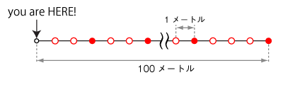

import DataGridMdx from "@site/src/components/DataGridMdx";

# 指数分布(Exponential distribtuion)

## 雑踏の中を歩く指数分布

都会の雑踏を歩いていると、1メートル進んでは人にぶつかり、3メートル進んでは人にぶつかり、となかなかスムーズに歩けないですよね（え、私だけ？）。\
直感的に考えて

- 長い距離ぶつからずに歩ける確率は少ない
- 人がたくさんいると短い距離歩くだけでぶつかる

というのは理解できると思います。では、人とぶつかるタイミングはどういった分布に従うのでしょうか？

まず、雑踏をそのままモデル化するのは難しそうです。そこで簡単なモデルを考えることにします。\
歩いている人間は複雑すぎるので、1本道上で人はみんな止まっていると仮定します。ある人の場所から歩いて、次の人までぶつからずに歩く。 このモデルで人と人との間隔の分布を調べてみましょう。\
このモデルでもいきなり一般的な話をすると難しいから、更に簡単な状況からスタートすることにしますね。

さて、100メートルの道があります。自分の今いる場所から1メートル先の地点、そこから100個のベンチが1メートル間隔で並んでいます。そこに20人の人が座ることとします。ただし以下の条件の制約があります。

- 1つのベンチには1人しか座れない。
- 座り心地の良いベンチがあるとか、日陰と日なたにあるベンチがあるとか、嫌いな奴から離れて座りたいとか、どこかのベンチにモデル級の美女が座っていて、その周辺に何人か集まって座るとか、そういったことはありません。つまりどのベンチに座るかは「**同様に確からしい**」のです。

図の赤丸が人がいるベンチ、白抜きの丸が空のベンチです。

以上から、どのベンチでも人がいる確率は同様に確からしく $\frac{20}{100}=0.2$ となります。

では勇気を持って歩き出してください。

- 隣のベンチに人はいなかった
- その隣のベンチにも人はいなかった
- その隣のベンチには人がいた

この状況、つまり2メートル人と出会わなかった確率を求めてみましょう。\
先ず隣のベンチに人がいない確率は

$$
1-0.2
$$

となります（ベンチに人がいる確率は$0.2$であることを思いだして）。 その隣にも人がいないので、ここまでの確率は

$$
(1-0.2)^2
$$

となります。そして次に人が出現。結局2メートル人と出会わない確率は

$$
(1-0.2)^2\times0.2
$$

です。\
ここまで来れば、あるベンチから右側に$x$個分のベンチに人がいなくて、その次に人がいる（つまり$x$メートル人と出会わない）確率は、

$$
(1-0.2)^x\times0.2
$$

であることが分かります。\
では次ステップに移りましょう。ベンチの数を倍にして50センチ間隔に配置してみます。ベンチの数は倍の200個、人の数は変わらず20人になるので、ベンチに人がいる確率は 0.1 となりますね。\
こで$2x$個のベンチを挟んで、次のベンチに人がいる（つまり$x$メートル人と出会わない）確率は、

$$
(1-0.1)^{2x}\times0.1
$$

となります。\
さらにベンチの間隔を半分にします。ベンチが400個、人は20人。$4x$個のベンチを挟んで、次に人がいる（つまり$x$メートル人と出会わない）確率は、

$$
(1-0.05)^{4x}\times0.05
$$

となります。\
ここまでの様子を図に示してみます（$x=2$の場合）。\
\
もうここまでくれば、一般化は簡単ですね。

ベンチの間隔を$\delta$としましょう。\
$x$メートル人と会わない確率は、

$$
\left(1-\delta\frac{n}{N}\right)^{x/\delta}\times\delta\frac{n}{N}
$$

となります（ちなみにこの分布は**幾何分布**と呼ばれます）。一方で隣の人までの距離が$x$メートル以下である確率を $F(x)$ と書くと、隣の人ととの距離が $x$ より離れていて $(x+\delta)$ メートル以下である確率が

$$
F(x+\delta)-F(x)
$$

であることは分かるでしょうか？\
結局、

$$
F(x+\delta)-F(x)=\left(1-\delta\frac{n}{N}\right)^{x/\delta}\times\delta\frac{n}{N}
$$

が得られることとなります。

ここからは微分・積分の知識が必要なんですね。両辺を$\delta$で割って、

$$
\frac{F(x+\delta)-F(x)}{\delta}=\left(1-\delta\frac{n}{N}\right)^{x/\delta}\times\frac{n}{N}
$$

$\delta\to 0$ の極限（つまりバラバラのベンチではなく、100メートルの長いすに自由に座る）を考えると、

$$
f(x)=\frac{1}{\beta}\exp\left(-\frac{x}{\beta}\right)
$$

これが**指数分布**の[確率密度分布](/docs/glossary#probability-density-function)なんです！ ここで

$$
\beta=\frac{N}{n}
$$

としましたが、これは平均間隔です。

平均して$\beta$メートルに1回ぶつかるとすると（イタイ）、$x$メートル歩くまでにぶつかる確率が上式$F(x)$となります。 ではこの状況下で、1メートルで平均何回人とぶつかるでしょう？答えは、パラメータ$\nu=1/\beta$とした**[ポアソン分布](poisson-distribution.mdx)**になるのです！（覚えてましたか？）

## 分布の形状

### 基本情報

- パラメータ $\beta$ が必要です。

  $$
  \beta>0
  $$

  このパラメータは分布の[平均](/docs/glossary#central-moment)です。

- 半無限区間 $x \geq 0$ で定義された連続分布です。
- [平均](/docs/glossary#central-moment)対して常に非対称です。

### 確率

- [累積分布関数](/docs/glossary#cumulative-distribution-function)

  $$
  F(x)=1-\exp\left(-\frac{x}{\beta}\right)
  $$

- [確率密度関数](/docs/glossary#probability-density-function)

  $$
  f(x)=\frac{1}{\beta}\exp\left(-\frac{x}{\beta}\right)
  $$

- Excel での[累積分布関数 (c.d.f.)](/docs/glossary#cumulative-distribution-function) と [確率密度関数 (p.d.f.)](/docs/glossary#probability-density-function)の求め方

<DataGridMdx
  data={{
    cells: [
      [
        { value: "データ", readOnly: true, className: "orange-cell" },
        { value: "説明", readOnly: true, className: "orange-cell" },
      ],
      [
        { value: "0.5", readOnly: true },
        { value: "対象となる値", readOnly: true },
      ],
      [
        { value: "8", readOnly: true },
        { value: "分布のパラメータ Beta の値", readOnly: true },
      ],
      [
        { value: "数式", readOnly: true, className: "orange-cell" },
        { value: "説明（計算結果）", readOnly: true, className: "orange-cell" },
      ],
      [
        { value: "=1-EXP(-A2/A3)", readOnly: true },
        { value: "上のデータに対する累積分布関数の値", readOnly: true },
      ],
      [
        { value: "=EXP(-A2/A3)/A3", readOnly: true },
        { value: "上のデータに対する確率密度関数の値", readOnly: true },
      ],
    ],
  }}
/>

### 分位点

- [累積分布関数](/docs/glossary#cumulative-distribution-function)の逆関数

  $$
  F^{-1}(P)=-\beta\ln(1-P)
  $$

- Excel での[分位点](/docs/glossary#quantile)の求め方

<DataGridMdx
  data={{
    cells: [
      [
        { value: "データ", readOnly: true, className: "orange-cell" },
        { value: "説明", readOnly: true, className: "orange-cell" },
      ],
      [
        { value: "0.5", readOnly: true },
        { value: "この分布の確率", readOnly: true },
      ],
      [
        { value: "1.7", readOnly: true },
        { value: "分布のパラメータ Beta の値", readOnly: true },
      ],
      [
        { value: "数式", readOnly: true, className: "orange-cell" },
        { value: "説明（計算結果）", readOnly: true, className: "orange-cell" },
      ],
      [
        { value: "=-A3*LN(1-A2)", readOnly: true },
        { value: "上のデータに対する累積分布関数の逆関数の値", readOnly: true },
      ],
    ],
  }}
/>

## 分布の特徴

### 平均 -- 分布の"中心"はどこ？ ([定義](/docs/glossary#central-moment))

- 分布の[平均](/docs/glossary#central-moment)は $\beta$ と与えられます。

### 標準偏差 -- 分布はどのくらい広がっているか（[定義](/docs/glossary#standard-deviation)）

- 分布の[標準偏差](/docs/glossary#standard-deviation)は $\beta$ と与えられます。

### 歪度 -- 分布はどちらに偏っているか([定義](/docs/glossary#skewness))

- 分布の[歪度](/docs/glossary#skewness)は $2$ です。

### 尖度 -- 尖っているか丸まっているか ([定義](/docs/glossary#kurtosis))

- 分布の[尖度](/docs/glossary#kurtosis)は $6$ です。

## 乱数

- 乱数 x は一様乱数 U に対して次式で生成されます（逆関数法） :

  $$
  x=-\beta\ln(1-U)
  $$

- Excel での乱数生成法

<DataGridMdx
  data={{
    cells: [
      [
        { value: "データ", readOnly: true, className: "orange-cell" },
        { value: "説明", readOnly: true, className: "orange-cell" },
      ],
      [
        { value: "0.5", readOnly: true },
        { value: "分布のパラメータ Beta の値", readOnly: true },
      ],
      [
        { value: "数式", readOnly: true, className: "orange-cell" },
        { value: "説明（計算結果）", readOnly: true, className: "orange-cell" },
      ],
      [
        { value: "=-A2*LN(1-NTRAND(100))", readOnly: true },
        {
          value:
            "100個の指数乱数を Mersenne Twister アルゴリズムで生成します。",
          readOnly: true,
        },
      ],
    ],
  }}
/>

メモ： この使用例の数式は、配列数式として入力する必要があります。使用例を新規ワークシートにコピーした後、A4:A103 のセル範囲 (配列数式が入力されているセルが左上になる) を選択します。F2 キーを押し、Ctrl キーと Shift キーを押しながら Enter キーを押します。この数式が配列数式として入力されていない場合、単一の値 2 のみが計算結果として返されます。

## 参照

- [Wolfram Mathworld -- Exponential distribution](http://mathworld.wolfram.com/ExponentialDistribution.html)
- [Wikipedia -- Exponential distribution](http://en.wikipedia.org/wiki/Exponential_distribution)
- [Statistics Online Computational Resource](http://www.socr.ucla.edu/htmls/SOCR_Distributions.html)
