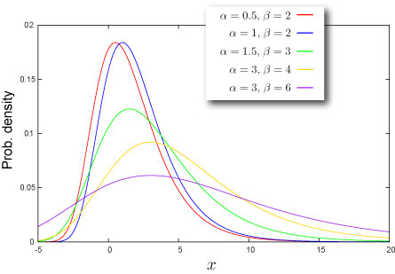

import DataGridMdx from "@site/src/components/DataGridMdx";

# ガンベル（タイプ1）分布(Gumbel type I distribution)

## 分布の形状

### 基本情報

- 2つのパラメータ $\alpha, \beta$ が必要です ([どうやって求めるの？](../03-function-reference/02-distribution-functions/044-ntgumbelparam.mdx)).

  $$
  \beta>0
  $$

- 無限区間 $(-\infty,+\infty)$ で定義された連続分布です。
- [平均](/docs/glossary#central-moment)対して常に非対称です。

### 確率

- [累積分布関数](/docs/glossary#cumulative-distribution-function)

  $$
  F(x)=\exp\left[-\exp\left(-\frac{x-\alpha}{\beta}\right)\right]
  $$

- [確率密度関数](/docs/glossary#probability-density-function)

  $$
  f(x)=\frac{1}{\beta}\exp\left(-\frac{x-\alpha}{\beta}\right)\exp\left[-\exp\left(-\frac{x-\alpha}{\beta}\right)\right]
  $$

- Excel での[累積分布関数 (c.d.f.)](/docs/glossary#cumulative-distribution-function) と [確率密度関数 (p.d.f.)](/docs/glossary#probability-density-function)の求め方

<DataGridMdx
  data={{
    cells: [
      [
        { value: "データ", readOnly: true, className: "orange-cell" },
        { value: "説明", readOnly: true, className: "orange-cell" },
      ],
      [
        { value: "0.5", readOnly: true },
        { value: "対象となる値", readOnly: true },
      ],
      [
        { value: "8", readOnly: true },
        { value: "分布のパラメータ Alpha の値", readOnly: true },
      ],
      [
        { value: "2", readOnly: true },
        { value: "分布のパラメータ Beta の値", readOnly: true },
      ],
      [
        { value: "数式", readOnly: true, className: "orange-cell" },
        { value: "説明（計算結果）", readOnly: true, className: "orange-cell" },
      ],
      [
        { value: "=NTGUMBELDIST(A2,A3,A4,TRUE)", readOnly: true },
        { value: "上のデータに対する累積分布関数の値", readOnly: true },
      ],
      [
        { value: "=NTGUMBELDIST(A2,A3,A4,FALSE)", readOnly: true },
        { value: "上のデータに対する確率密度関数の値", readOnly: true },
      ],
    ],
  }}
/>

- 関連 NtRand 関数 : [NTGUMBELDIST](../03-function-reference/02-distribution-functions/039-ntgumbeldist.mdx)

### 分位点

- [累積確率関数](/docs/glossary#cumulative-distribution-function)の逆関数

  $$
  F^{-1}(P)=\alpha-\beta\ln\ln\frac{1}{P}
  $$

- Excel での[分位点](/docs/glossary#quantile)の求め方

<DataGridMdx
  data={{
    cells: [
      [
        { value: "データ", readOnly: true, className: "orange-cell" },
        { value: "説明", readOnly: true, className: "orange-cell" },
      ],
      [
        { value: "0.7", readOnly: true },
        { value: "この分布の確率", readOnly: true },
      ],
      [
        { value: "1.7", readOnly: true },
        { value: "分布のパラメータ Alpha の値", readOnly: true },
      ],
      [
        { value: "0.9", readOnly: true },
        { value: "分布のパラメータ Beta の値", readOnly: true },
      ],
      [
        { value: "数式", readOnly: true, className: "orange-cell" },
        { value: "説明（計算結果）", readOnly: true, className: "orange-cell" },
      ],
      [
        { value: "=GUMBELINV(A2,A3,A4)", readOnly: true },
        { value: "上のデータに対する累積分布関数の逆関数の値", readOnly: true },
      ],
    ],
  }}
/>

- 関連 NtRand 関数 : [NTGUMBELINV](../03-function-reference/02-distribution-functions/040-ntgumbelinv.mdx)

## 分布の特徴

### 平均 -- 分布の"中心"はどこ？ ([定義](/docs/glossary#central-moment))

- 分布の[平均](/docs/glossary#central-moment) は次式で与えられます。

  $$
  \alpha+\gamma \beta
  $$

  ここで $\gamma$ は [オイラーの定数](/docs/glossary#eulers-constant)です。

- Excel での計算法

<DataGridMdx
  data={{
    cells: [
      [
        { value: "データ", readOnly: true, className: "orange-cell" },
        { value: "説明", readOnly: true, className: "orange-cell" },
      ],
      [
        { value: "8", readOnly: true },
        { value: "分布のパラメータ Alpha の値", readOnly: true },
      ],
      [
        { value: "2", readOnly: true },
        { value: "分布のパラメータ Beta の値", readOnly: true },
      ],
      [
        { value: "数式", readOnly: true, className: "orange-cell" },
        { value: "説明（計算結果）", readOnly: true, className: "orange-cell" },
      ],
      [
        { value: "=NTGUMBELMEAN(A2,A3)", readOnly: true },
        { value: "上のデータに対する分布の平均", readOnly: true },
      ],
    ],
  }}
/>

- 関連 NtRand 関数 : [NTGUMBELMEAN](../03-function-reference/02-distribution-functions/042-ntgumbelmean.mdx)

### 標準偏差 -- 分布はどのくらい広がっているか（[定義](/docs/glossary#standard-deviation)）

- 分布の[分散](/docs/glossary#variance) は次式で与えられます。

  $$
  \beta^2\zeta(2)
  $$

  ここで $\zeta(\cdot)$ は[リーマンのゼータ関数](/docs/glossary#riemann-zeta-function)です。

  [標準偏差](/docs/glossary#standard-deviation) は [分散](/docs/glossary#variance)の正の平方根です。

- Excel での計算法

<DataGridMdx
  data={{
    cells: [
      [
        { value: "データ", readOnly: true, className: "orange-cell" },
        { value: "説明", readOnly: true, className: "orange-cell" },
      ],
      [
        { value: "2", readOnly: true },
        { value: "分布のパラメータ B の値", readOnly: true },
      ],
      [
        { value: "数式", readOnly: true, className: "orange-cell" },
        { value: "説明（計算結果）", readOnly: true, className: "orange-cell" },
      ],
      [
        { value: "=NTGUMBELSTDEV(A2)", readOnly: true },
        { value: "上のデータに対する分布の標準偏差", readOnly: true },
      ],
    ],
  }}
/>

- 関連 NtRand 関数 : [NTGUMBELSTDEV](../03-function-reference/02-distribution-functions/046-ntgumbelstdev.mdx)

### 歪度 -- 分布はどちらに偏っているか([定義](/docs/glossary#skewness))

- 分布の[歪度](/docs/glossary#skewness) は次式で与えられます。

  $$
  -\frac{12\sqrt{6}\zeta(3)}{\pi^3}=-1.139547099\cdots
  $$

  ここで $\zeta(\cdot)$ は [リーマンのゼータ関数](/docs/glossary#riemann-zeta-function)です。

### 尖度 -- 尖っているか丸まっているか ([定義](/docs/glossary#kurtosis))

- 分布の[尖度](/docs/glossary#kurtosis)は $2.4$ です。

## 乱数

- 乱数 x は一様乱数 U に対して次式で生成されます（逆関数法） :

  $$
  x=\alpha-\beta\ln\ln\frac{1}{U}
  $$

- Excel での乱数生成法

<DataGridMdx
  data={{
    cells: [
      [
        { value: "データ", readOnly: true, className: "orange-cell" },
        { value: "説明", readOnly: true, className: "orange-cell" },
      ],
      [
        { value: "0.5", readOnly: true },
        { value: "分布のパラメータ Alpha の値", readOnly: true },
      ],
      [
        { value: "0.5", readOnly: true },
        { value: "分布のパラメータ Beta の値", readOnly: true },
      ],
      [
        { value: "数式", readOnly: true, className: "orange-cell" },
        { value: "説明（計算結果）", readOnly: true, className: "orange-cell" },
      ],
      [
        { value: "=NTRANDGUMBEL(100,A2,A3,0)", readOnly: true },
        {
          value:
            "100個のガンベル（タイプ1）乱数を Mersenne Twister アルゴリズムで生成します。",
          readOnly: true,
        },
      ],
    ],
  }}
/>

メモ： この使用例の数式は、配列数式として入力する必要があります。使用例を新規ワークシートにコピーした後、A5:A104 のセル範囲 (配列数式が入力されているセルが左上になる) を選択します。F2 キーを押し、Ctrl キーと Shift キーを押しながら Enter キーを押します。この数式が配列数式として入力されていない場合、単一の値 2 のみが計算結果として返されます。

## 関連 NtRand 関数

- 既に分布のパラメータをお持ちの場合
  - Mersenne Twiseter 法による乱数生成 : [NTRANDGUMBEL](../03-function-reference/01-random-numbers/01-single-series/07-ntrandgumbel.mdx)
  - 確率計算 : [NTGUMBELDIST](../03-function-reference/02-distribution-functions/039-ntgumbeldist.mdx)
  - 平均計算 : [NTGUMBELMEAN](../03-function-reference/02-distribution-functions/042-ntgumbelmean.mdx)
  - 標準偏差計算 : [NTGUMBELSTDEV](../03-function-reference/02-distribution-functions/045-ntgumbelskew.mdx)
  - 歪度計算 : [NTGUMBELSKEW](../03-function-reference/02-distribution-functions/045-ntgumbelskew.mdx)
  - 尖度計算 : [NTGUMBELKURT](../03-function-reference/02-distribution-functions/041-ntgumbelkurt.mdx)
  - 上記の各モーメントを一度に計算 : [NTGUMBELMOM](../03-function-reference/02-distribution-functions/043-ntgumbelmom.mdx)
- 分布の平均と標準偏差をお持ちの場合
  - 分布のパラメータ推定 : [NTGUMBELRPARAM](../03-function-reference/02-distribution-functions/044-ntgumbelparam.mdx)

## 参照

- [Wolfram Mathworld -- Gumbel Distribution](http://mathworld.wolfram.com/GumbelDistribution.html)
- [Wikipedia -- Gumbel distribution](http://en.wikipedia.org/wiki/Gumbel_distribution)
- [Statistics Online Computational Resource](http://www.socr.ucla.edu/htmls/SOCR_Distributions.html)
- Extreme value therory (EVT)
- [Risk management -- Operational risk](http://en.wikipedia.org/wiki/Operational_risk)
