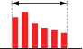
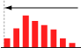
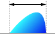
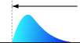
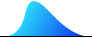

# 確率分布の世界

### 確率分布の世界へようこそ！

二の足を踏んでないで興味のあるところをのぞいてみてください！興味ない？いやいや、以外に面白い事実があるんですよ...例えば[正規分布](https://www.ntrand.com/jp/normal-distribution-single/ "正規分布")とか。\
将来的に**コツコツ**増やしていく予定です、実は。

## 単変量

### 件数や人数など整数を対象にしている場

| 範囲     | 分布名                                                                                                                                               |
| -------- | ---------------------------------------------------------------------------------------------------------------------------------------------------- |
| **有限** |   [ベルヌーイ](bernoulli-distribution.mdx)  [一様（離散）](uniform-distribution-discrete.mdx) |
| **無限** |   [ポアソン](poisson-distribution.mdx)                                                           |

### 重さ、高さ、時間、収益率．．．整数に限らずどんな値でもとる場合

- [単峰型](https://www.ntrand.com/jp/glossary/#local_Unimodal)...

| 範囲       | 左右対称                                                                                                                                                                                                                                                                       | 任意                                                                                                                                                                                                                                                                                      | 左右非対称                                                                                                                                                                                                                                                                                                                                                         |
| ---------- | ------------------------------------------------------------------------------------------------------------------------------------------------------------------------------------------------------------------------------------------------------------------------------ | ----------------------------------------------------------------------------------------------------------------------------------------------------------------------------------------------------------------------------------------------------------------------------------------- | ------------------------------------------------------------------------------------------------------------------------------------------------------------------------------------------------------------------------------------------------------------------------------------------------------------------------------------------------------------------ |
| **有限**   | 未対応                                                                                                                                                                                                                                                                         |   [ジョンソン SB](johnson-sb-distribution.mdx)  [クマラスワミー](kumaraswamy-distribution.mdx)  [三角](triangular-distribution.mdx)  [ベータ](beta-distribution.mdx)  [切断正規](truncated-normal-distribution.mdx) | 未対応                                                                                                                                                                                                                                                                                                                                                             |
| **半無限** | 未対応                                                                                                                                                                                                                                                                         | 未対応                                                                                                                                                                                                                                                                                    |   [ガンベル（タイプ2）](gumbel-type-ii-distribution.mdx)  [対数正規](log-normal-distribution.mdx)  [ワイブル](weibull-distribution.mdx)  [カイ](chi-distribution.mdx)  [カイ2乗](chi-square-distribution.mdx)  [ガンマ](gamma-distribution.mdx)  [F](f-distribution.mdx) |
| **無限**   |   [ラプラス](laplace-distribution.mdx)  [コーシー](cauchy-distribution.mdx)  [正規（単変量）](normal-distribution-single.mdx)  [ロジスティック](logistic-distribution.mdx)  [t](t-distribution.mdx) |   [ジョンソン SU](johnson-su-distribution.mdx)                                                                                                                                                                                        |   [ガンベル（タイプ1）](gumbel-type-i-distribution.mdx)                                                                                                                                                                                                                                                    |

- 単調減少・単調増加型...
  - [切断正規](truncated-normal-distribution.mdx)
  - [ベータ](beta-distribution.mdx)
  - [ワイブル](weibull-distribution.mdx)
  - [カイ](chi-distribution.mdx)
  - [カイ2乗](chi-square-distribution.mdx)
  - [ガンマ](gamma-distribution.mdx)
  - [F](f-distribution.mdx)
  - [ジョンソン SB](johnson-sb-distribution.mdx)
  - [パレート](pareto-distribution.mdx)
  - [指数](exponential-distribution.mdx)
- U字型...
  - [ベータ](beta-distribution.mdx)
  - [U字型2次](u-quadratic-distribution.mdx)
- Rectangle...
  - [一様（連続）](uniform-distribution-continuous.mdx)

## Multi variable

- [正規分布（多変量）](normal-distribution-multi.mdx)
