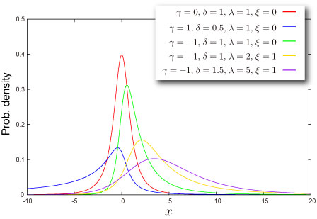

import DataGridMdx from "@site/src/components/DataGridMdx";

# ジョンソン SU 分布(Johnson SU distribution)

## 正規分布の進化形ジョンソン SU 分布

最近、正規分布によるモデルに限界を感じていませんか？\
政治、経済、自然...。変化の著しい今の世の中をモデル化するには、正規分布には荷が重すぎます。それは**完全な左右対称性**と**裾の薄さ**という最大の弱点があるからなのです。\
ジョンソン SU 分布はこれらの欠陥をカバーする分布として最近注目を浴びてきています。\
この分布は[歪度](/docs/glossary#skewness)（分布の非対称性）と[尖度](/docs/glossary#kurtosis)（裾の厚さ）を適当に与えることで分布の形状をかなり自由に操作できるという特徴をもっているのです。

## 分布の形状

### 基本情報

- 4つのパラメータ $\gamma, \delta,\lambda,\xi$ が必要です ([どうやって求めるの？](../03-function-reference/02-distribution-functions/052-ntjohnsonsuparam.mdx)).

  $$
  \delta>0,\lambda>0
  $$

- 無限区間 $(-\infty,+\infty)$ で定義された連続分布.
- [平均](/docs/glossary#central-moment)対して対称にも非対称にもなり得ます。

### 確率

- [累積分布関数](/docs/glossary#cumulative-distribution-function)

  $$
  F(x)=\Phi\left(\gamma+\delta\sinh^{-1}z\right)
  $$

  ここで

  $$
  z=\frac{x-\xi}{\lambda}
  $$

  で、$\Phi(\cdot)$ は標準席分布の[累積分布関数](/docs/glossary#cumulative-distribution-function)です。

- [確率密度関数](/docs/glossary#probability-density-function)

  $$
  f(x)=\frac{\delta}{\lambda\sqrt{2\pi}\sqrt{z^2+1}}\exp\left[-\frac{1}{2}\left(\gamma+\delta\sinh^{-1}z\right)^2\right]
  $$

- Excel での[累積分布関数 (c.d.f.)](/docs/glossary#cumulative-distribution-function) と [確率密度関数 (p.d.f.)](/docs/glossary#probability-density-function)の求め方

<DataGridMdx
  data={{
    cells: [
      [
        { value: "データ", readOnly: true, className: "orange-cell" },
        { value: "説明", readOnly: true, className: "orange-cell" },
      ],
      [
        { value: "2.5", readOnly: true },
        { value: "対象となる値", readOnly: true },
      ],
      [
        { value: "1", readOnly: true },
        { value: "分布のパラメータ Gamma の値", readOnly: true },
      ],
      [
        { value: "4", readOnly: true },
        { value: "分布のパラメータ Delta の値", readOnly: true },
      ],
      [
        { value: "3", readOnly: true },
        { value: "分布のパラメータ Lambda の値", readOnly: true },
      ],
      [
        { value: "0.9", readOnly: true },
        { value: "分布のパラメータ Xi の値", readOnly: true },
      ],
      [
        { value: "数式", readOnly: true, className: "orange-cell" },
        { value: "説明（計算結果）", readOnly: true, className: "orange-cell" },
      ],
      [
        { value: "=NTJOHNSONSUDIST(A2,A3,A4,A5,A6,TRUE)", readOnly: true },
        { value: "上のデータに対する累積分布関数の値", readOnly: true },
      ],
      [
        { value: "=NTJOHNSONSUDIST(A2,A3,A4,A5,A6,FALSE)", readOnly: true },
        { value: "上のデータに対する確率密度関数の値", readOnly: true },
      ],
    ],
  }}
/>

- 関連 NtRand 関数 : [NTJOHNSONSUDIST](../03-function-reference/02-distribution-functions/047-ntjohnsonsudist.mdx)

### 分位点

- [累積分布関数](/docs/glossary#cumulative-distribution-function)の逆関数

  $$
  F^{-1}(P)=\lambda\sinh\left(\frac{\Phi^{-1}(P)-\gamma}{\delta}\right)+\xi
  $$

  ここで $\Phi(\cdot)$ は 標準正規分布の[累積分布関数](/docs/glossary#cumulative-distribution-function)です。.

- Excel での[分位点](/docs/glossary#quantile)の求め方

<DataGridMdx
  data={{
    cells: [
      [
        { value: "データ", readOnly: true, className: "orange-cell" },
        { value: "説明", readOnly: true, className: "orange-cell" },
      ],
      [
        { value: "0.5", readOnly: true },
        { value: "対象となる値", readOnly: true },
      ],
      [
        { value: "1", readOnly: true },
        { value: "分布のパラメータ Gamma の値", readOnly: true },
      ],
      [
        { value: "4", readOnly: true },
        { value: "分布のパラメータ Delta の値", readOnly: true },
      ],
      [
        { value: "3", readOnly: true },
        { value: "分布のパラメータ Lambda の値", readOnly: true },
      ],
      [
        { value: "0.9", readOnly: true },
        { value: "分布のパラメータ Xi の値", readOnly: true },
      ],
      [
        { value: "数式", readOnly: true, className: "orange-cell" },
        { value: "説明（計算結果）", readOnly: true, className: "orange-cell" },
      ],
      [
        { value: "=NTJOHNSONSUINV(A2,A3,A4,A5,A6)", readOnly: true },
        { value: "上のデータに対する累積分布関数の逆関数の値", readOnly: true },
      ],
    ],
  }}
/>

- 関連 NtRand 関数 : [NTJOHNSONSUINV](../03-function-reference/02-distribution-functions/048-ntjohnsonsuinv.mdx)

## 分布の特徴

### 平均 -- 分布の"中心"はどこ？ ([定義](/docs/glossary#central-moment))

- 分布の[平均](/docs/glossary#central-moment) は次式で与えられます。

  $$
  \xi-\lambda\omega^{1/2}\sinh\Omega
  $$

  ここで

  $$
  \omega=\exp\left(\delta^{-2}\right),\Omega=\gamma/\delta
  $$

  です。

- Excel での計算法

<DataGridMdx
  data={{
    cells: [
      [
        { value: "データ", readOnly: true, className: "orange-cell" },
        { value: "説明", readOnly: true, className: "orange-cell" },
      ],
      [
        { value: "1", readOnly: true },
        { value: "分布のパラメータ Gamma の値", readOnly: true },
      ],
      [
        { value: "4", readOnly: true },
        { value: "分布のパラメータ Delta の値", readOnly: true },
      ],
      [
        { value: "3", readOnly: true },
        { value: "分布のパラメータ Lambda の値", readOnly: true },
      ],
      [
        { value: "0.9", readOnly: true },
        { value: "分布のパラメータ Xi の値", readOnly: true },
      ],
      [
        { value: "数式", readOnly: true, className: "orange-cell" },
        { value: "説明（計算結果）", readOnly: true, className: "orange-cell" },
      ],
      [
        { value: "=NTJOHNSONSUMEAN(A2,A3,A4,A5)", readOnly: true },
        { value: "上のデータに対す分布の平均", readOnly: true },
      ],
    ],
  }}
/>

- 関連 NtRand 関数 : [NTJOHNSONSUMEAN](../03-function-reference/02-distribution-functions/050-ntjohnsonsumean.mdx)

### 標準偏差 -- 分布はどのくらい広がっているか（[定義](/docs/glossary#standard-deviation)）

- 分布の[分散](/docs/glossary#variance) は次式で与えられます。

  $$
  \frac{\lambda^2}{2}(\omega-1)(\omega\cosh 2\Omega+1)
  $$

  ここで

  $$
  \omega=\exp\left(\delta^{-2}\right),\Omega=\gamma/\delta
  $$

  です。

  [標準偏差](/docs/glossary#standard-deviation) は [分散](/docs/glossary#variance)の正の平方根です。

- Excel での計算法

<DataGridMdx
  data={{
    cells: [
      [
        { value: "データ", readOnly: true, className: "orange-cell" },
        { value: "説明", readOnly: true, className: "orange-cell" },
      ],
      [
        { value: "1", readOnly: true },
        { value: "分布のパラメータ Gamma の値", readOnly: true },
      ],
      [
        { value: "4", readOnly: true },
        { value: "分布のパラメータ Delta の値", readOnly: true },
      ],
      [
        { value: "3", readOnly: true },
        { value: "分布のパラメータ Lambda の値", readOnly: true },
      ],
      [
        { value: "0.9", readOnly: true },
        { value: "分布のパラメータ Xi の値", readOnly: true },
      ],
      [
        { value: "数式", readOnly: true, className: "orange-cell" },
        { value: "説明（計算結果）", readOnly: true, className: "orange-cell" },
      ],
      [
        { value: "=NTJOHNSONSUSTDEV(A2,A3,A4,A5)", readOnly: true },
        { value: "上のデータに対する分布の標準偏差", readOnly: true },
      ],
    ],
  }}
/>

- 関連 NtRand 関数 : [NTJOHNSONSUSTDEV](../03-function-reference/02-distribution-functions/054-ntjohnsonsustdev.mdx)

### 歪度 -- 分布はどちらに偏っているか([定義](/docs/glossary#skewness))

- 分布の[歪度](/docs/glossary#skewness) は次式の平方根で与えられます。

  $$
  \beta_1=\omega(\omega-1)\frac{[\omega(\omega+2)\sinh 3\Omega+3\sinh\Omega]^2}{2(\omega\cosh 2\Omega+1)^3}
  $$

  ここで

  $$
  \omega=\exp\left(\delta^{-2}\right),\Omega=\frac{\gamma}{\delta}
  $$

  です。歪度の符号は、$\Omega$の符号の逆です。

- Excel での計算法

<DataGridMdx
  data={{
    cells: [
      [
        { value: "データ", readOnly: true, className: "orange-cell" },
        { value: "説明", readOnly: true, className: "orange-cell" },
      ],
      [
        { value: "1", readOnly: true },
        { value: "分布のパラメータ Gamma の値", readOnly: true },
      ],
      [
        { value: "4", readOnly: true },
        { value: "分布のパラメータ Delta の値", readOnly: true },
      ],
      [
        { value: "3", readOnly: true },
        { value: "分布のパラメータ Lambda の値", readOnly: true },
      ],
      [
        { value: "0.9", readOnly: true },
        { value: "分布のパラメータ Xi の値", readOnly: true },
      ],
      [
        { value: "数式", readOnly: true, className: "orange-cell" },
        { value: "説明（計算結果）", readOnly: true, className: "orange-cell" },
      ],
      [
        { value: "=NTJOHNSONSUSKEW(A2,A3,A4,A5)", readOnly: true },
        { value: "上のデータに対する分布の歪度", readOnly: true },
      ],
    ],
  }}
/>

- 関連 NtRand 関数 : [NTJOHNSONSUSKEW](../03-function-reference/02-distribution-functions/053-ntjohnsonsuskew.mdx)

### 尖度 -- 尖っているか丸まっているか ([定義](/docs/glossary#kurtosis))

- 分布の[尖度](/docs/glossary#kurtosis) は次式で与えられます。

  $$
  \beta_2=\frac{\omega^2(\omega^4+2\omega^3+3\omega^2-3)\cosh 4\Omega+4\omega^2(\omega+2)\cosh 2\Omega+3(2\omega+1)}{2(\omega\cosh 2\Omega+1)^2}-3
  $$

  ここで

  $$
  \omega=\exp\left(\delta^{-2}\right),\Omega=\frac{\gamma}{\delta}
  $$

  です。

- Excel での計算法

<DataGridMdx
  data={{
    cells: [
      [
        { value: "データ", readOnly: true, className: "orange-cell" },
        { value: "説明", readOnly: true, className: "orange-cell" },
      ],
      [
        { value: "1", readOnly: true },
        { value: "分布のパラメータ Gamma の値", readOnly: true },
      ],
      [
        { value: "4", readOnly: true },
        { value: "分布のパラメータ Delta の値", readOnly: true },
      ],
      [
        { value: "3", readOnly: true },
        { value: "分布のパラメータ Lambda の値", readOnly: true },
      ],
      [
        { value: "0.9", readOnly: true },
        { value: "分布のパラメータ Xi の値", readOnly: true },
      ],
      [
        { value: "数式", readOnly: true, className: "orange-cell" },
        { value: "説明（計算結果）", readOnly: true, className: "orange-cell" },
      ],
      [
        { value: "=NTJOHNSONSUKURT(A2,A3,A4,A5)", readOnly: true },
        { value: "上のデータに対する分布の尖度", readOnly: true },
      ],
    ],
  }}
/>

- 関連 NtRand 関数 : [NTJOHNSONSUKURT](../03-function-reference/02-distribution-functions/049-ntjohnsonsukurt.mdx)

## 乱数

- 乱数 x は一様乱数 U に対して次式で生成されます（逆関数法） :

  $$
  x=\lambda\sinh\left(\frac{\Phi^{-1}(U)-\gamma}{\delta}\right)+\xi
  $$

- Excel での乱数生成法

<DataGridMdx
  data={{
    cells: [
      [
        { value: "データ", readOnly: true, className: "orange-cell" },
        { value: "説明", readOnly: true, className: "orange-cell" },
      ],
      [
        { value: "1", readOnly: true },
        { value: "分布のパラメータ Gamma の値", readOnly: true },
      ],
      [
        { value: "4", readOnly: true },
        { value: "分布のパラメータ Delta の値", readOnly: true },
      ],
      [
        { value: "3", readOnly: true },
        { value: "分布のパラメータ Lambda の値", readOnly: true },
      ],
      [
        { value: "0.9", readOnly: true },
        { value: "分布のパラメータ Xi の値", readOnly: true },
      ],
      [
        { value: "数式", readOnly: true, className: "orange-cell" },
        { value: "説明（計算結果）", readOnly: true, className: "orange-cell" },
      ],
      [
        { value: "=NTRANDJOHNSONSU(100,A2,A3,A4,A5,0)", readOnly: true },
        {
          value:
            "100個のジョンソン SU 乱数を Mersenne Twister アルゴリズムで生成します。",
          readOnly: true,
        },
      ],
    ],
  }}
/>

メモ： この使用例の数式は、配列数式として入力する必要があります。使用例を新規ワークシートにコピーした後、A5:A104 のセル範囲 (配列数式が入力されているセルが左上になる) を選択します。F2 キーを押し、Ctrl キーと Shift キーを押しながら Enter キーを押します。この数式が配列数式として入力されていない場合、単一の値 2 のみが計算結果として返されます。

## 関連 NtRand 関数

- 既に分布のパラメータをお持ちの場合
  - Mersenne Twister 法による乱数生成 : [NTRANDJOHNSONSU](../03-function-reference/01-random-numbers/01-single-series/08-ntrandjohnsonsu.mdx)
  - 確率計算 : [NTJOHNSONSUDIST](../03-function-reference/02-distribution-functions/047-ntjohnsonsudist.mdx)
  - Computing quantile : [NTJOHNSONSUINV](../03-function-reference/02-distribution-functions/048-ntjohnsonsuinv.mdx)
  - 平均計算 : [NTJOHNSONSUMEAN](../03-function-reference/02-distribution-functions/050-ntjohnsonsumean.mdx)
  - 標準偏差計算 : [NTJOHNSONSUSTDEV](../03-function-reference/02-distribution-functions/053-ntjohnsonsuskew.mdx)
  - 歪度計算 : [NTJOHNSONSUSKEW](../03-function-reference/02-distribution-functions/053-ntjohnsonsuskew.mdx)
  - 尖度計算 : [NTJOHNSONSUKURT](../03-function-reference/02-distribution-functions/049-ntjohnsonsukurt.mdx)
  - 上記の各モーメントを一度に計算 : [NTJOHNSONSUMOM](../03-function-reference/02-distribution-functions/051-ntjohnsonsumom.mdx)
- 分布の平均と標準偏差をお持ちの場合
  - 分布のパラメータ推定 : [NTJOHNSONSUPARAM](../03-function-reference/02-distribution-functions/052-ntjohnsonsuparam.mdx)

## 参照

- [Statistics Online Computational Resource](http://www.socr.ucla.edu/htmls/SOCR_Distributions.html)
- Finance, Economics : Value at Risk(VaR) model

  ["Estimation of Value at Risk Using Johnson Su-normal Distribution"](http://gloriamundi.org/library_journal_view.asp?journal_id=5574)
