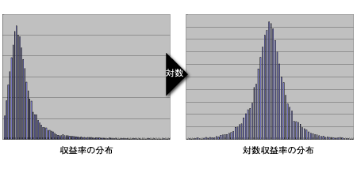
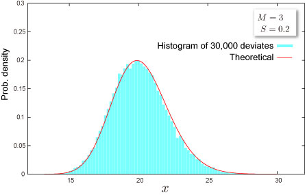

import DataGridMdx from "@site/src/components/DataGridMdx";

# 対数正規分布(Log normal distribution)

## 勝ち組への道対数正規分布

### 金融工学

オプションの価格公式として有名な[**ブラック=ショールズ式**](http://ja.wikipedia.org/wiki/%E3%83%96%E3%83%A9%E3%83%83%E3%82%AF-%E3%82%B7%E3%83%A7%E3%83%BC%E3%83%AB%E3%82%BA%E6%96%B9%E7%A8%8B%E5%BC%8F)では対数正規分布が決定的に重要な役割を果たしています。\
この理論では、株価の変動は**幾何ブラウン運動**によって支配されていると仮定しています。そしてこの仮定から、株価の収益率（= 前日の終値/当日の終値 -- 1）は**対数正規分布**に従っているということが分かるのです。

では簡単に、実際の例を見てみましょう。\
下の図の左側は、TOPIX の収益率の分布です。 一方右の図は、対数収益率（= log(前日の終値/当日の終値) ）です。\
\
なるほど、確かに収益率の対数が正規分布に従っているみたいですね。 つまり、元の収益率は対数正規分布に従っているという仮定が一番もっともらしいことが分かるでしょう。\
最近では、対数収益率は正規分布よりもっと裾の厚い分布に従っているという議論が高まってきています。そういった分布として[ジョンソン SU 分布](johnson-su-distribution.mdx)が現在非常に注目されているのです。

他にお金がらみの話としては、世帯の**年収の分布**が対数正規分布（に近い分布）になるとの分析もあったりします。興味のある方は [ここ](http://www.mhlw.go.jp/toukei/saikin/hw/k-tyosa/k-tyosa08/2-2.html)に厚生労働省による所得の分布の図があるのでぜひ確かめてみてください。ご感想は心の中にでもしまっておいてください。

### ちょっと注意

正規分布の[累積分布関数](/docs/glossary#cumulative-distribution-function)は

$$
\Phi\left(\frac{x-m}{\sigma}\right)
$$

と表記されることを正規分布の項で説明しましたね。 では、対数正規分布に従う確率変数 $x$ の分布関数はどうなるかというと、実に単純なもので、

$$
F(x)=\Phi\left(\frac{\log x-m}{\sigma}\right)
$$

になります。そう、[正規分布](normal-distribution-single.mdx)の変数を $x\rightarrow \log x$ としただけなんです。\
ここでもうちょっと**注意**。 [正規分布](normal-distribution-single.mdx)の[確率密度関数](/docs/glossary#probability-density-function)が

$$
\frac{1}{\sigma}\phi\left(\frac{x-m}{\sigma}\right)
$$

であるからって、調子に乗って対数正規分布の[確率密度関数](/docs/glossary#probability-density-function)を、

$$
f(x)=\frac{1}{\sigma}\phi\left(\frac{\log x-m}{\sigma}\right)
$$

としないようにしましょう。[確率密度関数](/docs/glossary#probability-density-function)は、[累積分布関数](/docs/glossary#cumulative-distribution-function)を微分して求めるもの。だから正しい[確率密度関数](/docs/glossary#probability-density-function)は、

$$
f(x)=\frac{1}{\sigma x}\phi\left(\frac{\log x-m}{\sigma}\right)
$$

となります。分母の $x$を忘れないようにね。

## 分布の形状

### 基本情報

- 2つのパラメータ $M, S$ が必要です ([どうやって求めるの？](../03-function-reference/02-distribution-functions/068-ntlognormparam.mdx)).

  $$
  S>0
  $$

- 半無限区間 $x > 0$ で定義された連続分布です。
- [平均](/docs/glossary#central-moment)対して常に非対称です。

### 確率

- [累積分布関数](/docs/glossary#cumulative-distribution-function)

  $$
  F(x)=\Phi\left(\frac{\ln x-M}{S}\right)
  $$

  ここで $\Phi(\cdot)$ は標準正規分布の[累積分布関数](/docs/glossary#cumulative-distribution-function)です。

- [確率密度関数](/docs/glossary#probability-density-function)

  $$
  f(x)=\frac{1}{Sx}\phi\left(\frac{\ln x-M}{S}\right)
  $$

  ここで $\phi(\cdot)$ は標準正規分布の[確率密度関数](/docs/glossary#probability-density-function)です。

- Excel での[累積分布関数 (c.d.f.)](/docs/glossary#cumulative-distribution-function) と [確率密度関数 (p.d.f.)](/docs/glossary#probability-density-function)の求め方

<DataGridMdx
  data={{
    cells: [
      [
        { value: "データ", readOnly: true, className: "orange-cell" },
        { value: "説明", readOnly: true, className: "orange-cell" },
      ],
      [
        { value: 0.5, readOnly: true },
        { value: "対象となる値", readOnly: true },
      ],
      [
        { value: 0.1, readOnly: true },
        { value: "分布のパラメータ M の値", readOnly: true },
      ],
      [
        { value: 2, readOnly: true },
        { value: "分布のパラメータ S の値", readOnly: true },
      ],
      [
        { value: "数式", readOnly: true, className: "orange-cell" },
        { value: "説明（計算結果）", readOnly: true, className: "orange-cell" },
      ],
      [
        { value: "=NTLOGNORMDIST(A2,A3,A4,TRUE)", readOnly: true },
        { value: "上のデータに対する累積分布関数の値", readOnly: true },
      ],
      [
        { value: "=NTLOGNORMDIST(A2,A3,A4,FALSE)", readOnly: true },
        { value: "上のデータに対する確率密度関数の値", readOnly: true },
      ],
    ],
  }}
/>

- 関連 NtRand 関数 : [NTLOGNORMDIST](../03-function-reference/02-distribution-functions/063-ntlognormdist.mdx)

### 分位点

- [累積分布関数](/docs/glossary#cumulative-distribution-function)の逆関数

  $$
  F^{-1}(P)=\exp\left[S\Phi^{-1}(P)+M\right]
  $$

  ここで $\Phi(\cdot)$ は標準正規分布の[累積分布関数](/docs/glossary#cumulative-distribution-function)です。

- Excel での[分位点](/docs/glossary#quantile)の求め方

<DataGridMdx
  data={{
    cells: [
      [
        { value: "データ", readOnly: true, className: "orange-cell" },
        { value: "説明", readOnly: true, className: "orange-cell" },
      ],
      [
        { value: 0.7, readOnly: true },
        { value: "この分布の確率", readOnly: true },
      ],
      [
        { value: 0.1, readOnly: true },
        { value: "分布のパラメータ M の値", readOnly: true },
      ],
      [
        { value: 2, readOnly: true },
        { value: "分布のパラメータ S の値", readOnly: true },
      ],
      [
        { value: "数式", readOnly: true, className: "orange-cell" },
        { value: "説明（計算結果）", readOnly: true, className: "orange-cell" },
      ],
      [
        { value: "=NTLOGNORMINV(A2,A3,A4)", readOnly: true },
        { value: "上のデータに対する累積分布関数の逆関数の値", readOnly: true },
      ],
    ],
  }}
/>

- 関連 NtRand 関数 : [NTLOGNORMINV](../03-function-reference/02-distribution-functions/064-ntlognorminv.mdx)

## 分布の特徴

### 平均 -- 分布の"中心"はどこ？ ([定義](/docs/glossary#central-moment))

- 分布の[平均](/docs/glossary#central-moment) は次式で与えられます。

  $$
  m\sqrt{\omega}
  $$

  ここで

  $$
  m=\exp(M),\omega=\exp(S^2)
  $$

  です。

- Excel での計算法

<DataGridMdx
  data={{
    cells: [
      [
        { value: "データ", readOnly: true, className: "orange-cell" },
        { value: "説明", readOnly: true, className: "orange-cell" },
      ],
      [
        { value: 0.1, readOnly: true },
        { value: "分布のパラメータ M の値", readOnly: true },
      ],
      [
        { value: 2, readOnly: true },
        { value: "分布のパラメータ S の値", readOnly: true },
      ],
      [
        { value: "数式", readOnly: true, className: "orange-cell" },
        { value: "説明（計算結果）", readOnly: true, className: "orange-cell" },
      ],
      [
        { value: "=NTLOGNORMMEAN(A2,A3)", readOnly: true },
        { value: "上のデータに対する分布の平均", readOnly: true },
      ],
    ],
  }}
/>

- 関連 NtRand 関数 : [NTLOGNORMMEAN](../03-function-reference/02-distribution-functions/066-ntlognormmean.mdx)

### 標準偏差 -- 分布はどのくらい広がっているか（[定義](/docs/glossary#standard-deviation)）

- 分布の[分散](/docs/glossary#variance) は次式で与えられます。

  $$
  m^2\omega(\omega-1)
  $$

  ここで

  $$
  m=\exp(M),\omega=\exp(S^2)
  $$

  です。

  [標準偏差](/docs/glossary#standard-deviation) は [分散](/docs/glossary#variance)の正の平方根です。

- Excel での計算法

<DataGridMdx
  data={{
    cells: [
      [
        { value: "データ", readOnly: true, className: "orange-cell" },
        { value: "説明", readOnly: true, className: "orange-cell" },
      ],
      [
        { value: 0.1, readOnly: true },
        { value: "分布のパラメータ M の値", readOnly: true },
      ],
      [
        { value: 2, readOnly: true },
        { value: "分布のパラメータ S の値", readOnly: true },
      ],
      [
        { value: "数式", readOnly: true, className: "orange-cell" },
        { value: "説明（計算結果）", readOnly: true, className: "orange-cell" },
      ],
      [
        { value: "=NTLOGNORMSTDEV(A2,A3)", readOnly: true },
        { value: "上のデータに対する分布の標準偏差", readOnly: true },
      ],
    ],
  }}
/>

- 関連 NtRand 関数 : [NTLOGNORMSTDEV](../03-function-reference/02-distribution-functions/070-ntlognormstdev.mdx)

### 歪度 -- 分布はどちらに偏っているか([定義](/docs/glossary#skewness))

- 分布の[歪度](/docs/glossary#skewness) は次式で与えられます。

  $$
  (\omega+2)\sqrt{\omega-1}
  $$

  ここで

  $$
  \omega=\exp(S^2)
  $$

  です。

- Excel での計算法

<DataGridMdx
  data={{
    cells: [
      [
        { value: "データ", readOnly: true, className: "orange-cell" },
        { value: "説明", readOnly: true, className: "orange-cell" },
      ],
      [
        { value: 0.1, readOnly: true },
        { value: "分布のパラメータ M の値", readOnly: true },
      ],
      [
        { value: 2, readOnly: true },
        { value: "分布のパラメータ S の値", readOnly: true },
      ],
      [
        { value: "数式", readOnly: true, className: "orange-cell" },
        { value: "説明（計算結果）", readOnly: true, className: "orange-cell" },
      ],
      [
        { value: "=NTLOGNORMSKEW(A2,A3)", readOnly: true },
        { value: "上のデータに対する分布の歪度", readOnly: true },
      ],
    ],
  }}
/>

- 関連 NtRand 関数 : [NTLOGNORMSKEW](../03-function-reference/02-distribution-functions/069-ntlognormskew.mdx)

### 尖度 -- 尖っているか丸まっているか ([定義](/docs/glossary#kurtosis))

- 分布の[尖度](/docs/glossary#kurtosis) は次式で与えられます。

  $$
  \omega^4+2\omega^3+3\omega^2-6
  $$

  ここで

  $$
  \omega=\exp(S^2)
  $$

  です。

- Excel での計算法

<DataGridMdx
  data={{
    cells: [
      [
        { value: "データ", readOnly: true, className: "orange-cell" },
        { value: "説明", readOnly: true, className: "orange-cell" },
      ],
      [
        { value: 0.1, readOnly: true },
        { value: "分布のパラメータ M の値", readOnly: true },
      ],
      [
        { value: 2, readOnly: true },
        { value: "分布のパラメータ S の値", readOnly: true },
      ],
      [
        { value: "数式", readOnly: true, className: "orange-cell" },
        { value: "説明（計算結果）", readOnly: true, className: "orange-cell" },
      ],
      [
        { value: "=NTLOGNORMKURT(A2,A3)", readOnly: true },
        { value: "上のデータに対する分布の尖度", readOnly: true },
      ],
    ],
  }}
/>

- 関連 NtRand 関数 : [NTLOGNORMKURT](../03-function-reference/02-distribution-functions/065-ntlognormkurt.mdx)

## 乱数

- 乱数 x は一様乱数 U に対して次式で生成されます（逆関数法） :

  $$
  x=\exp\left[S\Phi^{-1}(U)+M\right]
  $$

  ここで $\Phi(\cdot)$ は標準正規分布の[累積分布関数](/docs/glossary#cumulative-distribution-function)です。

- Excel での乱数生成法

<DataGridMdx
  data={{
    cells: [
      [
        { value: "データ", readOnly: true, className: "orange-cell" },
        { value: "説明", readOnly: true, className: "orange-cell" },
      ],
      [
        { value: 0.1, readOnly: true },
        { value: "分布のパラメータ M の値", readOnly: true },
      ],
      [
        { value: 2, readOnly: true },
        { value: "分布のパラメータ S の値", readOnly: true },
      ],
      [
        { value: "数式", readOnly: true, className: "orange-cell" },
        { value: "説明（計算結果）", readOnly: true, className: "orange-cell" },
      ],
      [
        { value: "=NTRANDLOGNORM(100,A2,A3,0)", readOnly: true },
        {
          value:
            "100個の対数正規乱数を Mersenne Twister アルゴリズムで生成します。",
          readOnly: true,
        },
      ],
    ],
  }}
/>

メモ： この使用例の数式は、配列数式として入力する必要があります。使用例を新規ワークシートにコピーした後、A7:A106 のセル範囲 (配列数式が入力されているセルが左上になる) を選択します。F2 キーを押し、Ctrl キーと Shift キーを押しながら Enter キーを押します。この数式が配列数式として入力されていない場合、単一の値 2 のみが計算結果として返されます。

- 関連 NtRand 関数 : [NTRANDLOGNORM](../03-function-reference/01-random-numbers/01-single-series/10-ntrandlognorm.mdx)

## 関連 NtRand 関数

- 既に分布のパラメータをお持ちの場合
  - Mersenne Twiseter 法による乱数生成 : [NTRANDLOGNORM](../03-function-reference/01-random-numbers/01-single-series/10-ntrandlognorm.mdx)
  - 確率計算 : [NTLOGNORMDIST](../03-function-reference/02-distribution-functions/063-ntlognormdist.mdx)
  - 平均計算 : [NTLOGNORMMEAN](../03-function-reference/02-distribution-functions/066-ntlognormmean.mdx)
  - 標準偏差計算 : [NTLOGNORMSTDEV](../03-function-reference/02-distribution-functions/069-ntlognormskew.mdx)
  - 歪度計算 : [NTLOGNORMSKEW](../03-function-reference/02-distribution-functions/069-ntlognormskew.mdx)
  - 尖度計算 : [NTLOGNORMKURT](../03-function-reference/02-distribution-functions/065-ntlognormkurt.mdx)
  - 上記の各モーメントを一度に計算 : [NTLOGNORMMOM](../03-function-reference/02-distribution-functions/067-ntlognormmom.mdx)
- 分布の平均と標準偏差をお持ちの場合
  - 分布のパラメータ推定 : [NTLOGNORMPARAM](../03-function-reference/02-distribution-functions/068-ntlognormparam.mdx)

## 参照

- [Wolfram Mathworld -- Log Normal Distribution](http://mathworld.wolfram.com/LogNormalDistribution.html)
- [Wikipedia -- Log-normal distribution](http://en.wikipedia.org/wiki/Log_normal_distribution)
- [Statistics Online Computational Resource](http://www.socr.ucla.edu/htmls/SOCR_Distributions.html)
