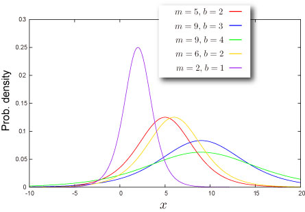
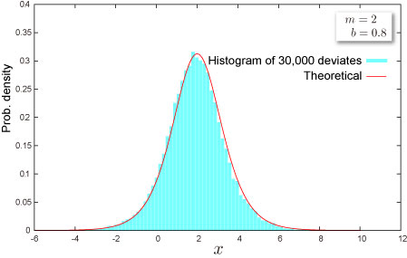

import DataGridMdx from "@site/src/components/DataGridMdx";

# ロジスティック分布(Logistic distribution)

## 正規分布の代用品ロジスティック分布

ロジスティック分布は[単峰分布](/docs/glossary#unimodal)で左右対称ということから正規分布に良く似ており、また式が扱いやすいこともあって正規分布の替わりに用いられることが多い実は人気の分布なのです。 ただ、正規分布より裾が厚いことに注意が必要です。

ロジスティック分布の[累積分布関数](/docs/glossary#cumulative-distribution-function)に見る曲線は**ロジスティック曲線**と呼ばれ、分布そのものよりこちらの曲線の方が様々な場面で現れています。

- 生物学 : 生物がどのように生態系の競争関係の中で個体数を増やすか
- エネルギー : 一次エネルギー資源の拡散、放散と代用原理
- 疫学 : 病気の蔓延の原理
- マーケティング : 新製品の流布
- 心理学 : 学習曲線
- テクノロジー : 新技術の普及と技術の世代交代

## 分布の形状

### 基本情報

- 2つのパラメータ $m, b$ が必要です ([どうやって求めるの？](../03-function-reference/02-distribution-functions/060-ntlogisticparam.mdx)).

  $$
  b>0
  $$

- 無限区間 $(-\infty,+\infty)$ で定義された連続分布です。
- [平均](/docs/glossary#central-moment)対して常に対称です。

### 確率

- [累積分布関数](/docs/glossary#cumulative-distribution-function)

  $$
  F(x)=\frac{1}{2}\left[1+\tanh\left(\frac{x-m}{2b}\right)\right]
  $$

- [確率密度関数](/docs/glossary#probability-density-function)

  $$
  f(x)=\frac{1}{4b}\text{sech}^2\left(\frac{x-m}{2b}\right)
  $$

- Excel での[累積分布関数 (c.d.f.)](/docs/glossary#cumulative-distribution-function) と [確率密度関数 (p.d.f.)](/docs/glossary#probability-density-function)の求め方

<DataGridMdx
  data={{
    cells: [
      [
        { value: "データ", readOnly: true, className: "orange-cell" },
        { value: "説明", readOnly: true, className: "orange-cell" },
      ],
      [
        { value: "0.5", readOnly: true },
        { value: "対象となる値", readOnly: true },
      ],
      [
        { value: "8", readOnly: true },
        { value: "分布のパラメータ M の値", readOnly: true },
      ],
      [
        { value: "2", readOnly: true },
        { value: "分布のパラメータ B の値", readOnly: true },
      ],
      [
        { value: "数式", readOnly: true, className: "orange-cell" },
        { value: "説明（計算結果）", readOnly: true, className: "orange-cell" },
      ],
      [
        { value: "=NTLOGISTICDIST(A2,A3,A4,TRUE)", readOnly: true },
        { value: "上のデータに対する累積分布関数の値", readOnly: true },
      ],
      [
        { value: "=NTLOGISTICDIST(A2,A3,A4,FALSE)", readOnly: true },
        { value: "上のデータに対する確率密度関数の値", readOnly: true },
      ],
    ],
  }}
/>

- 関連 NtRand 関数 : [NTLOGISTICDIST](../03-function-reference/02-distribution-functions/055-ntlogisticdist.mdx)

### 分位点

- [累積確率関数](/docs/glossary#cumulative-distribution-function)の逆関数

  $$
  F^{-1}(P)=2b\tanh^{-1}(2P-1)+m
  $$

- Excel での[分位点](/docs/glossary#quantile)の求め方

<DataGridMdx
  data={{
    cells: [
      [
        { value: "データ", readOnly: true, className: "orange-cell" },
        { value: "説明", readOnly: true, className: "orange-cell" },
      ],
      [
        { value: "0.7", readOnly: true },
        { value: "この分布の確率", readOnly: true },
      ],
      [
        { value: "1.7", readOnly: true },
        { value: "分布のパラメータ M の値", readOnly: true },
      ],
      [
        { value: "0.9", readOnly: true },
        { value: "分布のパラメータ B の値", readOnly: true },
      ],
      [
        { value: "数式", readOnly: true, className: "orange-cell" },
        { value: "説明（計算結果）", readOnly: true, className: "orange-cell" },
      ],
      [
        { value: "=NTLOGISTICINV(A2,A3,A4)", readOnly: true },
        { value: "上のデータに対する累積分布関数の逆関数の値", readOnly: true },
      ],
    ],
  }}
/>

- 関連 NtRand 関数 : [NTLOGISTICINV](../03-function-reference/02-distribution-functions/056-ntlogisticinv.mdx)

## 分布の特徴

### 平均 -- 分布の"中心"はどこ？ ([定義](/docs/glossary#central-moment))

- 分布の[平均](/docs/glossary#central-moment)は $m$ と与えられます。

### 標準偏差 -- 分布はどのくらい広がっているか（[定義](/docs/glossary#standard-deviation)）

- 分布の[分散](/docs/glossary#variance) は次式で与えられます。

  $$
  \frac{\pi^2b^2}{3}
  $$

  [標準偏差](/docs/glossary#standard-deviation) は [分散](/docs/glossary#variance)の正の平方根です。

- Excel での計算法

<DataGridMdx
  data={{
    cells: [
      [
        { value: "データ", readOnly: true, className: "orange-cell" },
        { value: "説明", readOnly: true, className: "orange-cell" },
      ],
      [
        { value: "2", readOnly: true },
        { value: "分布のパラメータ B の値", readOnly: true },
      ],
      [
        { value: "数式", readOnly: true, className: "orange-cell" },
        { value: "説明（計算結果）", readOnly: true, className: "orange-cell" },
      ],
      [
        { value: "=NTLOGISTICSTDEV(A2)", readOnly: true },
        { value: "上のデータに対する分布の標準偏差", readOnly: true },
      ],
    ],
  }}
/>

- 関連 NtRand 関数 : [NTLOGISTICSTDEV](../03-function-reference/02-distribution-functions/062-ntlogisticstdev.mdx)

### 歪度 -- 分布はどちらに偏っているか([定義](/docs/glossary#skewness))

- 分布の[歪度](/docs/glossary#skewness)は $0$ です。

### 尖度 -- 尖っているか丸まっているか ([定義](/docs/glossary#kurtosis))

- 分布の[尖度](/docs/glossary#kurtosis)は $1.2$ です。

## 乱数

- 乱数 x は一様乱数 U に対して次式で生成されます（逆関数法） :

  $$
  x=2b\tanh^{-1}(2U-1)+m
  $$

- Excel での乱数生成法

<DataGridMdx
  data={{
    cells: [
      [
        { value: "データ", readOnly: true, className: "orange-cell" },
        { value: "説明", readOnly: true, className: "orange-cell" },
      ],
      [
        { value: "0.5", readOnly: true },
        { value: "分布のパラメータ M の値", readOnly: true },
      ],
      [
        { value: "0.5", readOnly: true },
        { value: "分布のパラメータ B の値", readOnly: true },
      ],
      [
        { value: "数式", readOnly: true, className: "orange-cell" },
        { value: "説明（計算結果）", readOnly: true, className: "orange-cell" },
      ],
      [
        { value: "=NTRANDLOGISTIC(100,A2,A3)", readOnly: true },
        {
          value:
            "100個のロジスティック乱数を Mersenne Twister アルゴリズムで生成します。",
          readOnly: true,
        },
      ],
    ],
  }}
/>

メモ： この使用例の数式は、配列数式として入力する必要があります。使用例を新規ワークシートにコピーした後、A5:A104 のセル範囲 (配列数式が入力されているセルが左上になる) を選択します。F2 キーを押し、Ctrl キーと Shift キーを押しながら Enter キーを押します。この数式が配列数式として入力されていない場合、単一の値 2 のみが計算結果として返されます。

## 関連 NtRand 関数

- 既に分布のパラメータをお持ちの場合
  - Mersenne Twiseter 法による乱数生成 : [NTRANDLOGISTIC](../03-function-reference/01-random-numbers/01-single-series/09-ntrandlogistic.mdx)
  - 確率計算 : [NTLOGISTICDIST](../03-function-reference/02-distribution-functions/055-ntlogisticdist.mdx)
  - 平均計算 : [NTLOGISTICMEAN](../03-function-reference/02-distribution-functions/058-ntlogisticmean.mdx)
  - 標準偏差計算 : [NTLOGISTICSTDEV](../03-function-reference/02-distribution-functions/061-ntlogisticskew.mdx)
  - 歪度計算 : [NTLOGISTICSKEW](../03-function-reference/02-distribution-functions/061-ntlogisticskew.mdx)
  - 尖度計算 : [NTLOGISTICKURT](../03-function-reference/02-distribution-functions/057-ntlogistickurt.mdx)
  - 上記の各モーメントを一度に計算 : [NTLOGISTICMOM](../03-function-reference/02-distribution-functions/059-ntlogisticmom.mdx)
- 分布の平均と標準偏差をお持ちの場合
  - 分布のパラメータ推定 : [NTLOGISTICPARAM](../03-function-reference/02-distribution-functions/060-ntlogisticparam.mdx)

## 参照

- [Wolfram Mathworld -- Logistic Distribution](http://mathworld.wolfram.com/LogisticDistribution.html)
- [Wikipedia -- ロジスティック分布](http://en.wikipedia.org/wiki/Logistic_distribution)
- [Statistics Online Computational Resource](http://www.socr.ucla.edu/htmls/SOCR_Distributions.html)
