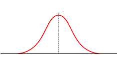
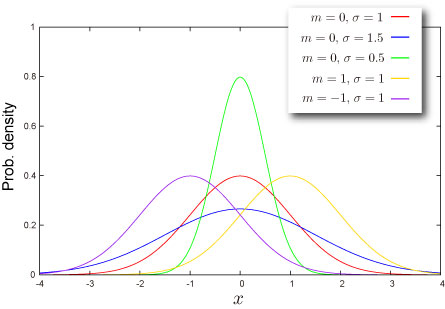
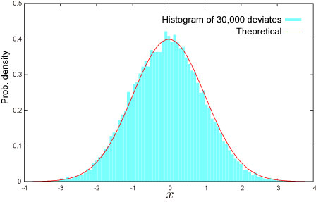

import DataGridMdx from "@site/src/components/DataGridMdx";

# 正規分布（単変量）(Normal distribution)

## あの鐘を鳴らすのは正規分布

### ベル=カーブ

**正規分布（英名 "Normal distribution"）**は確率・統計で間違いなく最も重要な分布です。実際これを知らないと何もできない程！19世紀最大の科学者[カール・フリードリヒ・ガウス](http://ja.wikipedia.org/wiki/%E3%82%AB%E3%83%BC%E3%83%AB%E3%83%BB%E3%83%95%E3%83%AA%E3%83%BC%E3%83%89%E3%83%AA%E3%83%92%E3%83%BB%E3%82%AC%E3%82%A6%E3%82%B9)が導入したことから、**ガウス分布**とも呼ばれています（彼の故郷、ドイツの[旧10マルク紙幣にはガウスの自身と正規分布の形が描かれていました](http://www.ee.toyota-ct.ac.jp/~sugi/GAUSS.jpg)）。

先ずは正規分布の[確率密度関数](https://www.ntrand.com/jp/glossary/#local_Probability)の形を見てみましょう。

- 左右対称
- 中心部分が一番高く、中心から離れれば離れるほど急速に減少していく
- （見ただけでは分からないけど）実はグラフは永遠に伸びていて、水平軸に接することはない。

均整のとれたこの形は[古き良き時代の鐘](http://www.notredamedeparis.fr/The-Bells)を想起させることから「ベル＝カーブ」という愛称も持っています。

### 分布の特徴

正規分布の形状はなんと**たった2つ**の情報で決まってしまいます。

- **分布の位置**を決める **[平均](https://www.ntrand.com/jp/glossary/#local_mean)**。通常 $m$ と表記されることが多い。
- **分布の広がり**を決める **[標準偏差](https://www.ntrand.com/jp/glossary/#local_standard_deviation)**。通常 $\sigma$（ギリシャ文字の"シグマ"）と表記されることが多い。

### 数式を少々（我慢我慢）

とにかく重要でどこにでも顔を出す分布なので、ここはひとつ数式を見てみましょう。他でもしょっちゅう出てくるものばかりで、きっと**試験にも出ます**。どうにか我慢してお付き合いください。

- [確率密度関数](https://www.ntrand.com/jp/glossary/#local_Probability)\
  上でみたベル=カーブを描き出す関数は、

  $$
  f(x)=\frac{1}{\sqrt{2\pi}\sigma}\exp\left[-\frac{(x-m)^2}{2\sigma^2}\right]
  $$

  と与えられます。ここで$m=0$、$\sigma=1$としてみると（つまり標準正規分布）、

  $$
  f(x)=\frac{1}{\sqrt{2\pi}}\exp\left(-\frac{x^2}{2}\right)
  $$

  となります。この関数は $\phi(x)$ （ギリシャ文字の "ファイ" の小文字）と表記されます。この $\phi(\cdot)$ を使うと、標準じゃない正規分布は、

  $$
  f(x)=\frac{1}{\sigma}\phi\left(\frac{x-m}{\sigma}\right)
  $$

  となります。

- [累積分布関数](https://www.ntrand.com/jp/glossary/#local_Cumulative)\
  累積分布関数は[確率密度関数](https://www.ntrand.com/jp/glossary/#local_Probability)を積分したもの！としかいいようがありません。

  $$
  F(x)=\frac{1}{\sqrt{2\pi}\sigma}\int_{-\infty}^{x}\exp\left[-\frac{(t-m)^2}{2\sigma^2}\right]\text{d}t
  $$

  これも標準正規分布の場合には特別な表記が与えられています。

  $$
  \Phi(x)=\int_{-\infty}^{x}\phi(t)\text{d}t
  $$

  $\Phi$ はギリシャ文字の"ファイ"の大文字です。この $\Phi(\cdot)\$ を使うと標準じゃない正規分布は、

  $$
  F(x)=\Phi\left(\frac{x-m}{\sigma}\right)
  $$

  となります。

### その他のトピック

- 左右対称ということから、この分布の[歪度](https://www.ntrand.com/jp/glossary/#local_skewness/)（ゆがみ）は 0
- 正規分布の[尖度](https://www.ntrand.com/jp/glossary/#local_kurtosis/)（とがり具合）を 0 として、この分布より裾が厚い分布（[尖度](https://www.ntrand.com/jp/glossary/#local_kurtosis/)が正）を "[Leptokurtic](https://www.ntrand.com/jp/glossary/#local_leptokurtic/)"な分布、裾が薄い分布（[尖度](https://www.ntrand.com/jp/glossary/#local_kurtosis/)が負）を "[Platykurtic](https://www.ntrand.com/jp/glossary/#local_leptokurtic/)"な分布と呼ぶ
- 多数の分布の極限が正規分布になるということと、多数の不確定要素の積み重ねが正規分布を生み出す（**中心極限定理**）という事実によって、この分布はどこにでも顔を出す。

## 分布の形状

### 基本情報

- 無限区間 $(-\infty,+\infty)$ で定義された連続分布です。

### 確率

- [累積分布関数](https://www.ntrand.com/jp/glossary/#local_cumulative)

  $$
  F(x)=\frac{1}{\sigma}\int_{-\infty}^{x}\phi\left(\frac{t-m}{\sigma}\right)\text{d}t
  $$

  ここで $\phi(\cdot)$ は標準正規分布の[確率密度関数](https://www.ntrand.com/jp/glossary/#local_probability)です。

- [確率密度関数](https://www.ntrand.com/jp/glossary/#local_probability)

  $$
  f(x)=\frac{1}{\sqrt{2\pi}\sigma}\exp\left[-\frac{(x-m)^2}{2\sigma^2}\right]
  $$

- Excel での[累積分布関数 (c.d.f.)](https://www.ntrand.com/jp/glossary/#local_cumulative) と [確率密度関数 (p.d.f.)](https://www.ntrand.com/jp/glossary/#local_Probability)の求め方

<DataGridMdx
  data={{
    cells: [
      [
        { value: "データ", readOnly: true, className: "orange-cell" },
        { value: "説明", readOnly: true, className: "orange-cell" },
      ],
      [
        { value: "0.5", readOnly: true },
        { value: "対象となる値", readOnly: true },
      ],
      [
        { value: "8", readOnly: true },
        { value: "分布のパラメータ M の値", readOnly: true },
      ],
      [
        { value: "2", readOnly: true },
        { value: "分布のパラメータ Sigma の値", readOnly: true },
      ],
      [
        { value: "数式", readOnly: true, className: "orange-cell" },
        { value: "説明（計算結果）", readOnly: true, className: "orange-cell" },
      ],
      [
        { value: "=NTNORMDIST((A2-A3)/A4,TRUE)", readOnly: true },
        { value: "上のデータに対する累積分布関数の値", readOnly: true },
      ],
      [
        { value: "=NTNORMDIST((A2-A3)/A4,FALSE)", readOnly: true },
        { value: "上のデータに対する確率密度関数の値", readOnly: true },
      ],
    ],
  }}
/>

- 関連 NtRand 関数 : [NTNORMDIST](https://www.ntrand.com/jp/ntnormdist/)
- 第2引数が TRUE の場合、NtRand 関数 [NTNORMDIST](https://www.ntrand.com/jp/ntnormdist/) は Excel 関数 [NORMSDIST](http://office.microsoft.com/en-us/excel/HP052091941033.aspx?pid=CH062528311033) と同等です。

### 分位点

- [累積確率関数](https://www.ntrand.com/jp/glossary/#local_cumulative)の逆関数

  $$
  F^{-1}(P)=\sigma\Phi^{-1}(P)+m
  $$

  ここで $\Phi(\cdot)$ は標準正規分布の[累積分布関数](https://www.ntrand.com/jp/glossary/#local_cumulative)です。

- Excel での[分位点](https://www.ntrand.com/jp/glossary/#local_quantile)の求め方

<DataGridMdx
  data={{
    cells: [
      [
        { value: "データ", readOnly: true, className: "orange-cell" },
        { value: "説明", readOnly: true, className: "orange-cell" },
      ],
      [
        { value: "0.7", readOnly: true },
        { value: "この分布の確率", readOnly: true },
      ],
      [
        { value: "1.7", readOnly: true },
        { value: "分布のパラメータ M の値", readOnly: true },
      ],
      [
        { value: "0.9", readOnly: true },
        { value: "分布のパラメータ Sigma の値", readOnly: true },
      ],
      [
        { value: "数式", readOnly: true, className: "orange-cell" },
        { value: "説明（計算結果）", readOnly: true, className: "orange-cell" },
      ],
      [
        { value: "=A4*NORMSINV(A2)+A3", readOnly: true },
        { value: "上のデータに対する累積分布関数の逆関数の値", readOnly: true },
      ],
    ],
  }}
/>

- [NORMSINV](http://office.microsoft.com/en-us/excel/HP052091951033.aspx?pid=CH062528311033) は Excel 関数です。

## 分布の特徴

### 平均 -- 分布の"中心"はどこ？ ([定義](https://www.ntrand.com/jp/glossary/#local_mean))

- 分布の[平均](https://www.ntrand.com/jp/glossary/#local_mean)は $m$ と与えられます。

### 標準偏差 -- 分布はどのくらい広がっているか（[定義](https://www.ntrand.com/jp/glossary/#local_standard_deviation)）

- 分布の[標準偏差](https://www.ntrand.com/jp/glossary/#local_standard_deviation)は $\sigma$ と与えられます。

### 歪度 -- 分布はどちらに偏っているか([定義](https://www.ntrand.com/jp/glossary/#local_skewness))

- 分布の[歪度](https://www.ntrand.com/jp/glossary/#local_skewness)は  です。

### 尖度 -- 尖っているか丸まっているか ([定義](https://www.ntrand.com/jp/glossary/#local_kurtosis))

- 分布の[尖度](https://www.ntrand.com/jp/glossary/#local_kurtosis)は  です。

## 乱数

Excel での乱数生成法

|

|   |
| 1 |
| 2 |
| 3 |
| 4 |
| 5\
    |

|

| A | B |
| データ | 説明 |
| 0.5 | 分布のパラメータ M の値 |
| 0.5 | 分布のパラメータ Sigma の値 |
| 数式 | 説明（計算結果） |
| =A3\*NTRANDNORM(100)+A2 | 100個の正規乱数を Mersenne Twister アルゴリズムで生成します。 |

|

メモ： この使用例の数式は、配列数式として入力する必要があります。使用例を新規ワークシートにコピーした後、A5:A104 のセル範囲 (配列数式が入力されているセルが左上になる) を選択します。F2 キーを押し、Ctrl キーと Shift キーを押しながら Enter キーを押します。この数式が配列数式として入力されていない場合、単一の値 2 のみが計算結果として返されます。

## 関連 NtRand 関数

- Mersenne Twiseter 法による乱数生成 : [NTRANDNORM](https://www.ntrand.com/jp/ntrandnorm/)

## 参照

- [Wolfram Mathworld -- Normal Distribution](http://mathworld.wolfram.com/NormalDistribution.html)
- [Wikipedia -- Normal distribution](http://en.wikipedia.org/wiki/Normal_distribution)
- [Statistics Online Computational Resource](http://www.socr.ucla.edu/htmls/SOCR_Distributions.html)
