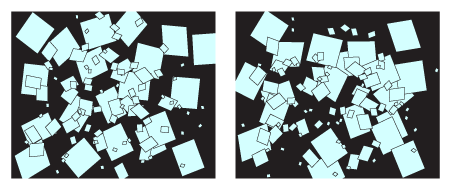

import DataGridMdx from "@site/src/components/DataGridMdx";

# パレート分布(Pareto distribution)

## 世界を動かすパレート分布

### スケールフリー

突然ですが、手元に大きなガラス板があります。ここに日頃の鬱憤をはらすために大きな石を思い切りぶつけてみましょう。すっきりしましたか？ではここで、粉々に砕け散ったガラス片の写真を2枚撮ってみます（図）。実はこっちのほうが大事だったんですね。

\
（大分図が簡略化してあることは突っ込まないでおいてくださいね。） さて左の写真は1辺が1メートルです。この写真で大体20センチ角程度の破片（一番大きい欠片）に対して、その半分程度の大きさ（10センチ角程度）の破片の数は大体1.2倍ほどあるとします。さらにその半分程度の大きさ（5センチ角程度）の破片はさらに1.2倍ほどあります。\
では右の写真は何でしょうか。実はこれは1辺が0.1ミリの顕微鏡写真なのです。ここに写っているのは極小の破片のみということになります。 ここから見て気が付くことは、1辺が1メートルであろうと、0.1ミリであろうと、見える世界が変わらないということ。つまり右の写真でも最大の大きさに分類される破片に対して、その半分程度の大きさのものは1.2倍ほど含まれているのです！その半分はさらに1.2倍...。

拡大しても縮小しても同じ世界が繰り返されるこの性質を**スケールフリー**といいます。（この性質を持つものをベキ分布といい、パレート分布はその代表格なのです。）パレート分布に従うとスケールフリーの現象が起こります。\
同じような事情は、雲の写真を撮ってみても見られます。雲のアップの写真を撮って、人に見せるときに「この写真の1辺は1キロメートル」といっても「1メートル」といっても見せられた方は何の違和感も感じないでしょう。（ぜひ試してください。）\
実はこのような分布をなす事例は挙げればキリがないのです。

- 世帯の貯蓄額：典型的な貯蓄額はない。パレート分布の研究はもともとここから始まった。
- 地震：典型的なマグニチュードはない。マグニチュード6の頻度とマグニチュード3の頻度の比は、マグニチュード4とマグニチュード2の頻度の比に等しい。
- 月のクレーター：大きいクレーターは少なく、小さいクレーターは数多く存在する。
- サイトの被リンク：被リンクの多いサイトは少なく、被リンクが2,3個のサイトは沢山ある。

いまや、自然法則の根幹を成す法則ではないかと世界の注目を浴びているのです。

## 分布の形状

### 基本情報

- 2つのパラメータ $a, b$ が必要です.

  $$
  a>0, b>0
  $$

- 半無限区間 $x>b$ で定義された連続分布です。
- [平均](https://www.ntrand.com/jp/glossary/#local_mean)対して常に非対称です。

### 確率

- [累積分布関数](https://www.ntrand.com/jp/glossary/#local_cumulative)

  $$
  F(x)=1-\left(\frac{b}{x}\right)^a
  $$

- [確率密度関数](https://www.ntrand.com/jp/glossary/#local_probability)

  $$
  f(x)=\frac{ab^a}{x^{a+1}}
  $$

- Excel での[累積分布関数 (c.d.f.)](https://www.ntrand.com/jp/glossary/#local_cumulative) と [確率密度関数 (p.d.f.)](https://www.ntrand.com/jp/glossary/#local_Probability)の求め方

<DataGridMdx
  data={{
    cells: [
      [
        { value: "データ", readOnly: true, className: "orange-cell" },
        { value: "説明", readOnly: true, className: "orange-cell" },
      ],
      [
        { value: "5", readOnly: true },
        { value: "対象となる値", readOnly: true },
      ],
      [
        { value: "8", readOnly: true },
        { value: "分布のパラメータ A の値", readOnly: true },
      ],
      [
        { value: "2", readOnly: true },
        { value: "分布のパラメータ B の値", readOnly: true },
      ],
      [
        { value: "数式", readOnly: true, className: "orange-cell" },
        { value: "説明（計算結果）", readOnly: true, className: "orange-cell" },
      ],
      [
        { value: "=1-POWER(A4/A2,A3)", readOnly: true },
        { value: "上のデータに対する累積分布関数の値", readOnly: true },
      ],
      [
        { value: "=A3*A4^A3/POWER(A2,A3+1)", readOnly: true },
        { value: "上のデータに対する確率密度関数の値", readOnly: true },
      ],
    ],
  }}
/>

### 分位点

- [累積分布関数](https://www.ntrand.com/jp/glossary/#local_cumulative)の逆関数

  $$
  F^{-1}(P)=\frac{b}{(1-P)^{1/a}}
  $$

- Excel での[分位点](https://www.ntrand.com/jp/glossary/#local_quantile)の求め方

<DataGridMdx
  data={{
    cells: [
      [
        { value: "データ", readOnly: true, className: "orange-cell" },
        { value: "説明", readOnly: true, className: "orange-cell" },
      ],
      [
        { value: "0.7", readOnly: true },
        { value: "この分布の確率", readOnly: true },
      ],
      [
        { value: "1.7", readOnly: true },
        { value: "分布のパラメータ A の値", readOnly: true },
      ],
      [
        { value: "0.9", readOnly: true },
        { value: "分布のパラメータ B の値", readOnly: true },
      ],
      [
        { value: "数式", readOnly: true, className: "orange-cell" },
        { value: "説明（計算結果）", readOnly: true, className: "orange-cell" },
      ],
      [
        { value: "=A4/POWER(1-A2,1/A3)", readOnly: true },
        { value: "上のデータに対する累積分布関数の逆関数の値", readOnly: true },
      ],
    ],
  }}
/>

## 分布の特徴

### 平均 -- 分布の"中心"はどこ？ ([定義](https://www.ntrand.com/jp/glossary/#local_mean))

- 分布の[平均](https://www.ntrand.com/jp/glossary/#local_mean) は次式で与えられます。

  $$
  \frac{ab}{a-1}
  $$

- Excel での計算法

<DataGridMdx
  data={{
    cells: [
      [
        { value: "データ", readOnly: true, className: "orange-cell" },
        { value: "説明", readOnly: true, className: "orange-cell" },
      ],
      [
        { value: "8", readOnly: true },
        { value: "分布のパラメータ Alpha の値", readOnly: true },
      ],
      [
        { value: "2", readOnly: true },
        { value: "分布のパラメータ Beta の値", readOnly: true },
      ],
      [
        { value: "数式", readOnly: true, className: "orange-cell" },
        { value: "説明（計算結果）", readOnly: true, className: "orange-cell" },
      ],
      [
        { value: "=A2*A2/(A2-1)", readOnly: true },
        { value: "上のデータに対する分布の平均", readOnly: true },
      ],
    ],
  }}
/>

### 標準偏差 -- 分布はどのくらい広がっているか（[定義](https://www.ntrand.com/jp/glossary/#local_standard_deviation)）

- 分布の[分散](https://www.ntrand.com/jp/glossary/#local_variance) は次式で与えられます。

  $$
  \frac{ab^2}{(a-1)^2(a-2)}
  $$

  [標準偏差](https://www.ntrand.com/jp/glossary/#local_standard_deviation) は [分散](https://www.ntrand.com/jp/glossary/#local_variance)の正の平方根です。

- Excel での計算法

<DataGridMdx
  data={{
    cells: [
      [
        { value: "データ", readOnly: true, className: "orange-cell" },
        { value: "説明", readOnly: true, className: "orange-cell" },
      ],
      [
        { value: "8", readOnly: true },
        { value: "分布のパラメータ A の値", readOnly: true },
      ],
      [
        { value: "2", readOnly: true },
        { value: "分布のパラメータ B の値", readOnly: true },
      ],
      [
        { value: "数式", readOnly: true, className: "orange-cell" },
        { value: "説明（計算結果）", readOnly: true, className: "orange-cell" },
      ],
      [
        { value: "=A3/(A2-1)*SQRT(A2/(A2-2))", readOnly: true },
        { value: "上のデータに対する分布の標準偏差", readOnly: true },
      ],
    ],
  }}
/>

### 歪度 -- 分布はどちらに偏っているか([定義](https://www.ntrand.com/jp/glossary/#local_skewness))

- 分布の[歪度](https://www.ntrand.com/jp/glossary/#local_skew) は次式で与えられます。

  $$
  \sqrt{\frac{a-2}{a}}\frac{2(a+1)}{a-3}
  $$

- Excel での計算法

<DataGridMdx
  data={{
    cells: [
      [
        { value: "データ", readOnly: true, className: "orange-cell" },
        { value: "説明", readOnly: true, className: "orange-cell" },
      ],
      [
        { value: "8", readOnly: true },
        { value: "分布のパラメータ A の値", readOnly: true },
      ],
      [
        { value: "数式", readOnly: true, className: "orange-cell" },
        { value: "説明（計算結果）", readOnly: true, className: "orange-cell" },
      ],
      [
        { value: "=SQRT((A2-2)/A2)*2*(A2+1)/(A2-3)", readOnly: true },
        { value: "上のデータに対する分布の歪度", readOnly: true },
      ],
    ],
  }}
/>

### 尖度 -- 尖っているか丸まっているか ([定義](https://www.ntrand.com/jp/glossary/#local_kurtosis))

- 分布の[尖度](https://www.ntrand.com/jp/glossary/#local_kurtosis) は次式で与えられます。

  $$
  \frac{6(a^3+a^2-6a-2)}{a(a-3)(a-4)}
  $$

- Excel での計算法

<DataGridMdx
  data={{
    cells: [
      [
        { value: "データ", readOnly: true, className: "orange-cell" },
        { value: "説明", readOnly: true, className: "orange-cell" },
      ],
      [
        { value: "8", readOnly: true },
        { value: "分布のパラメータ A の値", readOnly: true },
      ],
      [
        { value: "数式", readOnly: true, className: "orange-cell" },
        { value: "説明（計算結果）", readOnly: true, className: "orange-cell" },
      ],
      [
        { value: "=6*(A2^3+A2^2-6*A2-2)/(A2*(A2-3)*(A2-4))", readOnly: true },
        { value: "上のデータに対する分布の尖度", readOnly: true },
      ],
    ],
  }}
/>

## 乱数

- 乱数 x は一様乱数 U に対して次式で生成されます（逆関数法） :

  $$
  x=\frac{b}{(1-U)^{1/a}}
  $$

- Excel での乱数生成法

<DataGridMdx
  data={{
    cells: [
      [
        { value: "データ", readOnly: true, className: "orange-cell" },
        { value: "説明", readOnly: true, className: "orange-cell" },
      ],
      [
        { value: "0.5", readOnly: true },
        { value: "分布のパラメータ A の値", readOnly: true },
      ],
      [
        { value: "2", readOnly: true },
        { value: "分布のパラメータ B の値", readOnly: true },
      ],
      [
        { value: "数式", readOnly: true, className: "orange-cell" },
        { value: "説明（計算結果）", readOnly: true, className: "orange-cell" },
      ],
      [
        { value: "=A3/POWER(1-NTRAND(100),1/A2)", readOnly: true },
        {
          value:
            "100個のパレート乱数を Mersenne Twister アルゴリズムで生成します。",
          readOnly: true,
        },
      ],
    ],
  }}
/>

メモ： この使用例の数式は、配列数式として入力する必要があります。使用例を新規ワークシートにコピーした後、A5:A104 のセル範囲 (配列数式が入力されているセルが左上になる) を選択します。F2 キーを押し、Ctrl キーと Shift キーを押しながら Enter キーを押します。この数式が配列数式として入力されていない場合、単一の値 2 のみが計算結果として返されます。

## 参照

- [Wolfram Mathworld -- Pareto distribution](http://mathworld.wolfram.com/ParetoDistribution.html)
- [Wikipedia -- Pareto distribution](http://en.wikipedia.org/wiki/Pareto_distribution)
- [Statistics Online Computational Resource](http://www.socr.ucla.edu/htmls/SOCR_Distributions.html)
- [Meteorology](http://en.wikipedia.org/wiki/Meteorology), [Seismology](http://en.wikipedia.org/wiki/Seismology) : Model of extreme event (Extreme value theory)
- [Risk management -- Operational risk](http://en.wikipedia.org/wiki/Operational_risk)
