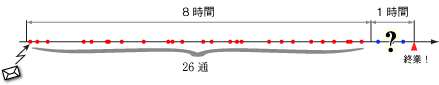
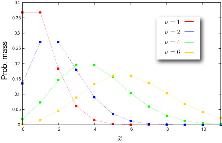
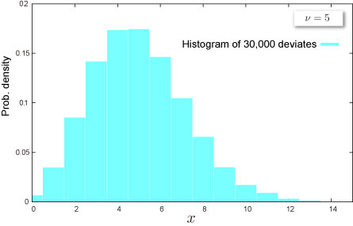

import DataGridMdx from "@site/src/components/DataGridMdx";

# ポアソン分布(Poisson distribution)

## 馬に蹴られてポアソン分布

### 概要

恋愛の話じゃありません。馬に蹴られて死んでしまう兵士の数の分布。これこそが歴史上初のポアソン分布の実用例だったのです。驚いたでしょ？\
ポアソン分布が現れる例は...

- ある交差点で1時間に起きる事故の件数
- 国道1キロメートル当たりのレストランの数
- この原稿を書いている間に変換間違えをする数

などといったものが考えられます。このようにポアソン分布とは、時間（例えば1時間当たり）、場所（例えば1平方メートル当たり）、距離（例えば1キロメートル当たり）などある一定区間の中で、偶然に起こる事象の数の分布です。\
でもこれは一般的には起こる確率の低い事象に対する分布なので、注意したいところです。（ほら、なかなか馬に蹴られて死なないでしょ？）別名「少数の法則」とも呼ばれています（発生件数が多い場合は[正規分布](normal-distribution-single.mdx)に近くなります）。

### 例えば以下のリアリティー溢れる例

金曜の夕方のオフィス。あと1時間で終業時間、そのあと友達と夕食の約束がある。予約の取りにくいレストランなので、飛び込みの仕事などの残業は絶対にしたくない！ 今のところ今日までの仕事は全て片付けたはず。あとは上司や先輩からメールで突然仕事が降ってこないことを祈るのみ。むむむ、受信箱を開くのが怖い。\
今日今までに来たメールは8時間で26通。さて、あと1時間で何通くるんだろう？

ここでポアソン分布が活躍するのです。\

ポアソン分布は「1単位区間あたり平均 $\nu$（ギリシャ文字で"ニュー"）件起きる事象が、$x$件発生する確率」を次式で与えてくれます。

$$
f(x)=\frac{\nu^{x}e^{-\nu }}{x!}
$$

では今の状況に当てはめてみましょう。知りたいのは、これからの1時間で来るメール数。過去8時間のメールの受信数から1時間当たり平均受信件数は 26÷8=3.25 [通/時間]であることが分かりますね。 したがって1時間に受け取るメール数は $\nu=3.25$のポアソン分布となるのがわかります。

$$
f(x)=\frac{3.25^{x}e^{-3.25}}{x!}
$$

ここから、例えばメールが3通来る確率は、

$$
f(3)=\frac{3.25^{3}e^{-3.25}}{3!}=0.2218
$$

つまり大体 22％となります。また1通もメールが来ない（0通のメールが来る）確率は

$$
f(0)=\frac{3.25^{0}e^{-3.25}}{0!}=0.039
$$

4％程度、つまり96％の確率でメールがやってくることになります。残念ながらこのままサックリとは帰れそうにないみたいですね。

あと1時間...。今までの経験から7通くらいのメールなら1時間でなんとか処理できそう。だったら7通以下のメールが来る確率を計算してみましょう。これは、1通も来ない確率、1通来る確率、2通来る確率...7通来る確率の和になります。

$$
f(0)+f(1)+f(2)+f(3)+f(4)+f(5)+f(6)+f(7)=0.982
$$

つまり、

**「98％の確率で、これからの1時間に受け取るメールは7通以下」**ということ。

98％の確率で定時に帰れる！楽しい金曜の夜になりそうです。

ところで1時間に7通といっても、だいたい5分おきくらいに均等にメールが来るかもしれないし、30分来ないと思ったら一気に連続してメールが来るかもしれないですよね？ 受信したメールと次に来るメールの間隔はどのような分布になっているのでしょうか？実は、それは[指数分布](exponential-distribution.mdx)になることが分かっているのです。

## 分布の形状

### 基本情報

- パラメータ $\nu$ が必要です。

  $$
  \nu>0
  $$

  このパラメータは分布の[平均](/docs/glossary#central-moment)です。

- 非負の整数 $x={0,1,2,\cdots}$ で定義される離散分布です。

### 確率

- [累積分布関数](/docs/glossary#cumulative-distribution-function)

  $$
  F(x)=\text{e}^{-\nu}\sum_{i=0}^{x}\frac{\nu^i}{i !}
  $$

- [確率質量関数](/docs/glossary#probability-mass-function)

  $$
  f(x)=\frac{\nu^x\text{e}^{-\nu}}{x !}
  $$

- Excel での[累積分布関数 (c.d.f.)](/docs/glossary#cumulative-distribution-function) と [確率質量関数 (p.m.f.)](/docs/glossary#probability-mass-function)の求め方

<DataGridMdx
  data={{
    cells: [
      [
        { value: "データ", readOnly: true, className: "orange-cell" },
        { value: "説明", readOnly: true, className: "orange-cell" },
      ],
      [
        { value: 3, readOnly: true },
        { value: "対象となる値", readOnly: true },
      ],
      [
        { value: 5, readOnly: true },
        { value: "分布のパラメータ nu の値", readOnly: true },
      ],
      [
        { value: "数式", readOnly: true, className: "orange-cell" },
        { value: "説明（計算結果）", readOnly: true, className: "orange-cell" },
      ],
      [
        { value: "=NTPOISSONDIST(A2,A3,TRUE)", readOnly: true },
        { value: "上のデータに対する累積分布関数の値", readOnly: true },
      ],
      [
        { value: "=NTPOISSONDIST(A2,A3,FALSE)", readOnly: true },
        { value: "上のデータに対する確率密度関数の値", readOnly: true },
      ],
    ],
  }}
/>

- 関連 NtRand 関数 : [NTPOISSONDIST](../03-function-reference/02-distribution-functions/073-ntpoissondist.mdx)

## 分布の特徴

### 平均 -- 分布の"中心"はどこ？ ([定義](/docs/glossary#central-moment))

- 分布の[平均](/docs/glossary#central-moment)は $\nu$ と与えられます。

### 標準偏差 -- 分布はどのくらい広がっているか（[定義](/docs/glossary#standard-deviation)）

- 分布の[標準偏差](/docs/glossary#standard-deviation)は $\nu$ と与えられます。

  [標準偏差](/docs/glossary#standard-deviation) は [分散](/docs/glossary#variance)の正の平方根です。

### 歪度 -- 分布はどちらに偏っているか([定義](/docs/glossary#skewness))

- 分布の[歪度](/docs/glossary#skewness) は次式で与えられます。

  $$
  \frac{1}{\sqrt{\nu}}
  $$

- Excel での計算法

<DataGridMdx
  data={{
    cells: [
      [
        { value: "データ", readOnly: true, className: "orange-cell" },
        { value: "説明", readOnly: true, className: "orange-cell" },
      ],
      [
        { value: 8, readOnly: true },
        { value: "分布のパラメータ nu の値", readOnly: true },
      ],
      [
        { value: "数式", readOnly: true, className: "orange-cell" },
        { value: "説明（計算結果）", readOnly: true, className: "orange-cell" },
      ],
      [
        { value: "=NTPOISSONSKEW(A2)", readOnly: true },
        { value: "上のデータに対する分布の平均", readOnly: true },
      ],
    ],
  }}
/>

- 関連 NtRand 関数 : [NTPOISSONSKEW](../03-function-reference/02-distribution-functions/078-ntpoissonskew.mdx)

### 尖度 -- 尖っているか丸まっているか ([定義](/docs/glossary#kurtosis))

- 分布の[尖度](/docs/glossary#kurtosis) は次式で与えられます。

  $$
  \frac{1}{\nu}
  $$

- Excel での計算法

<DataGridMdx
  data={{
    cells: [
      [
        { value: "データ", readOnly: true, className: "orange-cell" },
        { value: "説明", readOnly: true, className: "orange-cell" },
      ],
      [
        { value: 8, readOnly: true },
        { value: "分布のパラメータ nu の値", readOnly: true },
      ],
      [
        { value: "数式", readOnly: true, className: "orange-cell" },
        { value: "説明（計算結果）", readOnly: true, className: "orange-cell" },
      ],
      [
        { value: "=NTPOISSONKURT(A2)", readOnly: true },
        { value: "上のデータに対する分布の平均", readOnly: true },
      ],
    ],
  }}
/>

- 関連 NtRand 関数 : [NTPOISSONKURT](../03-function-reference/02-distribution-functions/075-ntpoissonkurt.mdx)

## 乱数

Excel での乱数生成法

<DataGridMdx
  data={{
    cells: [
      [
        { value: "データ", readOnly: true, className: "orange-cell" },
        { value: "説明", readOnly: true, className: "orange-cell" },
      ],
      [
        { value: 100, readOnly: true },
        { value: "生成する乱数の数", readOnly: true },
      ],
      [
        { value: 6, readOnly: true },
        { value: "分布のパラメータ nu の値", readOnly: true },
      ],
      [
        { value: "数式", readOnly: true, className: "orange-cell" },
        { value: "説明（計算結果）", readOnly: true, className: "orange-cell" },
      ],
      [
        { value: "=NTRANDPOISSON(100,A2,0)", readOnly: true },
        {
          value:
            "100個のポアッソン乱数を Mersenne Twister アルゴリズムで生成します。",
          readOnly: true,
        },
      ],
    ],
  }}
/>

メモ： この使用例の数式は、配列数式として入力する必要があります。使用例を新規ワークシートにコピーした後、A4:A103 のセル範囲 (配列数式が入力されているセルが左上になる) を選択します。F2 キーを押し、Ctrl キーと Shift キーを押しながら Enter キーを押します。この数式が配列数式として入力されていない場合、単一の値 2 のみが計算結果として返されます。

## 関連 NtRand 関数

- 既に分布のパラメータをお持ちの場合
  - Mersenne Twiseter 法による乱数生成 : [NTRANDPOISSON](../03-function-reference/01-random-numbers/01-single-series/12-ntrandpoisson.mdx)
  - 確率計算 : [NTPOISSONDIST](../03-function-reference/02-distribution-functions/073-ntpoissondist.mdx)
  - 平均計算 : [NTPOISSONMEAN](../03-function-reference/02-distribution-functions/076-ntpoissonmean.mdx)
  - 標準偏差計算 : [NTPOISSONSTDEV](../03-function-reference/02-distribution-functions/079-ntpoissonstdev.mdx)
  - 歪度計算 : [NTPOISSONSKEW](../03-function-reference/02-distribution-functions/078-ntpoissonskew.mdx)
  - 尖度計算 : [NTPOISSONKURT](../03-function-reference/02-distribution-functions/075-ntpoissonkurt.mdx)
  - 上記の各モーメントを一度に計算 : [NTPOISSONMOM](../03-function-reference/02-distribution-functions/077-ntpoissonmom.mdx)

## 参照

- [Wolfram Mathworld -- Poisson Distribution](http://mathworld.wolfram.com/PoissonDistribution.html)
- [Wikipedia -- Poisson distribution](http://en.wikipedia.org/wiki/Poisson_distribution)
- [Statistics Online Computational Resource](http://www.socr.ucla.edu/htmls/SOCR_Distributions.html)
- Accident : The number of soldiers killed by horse-kicks each year in each corps
- [Queuing Theory](http://en.wikipedia.org/wiki/Queueing_theory) : Number of phone calls per minuite, number of access to web sever per minuite
- Biology : Number of mutations
- Nuclear physics : the [nuclear decay](http://en.wikipedia.org/wiki/Nuclear_decay) of atoms
- [Risk management -- Operational risk](http://en.wikipedia.org/wiki/Operational_risk)
