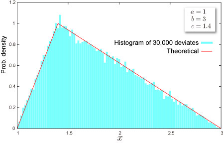

import DataGridMdx from "@site/src/components/DataGridMdx";

# 三角分布(Triangular distribution)

## 中学生レベル三角分布

### 代用品としての三角分布

有限区間の[単峰分布](https://www.ntrand.com/jp/glossary/#local_Unimodal)として、[ベータ分布](https://www.ntrand.com/jp/beta-distribution/)が挙げられますが、この分布は関数が[ベータ関数](https://www.ntrand.com/jp/glossary/#local_beta_function)という聞いたこともない関数で正体が隠ぺいされている！（実際のところ、Excel を使えば中身など知らなくてもいいんですが）。 また、[ジョンソン SB 分布](https://www.ntrand.com/jp/johnson-sb-distribution/)も結局は[正規分布](https://www.ntrand.com/jp/normal-distribution-single/)の[累積分布関数](https://www.ntrand.com/jp/glossary/#local_Cumulative)が使われているので、その正体はブラックボックスになっているのです。\
そこと比べると三角分布の[確率密度関数](https://www.ntrand.com/jp/glossary/#local_Probability)は、中学生でもわかる（失礼！）1次式です。[累積分布関数](https://www.ntrand.com/jp/glossary/#local_Cumulative)だって2次式にすぎません。\
シンプルで扱い易いその性質から、[ベータ分布](https://www.ntrand.com/jp/beta-distribution/)の代用として用いられることも実はよくあるんです。

### 納期の見積もり（またまた）

[ベータ分布](https://www.ntrand.com/jp/beta-distribution/)の項で説明した PERT手法による納期の期待値算出（3点見積もり）を三角分布で行う場合ももちろんあります（だって代用品だもの）。 その場合、悲観値、楽観値、そして最可能値を用いて、

納期の期待値 = (楽観値+最可能値+悲観値）÷3

と与えられるのです（下記の平均の項目参照お願いします）。

## 分布の形状

### 基本情報

- 3つのパラメータ $a, b, c$ が必要です ([どうやって求めるの？](https://www.ntrand.com/jp/nttriangularparam/)).

  $$
  a<c<b
  $$

  これらのパラメータはそれぞれ、分布の下限、分布の上限、分布の[最頻値](https://www.ntrand.com/jp/glossary/#local_mode)を表します。

- 有限区間 $a\leq x \leq b$ で定義された連続分布です。
- [平均](https://www.ntrand.com/jp/glossary/#local_mean)対して対称にも非対称にもなり得ます。

### 確率

- [累積分布関数](https://www.ntrand.com/jp/glossary/#local_cumulative)

  $$
  F(x)=\begin{cases}\frac{(x-a)^2}{(b-a)(c-a)}\quad&(a\leq x<c)\\1-\frac{(b-x)^2}{(b-a)(b-c)}\quad&(c\leq x\leq b)\end{cases}
  $$

- [確率密度関数](https://www.ntrand.com/jp/glossary/#local_probability)

  $$
  f(x)=\begin{cases}\frac{2(x-a)}{(b-a)(c-a)}\quad&(a\leq x<c)\\\frac{2(b-x)}{(b-a)(b-c)}\quad&(c\leq x\leq b)\end{cases}
  $$

- Excel での[累積分布関数 (c.d.f.)](https://www.ntrand.com/jp/glossary/#local_cumulative) と [確率密度関数 (p.d.f.)](https://www.ntrand.com/jp/glossary/#local_Probability)の求め方

<DataGridMdx
  data={{
    cells: [
      [
        { value: "データ", readOnly: true, className: "orange-cell" },
        { value: "説明", readOnly: true, className: "orange-cell" },
      ],
      [
        { value: 1.5, readOnly: true },
        { value: "対象となる値", readOnly: true },
      ],
      [
        { value: 1, readOnly: true },
        { value: "分布のパラメータ Min の値", readOnly: true },
      ],
      [
        { value: 3, readOnly: true },
        { value: "分布のパラメータ Max の値", readOnly: true },
      ],
      [
        { value: 1.4, readOnly: true },
        { value: "分布のパラメータ Mode の値", readOnly: true },
      ],
      [
        { value: "数式", readOnly: true, className: "orange-cell" },
        { value: "説明（計算結果）", readOnly: true, className: "orange-cell" },
      ],
      [
        { value: "=NTTRIANGULARDIST(A2,A3,A4,A5,TRUE)", readOnly: true },
        { value: "上のデータに対する累積分布関数の値", readOnly: true },
      ],
      [
        { value: "=NTTRIANGULARDIST(A2,A3,A4,A5,FALSE)", readOnly: true },
        { value: "上のデータに対する確率密度関数の値", readOnly: true },
      ],
    ],
  }}
/>

- 関連 NtRand 関数 : [NTTRIANGULARDIST](https://www.ntrand.com/jp/nttriangulardist/)

### 分位点

- [累積確率関数](https://www.ntrand.com/jp/glossary/#local_cumulative)の逆関数

  $$
  F^{-1}(P)=\begin{cases}\sqrt{P(c-a)(b-a)}+a\quad&\left(P< \frac{c-a}{b-a}\right)\\-\sqrt{(1-P)(b-c)(b-a)}+b\quad&\left(P\geq \frac{c-a}{b-a}\right)\end{cases}
  $$

- Excel での[分位点](https://www.ntrand.com/jp/glossary/#local_quantile)の求め方

<DataGridMdx
  data={{
    cells: [
      [
        { value: "データ", readOnly: true, className: "orange-cell" },
        { value: "説明", readOnly: true, className: "orange-cell" },
      ],
      [
        { value: 0.5, readOnly: true },
        { value: "この分布の確率", readOnly: true },
      ],
      [
        { value: 1, readOnly: true },
        { value: "分布のパラメータ Min の値", readOnly: true },
      ],
      [
        { value: 3, readOnly: true },
        { value: "分布のパラメータ Max の値", readOnly: true },
      ],
      [
        { value: 1.4, readOnly: true },
        { value: "分布のパラメータ Mode の値", readOnly: true },
      ],
      [
        { value: "数式", readOnly: true, className: "orange-cell" },
        { value: "説明（計算結果）", readOnly: true, className: "orange-cell" },
      ],
      [
        { value: "=NTTRIANGULARINV(A2,A3,A4,A5)", readOnly: true },
        { value: "上のデータに対する累積分布関数の逆関数の値", readOnly: true },
      ],
    ],
  }}
/>

- 関連 NtRand 関数 : [NTTRIANGULARINV](https://www.ntrand.com/jp/nttriangularinv/)

## 分布の特徴

### 平均 -- 分布の''中心''はどこ？ ([定義](https://www.ntrand.com/jp/glossary/#local_mean))

- 分布の[平均](https://www.ntrand.com/jp/glossary/#local_mean) は次式で与えられます。

  $$
  \frac{a+b+c}{3}
  $$

- Excel での計算法

<DataGridMdx
  data={{
    cells: [
      [
        { value: "データ", readOnly: true, className: "orange-cell" },
        { value: "説明", readOnly: true, className: "orange-cell" },
      ],
      [
        { value: 1, readOnly: true },
        { value: "分布のパラメータ Min の値", readOnly: true },
      ],
      [
        { value: 3, readOnly: true },
        { value: "分布のパラメータ Max の値", readOnly: true },
      ],
      [
        { value: 1.4, readOnly: true },
        { value: "分布のパラメータ Mode の値", readOnly: true },
      ],
      [
        { value: "数式", readOnly: true, className: "orange-cell" },
        { value: "説明（計算結果）", readOnly: true, className: "orange-cell" },
      ],
      [
        { value: "=NTTRIANGULARMEAN(A2,A3,A4)", readOnly: true },
        { value: "上のデータに対する分布の平均", readOnly: true },
      ],
    ],
  }}
/>

- 関連 NtRand 関数 : [NTTRIANGULARMEAN](https://www.ntrand.com/jp/nttriangularmean/)

### 標準偏差 -- 分布はどのくらい広がっているか（[定義](https://www.ntrand.com/jp/glossary/#local_standard_deviation)）

- 分布の[分散](https://www.ntrand.com/jp/glossary/#local_variance) は次式で与えられます。

  $$
  \frac{a^2+b^2+c^2-ab-bc-ca}{18}
  $$

  [標準偏差](https://www.ntrand.com/jp/glossary/#local_standard_deviation) は [分散](https://www.ntrand.com/jp/glossary/#local_variance)の正の平方根です。

- Excel での計算法

<DataGridMdx
  data={{
    cells: [
      [
        { value: "データ", readOnly: true, className: "orange-cell" },
        { value: "説明", readOnly: true, className: "orange-cell" },
      ],
      [
        { value: 1, readOnly: true },
        { value: "分布のパラメータ Min の値", readOnly: true },
      ],
      [
        { value: 3, readOnly: true },
        { value: "分布のパラメータ Max の値", readOnly: true },
      ],
      [
        { value: 1.4, readOnly: true },
        { value: "分布のパラメータ Mode の値", readOnly: true },
      ],
      [
        { value: "数式", readOnly: true, className: "orange-cell" },
        { value: "説明（計算結果）", readOnly: true, className: "orange-cell" },
      ],
      [
        { value: "=NTTRIANGULARSTDEV(A2,A3,A4)", readOnly: true },
        { value: "上のデータに対する分布の標準偏差", readOnly: true },
      ],
    ],
  }}
/>

- 関連 NtRand 関数 : [NTTRIANGULARSTDEV](https://www.ntrand.com/jp/nttriangularstdev/)

### 歪度 -- 分布はどちらに偏っているか([定義](https://www.ntrand.com/jp/glossary/#local_skewness))

- 分布の[歪度](https://www.ntrand.com/jp/glossary/#local_skewness)は次式で与えられます。

  $$
  \frac{\sqrt{2}(a+b-2c)(2a-b-c)(a-2b+c)}{5(a^2+b^2+c^2-ab-bc-ca)^{3/2}}
  $$

- Excel での計算法

<DataGridMdx
  data={{
    cells: [
      [
        { value: "データ", readOnly: true, className: "orange-cell" },
        { value: "説明", readOnly: true, className: "orange-cell" },
      ],
      [
        { value: 1, readOnly: true },
        { value: "分布のパラメータ Min の値", readOnly: true },
      ],
      [
        { value: 3, readOnly: true },
        { value: "分布のパラメータ Max の値", readOnly: true },
      ],
      [
        { value: 1.4, readOnly: true },
        { value: "分布のパラメータ Mode の値", readOnly: true },
      ],
      [
        { value: "数式", readOnly: true, className: "orange-cell" },
        { value: "説明（計算結果）", readOnly: true, className: "orange-cell" },
      ],
      [
        { value: "=NTTRIANGULARSKEW(A2,A3,A4)", readOnly: true },
        { value: "上のデータに対する分布の歪度", readOnly: true },
      ],
    ],
  }}
/>

- 関連 NtRand 関数 : [NTTRIANGULARSKEW](https://www.ntrand.com/jp/nttriangularskew/)

### 尖度 -- 尖っているか丸まっているか ([定義](https://www.ntrand.com/jp/glossary/#local_kurtosis))

- 分布の[尖度](https://www.ntrand.com/jp/glossary/#local_kurtosis)は $-0.6$ です。

## 乱数

- 乱数 x は一様乱数 U に対して次式で生成されます（逆関数法） :

  $$
  x=\begin{cases}\sqrt{U(c-a)(b-a)}+a\quad&\left(U< \frac{c-a}{b-a}\right)\\-\sqrt{(1-U)(b-c)(b-a)}+b\quad&\left(U\geq \frac{c-a}{b-a}\right)\end{cases}
  $$

- Excel での乱数生成法

<DataGridMdx
  data={{
    cells: [
      [
        { value: "データ", readOnly: true, className: "orange-cell" },
        { value: "説明", readOnly: true, className: "orange-cell" },
      ],
      [
        { value: 0, readOnly: true },
        { value: "分布のパラメータ Min の値", readOnly: true },
      ],
      [
        { value: 3, readOnly: true },
        { value: "分布のパラメータ Max の値", readOnly: true },
      ],
      [
        { value: 1.8, readOnly: true },
        { value: "分布のパラメータ Mode の値", readOnly: true },
      ],
      [
        { value: "数式", readOnly: true, className: "orange-cell" },
        { value: "説明（計算結果）", readOnly: true, className: "orange-cell" },
      ],
      [
        { value: "=NTRANDTRIANGULAR(100,A2,A3,A5,0)", readOnly: true },
        {
          value:
            "100個の三角 乱数を Mersenne Twister アルゴリズムで生成します。",
          readOnly: true,
        },
      ],
    ],
  }}
/>

メモ： この使用例の数式は、配列数式として入力する必要があります。使用例を新規ワークシートにコピーした後、A6:A105 のセル範囲 (配列数式が入力されているセルが左上になる) を選択します。F2 キーを押し、Ctrl キーと Shift キーを押しながら Enter キーを押します。この数式が配列数式として入力されていない場合、単一の値 2 のみが計算結果として返されます。

## 関連 NtRand 関数

- 既に分布のパラメータをお持ちの場合
  - Mersenne Twiseter 法による乱数生成 : [NTRANDTRIANGULAR](https://www.ntrand.com/jp/ntrandtriangular/)
  - 確率計算 : [NTTRIANGULARDIST](https://www.ntrand.com/jp/nttriangulardist/)
  - Computing quantile : [NTTRIANGULARINV](https://www.ntrand.com/jp/nttriangularinv/)
  - 平均計算 : [NTTRIANGULARMEAN](https://www.ntrand.com/jp/nttriangularmean/)
  - 標準偏差計算 : [NTTRIANGULARSTDEV](https://www.ntrand.com/jp/nttriangularskew/)
  - 歪度計算 : [NTTRIANGULARSKEW](https://www.ntrand.com/jp/nttriangularskew/)
  - 尖度計算 : [NTTRIANGULARKURT](https://www.ntrand.com/jp/nttriangularkurt/)
  - 上記の各モーメントを一度に計算 : [NTTRIANGULARMOM](https://www.ntrand.com/jp/nttriangularmom/)
- 平均、標準偏差、最頻値をお持ちの場合
  - 分布のパラメータ推定 : [NTTRIANGULARPARAM](https://www.ntrand.com/jp/nttriangularparam/)

## 参照

- [Wolfram Mathworld -- Triangular Distribution](http://mathworld.wolfram.com/TriangularDistribution.html)
- [Wikipedia -- Triangular distribution](http://en.wikipedia.org/wiki/Triangular_distribution)
- [Statistics Online Computational Resource](http://www.socr.ucla.edu/htmls/SOCR_Distributions.html)
- [Project management](http://en.wikipedia.org/wiki/Project_management) -- [PERT](http://en.wikipedia.org/wiki/PERT), [CPM](http://en.wikipedia.org/wiki/Critical_path_method) and so on
- Digital signal processing ([dithering](http://en.wikipedia.org/wiki/Dither)) -- digital audio, digital video, digital photography, seismology, RADAR, weather forecasting systems and many more
- Data security

  ["Truncated Triangular Distribution for Multiplicative Noise and Domain Estimation" by Jay J. Kim and Dong M. Jeong](http://www.amstat.org/sections/srms/Proceedings/y2008/Files/300855.pdf)

- [Business simulation](http://en.wikipedia.org/wiki/Triangular_distribution#Business_simulations) (Corporate finance)
