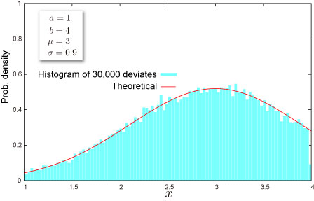

import DataGridMdx from "@site/src/components/DataGridMdx";

## 腕をバッサリ切り落とし切断正規分布

### 上限と下限

さて、突然ですが袋に30グラムと書いてある某メーカーヒット商品のスナック菓子がここにあります。\
突撃訪問にて工場で次々と作られる製品の重さを量ってみるとピッタリ30グラムなわけもなく、29.98グラムのものもあれば、30.12グラムのものもあったりします。 もちろん30グラム周辺にデータは固まっていて、極端に多すぎるものや少なすぎるものは少なくなっています。そうです。ピンときましたか？これはまさに「正規分布」をなす典型的な場合だったのです！（テンション高めに左側の図をご覧ください。）

では、忘れていましたが、我々の手元にあるこの製品の重さはどうなっているのでしょうか。\
早速大人買いをして、重さの分布を見てみることにしましょう。さすが30グラムと書いてあるだけのことはあって、大体どれも30グラムに近い値ですが、ピッタリ30グラムなわけもなく、29.98グラムのものもあれば、30.12グラムのものもありますね（ま、当たり前なんですが）。 こうして努力と不意の出費の結果出来あがった分布図は右側のものになりました。\
ここで左と異なる点がはっきりします。我々の手元に届いたという条件の下では $30\pm 3$グラムより誤差が大きいものが存在しないのです！すると分布は裾をバッサリ切り取られたような形になってしまいます。 しかし存在範囲では依然、正規分布であることは間違いないのです。\
そう、この分布こそが**切断正規分布**なのです。

### 条件付確率

さていきなりここで問題です。図を見ると右の分布は左右の両側を切り取っただけでなく、背が高くなっていることに気がつきましたか？これは何故でしょうか？\
そうです、確率の基礎を熟知しているあなたなら（アナタですよ、アナタ！）もう明らかでしょう。そう、[確率密度関数](/docs/glossary#probability-density-function)の曲線の下の面積は1でないといけないからです（ちゃんと覚えてましたか？）。\
もともと面積が1だった正規分布の曲線（図の左）から単純にに左右を切り取ると、面積は1より小さくなってしまいますね。そこで、面積が1になるように縦に引き伸ばしているのです。すごいでしょう？\
そしてこれは、**条件付確率**の事実を表現しているのです。つまり、この状況下では

「我々の手元に来た、という条件の下で重さが $x$ 以下になる確率は？」

という問いを表現したものが求める分布関数であったのです。まさに条件付確率ではないでしょうか。\
「我々の手元に来る確率」は左の図で左右の裾を切り取った部分の面積に他ならないですよね（平均$\pm 3$グラムに収まる確率）。従って、分布関数は、単に左右を切り取ったものを「我々の手元に来る確率」で割ったものになるのです。

### その他

- 実は上限と下限は必ずしも分布の山を挟む必要はないのです。下図のように山を挟まないで分布の裾の部分だけを残したような切断正規分布ももちろん考えられます（何に使われるかは現在調査中ですが）。

  

- 上限と下限を定めた切断正規分布を「両側切断正規分布」、上限または下限のみを定めた切断正規分布を「片側切断正規分布」と呼ぶことがあります。

## 分布の形状

### 基本情報

- 4つのパラメータ $a, b,m,\sigma$ が必要です ([どうやって求めるの？](../03-function-reference/02-distribution-functions/100-nttruncnormparam.mdx)).

  $$
  a<b
  $$

  $$
  \sigma>0
  $$

- 有限区間 $a\leq x \leq b$ で定義された連続分布です。
- [平均](/docs/glossary#central-moment)対して対称にも非対称にもなり得ます。

### 確率

- [累積分布関数](/docs/glossary#cumulative-distribution-function)

  $$
  F(x)=\frac{1}{\Delta}\left[\Phi\left(\frac{x-m}{\sigma}\right)-\Phi(A)\right]
  $$

  ここで

  $$
  \Delta=\Phi(B)-\Phi(A)
  $$

  $$
  A=\frac{a-m}{\sigma},B=\frac{b-m}{\sigma}
  $$

  、 $\Phi(\cdot)$ は 標準正規分布の[累積分布関数](/docs/glossary#cumulative-distribution-function)です。

- [確率密度関数](/docs/glossary#probability-density-function)

  $$
  f(x)=\frac{1}{\sigma\Delta}\phi\left(\frac{x-m}{\sigma}\right)
  $$

- Excel での[累積分布関数 (c.d.f.)](/docs/glossary#cumulative-distribution-function) と [確率密度関数 (p.d.f.)](/docs/glossary#probability-density-function)の求め方

<DataGridMdx
  data={{
    cells: [
      [
        { value: "データ", readOnly: true, className: "orange-cell" },
        { value: "説明", readOnly: true, className: "orange-cell" },
      ],
      [
        { value: 2.5, readOnly: true },
        { value: "対象となる値", readOnly: true },
      ],
      [
        { value: 1, readOnly: true },
        { value: "分布のパラメータ Min の値", readOnly: true },
      ],
      [
        { value: 4, readOnly: true },
        { value: "分布のパラメータ Max の値", readOnly: true },
      ],
      [
        { value: 3, readOnly: true },
        { value: "分布のパラメータ M の値", readOnly: true },
      ],
      [
        { value: 0.9, readOnly: true },
        { value: "分布のパラメータ Sigma の値", readOnly: true },
      ],
      [
        { value: "数式", readOnly: true, className: "orange-cell" },
        { value: "説明（計算結果）", readOnly: true, className: "orange-cell" },
      ],
      [
        { value: "=NTTRUNCNORMDIST(A2,A3,A4,A5,A6,TRUE)", readOnly: true },
        { value: "上のデータに対する累積分布関数の値", readOnly: true },
      ],
      [
        { value: "=NTTRUNCNORMDIST(A2,A3,A4,A5,A6,FALSE)", readOnly: true },
        { value: "上のデータに対する確率密度関数の値", readOnly: true },
      ],
    ],
  }}
/>

- 関連 NtRand 関数 : [NTTRUNCNORMDIST](../03-function-reference/02-distribution-functions/095-nttruncnormdist.mdx)

### 分位点

- [累積分布関数](/docs/glossary#cumulative-distribution-function)の逆関数

  $$
  F^{-1}(P)=\sigma\Phi^{-1}\left[\Delta P+\Phi(A)\right]+m
  $$

  ここで

  $$
  \Delta=\Phi(B)-\Phi(A)
  $$

  $$
  A=\frac{a-m}{\sigma},B=\frac{a-m}{\sigma}
  $$

  で、 $\Phi(\cdot)$ は標準正規分布の[累積分布関数](/docs/glossary#cumulative-distribution-function)です。

- Excel での[分位点](/docs/glossary#quantile)の求め方

<DataGridMdx
  data={{
    cells: [
      [
        { value: "データ", readOnly: true, className: "orange-cell" },
        { value: "説明", readOnly: true, className: "orange-cell" },
      ],
      [
        { value: 0.5, readOnly: true },
        { value: "上のデータに対する確率密度関数の値", readOnly: true },
      ],
      [
        { value: 1, readOnly: true },
        { value: "分布のパラメータ Min の値", readOnly: true },
      ],
      [
        { value: 4, readOnly: true },
        { value: "分布のパラメータ Max の値", readOnly: true },
      ],
      [
        { value: 3, readOnly: true },
        { value: "分布のパラメータ M の値", readOnly: true },
      ],
      [
        { value: 0.9, readOnly: true },
        { value: "分布のパラメータ Sigma の値", readOnly: true },
      ],
      [
        { value: "数式", readOnly: true, className: "orange-cell" },
        { value: "説明（計算結果）", readOnly: true, className: "orange-cell" },
      ],
      [
        { value: "=NTTRUNCNORMINV(A2,A3,A4,A5,A6)", readOnly: true },
        { value: "上のデータに対する累積分布関数の逆関数の値", readOnly: true },
      ],
    ],
  }}
/>

- 関連 NtRand 関数 : [NTTRUNCNORMINV](../03-function-reference/02-distribution-functions/096-nttruncnorminv.mdx)

## 分布の特徴

### 平均 -- 分布の"中心"はどこ？ ([定義](/docs/glossary#central-moment))

- 分布の[平均](/docs/glossary#central-moment) は次式で与えられます。

  $$
  m+\frac{\phi(A)-\phi(B)}{\Delta}\sigma
  $$

  ここで

  $$
  \Delta=\Phi(B)-\Phi(A)
  $$

  $$
  A=\frac{a-m}{\sigma},B=\frac{a-m}{\sigma}
  $$

  で、$\Phi(\cdot)$ と $\phi(\cdot)$ はそれぞれ、標準正規分布の[確率密度関数](/docs/glossary#probability-density-function)と[累積分布関数](/docs/glossary#cumulative-distribution-function)です。

- Excel での計算法

<DataGridMdx
  data={{
    cells: [
      [
        { value: "データ", readOnly: true, className: "orange-cell" },
        { value: "説明", readOnly: true, className: "orange-cell" },
      ],
      [
        { value: 1, readOnly: true },
        { value: "分布のパラメータ Min の値", readOnly: true },
      ],
      [
        { value: 4, readOnly: true },
        { value: "分布のパラメータ Max の値", readOnly: true },
      ],
      [
        { value: 3, readOnly: true },
        { value: "分布のパラメータ M の値", readOnly: true },
      ],
      [
        { value: 0.9, readOnly: true },
        { value: "分布のパラメータ Sigma の値", readOnly: true },
      ],
      [
        { value: "数式", readOnly: true, className: "orange-cell" },
        { value: "説明（計算結果）", readOnly: true, className: "orange-cell" },
      ],
      [
        { value: "=NTTRUNCNORMMEAN(A2,A3,A4,A5)", readOnly: true },
        { value: "上のデータに対す分布の平均", readOnly: true },
      ],
    ],
  }}
/>

- 関連 NtRand 関数 : [NTTRUNCNORMMEAN](../03-function-reference/02-distribution-functions/098-nttruncnormmean.mdx)

### 標準偏差 -- 分布はどのくらい広がっているか（[定義](/docs/glossary#standard-deviation)）

- 分布の[分散](/docs/glossary#variance) は次式で与えられます。

  $$
  \left[1+\frac{A\phi(A)-B\phi(B)}{\Delta}-\left(\frac{\phi(A)-\phi(B)}{\Delta}\right)^2\right]\sigma^2
  $$

  ここで

  $$
  \Delta=\Phi(B)-\Phi(A)
  $$

  $$
  A=\frac{a-m}{\sigma},B=\frac{a-m}{\sigma}
  $$

  で、 $\Phi(\cdot)$ と $\phi(\cdot)$ はそれぞれ、標準正規分布の[確率密度関数](/docs/glossary#probability-density-function)と[累積分布関数](/docs/glossary#cumulative-distribution-function)です。

  [標準偏差](/docs/glossary#standard-deviation) は [分散](/docs/glossary#variance)の正の平方根です。

- Excel での計算法

<DataGridMdx
  data={{
    cells: [
      [
        { value: "データ", readOnly: true, className: "orange-cell" },
        { value: "説明", readOnly: true, className: "orange-cell" },
      ],
      [
        { value: 1, readOnly: true },
        { value: "分布のパラメータ Min の値", readOnly: true },
      ],
      [
        { value: 4, readOnly: true },
        { value: "分布のパラメータ Max の値", readOnly: true },
      ],
      [
        { value: 3, readOnly: true },
        { value: "分布のパラメータ M の値", readOnly: true },
      ],
      [
        { value: 0.9, readOnly: true },
        { value: "分布のパラメータ Sigma の値", readOnly: true },
      ],
      [
        { value: "数式", readOnly: true, className: "orange-cell" },
        { value: "説明（計算結果）", readOnly: true, className: "orange-cell" },
      ],
      [
        { value: "=NTTRUNCNORMSTDEV(A2,A3,A4,A5)", readOnly: true },
        { value: "上のデータに対する分布の標準偏差", readOnly: true },
      ],
    ],
  }}
/>

- 関連 NtRand 関数 : [NTTRUNCNORMSTDEV](../03-function-reference/02-distribution-functions/102-nttruncnormstdev.mdx)

### 歪度 -- 分布はどちらに偏っているか([定義](/docs/glossary#skewness))

- 分布の[歪度](/docs/glossary#skewness) は次式で与えられます。

  $$
  -\frac{1}{V^{3/2}}\left[2\Delta_0+(3\Delta_{1}-1)\Delta_0+\Delta_2\right]
  $$

  ここで

  $$
  z(x)=\frac{\phi(x)}{\Delta}
  $$

  $$
  \Delta_k=B^kz(B)-A^kz(A)
  $$

  $$
  V=1-\Delta_1-\Delta_0^2
  $$

  $$
  \Delta=\Phi(B)-\Phi(A)
  $$

  $$
  A=\frac{a-m}{\sigma},B=\frac{a-m}{\sigma}
  $$

  で、 $\Phi(\cdot)$ と $\phi(\cdot)$ はそれぞれ、標準正規分布の[確率密度関数](/docs/glossary#probability-density-function)と[累積分布関数](/docs/glossary#cumulative-distribution-function)です。

- Excel での計算法

<DataGridMdx
  data={{
    cells: [
      [
        { value: "データ", readOnly: true, className: "orange-cell" },
        { value: "説明", readOnly: true, className: "orange-cell" },
      ],
      [
        { value: 1, readOnly: true },
        { value: "分布のパラメータ Min の値", readOnly: true },
      ],
      [
        { value: 4, readOnly: true },
        { value: "分布のパラメータ Max の値", readOnly: true },
      ],
      [
        { value: 3, readOnly: true },
        { value: "分布のパラメータ M の値", readOnly: true },
      ],
      [
        { value: 0.9, readOnly: true },
        { value: "分布のパラメータ Sigma の値", readOnly: true },
      ],
      [
        { value: "数式", readOnly: true, className: "orange-cell" },
        { value: "説明（計算結果）", readOnly: true, className: "orange-cell" },
      ],
      [
        { value: "=NTTRUNCNORMSKEW(A2,A3,A4,A5)", readOnly: true },
        { value: "上のデータに対する分布の歪度", readOnly: true },
      ],
    ],
  }}
/>

- 関連 NtRand 関数 : [NTTRUNCNORMSKEW](../03-function-reference/02-distribution-functions/101-nttruncnormskew.mdx)

### 尖度 -- 尖っているか丸まっているか ([定義](/docs/glossary#kurtosis))

- 分布の[尖度](/docs/glossary#kurtosis) は次式で与えられます。

  $$
  \frac{1}{V^2}\left[-3\Delta_0^4-2\Delta_0^2(3\Delta_1+1)-4\Delta_2\Delta_0-3\Delta_1-\Delta_3+3\right]-3
  $$

  ここで

  $$
  z(x)=\frac{\phi(x)}{\Delta}
  $$

  $$
  \Delta_k=B^kz(B)-A^kz(A)
  $$

  $$
  V=1-\Delta_1-\Delta_0^2
  $$

  $$
  \Delta=\Phi(B)-\Phi(A)
  $$

  $$
  A=\frac{a-m}{\sigma},B=\frac{a-m}{\sigma}
  $$

  で、$\Phi(\cdot)$ と $\phi(\cdot)$ はそれぞれ、標準正規分布の[確率密度関数](/docs/glossary#probability-density-function)と[累積分布関数](/docs/glossary#cumulative-distribution-function)です。

- Excel での計算法

<DataGridMdx
  data={{
    cells: [
      [
        { value: "データ", readOnly: true, className: "orange-cell" },
        { value: "説明", readOnly: true, className: "orange-cell" },
      ],
      [
        { value: 1, readOnly: true },
        { value: "分布のパラメータ Min の値", readOnly: true },
      ],
      [
        { value: 4, readOnly: true },
        { value: "分布のパラメータ Max の値", readOnly: true },
      ],
      [
        { value: 3, readOnly: true },
        { value: "分布のパラメータ M の値", readOnly: true },
      ],
      [
        { value: 0.9, readOnly: true },
        { value: "分布のパラメータ Sigma の値", readOnly: true },
      ],
      [
        { value: "数式", readOnly: true, className: "orange-cell" },
        { value: "説明（計算結果）", readOnly: true, className: "orange-cell" },
      ],
      [
        { value: "=NTTRUNCNORMKURT(A2,A3,A4,A5)", readOnly: true },
        { value: "上のデータに対する分布の尖度", readOnly: true },
      ],
    ],
  }}
/>

- 関連 NtRand 関数 : [NTTRUNCNORMKURT](../03-function-reference/02-distribution-functions/097-nttruncnormkurt.mdx)

## 乱数

- 乱数 x は一様乱数 U に対して次式で生成されます（逆関数法） :

  $$
  x=\sigma\Phi^{-1}\left[\Delta U+\Phi(A)\right]+m
  $$

  ここで

  $$
  \Delta=\Phi(B)-\Phi(A)
  $$

  $$
  A=\frac{a-m}{\sigma},B=\frac{a-m}{\sigma}
  $$

  で、$\Phi(\cdot)$ と $\phi(\cdot)$ はそれぞれ、標準正規分布の[確率密度関数](/docs/glossary#probability-density-function)と[累積分布関数](/docs/glossary#cumulative-distribution-function)です。

- Excel での乱数生成法

<DataGridMdx
  data={{
    cells: [
      [
        { value: "データ", readOnly: true, className: "orange-cell" },
        { value: "説明", readOnly: true, className: "orange-cell" },
      ],
      [
        { value: 1, readOnly: true },
        { value: "分布のパラメータ Min の値", readOnly: true },
      ],
      [
        { value: 4, readOnly: true },
        { value: "分布のパラメータ Max の値", readOnly: true },
      ],
      [
        { value: 3, readOnly: true },
        { value: "分布のパラメータ M の値", readOnly: true },
      ],
      [
        { value: 0.9, readOnly: true },
        { value: "分布のパラメータ Sigma の値", readOnly: true },
      ],
      [
        { value: "数式", readOnly: true, className: "orange-cell" },
        { value: "説明（計算結果）", readOnly: true, className: "orange-cell" },
      ],
      [
        { value: "=NTRANDTRUNCNORM(100,A2,A3,A4,A5,0)	", readOnly: true },
        {
          value: "切断正規乱数を Mersenne Twister アルゴリズムで生成します。",
          readOnly: true,
        },
      ],
    ],
  }}
/>

メモ： この使用例の数式は、配列数式として入力する必要があります。使用例を新規ワークシートにコピーした後、A7:A106 のセル範囲 (配列数式が入力されているセルが左上になる) を選択します。F2 キーを押し、Ctrl キーと Shift キーを押しながら Enter キーを押します。この数式が配列数式として入力されていない場合、単一の値 2 のみが計算結果として返されます。

## 関連 NtRand 関数

- 既に分布のパラメータをお持ちの場合
  - Mersenne Twiseter 法による乱数生成 : [NTRANDTRUNCNORM](../03-function-reference/01-random-numbers/01-single-series/15-ntrandtruncnorm.mdx)
  - 確率計算 : [NTTRUNCNORMDIST](../03-function-reference/02-distribution-functions/095-nttruncnormdist.mdx)
  - Computing quantile : [NTTRUNCNORMINV](../03-function-reference/02-distribution-functions/096-nttruncnorminv.mdx)
  - 平均計算 : [NTTRUNCNORMMEAN](../03-function-reference/02-distribution-functions/098-nttruncnormmean.mdx)
  - 標準偏差計算 : [NTTRUNCNORMSTDEV](../03-function-reference/02-distribution-functions/101-nttruncnormskew.mdx)
  - 歪度計算 : [NTTRUNCNORMSKEW](../03-function-reference/02-distribution-functions/101-nttruncnormskew.mdx)
  - 尖度計算 : [NTTRUNCNORMKURT](../03-function-reference/02-distribution-functions/097-nttruncnormkurt.mdx)
  - 上記の各モーメントを一度に計算 : [NTTRUNCNORMMOM](../03-function-reference/02-distribution-functions/099-nttruncnormmom.mdx)
- 分布の平均と標準偏差をお持ちの場合
  - 分布のパラメータ推定 : [NTTRUNCNORMPARAM](../03-function-reference/02-distribution-functions/100-nttruncnormparam.mdx)

## 参照

- [Wikipedia -- Truncated normal distribution](http://en.wikipedia.org/wiki/Truncated_normal_distribution)
- [Econometrics](http://en.wikipedia.org/wiki/Econometric) : [probit model](http://economics.about.com/od/economicsglossary/g/probitmodel.htm), [tobit model](http://en.wikipedia.org/wiki/Tobit_model)
- Marketing

  "Use of the Left-Truncated Normal Distribution for Improving Achieved Service Levels" by Arvid C. Johnson

- Agriculte

  ["Modeling Nonnegativity via Truncated Logistic and Normal Distributions: An Application to Ranch Land Price Analysis" by Feng Xu et al.](http://ageconsearch.umn.edu/bitstream/31238/1/19010102.pdf)
