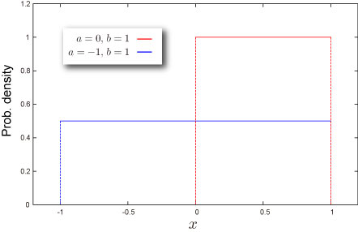
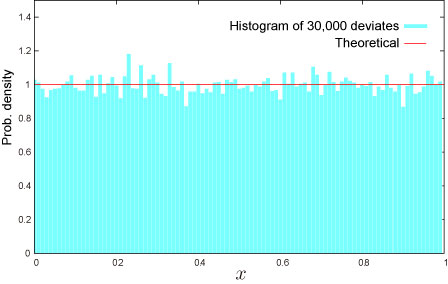

import DataGridMdx from "@site/src/components/DataGridMdx";

# 一様分布（連続）(Continuous uniform distribution)

## 乱数の素一様分布（連続）

### 概要

[一様分布（離散）](https://www.ntrand.com/jp/uniform-distribution-discrete/)の項で説明したルーレットをもう一度考えてみましょう。\
ルーレットは円周を一定の間隔で区切り、ボールがどの区画に飛び込むかを当てるゲームでしたね。区間が一定なので、どの区間に飛び込むかの確率は同様に確からしい→一様分布（離散）となる訳です。\
では区間の数をどんどんと増やしてみたらどうなるでしょう？　100区間、1000区間、10,000区間...。区間がいくつであっても各区間にボールが落ちる確率は

**1/区間数**

であることは一様分布（離散）を熟知した人（そう、アナタです！）なら容易に分かることでしょう。

更に区間を細かくしたら...？その行きつく先は区間を取り払ったただの円盤で、ボールが止まった場所は起点からの角度で表されることになります。\
この "進化系ルーレット" でゲームは成り立つんでしょうか？これまでと同様のルールで早速遊んでみましょう。\
さてボールが転がりだしました。よーし、ボールの止まる位置は "120度" ！起死回生を狙って大金を賭けることにします。ボールはだんだんとゆっくりになって、いよいよ止まりそうです。よし、その調子。狙った場所に来たー！結果は... "120.2390283028482982078364984937009832028...度"。 残念。\
お分かりでしょうか？このゲームでは絶対にボールの止まる位置を1点で当てることは出来ないのです。ボールは 0度以上360度未満のあらゆる場所に止まる可能性がある。ということはつまり、区間数（場合の数）は無限大になっているのです。結果、ある1点（180度でも30度でも220，3527度でも）にとどまる確率というのは 0 になってしまいます！でも安心してください。それらの確率を全て寄せ集めると1となるのです。（このあたりはちょっと微分・積分の知識が必要ですね。）\
連続分布の場合、確率変数がある値 $x$ を取る確率というものは定義されないの...！？

ではどうしたらいいのでしょうか？まずは「このボールが角度 $x$ 以下に止まる確率」を考えましょう。これは簡単。ルーレットは1周360度。そのうち $0\sim x$ 度に止まる確率は、

$$
F(x)=\frac{x}{360}
$$

です。実は大したことはないのです。これは[累積分布関数](https://www.ntrand.com/jp/glossary/#local_Cumulative)そのものだから。ではこれを $x$ で微分すると、

$$
f(x)=\frac{\text{d}}{\text{d}x}F(x)=\frac{1}{360}
$$

が得られます。実はこれが[確率密度関数](https://www.ntrand.com/jp/glossary/#local_Probability)の定義なのです。

一般に連続区間$[a,b]$ で定義された連続一様分布の[確率密度関数](https://www.ntrand.com/jp/glossary/#local_Probability)は、

$$
f(x)=\frac{1}{b-a}
$$

となります。

### 利用法

一様乱数でばらまかれた点の間隔は[指数分布](https://www.ntrand.com/jp/exponential-distribution/)になります。

一様分布（連続）に従う乱数（範囲は0から1。0や1を含むか否かは状況による）は、コンピューターで他の分布に従う様々な乱数を生成する素になるのです。 乱数は**逆関数法**や**棄却・採択法**といった手法で生成されますが、このいずれも一様乱数と対象となる分布の分布関数を利用して生成されるのです。\
つまり、最終的に得られる乱数の品質は元になる一様乱数の品質そのものということになります。\
例えばこのサイトで紹介している乱数発生ソフト「NtRand」では連続な一様乱数生成に、現在最高の品質を誇る Mersenne Twister 法を採用しています。

## 分布の形状

### 基本情報

- 2つのパラメータ $a, b$ が必要です.

  $$
  a<b
  $$

  これらのパラメータは分布の下限と上限を表します。

- 有限区間 $a\leq x \leq b$ で定義された連続分布です。
- [平均](https://www.ntrand.com/jp/glossary/#local_mean)対して常に対称です。

### 確率

- [累積分布関数](https://www.ntrand.com/jp/glossary/#local_cumulative)

  $$
  F(x)=\frac{x}{b-a}
  $$

- [確率密度関数](https://www.ntrand.com/jp/glossary/#local_probability)

  $$
  f(x)=\frac{1}{b-a}
  $$

- Excel での[累積分布関数 (c.d.f.)](https://www.ntrand.com/jp/glossary/#local_cumulative) と [確率密度関数 (p.d.f.)](https://www.ntrand.com/jp/glossary/#local_Probability)の求め方

<DataGridMdx
  data={{
    cells: [
      [
        { value: "データ", readOnly: true, className: "orange-cell" },
        { value: "説明", readOnly: true, className: "orange-cell" },
      ],
      [
        { value: "0.5", readOnly: true },
        { value: "対象となる値", readOnly: true },
      ],
      [
        { value: "1", readOnly: true },
        { value: "分布のパラメータ A の値", readOnly: true },
      ],
      [
        { value: "5", readOnly: true },
        { value: "分布のパラメータ B の値", readOnly: true },
      ],
      [
        { value: "数式", readOnly: true, className: "orange-cell" },
        { value: "説明（計算結果）", readOnly: true, className: "orange-cell" },
      ],
      [
        { value: "=(A2-A3)/(A4-A3)", readOnly: true },
        { value: "上のデータに対する累積分布関数の値", readOnly: true },
      ],
      [
        { value: "=1/(A4-A3)", readOnly: true },
        { value: "上のデータに対する確率密度関数の値", readOnly: true },
      ],
    ],
  }}
/>

### 分位点

- [累積分布関数](https://www.ntrand.com/jp/glossary/#local_cumulative)の逆関数

  $$
  F^{-1}(P)=a+P(b-a)
  $$

- Excel での[分位点](https://www.ntrand.com/jp/glossary/#local_quantile)の求め方

<DataGridMdx
  data={{
    cells: [
      [
        { value: "データ", readOnly: true, className: "orange-cell" },
        { value: "説明", readOnly: true, className: "orange-cell" },
      ],
      [
        { value: "0.5", readOnly: true },
        { value: "対象となる値", readOnly: true },
      ],
      [
        { value: "1", readOnly: true },
        { value: "分布のパラメータ A の値", readOnly: true },
      ],
      [
        { value: "5", readOnly: true },
        { value: "分布のパラメータ B の値", readOnly: true },
      ],
      [
        { value: "数式", readOnly: true, className: "orange-cell" },
        { value: "説明（計算結果）", readOnly: true, className: "orange-cell" },
      ],
      [
        { value: "=A3+A2*(A4-A3)", readOnly: true },
        { value: "上のデータに対する累積分布関数の逆関数の値", readOnly: true },
      ],
    ],
  }}
/>

## 分布の特徴

### 平均 -- 分布の"中心"はどこ？ ([定義](https://www.ntrand.com/jp/glossary/#local_mean))

- 分布の[平均](https://www.ntrand.com/jp/glossary/#local_mean) は次式で与えられます。

  $$
  \frac{a+b}{2}
  $$

- Excel での計算法

<DataGridMdx
  data={{
    cells: [
      [
        { value: "データ", readOnly: true, className: "orange-cell" },
        { value: "説明", readOnly: true, className: "orange-cell" },
      ],
      [
        { value: "8", readOnly: true },
        { value: "分布のパラメータ A の値", readOnly: true },
      ],
      [
        { value: "2", readOnly: true },
        { value: "分布のパラメータ B の値", readOnly: true },
      ],
      [
        { value: "数式", readOnly: true, className: "orange-cell" },
        { value: "説明（計算結果）", readOnly: true, className: "orange-cell" },
      ],
      [
        { value: "=(A2+A3)/2", readOnly: true },
        { value: "上のデータに対する分布の平均", readOnly: true },
      ],
    ],
  }}
/>

### 標準偏差 -- 分布はどのくらい広がっているか（[定義](https://www.ntrand.com/jp/glossary/#local_standard_deviation)）

- 分布の[分散](https://www.ntrand.com/jp/glossary/#local_variance) は次式で与えられます。

  $$
  \frac{(a-b)^2}{12}
  $$

  [標準偏差](https://www.ntrand.com/jp/glossary/#local_standard_deviation) は [分散](https://www.ntrand.com/jp/glossary/#local_variance)の正の平方根です。

- Excel での計算法

<DataGridMdx
  data={{
    cells: [
      [
        { value: "データ", readOnly: true, className: "orange-cell" },
        { value: "説明", readOnly: true, className: "orange-cell" },
      ],
      [
        { value: "8", readOnly: true },
        { value: "分布のパラメータ A の値", readOnly: true },
      ],
      [
        { value: "2", readOnly: true },
        { value: "分布のパラメータ B の値", readOnly: true },
      ],
      [
        { value: "数式", readOnly: true, className: "orange-cell" },
        { value: "説明（計算結果）", readOnly: true, className: "orange-cell" },
      ],
      [
        { value: "=(A3-A2)/(2*SQRT(3))", readOnly: true },
        { value: "上のデータに対する分布の標準偏差", readOnly: true },
      ],
    ],
  }}
/>

### 歪度 -- 分布はどちらに偏っているか([定義](https://www.ntrand.com/jp/glossary/#local_skewness))

- 分布の歪度は $0$ です。

### 尖度 -- 尖っているか丸まっているか ([定義](https://www.ntrand.com/jp/glossary/#local_kurtosis))

- 分布の尖度は $-1.2$ です。

## 乱数

Excel での乱数生成法

<DataGridMdx
  data={{
    cells: [
      [
        { value: "データ", readOnly: true, className: "orange-cell" },
        { value: "説明", readOnly: true, className: "orange-cell" },
      ],
      [
        { value: "1", readOnly: true },
        { value: "分布のパラメータ A の値", readOnly: true },
      ],
      [
        { value: "5", readOnly: true },
        { value: "分布のパラメータ B の値", readOnly: true },
      ],
      [
        { value: "数式", readOnly: true, className: "orange-cell" },
        { value: "説明（計算結果）", readOnly: true, className: "orange-cell" },
      ],
      [
        { value: "=(A3-A2)*NTRAND(100,A2,A3,0)+A2", readOnly: true },
        {
          value: "100個の一様乱数をMersenne Twister アルゴリズムで生成します。",
          readOnly: true,
        },
      ],
    ],
  }}
/>

メモ： この使用例の数式は、配列数式として入力する必要があります。使用例を新規ワークシートにコピーした後、A5:A104 のセル範囲 (配列数式が入力されているセルが左上になる) を選択します。F2 キーを押し、Ctrl キーと Shift キーを押しながら Enter キーを押します。この数式が配列数式として入力されていない場合、単一の値 2 のみが計算結果として返されます。

## 関連 NtRand 関数

- Mersenne Twiseter 法による乱数生成 : [NTRAND](https://www.ntrand.com/jp/ntrand/)

## 参照

- [Wolfram Mathworld -- Uniform Distribution](http://mathworld.wolfram.com/UniformDistribution.html)
- [Wikipedia -- Uniform distribution (continuous)](<http://en.wikipedia.org/wiki/Uniform_distribution_(continuous)>)
- [Statistics Online Computational Resource](http://www.socr.ucla.edu/htmls/SOCR_Distributions.html)
