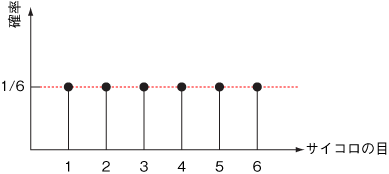

import DataGridMdx from "@site/src/components/DataGridMdx";

# 一様分布（離散）(Discrete uniform distribution)

## ギャンブルに勝つ！一様分布（離散）

どの教科書でもまず間違いなく最初に挙げる確率の事例といえば、やっぱりサイコロじゃないでしょうか（[ベルヌーイ分布](https://www.ntrand.com/jp/bernoulli-distribution/)よりも確率っぽい）。\
6面体のサイコロをふって、1の出る確率は？じゃあ偶数の出る確率は？などなど聞き覚えがあるでしょう。\
ここで現れる重要なキーワードは「**同様に確からしい**」。 つまり、1が出る確率も6が出る確率も同じということ。したがって、どの目が出る確率もみんな 1/6 となるのです（確率を全部足したら 1 にならないといけないからね）。これこそが一様分布の一様（全て同じ）たる所以ですね。\
グラフにするとこんな感じ。

例えば、ルーレットも代表的な一様分布の事例。みんな知っている通り、円盤の円周を等間隔に区切って、転がしたボールがどの区間に落ちるかを当てるゲームですね。 この場合も、どの目が出るか（どこにボールが落ちるか）は「同様に確からしい」ので、一様分布になります。\
ちなみに、実際のルーレットの区画の数は 37（ヨーロピアンスタイル）、38（アメリカンスタイル）、39（メキシカンスタイル）の3種類あったりします。ちょっと得したでしょ？

サイコロにしても、ルーレットにしても確率的に発生する事象は番号がつけられます（サイコロなら目そのもの。ルーレットなら、適当な区画から順に番号をつければいいですね）。 また、必ず上限と下限があります。番号の最小値をa、最大値をbとすると、どの目が出る確率も、

$$
\frac{1}{b-a+1}
$$

となります（分母の +1 に注意！植木算をがんばって思い出してください）。サイコロならば $a=1,;b=6$ ですね。

特別な条件下の一様分布には特別な名前が付いているものです。

- 公正なコイン（裏表のどちらが出るかが同様に確からしいコイン）を使ったコイントスで、表を 1、裏を 0 としたもの。これは**成功確率が0.5**の[ベルヌーイ分布](https://www.ntrand.com/jp/bernoulli-distribution/)と一致します。

- 目が1つしかない場合（2枚のコインを張り合わせて、両面表にしたコインでの表の出る確率）も考えられます（いや、面白いかじゃなくてあくまで可能性ですから！）。この分布は**退化分布**と呼ばれています。

もうひとつの特別な状況が**連続極限**で、その場合は[一様分布（連続）](https://www.ntrand.com/jp/uniform-distribution-continuous/)となります。

## 分布の形状

### 基本情報

- 2つのパラメータ $a,b$ が必要です。

  $$
  a <b
  $$

  これらのパラメータはそれぞれ、分布の最小値と最大値を表します。

- 整数 $x={a, a+1, \cdots, b}$ で定義された離散分布です。

### 確率

- [累積分布関数](https://www.ntrand.com/jp/glossary/#local_cumulative)

  $$
  F(x)=\begin{cases}0&(x<a)\\\frac{x-a+1}{b-a+1}&(x=\{a,a+1,\cdots,b\})\\1&(x>b)\end{cases}
  $$

- [確率質量関数](https://www.ntrand.com/jp/glossary/#local_probabilitymass)

  $$
  f(x)=\begin{cases}\frac{1}{b-a+1}&(x=\{a,a+1,\cdots,b\})\\0&(\text{otherwise})\end{cases}
  $$

- Excel での[累積分布関数 (c.d.f.)](https://www.ntrand.com/jp/glossary/#local_cumulative) と [確率質量関数 (p.m.f.)](https://www.ntrand.com/jp/glossary/#local_ProbabilityMass)の求め方

<DataGridMdx
  data={{
    cells: [
      [
        { value: "データ", readOnly: true, className: "orange-cell" },
        { value: "説明", readOnly: true, className: "orange-cell" },
      ],
      [
        { value: 3, readOnly: true },
        { value: "対象となる値", readOnly: true },
      ],
      [
        { value: 1, readOnly: true },
        { value: "分布のパラメータ A の値", readOnly: true },
      ],
      [
        { value: 6, readOnly: true },
        { value: "分布のパラメータ B の値", readOnly: true },
      ],
      [
        { value: "数式", readOnly: true, className: "orange-cell" },
        { value: "説明（計算結果）", readOnly: true, className: "orange-cell" },
      ],
      [
        {
          value: "=IF(A2<A3,0,IF(A2<=A4, (A2-A3+1)/(A4-A3+1),1))",
          readOnly: true,
        },
        { value: "上のデータに対する累積分布関数の値", readOnly: true },
      ],
      [
        { value: "=IF(AND(A3<=A2,A2<=A4),1/(A4-A3+1), 0)", readOnly: true },
        { value: "上のデータに対する確率質量関数の値", readOnly: true },
      ],
    ],
  }}
/>

## 分布の特徴

### 平均 -- 分布の"中心"はどこ？ ([定義](https://www.ntrand.com/jp/glossary/#local_mean))

- 分布の[平均](https://www.ntrand.com/jp/glossary/#local_mean) は次式で与えられます。

  $$
  \frac{a+b}{2}
  $$

- Excel での計算法

<DataGridMdx
  data={{
    cells: [
      [
        { value: "データ", readOnly: true, className: "orange-cell" },
        { value: "説明", readOnly: true, className: "orange-cell" },
      ],
      [
        { value: 1, readOnly: true },
        { value: "分布のパラメータ A の値", readOnly: true },
      ],
      [
        { value: 6, readOnly: true },
        { value: "分布のパラメータ B の値", readOnly: true },
      ],
      [
        { value: "数式", readOnly: true, className: "orange-cell" },
        { value: "説明（計算結果）", readOnly: true, className: "orange-cell" },
      ],
      [
        {
          value: "=(A2+A3)/2",
          readOnly: true,
        },
        { value: "上のデータに対する分布の平均", readOnly: true },
      ],
    ],
  }}
/>

### 標準偏差 -- 分布はどのくらい広がっているか（[定義](https://www.ntrand.com/jp/glossary/#local_standard_deviation)）

- 分布の[分散](https://www.ntrand.com/jp/glossary/#local_variance) は次式で与えられます。

  $$
  \frac{(b-a+1)^2-1}{12}
  $$

  [標準偏差](https://www.ntrand.com/jp/glossary/#local_standard_deviation) は [分散](https://www.ntrand.com/jp/glossary/#local_variance)の正の平方根です。

- Excel での計算法

<DataGridMdx
  data={{
    cells: [
      [
        { value: "データ", readOnly: true, className: "orange-cell" },
        { value: "説明", readOnly: true, className: "orange-cell" },
      ],
      [
        { value: 1, readOnly: true },
        { value: "分布のパラメータ A の値", readOnly: true },
      ],
      [
        { value: 6, readOnly: true },
        { value: "分布のパラメータ B の値", readOnly: true },
      ],
      [
        { value: "数式", readOnly: true, className: "orange-cell" },
        { value: "説明（計算結果）", readOnly: true, className: "orange-cell" },
      ],
      [
        {
          value: "=SQRT(((A3-A2+1)^2-1)/12)",
          readOnly: true,
        },
        { value: "上のデータに対する分布の標準偏差", readOnly: true },
      ],
    ],
  }}
/>

### 歪度 -- 分布はどちらに偏っているか([定義](https://www.ntrand.com/jp/glossary/#local_skewness))

- 分布の[歪度](https://www.ntrand.com/jp/glossary/#local_skewness) は $0$ です。

### 尖度 -- 尖っているか丸まっているか ([定義](https://www.ntrand.com/jp/glossary/#local_kurtosis))

- 分布の[尖度](https://www.ntrand.com/jp/glossary/#local_kurtosis) は次式で与えられます。

  $$
  -\frac{6((b-a+1)^2+1}{5((b-a+1)^2-1}
  $$

- Excel での計算法

<DataGridMdx
  data={{
    cells: [
      [
        { value: "データ", readOnly: true, className: "orange-cell" },
        { value: "説明", readOnly: true, className: "orange-cell" },
      ],
      [
        { value: 1, readOnly: true },
        { value: "分布のパラメータ A の値", readOnly: true },
      ],
      [
        { value: 6, readOnly: true },
        { value: "分布のパラメータ B の値", readOnly: true },
      ],
      [
        { value: "数式", readOnly: true, className: "orange-cell" },
        { value: "説明（計算結果）", readOnly: true, className: "orange-cell" },
      ],
      [
        {
          value: "=-6*((A3-A2+1)^2+1)/(5*((A3-A2+1)^2-1))",
          readOnly: true,
        },
        { value: "上のデータに対する分布の尖度", readOnly: true },
      ],
    ],
  }}
/>

## 乱数

- Excel での乱数生成法

<DataGridMdx
  data={{
    cells: [
      [
        { value: "データ", readOnly: true, className: "orange-cell" },
        { value: "説明", readOnly: true, className: "orange-cell" },
      ],
      [
        { value: 1, readOnly: true },
        { value: "分布のパラメータ A の値", readOnly: true },
      ],
      [
        { value: 6, readOnly: true },
        { value: "分布のパラメータ B の値", readOnly: true },
      ],
      [
        { value: "数式", readOnly: true, className: "orange-cell" },
        { value: "説明（計算結果）", readOnly: true, className: "orange-cell" },
      ],
      [
        {
          value: "=INT((A3-A2+1)*NTRAND(100))+A2",
          readOnly: true,
        },
        {
          value:
            "100個の一様乱数を Mersenne Twister アルゴリズムで生成します。",
          readOnly: true,
        },
      ],
    ],
  }}
/>

メモ： この使用例の数式は、配列数式として入力する必要があります。使用例を新規ワークシートにコピーした後、A5:A104 のセル範囲 (配列数式が入力されているセルが左上になる) を選択します。F2 キーを押し、Ctrl キーと Shift キーを押しながら Enter キーを押します。この数式が配列数式として入力されていない場合、単一の値 2 のみが計算結果として返されます。

## 参照

- [Wikipedia -- Uniform distribution (discrete)](<http://en.wikipedia.org/wiki/Uniform_distribution_(discrete)>)
