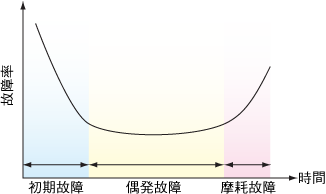
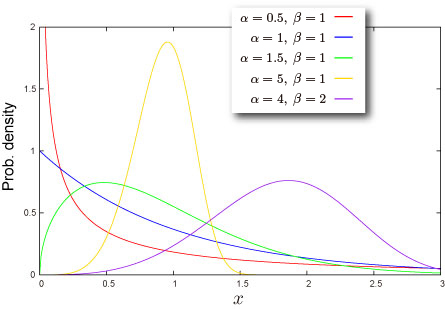
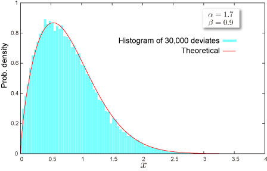

import DataGridMdx from "@site/src/components/DataGridMdx";

# ワイブル分布(Weibull distribution)

## ニータイマーの仕組みワイブル分布

### 信頼性工学

新しく買ったコンピューター。はやる気持ちを抑えて箱から取り出し、早速スイッチを！。。あれ？ウンともスンともいわないぞ。いきなり故障か？\
うちのテレビはまだブラウン管。最近突然画面が歪んだり、スイッチが入らなかったり。。。さすがに寿命か？\
毎年毎年、冬と夏に1回か2回くらいは風邪をひく。\
機械（や人間）はいつ故障するのか？[信頼性工学](http://ja.wikipedia.org/wiki/%E4%BF%A1%E9%A0%BC%E6%80%A7%E5%B7%A5%E5%AD%A6)における分析では、 故障率の時間推移は、

- 時間とともに減少する：初期不良に起因する故障
- 時間とともに増加する：寿命
- 時間によらず一定：偶発的な事故

に分類される。グラフにすると

こんな感じ（この形から、バスタブ曲線と呼ばれる）。

故障率を$h(t)$ として、上記の3つの状況を1つの式で綺麗にモデル可できないかと考えてみる。一番簡単には

$$
h(t)\propto t^{\alpha}
$$

としてはどうだろう。$\alpha$が正ならば、時間とともに増加する。負ならば減少。そして0ならば時間に依存しなくなる。

故障率がこの式に従うとしたとき、この機械の時刻 t における累積故障率（つまりある時間 t **までに**故障する確率）が**ワイブル分布**になるのである。

もうひとつ、ワイブル分布が表舞台に現れる理論が**極値理論**である。

## 分布の形状

### 基本情報

- 2つのパラメータ $\alpha, \beta$ が必要です ([どうやって求めるの？](../03-function-reference/02-distribution-functions/108-ntweibullparam.mdx))。

  $$
  {\alpha}>0,{\beta}>0
  $$

- 半無限区間 $x {\geq} 0$ で定義された連続分布です。
- [平均](/docs/glossary#central-moment)対して常に非対称です。

### 確率

- [累積分布関数](/docs/glossary#cumulative-distribution-function)

  $$
  F(x)=1-\exp\left[-\left(\frac{x}{\beta}\right)^\alpha\right]
  $$

- [確率密度関数](/docs/glossary#probability-density-function)

  $$
  f(x)=\frac{\alpha}{\beta}\left(\frac{x}{\beta}\right)^{\alpha-1}\exp\left[-\left(\frac{x}{\beta}\right)^{\alpha}\right]
  $$

- Excel での[累積分布関数 (c.d.f.)](/docs/glossary#cumulative-distribution-function) と [確率密度関数 (p.d.f.)](/docs/glossary#probability-density-function)の求め方

<DataGridMdx
  data={{
    cells: [
      [
        { value: "データ", readOnly: true, className: "orange-cell" },
        { value: "説明", readOnly: true, className: "orange-cell" },
      ],
      [
        { value: 0.5, readOnly: true },
        { value: "対象となる値", readOnly: true },
      ],
      [
        { value: 8, readOnly: true },
        { value: "分布のパラメータ Alpha の値", readOnly: true },
      ],
      [
        { value: 2, readOnly: true },
        { value: "分布のパラメータ Beta の値", readOnly: true },
      ],
      [
        { value: "数式", readOnly: true, className: "orange-cell" },
        { value: "説明（計算結果）", readOnly: true, className: "orange-cell" },
      ],
      [
        { value: "=NTWEIBULLDIST(A2,A3,A4,TRUE)", readOnly: true },
        { value: "上のデータに対する累積分布関数の値", readOnly: true },
      ],
      [
        { value: "=NTWEIBULLDIST(A2,A3,A4,FALSE)", readOnly: true },
        { value: "上のデータに対する確率密度関数の値", readOnly: true },
      ],
    ],
  }}
/>

- 関連 NtRand 関数 : [NTWEIBULLDIST](../03-function-reference/02-distribution-functions/103-ntweibulldist.mdx)

### 分位点

- [累積確率関数](/docs/glossary#cumulative-distribution-function)の逆関数

  $$
  F^{-1}(P)=\beta\left(\ln\frac{1}{1-P}\right)^{1/\alpha}
  $$

- Excel での[分位点](/docs/glossary#quantile)の求め方

<DataGridMdx
  data={{
    cells: [
      [
        { value: "データ", readOnly: true, className: "orange-cell" },
        { value: "説明", readOnly: true, className: "orange-cell" },
      ],
      [
        { value: 0.7, readOnly: true },
        { value: "この分布の確率", readOnly: true },
      ],
      [
        { value: 1.7, readOnly: true },
        { value: "分布のパラメータ Alpha の値", readOnly: true },
      ],
      [
        { value: 0.9, readOnly: true },
        { value: "分布のパラメータ Beta の値", readOnly: true },
      ],
      [
        { value: "数式", readOnly: true, className: "orange-cell" },
        { value: "説明（計算結果）", readOnly: true, className: "orange-cell" },
      ],
      [
        { value: "=WEIBULLINV(A2,A3,A4)", readOnly: true },
        { value: "上のデータに対する累積分布関数の逆関数の値", readOnly: true },
      ],
    ],
  }}
/>

- 関連 NtRand 関数 : [NTWEIBULLINV](../03-function-reference/02-distribution-functions/104-ntweibullinv.mdx)

## 分布の特徴

### 平均 -- 分布の"中心"はどこ？ ([定義](/docs/glossary#central-moment))

- 分布の[平均](/docs/glossary#central-moment) は次式で与えられます。

  $$
  \beta\Gamma\left(1+\frac{1}{\alpha}\right)
  $$

  ここで、$\Gamma(\cdot)$ は [ガンマ関数](/docs/glossary#gamma-function)です。

- Excel での計算法

<DataGridMdx
  data={{
    cells: [
      [
        { value: "データ", readOnly: true, className: "orange-cell" },
        { value: "説明", readOnly: true, className: "orange-cell" },
      ],
      [
        { value: 8, readOnly: true },
        { value: "分布のパラメータ Alpha の値", readOnly: true },
      ],
      [
        { value: 2, readOnly: true },
        { value: "分布のパラメータ Beta の値", readOnly: true },
      ],
      [
        { value: "数式", readOnly: true, className: "orange-cell" },
        { value: "説明（計算結果）", readOnly: true, className: "orange-cell" },
      ],
      [
        { value: "=NTWEIBULLMEAN(A2,A3)", readOnly: true },
        { value: "上のデータに対する分布の平均", readOnly: true },
      ],
    ],
  }}
/>

- 関連 NtRand 関数 : [NTWEIBULLMEAN](../03-function-reference/02-distribution-functions/106-ntweibullmean.mdx)

### 標準偏差 -- 分布はどのくらい広がっているか（[定義](/docs/glossary#standard-deviation)）

- 分布の[分散](/docs/glossary#variance) は次式で与えられます。

  $$
  \mu^\prime(2)-m^2
  $$

  ここで、

  $$
  \mu^\prime(r)=\beta^r\Gamma\left(1+\frac{r}{\alpha}\right)
  $$

  、 $\Gamma(\cdot)$ は [ガンマ関数](/docs/glossary#gamma-function)、$m$は分布の[平均](/docs/glossary#central-moment)です。

  [標準偏差](/docs/glossary#standard-deviation) は [分散](/docs/glossary#variance)の正の平方根です。

- Excel での計算法

<DataGridMdx
  data={{
    cells: [
      [
        { value: "データ", readOnly: true, className: "orange-cell" },
        { value: "説明", readOnly: true, className: "orange-cell" },
      ],
      [
        { value: 8, readOnly: true },
        { value: "分布のパラメータ Alpha の値", readOnly: true },
      ],
      [
        { value: 2, readOnly: true },
        { value: "分布のパラメータ Beta の値", readOnly: true },
      ],
      [
        { value: "数式", readOnly: true, className: "orange-cell" },
        { value: "説明（計算結果）", readOnly: true, className: "orange-cell" },
      ],
      [
        { value: "=NTWEIBULLSTDEV(A2,A3)", readOnly: true },
        { value: "上のデータに対する分布の標準偏差", readOnly: true },
      ],
    ],
  }}
/>

- 関連 NtRand 関数 : [NTWEIBULLSTDEV](../03-function-reference/02-distribution-functions/110-ntweibullstdev.mdx)

### 歪度 -- 分布はどちらに偏っているか([定義](/docs/glossary#skewness))

- 分布の[歪度](/docs/glossary#skewness) は次式で与えられます。

  $$
  \frac{1}{\sigma^3}\left[\mu^\prime(3)-3m\sigma^2-m^3\right]
  $$

  ここで、

  $$
  \mu^\prime(r)=\beta^r\Gamma\left(1+\frac{r}{\alpha}\right)
  $$

  、$\Gamma(\cdot)$ は [ガンマ関数](/docs/glossary#gamma-function)、$m$は分布の[平均](/docs/glossary#central-moment)、$\sigma$ は 分布の[標準偏差](/docs/glossary#standard-deviation)です。

- Excel での計算法

<DataGridMdx
  data={{
    cells: [
      [
        { value: "データ", readOnly: true, className: "orange-cell" },
        { value: "説明", readOnly: true, className: "orange-cell" },
      ],
      [
        { value: 8, readOnly: true },
        { value: "分布のパラメータ Alpha の値", readOnly: true },
      ],
      [
        { value: 2, readOnly: true },
        { value: "分布のパラメータ Beta の値", readOnly: true },
      ],
      [
        { value: "数式", readOnly: true, className: "orange-cell" },
        { value: "説明（計算結果）", readOnly: true, className: "orange-cell" },
      ],
      [
        { value: "=NTWEIBULLSKEW(A2,A3)", readOnly: true },
        { value: "上のデータに対する分布の歪度", readOnly: true },
      ],
    ],
  }}
/>

- 関連 NtRand 関数 : [NTWEIBULLSKEW](../03-function-reference/02-distribution-functions/109-ntweibullskew.mdx)

### 尖度 -- 尖っているか丸まっているか ([定義](/docs/glossary#kurtosis))

- 分布の[尖度](/docs/glossary#kurtosis) は次式で与えられます。

  $$
  \frac{\mu^\prime(4)-4\gamma_1\sigma^3m-6m^2\sigma^2-m^4}{\sigma^4}-3
  $$

  ここで、

  $$
  \mu^\prime(r)=\beta^r\Gamma\left(1+\frac{r}{\alpha}\right)
  $$

  、$\Gamma(\cdot)$ は [ガンマ関数](/docs/glossary#gamma-function)、$m$ は分布の[平均](/docs/glossary#central-moment)、$\sigma$ は分布の[標準偏差](/docs/glossary#standard-deviation)、$\gamma_1$ は分布の[歪度](/docs/glossary#skewness)です。

- Excel での計算法

<DataGridMdx
  data={{
    cells: [
      [
        { value: "データ", readOnly: true, className: "orange-cell" },
        { value: "説明", readOnly: true, className: "orange-cell" },
      ],
      [
        { value: 8, readOnly: true },
        { value: "分布のパラメータ Alpha の値", readOnly: true },
      ],
      [
        { value: 2, readOnly: true },
        { value: "分布のパラメータ Beta の値", readOnly: true },
      ],
      [
        { value: "数式", readOnly: true, className: "orange-cell" },
        { value: "説明（計算結果）", readOnly: true, className: "orange-cell" },
      ],
      [
        { value: "=NTWEIBULLKURT(A2,A3)", readOnly: true },
        { value: "上のデータに対する分布の尖度", readOnly: true },
      ],
    ],
  }}
/>

- 関連 NtRand 関数 : [NTWEIBULLKURT](../03-function-reference/02-distribution-functions/105-ntweibullkurt.mdx)

## 乱数

- 乱数 x は一様乱数 U に対して次式で生成されます（逆関数法） :

  $$
  x=\beta\left(\ln\frac{1}{1-U}\right)^{1/\alpha}
  $$

- Excel での乱数生成法

<DataGridMdx
  data={{
    cells: [
      [
        { value: "データ", readOnly: true, className: "orange-cell" },
        { value: "説明", readOnly: true, className: "orange-cell" },
      ],
      [
        { value: 0.5, readOnly: true },
        { value: "分布のパラメータ Alpha の値", readOnly: true },
      ],
      [
        { value: 0.5, readOnly: true },
        { value: "分布のパラメータ Beta の値", readOnly: true },
      ],
      [
        { value: "数式", readOnly: true, className: "orange-cell" },
        { value: "説明（計算結果）", readOnly: true, className: "orange-cell" },
      ],
      [
        { value: "=NTRANDWEIBULL(100,A2,A3,0)", readOnly: true },
        {
          value:
            "100個のワイブル乱数を Mersenne Twister アルゴリズムで生成します。",
          readOnly: true,
        },
      ],
    ],
  }}
/>

メモ： この使用例の数式は、配列数式として入力する必要があります。使用例を新規ワークシートにコピーした後、A5:A104 のセル範囲 (配列数式が入力されているセルが左上になる) を選択します。F2 キーを押し、Ctrl キーと Shift キーを押しながら Enter キーを押します。この数式が配列数式として入力されていない場合、単一の値 2 のみが計算結果として返されます。

## 関連 NtRand 関数

- 既に分布のパラメータをお持ちの場合
  - Mersenne Twiseter 法による乱数生成 : [NTRANDWEIBULL](../03-function-reference/01-random-numbers/01-single-series/16-ntrandweibull.mdx)
  - 確率計算 : [NTWEIBULLDIST](../03-function-reference/02-distribution-functions/103-ntweibulldist.mdx)
  - 平均計算 : [NTWEIBULLMEAN](../03-function-reference/02-distribution-functions/106-ntweibullmean.mdx)
  - 標準偏差計算 : [NTWEIBULLSTDEV](../03-function-reference/02-distribution-functions/109-ntweibullskew.mdx)
  - 歪度計算 : [NTWEIBULLSKEW](../03-function-reference/02-distribution-functions/109-ntweibullskew.mdx)
  - 尖度計算 : [NTWEIBULLKURT](../03-function-reference/02-distribution-functions/105-ntweibullkurt.mdx)
  - 上記の各モーメントを一度に計算 : [NTWEIBULLMOM](../03-function-reference/02-distribution-functions/107-ntweibullmom.mdx)
- 分布の平均と標準偏差をお持ちの場合
  - 分布のパラメータ推定 : [NTWEIBULLPARAM](../03-function-reference/02-distribution-functions/108-ntweibullparam.mdx)

## 参照

- [Wolfram Mathworld -- Weibull Distribution](http://mathworld.wolfram.com/WeibullDistribution.html)
- [Wikipedia -- Weibull distribution](http://en.wikipedia.org/wiki/Weibull_distribution)
- [Statistics Online Computational Resource](http://www.socr.ucla.edu/htmls/SOCR_Distributions.html)
- [Risk management -- Operational risk](http://en.wikipedia.org/wiki/Operational_risk)
